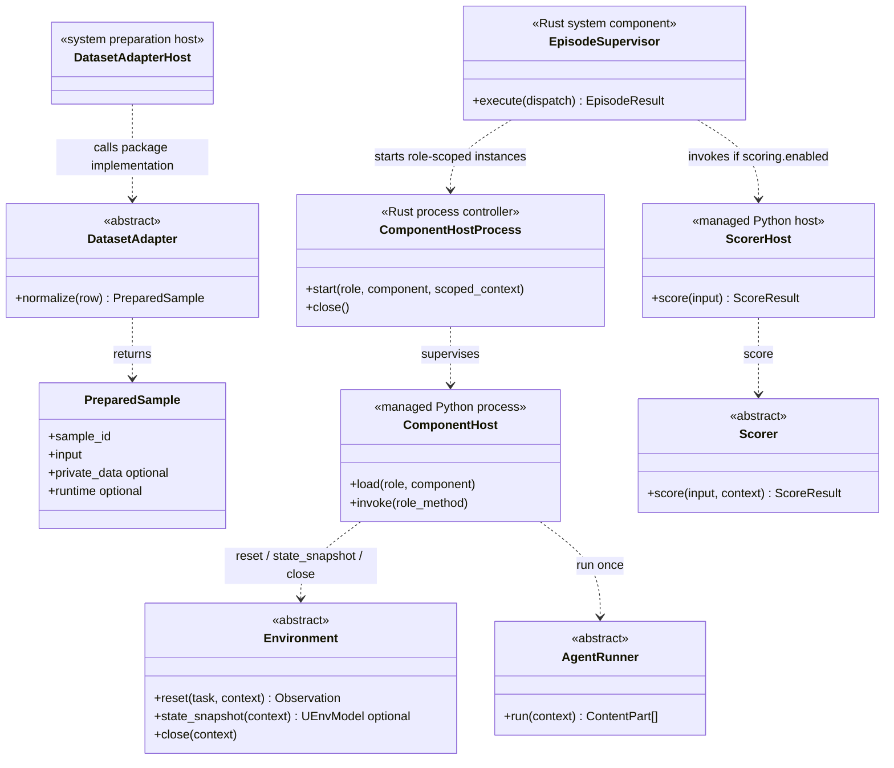
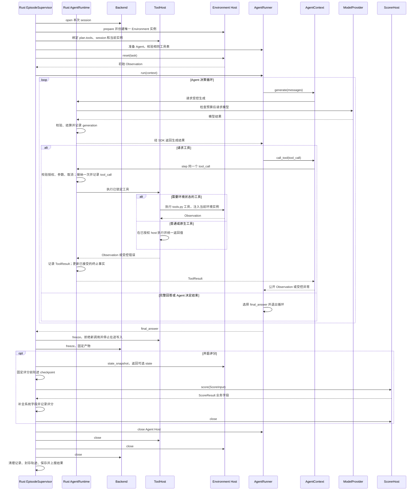
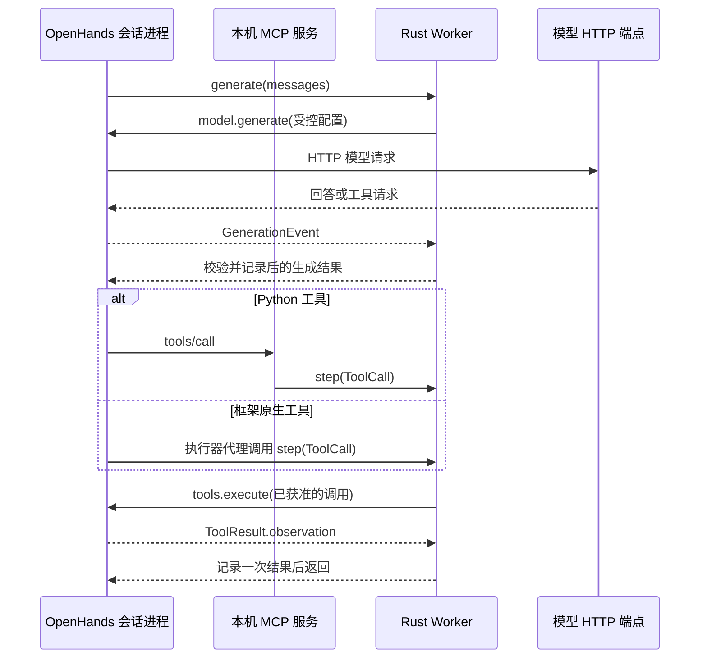

# UEnv 参考实现说明

本目录的参考代码用于把设计中的关键边界变成可运行测试。它不是远端生产迁移结果。

**工具接入状态：**参考 SDK、Rust 控制器、契约和九个数据集已统一到 AgentContext.call_tool → Rust AgentRuntime.step(tool_call)。旧环境动作接口、独立动作预算/事件和逐工具接口协商已删除。Python tools.py 提供 @tool、受管工具执行表和 NativeToolAdapter；后者读取原生参数格式并调用原执行器，框架集成负责转换。SDK 单元测试验证 Python 与不同原生格式，Rust 测试验证两种绑定使用同一预算和事件链。新增真实 OpenHands 1.15 会话、MCP HTTP 服务、Python/Rust 双向管道 RPC 与进程级取消；实测范围和复现命令见第 12 节。正式部署、全部原生工具及权限隔离验收仍独立进行。第 10 节保留历史审查记录，不替代本段及第 8 节的当前状态。

## 1. 语言边界

| 代码 | 负责什么 | 不负责什么 |
|---|---|---|
| Rust `reference-control` | 计划解析、组件锁定、镜像解析、预算、后端生命周期、模型和工具入口、轨迹、每个已进入评分的 attempt 至多一次评分、清理、EpisodeResult | 数据集评分规则、Agent 推理循环、Environment 业务 |
| Python `reference/sdk/src/uenv/sdk/` | Adapter、Environment、AgentRunner、Scorer、ToolExecutor、UEnvModel 与包 schema 生成 | 调度、后端、权威预算、轨迹封存、结果提交 |
| Python `reference/datasets/` | 九个数据集各自的 Adapter、Environment、Scorer | 选择 Agent、Backend、模型或本次工具表 |
| Python `scripts/build_*.py` 与 `reference/fixture_plan.py` | 从 proto 生成协议资源，生成文档和稳定示例 | 生产协议定义或运行时决策 |

系统控制逻辑不再通过 Python `EpisodeRuntime` 模拟。`reference/fixture_plan.py` 只生成静态示例；每个示例随后由 Rust `PlanResolver` 重建并比较，防止生成器成为第二套运行时规则。

## 2. Rust 参考文件

| 文件 | 责任 |
|---|---|
| `contracts.rs` | 读取 proto 生成的 schema；validate 完整递归校验公共及已登记扩展字段，validate_shape 仅供内部辅助检查 |
| `plan.rs` | `PlanResolver`、计划摘要、重试、工具与实际路由核验 |
| `ports.rs` | Backend、ToolHost、AgentHost、EnvironmentHost、ScorerHost、ModelProvider、FileStore 的 Rust 边界 |
| `runtime.rs` | `BudgetEnforcer`、`AgentRuntime`、`TrajectoryWriter`；模型生成与工具执行前持久化预算预占 |
| `rpc.rs` | Agent、Environment、Scorer、Model 的真实管道 RPC；按 execution_scope 路由工具 |
| `storage.rs` | LocalFileStore 不可变文件、摘要校验、逐事件 spool 和用量预占 |
| `lease.rs` | 将派发计划、Worker、epoch、剩余预算绑定到 HMAC token |
| `repository.rs` | Server 的提交/租约/结果事务，Worker 的派发去重账本与结果 outbox |
| `worker.rs` | 持久接纳后执行、重启后恢复部分轨迹、结果重传直至 ACK；不重新运行中断的 attempt |
| `process.rs` | Linux 子进程超时、输出上限、进程组终止与回收；自身不是安全沙箱 |
| `backends.rs` | LinuxBackend 实现共同 Backend 边界，Engine 声明 Process、Docker、Podman；Podman 未通过验证，open 明确拒绝；统一工作区限额、命令执行、冻结和清理 |
| `scoring.rs` | 每个进入评分的 attempt 至多调用一次 Python Scorer，拒绝其填写系统字段，补全正式 `ScoreResult` |
| `supervisor.rs` | `EpisodeSupervisor.execute(dispatch, ports...)` 统一 attempt 状态机和清理；配置只读 `dispatch.plan` |

公共协议的可编辑来源已落实到 `contracts/proto/uenv/v1/*.proto`。`scripts/build_contracts.py` 读取 proto 类型与字段约束，生成 JSON Schema、Python protobuf 类型、描述符和字段字典；Rust build.rs 从同一描述符生成 prost 类型。数据集新增业务字段仍只在包内 models.py 定义。Python 和 Rust 均提供完整 schema 校验，Server/Worker 持久化接纳入口已使用它；内部辅助 validate_shape 不能代替边界校验。现有 Host 管道仍使用受限 JSON RPC，并未完成生产 Server/Worker 的 protobuf 网络服务迁移。

轨迹采集复用 BatchRequest/ExecutionPlan/EpisodeSupervisor 和 TrajectoryWriter。validate_run_purpose 在批次、计划解析与 Worker 入口检查三种用途及 scoring.enabled/training 组合；PlanResolver scoring.enabled=false 时不解析私有材料和 harness。Supervisor 接收可选 ScorerHost，其存在性必须与 plan.scoring.enabled 一致，不接受占位评分器。正常无评分执行保留 final_answer、termination_reason、清理和最终轨迹；有评分失败时保留错误评分。validate_result_for_plan 在本地返回边界检查评分与计划相符，生产 Server 还必须在租约事务中接入同一校验。

本地生成器遍历 reference/runs 中的公共配置，根据 dataset_package 找到已登记包，使用同一提交构建逻辑；新增采集示例不在生成器内按数据集或用途硬编码分流。正式 Bridge、网络服务、导出服务和模型训练框架仍需接通；本地数据库和 Host RPC 已有实现，不能把参考端口测试视为生产验收。

FileStore 只属于 Rust 系统内部的文件存储端口：put_bytes 写入字节并返回 ArtifactRef，read 按引用读取并校验内容，put_json 只是序列化辅助方法。MemoryFileStore 是内存测试实现；LocalFileStore 已使用本地文件系统，并提供逐事件 spool。用户不实现、实例化或配置 FileStore；SDK 中获准的文件读写回调由 Worker 提供，不把底层存储对象或凭据交给扩展。Hub 管包版本、索引和授权，Server 管运行记录与保存期限，TrajectoryWriter 管轨迹格式与分片；这些职责不放进 FileStore。本地不可变写入、重开读取和摘要验证已有测试；保留期和跨节点文件回收仍待接通。

## 3. Python 参考文件

`reference/sdk/src/uenv/sdk/` 定义以下扩展接口及通用默认行为；数据集专用实现位于 `reference/datasets/<name>/src/<name>/`，不在 SDK 或 Host 内：

- `DatasetAdapter.normalize(row) -> PreparedSample`
- `Environment.reset/state_snapshot/close`
- `AgentRunner.run(context: AgentContext) -> list[ContentPart]`
- `Scorer.score(ScoreInput, ScoringContext) -> ScoreResult`
- `ToolExecutor.execute(arguments, context)`

具体实现为 `agent_context.py` 的 WorkerAgentContext；`agents.py` 提供可随 SDK 安装的 PlainAgent，`extension_templates.py` 只复用它。`environment_host.py`、`scorer_host.py`、`model_host.py` 分别处理独立角色，`component_host.py` 负责 Agent 及 agent_state 工具。

`AgentContext` 只暴露 `task`、当前 `observation`、只读 `tools`、`seed` 以及异步 `generate/call_tool`。AgentRunner 对这些操作统一使用 `await`；具体 Context 由 Worker SDK 适配器提供，它只是能力入口，不拥有预算或第二份工具配置。

ComponentHost 先按所选角色的 package config schema 完整校验 `plan.environment`、`plan.scoring.config` 或 Agent/工具的 `config`，再只把 `config.data` 这一个 dict 传给 `Environment(config)`、`AgentRunner(config)`、`Scorer(config)` 或 `ToolExecutor(config)`；基类统一保存为 `self.config`。空配置也显式传 `{}`。组件不能同时读取整个 TypedConfig、环境变量或包默认值来形成第二套运行配置。

包模型由 dataset.yaml.models 显式登记，不扫描方法体猜测类型。input 必填；private_data、environment_config、scorer_config、observation、state 按需登记。已提供入口但未声明的角色配置使用 EmptyConfig；无 scorer 入口时不生成对应配置 schema；已声明的配置 schema 用于校验同一份 config.data，构造函数仍接收 dict。嵌套 UEnvModel 自动生成并恢复；ArtifactRef、ContentPart、EvaluationPlan 复用公共 schema。参考生成器对递归模型和有歧义的联合类型明确报错。

参考发布加载器不要求 tests/，但 build_examples 仍读取九个包保留的合成测试数据。build_manifest 已从工具函数生成 provided_tools 和参数 schema；尚未把数据集 wheel 构建、上传与 Hub 准入连成发布流程，manifest.artifacts 仍为空。SDK 自身已可构建 wheel，包含内置 PlainAgent、生成 protobuf 类型和运行时 schema 资源。SDK 的 __init__.py 暂集中提供小型参考接口；生产目录仍按 module_map 拆分并仅在 __init__.py 导出。

九个内置数据集均提供评分，因此各自声明三个明确命名的直接子类；仅采集包可省略 Scorer 入口和配置 schema。例如 GSM8K 使用 `Gsm8kAdapter`、`Gsm8kEnvironment`、`Gsm8kScorer`；SWE Verified 使用 `SweVerifiedAdapter`、`SweVerifiedEnvironment`、`SweVerifiedScorer`。共享逻辑放在普通函数中复用，不再增加 `QuestionAnswerEnvironment`、`TextScorer` 或 `HarnessScorer` 中间层。

当前参考代码中的 Python `ScoreResult` 是同一个结果对象，包含以下业务字段：

```text
success, metrics, reward, evidence, generation_rewards（可选）
```

可选 `ScoreResult.generation_rewards` 已在 SDK、生成 schema 和 Rust 校验中实现，其项目只有 generation_id 与 reward；规范见[字段规范第 2.1 节](field_conventions.md#21-整体评分与逐次生成评分)。[过程评分示例](../../reference/examples/generation_scoring.py) 使用 SDK 的 read_scoring_trajectory 读取经 digest、身份和记录数校验的评分前轨迹，示范对每次完整文本生成做精确答案评价。这只是示例规则，不是通用推理质量评分模型。

Rust 从本次评分 checkpoint 中查验生成关联、有限数值和重复 ID，拒绝不存在或其他 attempt 的编号；评分错误不发布部分过程分数。整体分数与过程分数不相加，同一结果原样写入 score 事件和 EpisodeResult。FrameworkSample 复用 generation_rewards 的协议定义，实际 Bridge/训练适配及 token 映射仍待接入；不支持的训练端必须明确拒绝。九个数据集保持各自已有整体评分规则，不为它们编造过程奖励。


下面三个字段由 Rust Worker 填写：

```text
status, scorer, error
```

这样没有 `ScoreFacts`、`ScorerOutput`、`FrozenOutcome` 等同义转发类型。

## 4. 完整调用顺序

以下为当前 Supervisor 的调用顺序；Agent、Environment、Model 和 Scorer 可使用独立 Python RPC 进程，Linux 后端部署状态见第 8、11 节。

```mermaid
sequenceDiagram
    participant S as Rust Server / PlanResolver
    participant W as Rust Worker / EpisodeSupervisor
    participant B as Rust Backend
    participant T as Rust ToolGateway / ToolHost
    participant A as Python AgentHost
    participant E as Python EnvironmentHost
    participant M as ModelProvider
    participant C as Python ScorerHost

    S->>S: validate BatchRequest(run_spec, episodes) and compare stored run
    S->>S: resolve each episode with the same batch.run_spec
    S->>S: resolve one ExecutionPlan; collect required capabilities
    S->>W: execute(DispatchRequest)
    W->>B: open(plan.backend, plan.runtime, plan.internet_access)
    W->>E: prepare(plan.dataset_package, plan.environment, session, remaining_ms)
    W->>T: prepare(plan.tools, session, remaining_ms)
    T-->>W: actual routable tools; verify against plan.tools
    W->>A: prepare(plan.agent, plan.tools, plan.model.model_id, remaining_ms)
    A-->>W: actual model-visible tools; verify against plan.tools
    W->>E: reset(plan.task)
    W->>A: run_agent(task, observation, remaining_ms)
    A->>W: generate(messages) / call_tool(call)
    W->>M: generate using plan.model
    W->>T: call selected tool
    T->>T: route by execution_scope
    T-->>W: ToolResult.observation
    W-->>A: AgentContext 返回同一 Observation
    A->>W: final_answer 内容列表
    W->>T: freeze(remaining_ms); revoke and settle tool writes
    W->>B: freeze(remaining_ms) and expose a read-only scoring view
    W->>E: state_snapshot when scoring enabled
    W->>W: write pre-score trajectory manifest when scoring enabled
    W->>C: score(plan.dataset_package, plan.scoring.config, ScoreInput) when enabled
    C->>W: ScoreResult business fields
    W->>W: complete and record ScoreResult
    W->>C: close()
    W->>A: close()
    W->>T: close()
    W->>E: close()
    W->>B: close()
    W->>W: record cleanup/terminal and seal final trajectory
    W-->>S: EpisodeResult
```

AgentRunner 的循环调用 `context.generate(messages)` 和 `context.call_tool(tool_call)`。后者委托 Rust AgentRuntime.step；Worker 核验调用是否与模型产生的原始调用完全相符，再执行唯一选中的工具。sandbox 工具进入 Environment Host，agent_state 工具进入 Agent Host。Environment 不实现第二个 step。AgentContext 返回 Observation，ToolResult 仅用于内部状态传输和轨迹记录。

## 5. 配置消费路径核对

本节记录参考代码中谁读取配置，不重新定义字段。命名、归属与单一来源规则见[字段规范](field_conventions.md)，正式执行行为见[主方案第 5 章](../uenv_design.md#5-数据对象与配置来源)。测试结果单独记录在[验证记录](verification.md)。

| 配置或声明 | 参考读取入口与作用 | 当前边界 |
|---|---|---|
| 包 id、version | Python package_loader 生成 schema 地址，Rust ComponentCatalog 查找固定组件 | 已有本地消费路径；不代表 Hub 发布服务已完成 |
| dataset_package、environment、agent | PlanResolver 锁定包后，EnvironmentHost.prepare 接收同一包和环境参数，AgentHost.prepare 使用所选 agent | Agent 已有真实 RpcAgentHost；Environment 的部署接线仍待完成 |
| 批次接收与配置一致性 | Rust validate_batch_submission 校验非空批次、成员身份和同 run_id 的完整配置；PlanResolver.resolve 使用批次中的 run_spec 和各 episode | 已有多成员、跨批复用、配置冲突和覆盖拒绝测试；真实事务接入待实现 |
| 公开配置与默认值 | package_loader.expand_run 调用 SchemaRegistry.apply_defaults 后严格校验 RunSpec | 已有 YAML 读取结果与 Python 对象等价、重复键及非法值测试；正式 Bridge/CLI 仍待实现 |
| backend、runtime、internet_access | PlanResolver 解析组合和镜像；Backend.open 接收锁定后的计划信息 | 真正的 Process/Docker/Podman 驱动与隔离待实现 |
| model、training | AgentRuntime.generate 交给 ModelProvider，并检查生成记录 | ModelHost 已可调用 HTTP 模型端点；跨进程测试使用脚本模型响应，真实 Trainer 接入仍待完成 |
| tools | PlanResolver 锁定唯一工具选择与原生 Agent 归属；ToolHost.prepare 和 AgentHost.prepare 核验实际表；AgentRuntime.step 统一执行 | 真实 OpenHands、MCP、RPC 的正常及预算拒绝场景已验证，范围见第 12 节 |
| scoring.enabled | 为 true 时 Rust run_score 调用本包 ScorerHost；为 false 时跳过，validate_result_for_plan 核验结果是否应有评分 | 已有本地评分与错误测试；真实 harness 尚未验收 |
| limits、deadline_at_ms | PlanResolver 固定截止时间；BudgetEnforcer 和 Supervisor 使用派发剩余量限制调用 | 本地预算有效；真实 RPC 授权与累计持久账本待实现 |
| trajectory_retention_days | 目标由 Server 控制保存期，不进入 ExecutionPlan | 当前没有生产消费者，随轨迹存储与回收功能实施 |

角色端口是基础设施连接，不得另带一组逐 episode 配置。参考执行入口只有 DispatchRequest；其 lease、remaining_timeout_ms、consumed_usage 分别表达授权和累计状态，不覆盖计划选择。

旧包 metadata、作者 schema_version、额外 UEnv dependencies 已由加载器和契约拒绝；Python/Cargo 的安装依赖继续由包管理文件管理。字段存在或 schema 通过只能证明格式正确，不能替代上表的消费路径检查。

Python SchemaRegistry 和 Rust ContractSchema.validate 均递归校验公共字段及已登记包 schema。repository 的外部输入使用完整校验，内部控制流程仍保留部分 validate_shape 辅助检查。所有真实入口都必须先完整校验再调用内部流程，不能直接暴露辅助检查接口。其余缺口见第 8 节。

## 6. 轨迹与评分

`ScoreInput.trajectory_ref` 和 `EpisodeResult.trajectory_ref` 都指向 `TrajectoryManifest`。评分前 manifest 使用 trajectory_status=scoring_checkpoint；最终 manifest 使用 final_complete 或 final_partial，并包含适用的 score、cleaning 状态、错误和 terminal 事件。两处使用相同根结构，读取端无需根据调用位置猜格式。公开 manifest 不复制覆盖 private_data 的 plan_digest。参考 `TrajectoryWriter` 在任一事件或 checkpoint 写入失败后把最终清单标为 `final_partial`；score 事件写失败不会丢掉已经形成的 final_answer 或 ScoreResult。交互结束原因由 Worker 填写并只保存在 EpisodeResult.termination_reason；TerminalEvent 不再复制它，失败原因使用 ErrorRecord.code。

执行时私有评分材料原名传入 `EpisodeRequest.private_data`、`ExecutionPlan.private_data` 和 `ScoreInput.private_data`；准备阶段位于 PreparedSample 或标准化 JSONL 的同名字段。它不会进入 TaskSpec、Observation、AgentRuntime 或轨迹事件。Python Scorer 若需要运行正式测试，只能通过 `ScoringContext.run_harness()`；该回调由 Rust Worker 绑定到当前 Backend 的冻结评分视图。`ToolHost.freeze()` 先撤销 Agent 工具写入，`Backend.freeze()` 再固定 session 内容；完成这两步后才创建评分 checkpoint 和调用 Scorer。所有 freeze/close 都必须幂等。

Agent 交互结束后，ToolHost.freeze、Backend.freeze 和可选 Scorer 共用 finalize_reserve_ms 留出的总剩余时间；评分上下文沿用 BudgetEnforcer 的原始单调截止时间，不重新计算一个更晚的截止时间。

`ScoreInput` 不再携带 `remaining_timeout_ms`。Scorer 只能从 `ScoringContext` 查询 Supervisor 当前剩余预算；harness 的实际超时取这份剩余预算与 evaluation_plan 中超时上限的较小值，因此评分阶段没有第二个可覆盖的时间来源。

评测与后训练走同一评分路径，产生同一个 `EpisodeResult.score.reward`。关闭评分或进入评分前失败时没有 score；已经调用 Scorer 后，status=ok 或 status=error 的同一个 ScoreResult 都保留。区别只在下游如何消费结果；Worker 不为 training 维护第二套评分函数。

每条 `GenerationEvent.output_token_count` 都必填，并且是预算统计的唯一来源。`output_token_ids`、`output_logprobs` 和 `loss_mask` 是可选的详细训练轨迹；存在时必须彼此对齐并与 count 一致。训练配置要求 token trace 时，缺少这些详细字段的结果不能进入训练，但仍可以作为普通评测结果保存。

## 7. 验证范围

Rust 测试覆盖九个计划的统一重建、唯一字段字典、重试配置冻结、统一 Supervisor 流程、评分字段所有权、预算预留、连续轨迹、失败工具调用成对记录和失败清理。Python 测试覆盖 schema、九组数据集类、Environment 接口和评分规则。

`EpisodeSupervisor.execute()` 的本地参考假定 DispatchRequest 已经过 Worker RPC 授权；它检查形状、摘要和预算。`worker.execute_dispatch` 先通过 WorkerLedger.claim 完整校验、验签和持久去重，再调用 Supervisor；不得绕过这一接纳入口。生产网络服务尚需绑定该入口。

Supervisor 以收到的 `remaining_timeout_ms` 建立本机单调截止时间；运行中不再用墙上时钟重新解释 `deadline_at_ms`。Server 负责从唯一绝对 deadline 派生该只减值，Worker RPC 负责拒绝被放大的值。这样 deadline 是 Server 的审计与派发依据，remaining timeout 是 Worker 的唯一运行时计时输入，并非两套可覆盖配置。

Backend.open、各 Host.prepare、AgentHost.run_agent、ToolHost/Backend.freeze，以及模型、工具、环境和评分调用都接收这一个预算派生的当前剩余毫秒。close 由 Worker 进程控制器使用平台固定清理超时，因为清理不能在 episode 预算耗尽时跳过。同步 trait 只表示参考边界；生产 host 必须真正中断超时进程或容器操作。

已补齐完整 Rust JSON Schema 校验、HMAC 租约、SQLite 提交与结果事务、持久 attempt 账本、逐事件 spool、结果 outbox 和本地重启恢复。仍未完成生产 Server/Worker 网络服务迁移、节点失联/租约续期对账、完整角色隔离部署、官方 benchmark 差分和分布式恢复。Host 管道 RPC 与真实 Agent 的验证范围见第 12 节，后端限制见第 11 节。

九个数据集及两个采集配置的 batch_request.json 是实际提交结构示例；同目录 run_spec.json 和 episode_request.json 仅为方便查阅而展开的字段视图，不代表独立的配置提交接口或另一处生效来源。Rust validate_batch_submission 的 stored_run 是受信的只读对照，不用于补齐本次配置；EpisodeRepository.submit 已在数据库事务中核验并持久化；网络服务仍需接入它，不增加前置配置注册请求。

公开运行示例不填写 schema_version。expand_run 共用于 YAML 解析后的对象和 SDK 提供的公开字典，使用 SchemaRegistry.apply_defaults 补齐声明默认值，再递归校验组件参数和完整 RunSpec；普通 validate 不补值。默认资源、模型生成、重试及组件参数已从九份模板移除，由契约注解补齐，用户显式参数保持原值。该函数在提交边界生成内部协议标记。该辅助函数从传入目录按 dataset_package 选取唯一 manifest；环境参数与开启时的评分参数分别使用本包 schema。Rust PlanResolver 也只锁定一个数据集包，不能另选 Scorer。

当前交互参考：九个 Environment 只构造初始观测，PlainAgent 在无工具请求的完整 stop 回复后直接提交 final_answer。CounterEnvironment 持有状态，examples/tools.py 中的 increment 使用注入的当前实例返回 Observation。包声明不再包含 models.action；加载器拒绝 Environment 作者重复实现 step/parse_action。工具参数由函数类型标注或原生定义提供。

Observation 顶层已统一为 content、terminated、episode_truncated；ContentPart 增加 structured，内部复用 TypedConfig。SDK structured_part(UEnvModel) 生成信封，SchemaRegistry 校验已登记模型的字段；CounterEnvironment 用同一列表返回文本、图片和结构化状态。Rust runtime 的 prepare_model_messages 在预占生成预算前统一把结构化业务数据编码成 JSON 文本；PlainAgent 不自行转换，GenerationEvent.messages 与 ModelProvider 收到的消息保持一致，原观测不变。Rust 提供完整 validator，Python Host 对公开输入/返回执行登记 schema 校验；测试中的 HTTP 模型响应是脚本数据，不代表真实模型质量或多模态兼容性验收。

Rust AgentRuntime.step 校验选中绑定、生成身份、参数、重复调用、预算及取消，调用 ToolHost 后记录 ToolResult.observation；不再生成 EnvironmentTransition 或计独立环境步数。Python WorkerAgentContext 仅转交 step 传输并返回 Observation，不维护第二套预算。原生格式转换保留原执行器，支持从 OpenHands ToolDefinition 读取 action_type schema/validator；Conversation 原生代理、原始返回对象交还与 Host IPC 已通过第 12 节的真实测试。

## 8. 实现状态与待决事项

主设计定义目标行为；本节集中说明实际参考范围。源码基线见 source_refactoring_plan.md，具体测试结果仅由 verification.md 维护。下表的“待决策”意味着还缺接口或方案，“待验证”意味着已有目标但还不能据此宣称可用。

| 主题 | 已有参考 | 待完成或待决策 | 验证方式 |
|---|---|---|---|
| 公共协议 | proto 生成 Rust/Python 类型、schema、字段字典；models.py 生成包 schema | 待完成生产网络服务 stub 接线及跨语言二进制往返覆盖 | 契约生成、跨语言往返及真实 RPC 校验 |
| 执行控制 | Rust Supervisor/AgentRuntime、独立角色 Host RPC，问答与 sandbox 工具跨进程评分链 | 待完成全部后端常驻角色进程部署 | 使用真实组件进程验证结束、超时、取消和迟到调用 |
| 调度与恢复 | HMAC 派发校验、SQLite 事务/账本/outbox、spool、本地重启恢复 | 待完成网络服务接线、租约续期、节点失联对账与资源恢复验收 | 断连、进程退出、重复派发和迟到结果故障测试 |
| Backend 与私有评分 | 镜像优先级和回调协议；模拟 freeze/close | 待验证：Process/Docker/Podman 驱动、固定隔离底线、候选只读视图和真实镜像兼容性 | 按后端验证工作区、访问控制、评分依赖与清理 |
| Agent 与工具 | 工具选择与原生归属校验、Python 函数包装和 NativeToolAdapter、Rust step、统一 Observation/事件、多轮状态工具 | 已有第 12 节的真实 SDK/RPC、MCP 生命周期、原生 finish 与取消测试；待完成全量原生工具、Backend session 与权限分离部署 | 同一真实工具通过 SDK/MCP 的状态、结果、预算与事件；不能只用替身验收 |
| Hub 数据服务 | 包声明加载、schema 和模拟文件引用 | 待决策：数据发布/样本选择/文件授权 API 的完整请求结构；待实施：索引、缓存和保留期 | 同一条样本分别由本地与 Hub 准备，比较请求与结果；测试冲突、缺失和权限 |
| 动态工具 | 固定工具表协议 | 当前不支持；待决策：授权来源、发现过程及工具表版本协议 | 明确协议前拒绝运行中增加工具 |
| 通用性 | 九个合成数据集包及有状态接口示例 | 待验证：真实多轮、多模态、无参考答案、代码 harness 与 OpenHands 全链路 | 保留真实 Agent、工具、环境，仅替换模型端点做模拟 |

Python 构造的数据副本、schema 校验或 mock.freeze() 均不能证明进程隔离已经实现。Worker 的真实网络与文件授权、完整 RPC 字段验证和不可变产物保存是上线前要求。

原主文档中的本地执行入口记录统一归入本节：参考执行器接收 DispatchRequest，配置来自 ExecutionPlan；持久派发授权与恢复账本已有本地实现，生产网络入口与节点恢复仍需接入。旧日期下的测试数量不作为当前统计，最新记录见 [验证结果](verification.md)。

## 9. 系统接口接入目标

本节面向实现 Worker/IPC 的维护者。下面的类图和时序图描述目标接线；端口测试与第 12 节的真实工具接入覆盖其中一部分；图中的完整角色权限隔离部署不能由这些结果推断。

### 9.1 组件进程与用户扩展对象

先只看数据集接入直接相关的核心关系。图中方法省略 context 等参数以便阅读；准确签名见参考 SDK。标为 abstract 的类由 SDK 提供接口，实际调用的是包内子类。Host 是系统加载和调用代码，不包含数据集规则。



图例：虚线箭头 `..>` 表示调用或使用，不表示继承；箭头标签 run once 指一次 attempt 中只调用一次 Agent.run，内部可以发起多次 generation。`ComponentHostProcess` 是一种基础设施实现，按 role 启动 Agent 与 Environment/沙箱工具两个权限隔离的实例，不是两个用户接口。这里没有一个包揽所有职责的 Dataset 父类。

DatasetAdapter 的基类由 SDK 定义；具体子类和 normalize 实现位于数据集包的 dataset_adapter.py。UEnv 的 DatasetAdapterHost 在准备阶段加载并调用该实现，获得 PreparedSample(sample_id, input, private_data, runtime)。作者侧的 input 与 private_data 使用 `UEnvModel`；prepare 根据入口类型和固定包版本自动封装为内部 TypedConfig，再用 input 构建公开 TaskSpec，与可选 private_data 配对写入 EpisodeRequest，不再生成和读取额外的私有材料包装文件。Worker 执行时不再转换原始数据。

EpisodeSupervisor 是 Rust Worker 内唯一的 attempt 生命周期执行器。它创建后端会话、启动/终止 Python host、强制预算和取消、冻结产物、在本 attempt 进入评分时至多调用一次评分、完成首次清理、封存轨迹并保存待上报结果。ComponentHost 和 ScorerHost 只是受管 Python 组件入口，不拥有租约、后端、最终状态或持久化。它们先按对应角色的 package config schema 完整校验 `plan.environment`、`plan.scoring.config` 或 Agent/工具的 `config`，随后只把 `config.data` 作为必填 dict 传给用户类构造函数；基类统一保存为 `self.config`，空配置显式传 `{}`。Environment、AgentRunner、Scorer 是用户扩展对象；用户不实现 Supervisor 或 host。

### 9.2 Worker 内部多轮调用时序

所有工具动作走系统 AgentRuntime.step；call_tool 只是 Agent SDK 的委托方法。Environment 本身不提供另一个作者 step，也不解析模型动作。



AgentContext 不拥有预算或工具配置。generate 和 call_tool 分别委托 Rust 的 generate 与 step；只有 Rust 在副作用前接纳、计量并记录。ToolHost 负责路由，不再递归请求另一个环境动作入口。绑定同一个 Environment 的工具串行执行，其他执行位置仍服从权限与终止控制，不让原生 Agent 绕过授权。

PlainAgent 将工具反馈加入历史后继续生成，将无工具请求的完整 stop 回复返回为 final_answer。自定义 Agent 自行决定何时返回，不能伪造环境终止；length、取消、错误和预算耗尽仍按统一停止规则处理。只保留 max_generations 与 max_tool_calls 两个不同操作的次数上限，不再计一次 environment_step。

所有操作沿用同一单调截止时间及当前 remaining_ms。freeze/close 幂等；freeze 失败停止正常评分并转入清理，close 一步失败仍继续其余清理。清理使用平台固定超时，不因交互预算耗尽而跳过。此图为目标，真实协议和实现迁移见第 11.3 节[重构计划](source_refactoring_plan.md#113-工具接入与验收)。

### 9.3 工具路由与资源端口

这一张是统一工具动作后的目标逻辑依赖图。用户扩展是 Python，准入和资源控制是 Rust；跨进程通过生成协议通信。`ToolHost` 是 Rust 内部端口，`ToolGateway` 是它的实现，不是新的部署进程。普通 Python ToolExecutor 与 Environment 使用同一个 sandbox 角色 host；Agent 原生会话工具留在 Agent host。ToolGateway 只按唯一 `ExecutionPlan.tools` 选择路由，Backend 只提供本次 session。本地参考已统一 step 和结果信封；真实 IPC/OpenHands 接线见第 12 节，图中的全量角色隔离与 Backend session 部署仍待完成。用户工具在所属包 tools.py 定义，框架原生定义保留在框架库；系统公共 MCP 服务只转发，不复制实现。

```mermaid
classDiagram
  direction LR
  class AgentRunner {
    <<abstract>>
  }
  class ToolGateway {
    <<Rust ToolHost implementation>>
    +prepare(tools, session, remaining_ms) routable_tools
    +execute(binding, arguments) Observation
    +freeze(remaining_ms)
    +close()
  }
  class ToolExecutor {
    <<abstract>>
    +execute(arguments, context) Observation
  }
  class ReadFileTool
  class BackendSession {
    <<planned>>
    +read_file(path)
    +execute(request)
  }
  class Backend {
    <<Rust trait>>
    +open(backend, runtime, internet_access, remaining_ms)
    +execute(request)
    +read_file(session_id, path)
    +freeze(remaining_ms)
    +close()
  }
  class AgentRuntime {
    <<Rust system component>>
    +step(tool_call) ToolResult
  }
  class Environment {
  }
  AgentRunner ..> AgentRuntime : SDK call_tool delegates to step
  AgentRuntime ..> ToolGateway : dispatches once after admission
  ToolExecutor ..> Environment : uses injected current instance
  ToolGateway ..> ToolExecutor : invokes through role-scoped ComponentHost
  ToolExecutor <|-- ReadFileTool
  ReadFileTool ..> BackendSession : context.session.read_file
  BackendSession ..> Backend : delegates through Worker
```



工具不是 Agent 的父类，Backend 也不是 Environment 的父类。它们通过受控接口组合：Agent 决定调用，工具完成操作，后端提供资源能力。ProcessBackend、DockerBackend、PodmanBackend 在 Worker 侧实现统一后端协议；这不意味着 Python ABC 的继承关系可以直接跨语言执行。ToolHost 返回“能否路由”，AgentHost 返回“模型能否看见”；Supervisor 把两者分别与唯一 `ExecutionPlan.tools` 核对，返回值不成为第二份工具配置。

用户编写的状态工具统一定义在所属包 tools.py，Host 将当前 Environment 实例通过受控 Context 注入；Environment 不注册工具或再实现同名操作。文件工具使用 session，Agent 会话工具取得本角色允许的状态；MCP 不取得这些对象，只向系统 step 转发调用。一次调用只保存一对 tool_call/tool_result，公开返回只在 observation 中。规则与 SDK/MCP 汇合图见[主设计第 6.4 节](../uenv_design.md#64-工具定义接入与调用)。

PlainAgent 的 Python 循环已通过工具 Context 测试和第 12 节的真实 RPC 测试：多次生成、工具反馈、两种历史策略、提前结束、预算耗尽和错误传播。AgentRuntimeError 只是已有 ErrorRecord 的 SDK 异常表示，不增加传输对象；component_host.py 中的真实 IPC Context 将 Worker 错误转换为它。Rust 端独立验证多次生成经过同一预算、工具绑定及轨迹入口；第 12 节进一步验证了真实 Python/Rust IPC。

GenerationEvent.tool_calls 和 assistant Message.tool_calls 复用既有 ToolCall 字段；它们表示模型请求，实际执行仍由独立 tool_call/tool_result 事件证明。ModelProvider 接收 ExecutionPlan.tools 的受控副本，按已登记版本加载模型可用的工具描述和 schema，不接受另一张工具选择表。模型接口映射时不发送 implementation、generation_id、timeout_ms 等控制字段；原生输出、tokens/logprobs 保持可追溯，真实模型和框架适配仍需验收。

## 10. 统一路径与职责审查

本节前两张表保留此前参考实现审查记录，描述当时的处理；其中 ToolResult.data 和独立环境动作路径已被新的第 5.4 节方案替代，不能作为目标接口。当前待实施清单按系统 step(tool_call) 更新。

2026-09-10 核对主方案、用户指南、字段生成器、九个数据集示例及 Rust 控制参考，并对照下列外部实现。这里区分已经复现并修正的问题，以及需要真实系统验证的缺口；不将 mock 测试视为生产接通。

| 问题与触发方式 | 具体影响 | 本次处理 |
|---|---|---|
| CLI 与 Python 被画成两条各自准备配置的路径 | 后续容易出现默认值、覆盖顺序和重试行为不同 | 改为 CLI 读取文件后调用 UEnvClient；共用 BridgeService，dry-run 也复用同一过程。正式客户端仍待实现 |
| 流程图只写“受管理的 Adapter.normalize” | 容易把准备阶段的调用位置误认为转换代码归属 | 标为 UEnv 调用数据集包内实现；Environment/Scorer 也分别标出系统 Host 与包内对象，SDK 只定义接口与通用默认行为 |
| 模板提到未定义的包内 prepare/build 逻辑 | 作者可能多写两个没有系统调用方的方法，也误以为参考已支持完整资源导入 | 删除该入口说法，区分包内数据解释与系统存储/摘要操作；明确 Code/SWE 示例仍依赖已准备资源，完整原始导入接口待实施 |
| YAML 重复写 limits 或其子字段 | SafeLoader 静默保留后值，用户看到两处配置却只有后一处生效 | package_loader.load_yaml 拒绝重复键，包含嵌套映射 |
| Environment 和 Scorer 分别配置包选择 | 同一个数据集重复填写包身份和版本，增加组合校验与使用负担 | 用户只选择 dataset_package；environment 仅是环境参数，scoring.enabled 控制本包 Scorer，scoring.config 仅是评分参数；协议拒绝跨包覆盖 |
| 本地组件目录只按 id 查配置 | 用户填未登记版本也可能被套用现有 schema | 本地目录增加明确版本，展开时不匹配即拒绝；产品 Rust 目录按版本解析的职责不变 |
| Agent 自报结束原因 | 未执行终止动作也能声称环境已结束 | Agent 只返回 final_answer；Worker 根据当前 Observation、预算拒绝和生成完成信息填写结束原因；非法提交不进入评分 |
| 固定评分视图前未停止工具写入 | 在途工具或后台进程可能继续修改待评分的工作区 | 校验 final_answer，停止工具写入，再冻结后端；文件提交只通过 final_answer，真实进程停止能力待验证 |
| 模型事件未核对 model_id/source | 错模型或模拟来源的结果可能被当成所选模型的记录 | AgentRuntime 对照计划拒绝不一致的身份；真实 token、版本与服务返回仍需端点验证 |
| 模型或环境动作返回非法记录，但轨迹仍标完整 | 调用已经发生，缺少结果却可能被当成完整训练样本 | AgentRuntime 在发起调用到成功记录之间保留不完整状态；失败封存为 final_partial，已有模型身份错误回归验证 |
| Python Host 模块规划含独立 ModelClient/EventClient | 可能绕过 Rust 预算或与 Rust 重复产生权威事件 | 删除这两个目标模块；Python 经 RuntimeClient 请求操作，Rust 根据受控调用生成权威事件 |
| ToolSpec 有 output_schema，但 ToolResult 没有明确的结构化结果字段 | 无法确定 schema 校验什么，也无法完整映射 MCP 的结构化返回 | 使用现有 TypedConfig 作为可选 ToolResult.data，明确内容与结构化结果各自用途；真实 ToolHost 校验、MCP 映射尚待实现 |
| 传输重试条件只写“未产生可用结果” | 服务已经生成但响应丢失时，重试可能再次生成并漏计用量 | 收紧为确认未接纳，或服务支持同请求幂等；接纳情况不明不得盲重试。真实驱动待实现 |

本轮一致性复查（2026-09-11）覆盖根 README、全部 docs 文档、当前协议生成器及生成物、Python SDK/加载器/九个包和 Rust 控制参考。验证记录中的旧字段属于注明日期的历史，不作为当前接口；模块清单是目标目录，不能据此认定对应服务已经实现。

| 已修正的问题 | 原来会发生什么 | 当前处理 |
|---|---|---|
| README 残留 EpisodeOutput；主方案局部仍要求每个包必有 Scorer | 与统一 content、可选评分相冲突 | 移除旧类型说明，明确仅采集包可省略 Scorer；迁移验收也按评分开关执行 |
| 字段规范把所有轨迹序号都写成连续、把所有结果的 final_answer 都写成必填 | 无法表达有缺口的轨迹和未形成提交的失败结果 | 区分完整/部分轨迹与 completed/失败结果；与主方案保持一致 |
| 包校验只检查 input/private_data，入口继承规则主要靠九个示例测试 | 新包可在 config、动作或状态模型重复声明执行预算；错误类或导入别名也可登记 | 加载器检查具体直接子类和入口归属；遍历声明的业务模型及嵌套字段，执行字段名从核心契约读取；疑似同义仍只警告 |
| 模型单次输出超限、非法 response/finish_reason 未被控制入口拒绝 | 累计预算未耗尽时可能接受违反单次配置的结果 | 按实际发出的单次上限检查，验证内容和结束原因；失败不评分并标记缺失记录，已确认的超限 token 仍计入用量 |
| 评分指标只检查名称，没有检查数值和其余字段 | 字符串分数、错误方向或额外字段可能成为成功评分 | Rust 校验 Metric 字段、有限数、单位和方向；异常形成 error ScoreResult，不保留部分业务分数 |
| harness 超时只在 Python 辅助函数收紧，Rust 未复核候选和材料 | 自定义 Scorer 可绕过辅助函数改传候选、材料或更大超时 | Rust ScoringContext 绑定本次 ScoreInput，核验原 final_answer/private_data/state，按当前剩余预算与固定 evaluation_plan 再收紧超时 |
| 轨迹序号按已保存事件数计算 | 写入失败后下一事件复用原序号，丢失缺口位置 | 使用单调递增序号，失败后不复用；event_count 仍只计算实际保存事件 |

以上修复验证的是参考实现中已有的执行路径。代码仍未完整实现主方案：正式 Bridge/CLI、Hub 数据 API、proto 生成、事务与租约恢复、后端与 ComponentHost 的完整角色隔离接线、官方 harness、真实训练消费尚未完成；OpenHands/MCP 与 Host RPC 的新增实现见第 12 节；过程评分和后端命令执行已新增，见第 3、11 节。已有 mock、schema 和模块规划不等于这些功能已实现；第 8 节与下表是实施验收清单。

以下问题不能靠再画一个公共基类解决，重构实施前必须补齐：

| 优先级 | 缺口 | 必须验证的行为 |
|---|---|---|
| P1 | 统一 step、真实 OpenHands/MCP/RPC 已覆盖第 12 节场景，全量工具与权限隔离部署未验收 | 完成 MCP/Host RPC、OpenHands 执行拦截、同一环境实例串行访问和强制取消；跨进程验证只有一次计数和一对事件 |
| P1 | proto 类型/schema 生成已实现，生产网络服务尚未使用生成服务桩 | 网络边界使用同一协议和完整扩展 validator，并验证跨语言往返 |
| P1 | 轨迹缺失已在参考中标记；真实用量对账和故障恢复仍需验证 | 模型已执行但返回记录校验失败时，不能声称完整轨迹或精确零用量；禁止用不完整记录构造训练样本 |
| P1 | 本地 lease、结果事务、outbox、重启恢复已有实现，分布式失联对账未接通 | 迟到结果不覆盖新 attempt，同一提交不重复执行；保存与上报失败时不重复调用 Scorer |
| P1 | 实际后端、评分隔离和工具后台进程停止均未完成端到端验收 | 收尾后无迟到写入；Agent 看不到 ground truth；冻结候选与实际评分输入一致 |
| P2 | Hub 数据选择和授权 API 的完整结构仍未确定 | 固定 revision 后批量准备/缓存；本地与 Hub 的标准化样本进入同一提交函数；DatasetAdapter 不承担下载与鉴权 |
| P2 | OpenHands/MCP 已覆盖有限真实场景，全部原生工具尚未验收 | 真实框架必须让模型请求经过受控入口，保留真实 tokens，正确映射工具结果与结束动作；逐组合验收，不用名称匹配代替兼容测试 |

有些区别应当保留：原始数据需要 DatasetAdapter 转换，标准化数据只校验，两者汇合到相同准备过程；generate 产生模型输出，call_tool 委托系统 step 执行工具动作，两者使用相同控制边界但不互相代替。Backend 管资源和进程，Environment 管任务状态，Scorer 管单条任务评分；不再以独立环境动作协议重复实现工具功能。

外部实现对照与取舍：

- Harbor 的 CLI 将 harbor run 注册为 job start 的别名，配置模型集中定义并做输入约束。可借鉴统一应用入口和配置校验；它仍支持命令行覆盖，不照搬这部分，UEnv 只保留一处执行配置。[命令入口](https://github.com/harbor-framework/harbor/blob/main/src/harbor/cli/main.py)、[JobConfig](https://github.com/harbor-framework/harbor/blob/main/src/harbor/models/job/config.py)。
- Harbor 还实现了把产物传给独立 verifier 环境的执行分支。这说明仅把评分写成单独的 Scorer 类并不足以隔离私有测试；UEnv 必须验证产物传递、评分工作区和生命周期控制，而不照搬其所有运行分支。[Trial 评分实现](https://github.com/harbor-framework/harbor/blob/main/src/harbor/trial/trial.py)。
- HUD 当前公开协议把 manifest、tasks.start、tasks.grade 分开，Agent 使用环境提供的能力执行任务。可借鉴任务逻辑与 Agent 的解耦；HUD 也列出 SSH、MCP、CDP 等不同能力，并非只用 MCP。UEnv 另外要求集中计量和训练轨迹，因此不能直接允许任意框架绕过 Worker 调模型。[HUD 协议与示例](https://github.com/hud-evals/hud-python#the-protocol)。
- Gymnasium 的 step 接收环境声明的动作，区分环境终止与外部截断。可借鉴终止事实的归属；不能把模型的 stop 直接解释为任务结束。[Env API](https://gymnasium.farama.org/api/env/)。
- MCP 将可见 content 和可选 structuredContent 分开，声明 outputSchema 时要求结构化结果符合它。UEnv 的映射应保留这种信息，而不是把所有返回内容转成一段字符串；协议转换仍不能替代实际 Agent 接入测试。[MCP 工具协议](https://modelcontextprotocol.io/specification/2025-06-18/server/tools)。

上述对照依据本次访问的公开主分支与协议页面；外部项目会更新。UEnv 的最终规范在主方案和契约中，本节只记录问题、理由及实现缺口，不另建一份字段定义。


## 11. Linux 后端命令执行与隔离

[backends.rs](../../reference-control/src/backends.rs) 实现 Backend trait，使用内部 Engine 枚举声明 Process、Docker、Podman，共享工作区和收尾代码。Process 和 Docker 已通过真实测试；Podman 分支在独立环境出现附着等待不结束及早期运行时失败残留，当前 open 在创建资源之前明确返回 PODMAN_DRIVER_NOT_VALIDATED，不提供绕过开关。它不读取数据集名称。Engine 中的可执行文件、socket、rootfs 和 cgroup 路径由管理员部署提供；用户仍只填写已有 BackendSpec，CPU、内存、进程数、磁盘预算只读取 plan.backend.resources，镜像只读取 plan.runtime.image。

- Process 使用 bubblewrap 创建独立文件、进程、用户和网络空间，只挂载管理员准备的精简只读 rootfs 与本次工作区；通过 cgroup v2 落实 CPU、内存、交换空间和进程数上限。控制器缺失即失败，不退回普通子进程。低于驱动最小 CPU 配额 0.01 核时明确拒绝。
- 已验证的 Docker 与待验证的 Podman 使用同一容器命令构造逻辑，接收已准备好的 digest 镜像，执行时禁止隐式拉取、重新解析 tag 或切换镜像；使用非 root 用户、只读镜像层、移除 capabilities、禁止提权、无网络及资源限额。不挂载引擎 socket 或宿主凭据。
- 已启用引擎共用有容量上限的 tmpfs 工作区。命令 stdout/stderr 各自最多保留 1 MiB，超时或超出输出上限会终止执行；命令结束时清除其后台进程，避免它们继续写入。清理使用独立固定超时，不因任务预算耗尽跳过。
- freeze 复制已停止写入的工作区，保留普通文件、目录权限和符号链接，再将候选视图挂成只读；后续 Agent 命令拒绝，inspect_frozen 只提供受控只读检查。特殊设备、管道和 socket 文件会被拒绝。

**当前实现范围是有限命令会话及其持久工作区。**每条命令结束后其进程不会跨调用保留，因此还不能承接需要常驻服务的 Environment，也没有接通长期运行的 Python ComponentHost。容器镜像根文件系统只读，写入必须进入工作区或临时目录；任意旧镜像的路径约定与依赖仍需准备阶段验证。tmpfs 方案会占用内存，尚未实现磁盘项目配额型工作区。

internet_access=true 当前返回 CONTROLLED_EGRESS_UNAVAILABLE，不能直接放开宿主网络。run_harness 返回 HARNESS_ADAPTER_UNAVAILABLE，不能用命令退出码代替正式测试报告。完整状态型 Environment、取消信号接线、持久文件接口、镜像平台/依赖探测、正式 harness 私有材料装载及训练框架适配仍需实施。

真实测试位于 [linux_backends.rs](../../reference-control/tests/linux_backends.rs)。普通 cargo test 只运行无需特权的进程控制检查；专用隔离测试默认 ignored，必须指定管理员准备的 UENV_BACKEND_TEST_ROOT 后显式执行。所需目录为 tools、rootfs、sessions；容器测试另需专用引擎和已锁定的 UENV_BACKEND_TEST_IMAGE。测试配置不进入 RunSpec。工具初始化和测试结果记录在[验证记录](verification.md)，不能由 ignored 数量推断隔离测试已运行。


## 12. 真实 Agent、MCP 与跨进程 RPC

这一部分已经是可运行的跨进程实现。Rust 启动独立 Python ComponentHost，通过继承的 stdin/stdout 管道进行双向 JSON-RPC 2.0 调用；框架日志写 stderr。只有启动者持有这些管道，不开放网络 RPC 监听端口。生产 Server/Worker 调度协议不在此处替换。

| 实现文件 | 实际职责 |
|---|---|
| [rpc.rs](../../reference-control/src/rpc.rs) | RpcProcess 启动/回收子进程；RpcAgentHost、RpcToolHost、RpcModelProvider 实现现有端口；等待期间处理回调、超时和取消 |
| [rpc.py](../../reference/sdk/src/uenv/sdk/rpc.py) | Python 双向通信；独立读线程允许 Agent 等待 step 时接收 Worker 的执行回调 |
| [component_host.py](../../reference/sdk/src/uenv/sdk/component_host.py) | 加载启动者指定的可信工厂，安装工具/Agent/模型处理函数；请求本身不能导入其他组件 |
| [openhands.py](../../reference/sdk/src/uenv/sdk/integrations/openhands.py) | 启动真实 Conversation，保留原生工具定义和原执行器；将生成和工具请求交给 Worker，按调用身份交还原返回对象 |
| [mcp_server.py](../../reference/sdk/src/uenv/sdk/interfaces/mcp_server.py) | 绑定随机本机端口、使用一次性认证令牌的 MCP Streamable HTTP 服务；只公开已选 Python 工具，调用仍交给 step |
| [model_provider.py](../../reference/sdk/src/uenv/sdk/model_provider.py) | Worker 允许生成后，按 command.model 调用 OpenAI 兼容 HTTP 端点，转回统一 GenerationEvent |



MCP 包装不再被外层代理重复记为一次工具操作。OpenHands 默认工具关闭，只有 RunSpec.tools 中选中的工具可见；原生工具的参数和返回类型来自真实框架。原生对象只在 Python 进程内保存，Rust 只接收已有 ToolCall/ToolResult。system_prompt 来自 agent.config；端点、采样参数和生成上限来自 Worker 的 model 命令。框架 LLM 对象仅充当调用代理，不加载权重、不自行发模型请求。

内部 RPC 方法固定为 agent.prepare/run、tools.prepare/validate/execute/freeze、model.generate 和 host.close；Agent 向 Worker 只能请求 generate 和 step。RPC 的 id 是通信请求关联号，不替代 episode_id、generation_id 或 tool_call_id。现有业务载荷字段不复制定义。当前管道帧限制 8 MiB，写队列有界；子进程不读管道也不能阻塞 Worker 的等待超时。RpcCancellation 可由 Worker 取消信号驱动；Linux 失败收尾终止专属进程组，不能把进程组当成 namespaces/cgroup 隔离。

复现时使用独立 Python 3.12+ 虚拟环境，安装 [集成依赖](../../scripts/requirements-integration.txt)，然后运行：

```bash
/path/to/venv/bin/python -m pip install -r scripts/requirements-integration.txt
python scripts/validate_agent_integration.py --python /path/to/venv/bin/python --cargo /path/to/cargo
```

[真实会话测试](../../reference-control/tests/agent_rpc.rs)使用真实 OpenHands SDK 1.15.0、MCP 1.26.0、Python 子进程和 Rust AgentRuntime。只有模型回答由 [本机 HTTP 夹具](../../reference/sdk/tests/integration_components.py)提供；没有调用真实模型权重。测试覆盖混合工具正常返回、MCP 超限不执行、原生工具超限不执行，以及 PlainAgent 使用相同 Worker 通信。另有 [传输测试](../../reference-control/tests/rpc_transport.rs)覆盖嵌套回调、错误传播、超时、取消、断连和不读取管道的子进程。

边界：本轮实际验证的原生工具是 SDK 内置 finish；终端/文件工具必须先接到受控 Backend session，不能直接启用宿主执行器。当前 ComponentHost 将可信 Agent 集成、工具和模型处理函数放在同一 Python 进程中验证接线，未实现目标中的 Agent 与 sandbox 角色权限分离，不可用于运行不可信组件。可信工厂与版本化包/Hub 安装器的生产加载接线仍待迁移；测试工厂不是用户数据集接口。当前模型驱动支持文本和普通函数调用的 OpenAI 兼容接口；不支持的多模态/推理返回、非零传输重试会明确拒绝。训练要求的 token 字段必须由模型端点提供，不能由框架补造。旧 Linux 后端证据不替代本轮完整部署验收。
