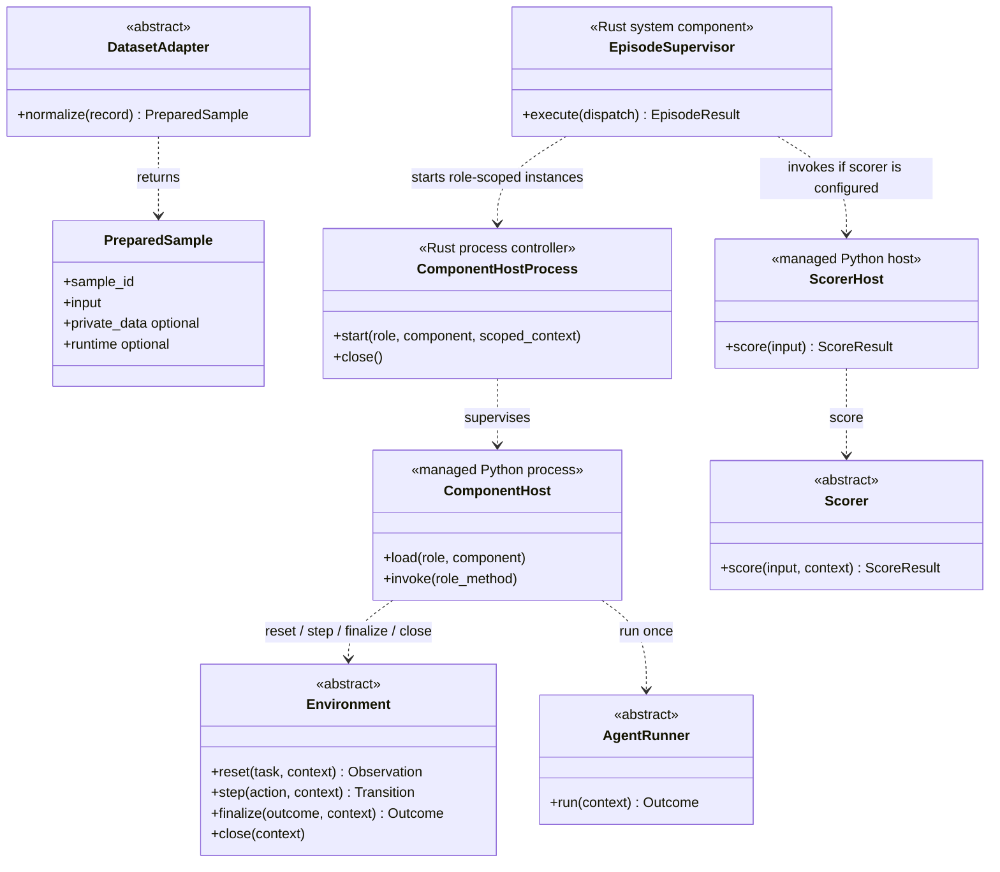
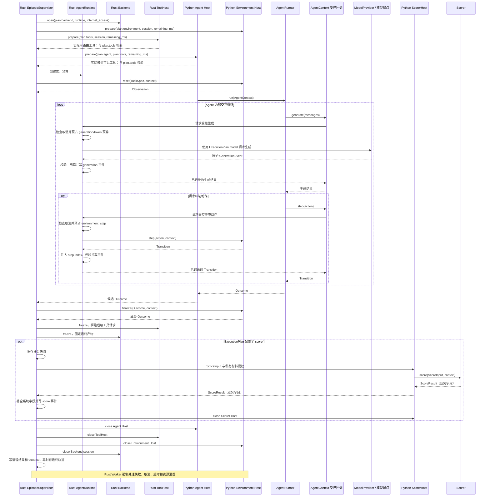

# UEnv 参考实现说明

本目录的参考代码用于把设计中的关键边界变成可运行测试。它不是远端生产迁移结果。

## 1. 语言边界

| 代码 | 负责什么 | 不负责什么 |
|---|---|---|
| Rust `reference-control` | 计划解析、组件锁定、镜像解析、预算、后端生命周期、模型和工具入口、轨迹、每个已进入评分的 attempt 至多一次评分、清理、EpisodeResult | 数据集评分规则、Agent 推理循环、Environment 业务 |
| Python `reference/sdk/src/uenv/sdk/` | Adapter、Environment、AgentRunner、Scorer、ToolExecutor、UEnvModel 与包 schema 生成 | 调度、后端、权威预算、轨迹封存、结果提交 |
| Python `reference/datasets/` | 九个数据集各自的 Adapter、Environment、Scorer | 选择 Agent、Backend、模型或本次工具表 |
| Python `scripts/build_*.py` 与 `reference/fixture_plan.py` | 当前本地参考的过渡生成器，生成文档、schema 和稳定示例 | 生产协议定义或运行时决策 |

系统控制逻辑不再通过 Python `EpisodeRuntime` 模拟。`reference/fixture_plan.py` 只生成静态示例；每个示例随后由 Rust `PlanResolver` 重建并比较，防止生成器成为第二套运行时规则。

## 2. Rust 参考文件

| 文件 | 责任 |
|---|---|
| `contracts.rs` | 当前参考读取生成的 `uenv.schema.json` 的类型与字段集合，并执行控制链需要的浅层形状检查；目标生产实现改为使用统一 proto 生成的 Rust 类型和完整校验器 |
| `plan.rs` | `PlanResolver`、计划摘要、重试、工具与实际路由核验 |
| `ports.rs` | Backend、ToolHost、AgentHost、EnvironmentHost、ScorerHost、ModelProvider、ArtifactStore 的 Rust 边界 |
| `runtime.rs` | `BudgetEnforcer`、`AgentRuntime`、`TrajectoryWriter` |
| `scoring.rs` | 每个进入评分的 attempt 至多调用一次 Python Scorer，拒绝其填写系统字段，补全正式 `ScoreResult` |
| `supervisor.rs` | `EpisodeSupervisor.execute(dispatch, ports...)` 统一 attempt 状态机和清理；配置只读 `dispatch.plan` |

Rust 不重复声明 TaskSpec、ExecutionPlan、ScoreResult 等公开结构。当前本地参考暂以 `contracts/uenv.schema.json` 驱动 Python validator，Rust 只读取类型与字段集合并追加跨字段检查。目标生产协议以 `contracts/proto/uenv/v1/*.proto` 为唯一可编辑来源；Rust/Python 类型、RPC stub、核心 JSON schema 和字段字典全部生成。数据集新增业务字段只在包内 models.py 定义并生成包 schema。生产 Server/Worker 的每个外部边界必须使用生成类型或完整校验器，不能把本地 `validate_shape` 当成完整 JSON Schema 校验。

轨迹采集复用 BatchRequest/ExecutionPlan/EpisodeSupervisor 和 TrajectoryWriter。validate_run_purpose 在批次、计划解析与 Worker 入口检查三种用途及 scorer/training 组合；PlanResolver 无 scorer 时不解析私有材料和 harness。Supervisor 接收可选 ScorerHost，其存在性必须与 plan.scorer 一致，不接受占位评分器。正常无评分执行保留 Outcome、清理和最终轨迹；有评分失败时保留错误评分。validate_result_for_plan 在本地返回边界检查评分与计划相符，生产 Server 还必须在租约事务中接入同一校验。

本地生成器遍历 reference/runs 中的公共配置，根据 environment.implementation 找到已登记包，使用同一提交构建逻辑；新增采集示例不在生成器内按数据集或用途硬编码分流。Bridge/RPC、实际数据库、真实导出服务和模型训练框架仍是目标接口，不能把参考端口测试视为生产验收。

## 3. Python 参考文件

`reference/sdk/src/uenv/sdk/` 提供以下用户接口：

- `DatasetAdapter.normalize(row) -> PreparedSample`
- `Environment.reset/step/finalize`
- `AgentRunner.run(context: AgentContext) -> Outcome`
- `Scorer.score(ScoreInput, ScoringContext) -> ScoreResult`
- `ToolExecutor.execute(arguments, context)`

`AgentContext` 只暴露 `task`、初始 `observation`、只读 `tools`、`seed` 以及异步 `generate/call_tool/step`。AgentRunner 对这三个操作统一使用 `await`；具体 Context 由 Worker SDK 适配器提供，它只是能力入口，不拥有预算或第二份工具配置。

ComponentHost 先按所选角色的 package config schema 完整校验 `ComponentSpec.config`，再只把 `config.data` 这一个 dict 传给 `Environment(config)`、`AgentRunner(config)`、`Scorer(config)` 或 `ToolExecutor(config)`；基类统一保存为 `self.config`。空配置也显式传 `{}`。组件不能同时读取整个 TypedConfig、环境变量或包默认值来形成第二套运行配置。

包模型由 dataset.yaml.models 显式登记，不扫描方法体猜测类型。input 必填；private_data、environment_config、scorer_config、action、observation、state 按需登记。已提供入口但未声明的角色配置使用 EmptyConfig；无 scorer 入口时不生成对应配置 schema；已声明的配置 schema 用于校验同一份 config.data，构造函数仍接收 dict。嵌套 UEnvModel 自动生成并恢复；ArtifactRef、ContentPart、EvaluationPlan 复用公共 schema。参考生成器对递归模型和有歧义的联合类型明确报错。

参考发布加载器不要求 tests/，但 build_examples 仍读取九个包保留的合成测试数据。build_manifest 尚未构建或上传 wheel、发布工具函数、执行 Hub 准入；生成 manifest 中 artifacts/provided_tools 为空是本地夹具边界。SDK 的 __init__.py 暂集中提供小型参考接口；生产目录仍按 module_map 拆分并仅在 __init__.py 导出。

九个内置数据集均提供评分，因此各自声明三个明确命名的直接子类；仅采集包可省略 Scorer 入口和配置 schema。例如 GSM8K 使用 `Gsm8kAdapter`、`Gsm8kEnvironment`、`Gsm8kScorer`；SWE Verified 使用 `SweVerifiedAdapter`、`SweVerifiedEnvironment`、`SweVerifiedScorer`。共享逻辑放在普通函数中复用，不再增加 `QuestionAnswerEnvironment`、`TextScorer` 或 `HarnessScorer` 中间层。

Python `ScoreResult` 是同一个结果对象。Scorer 只填写四个业务字段：

```text
success, metrics, reward, evidence
```

下面三个字段由 Rust Worker 填写：

```text
status, scorer, error
```

这样没有 `ScoreFacts`、`ScorerOutput`、`FrozenOutcome` 等同义转发类型。

## 4. 完整调用顺序

```mermaid
sequenceDiagram
    participant S as Rust Server / PlanResolver
    participant W as Rust Worker / EpisodeSupervisor
    participant B as Rust Backend
    participant T as Rust ToolGateway / ToolHost
    participant A as Python AgentHost
    participant E as Python EnvironmentHost
    participant M as ModelProvider
    participant C as Python ScorerHost

    S->>S: validate BatchRequest(run_spec, episodes) and compare stored run
    S->>S: resolve each episode with the same batch.run_spec
    S->>S: resolve one ExecutionPlan; collect required capabilities
    S->>W: execute(DispatchRequest)
    W->>B: open(plan.backend, plan.runtime, plan.internet_access)
    W->>E: prepare(plan.environment, session, remaining_ms)
    W->>T: prepare(plan.tools, session, remaining_ms)
    T-->>W: actual routable tools; verify against plan.tools
    W->>A: prepare(plan.agent, plan.tools, remaining_ms)
    A-->>W: actual model-visible tools; verify against plan.tools
    W->>E: reset(plan.task)
    W->>A: run_agent(task, observation, remaining_ms)
    A->>W: generate(messages) / call_tool(call) / step(action)
    W->>M: generate using plan.model
    W->>T: call selected tool
    T->>T: route by execution_scope
    W->>E: gated step(action) when requested
    A->>W: Outcome
    W->>E: finalize(Outcome)
    W->>T: freeze(remaining_ms) and reject later tool calls
    W->>B: freeze(remaining_ms) and expose a read-only scoring view
    W->>W: write pre-score trajectory manifest
    W->>C: score(ScoreInput) once in this attempt
    C->>W: ScoreResult business fields
    W->>W: complete and record ScoreResult
    W->>C: close()
    W->>A: close()
    W->>T: close()
    W->>E: close()
    W->>B: close()
    W->>W: record cleanup/terminal and seal final trajectory
    W-->>S: EpisodeResult
```

`generate(messages)` 和 Environment 的 `step(action)` 都是 AgentRunner 在循环中可调用的能力；它们不是同一层的业务实现。Rust `AgentRuntime` 在副作用发生前拦截模型、工具和环境动作，统一计算预算并写轨迹。多轮循环仍属于 AgentRunner；Worker 负责限制 generation、工具、环境动作和总时间。生产进程使用同一 ComponentHost 协议的 Agent 与 Environment 两个角色实例；Rust 以 AgentHost、EnvironmentHost 两个权限端口防止调用串线，本地同步参考用两个 mock 端口代替真实 IPC。

## 5. 配置消费路径核对

本节记录参考代码中谁读取配置，不重新定义字段。命名、归属与单一来源规则见[字段规范](field_conventions.md)，正式执行行为见[主方案第 5 章](../uenv_design.md#5-数据对象与配置来源)。测试结果单独记录在[验证记录](verification.md)。

| 配置或声明 | 参考读取入口与作用 | 当前边界 |
|---|---|---|
| 包 id、version | Python package_loader 生成 schema 地址，Rust ComponentCatalog 查找固定组件 | 已有本地消费路径；不代表 Hub 发布服务已完成 |
| environment、agent | PlanResolver 锁定后，由 EnvironmentHost.prepare、AgentHost.prepare 使用相应 plan 字段 | 参考使用端口和 mock；真实进程待接入 |
| 批次接收与配置一致性 | Rust validate_batch_submission 校验非空批次、成员身份和同 run_id 的完整配置；PlanResolver.resolve 使用批次中的 run_spec 和各 episode | 已有多成员、跨批复用、配置冲突和覆盖拒绝测试；真实事务接入待实现 |
| 公开配置与默认值 | package_loader.expand_run 调用 SchemaRegistry.apply_defaults 后严格校验 RunSpec | 已有本地双入口等价和非法值测试；正式 Bridge/CLI 仍待实现 |
| backend、runtime、internet_access | PlanResolver 解析组合和镜像；Backend.open 接收锁定后的计划信息 | 真正的 Process/Docker/Podman 驱动与隔离待实现 |
| model、training | AgentRuntime.generate 交给 ModelProvider，并检查生成记录 | 模型服务为 mock；生产 Bridge、推理端点与训练框架待接入 |
| tools | PlanResolver 匹配接口；ToolHost.prepare 和 AgentHost.prepare 分别核验同一计划工具表；AgentRuntime.call_tool 使用它 | 已验证端口约束；Python 函数包装、MCP 和 OpenHands 待接入 |
| scorer | 存在时 Rust run_score 调用 ScorerHost；省略时跳过，validate_result_for_plan 核验结果是否应有评分 | 已有本地评分与错误测试；真实 harness 尚未验收 |
| limits、deadline_at_ms | PlanResolver 固定截止时间；BudgetEnforcer 和 Supervisor 使用派发剩余量限制调用 | 本地预算有效；真实 RPC 授权与累计持久账本待实现 |
| trajectory_retention_days | 目标由 Server/ArtifactStore 控制保存期，不进入 ExecutionPlan | 当前没有生产消费者，随轨迹存储与回收功能实施 |

角色端口是基础设施连接，不得另带一组逐 episode 配置。参考执行入口只有 DispatchRequest；其 lease、remaining_timeout_ms、consumed_usage 分别表达授权和累计状态，不覆盖计划选择。

旧包 metadata、作者 schema_version、额外 UEnv dependencies 已由加载器和契约拒绝；Python/Cargo 的安装依赖继续由包管理文件管理。字段存在或 schema 通过只能证明格式正确，不能替代上表的消费路径检查。

Python validator 递归执行完整 JSON Schema；Rust ContractSchema 参考只读取类型与字段集合，并进行控制链需要的浅层形状与语义检查。生产边界必须接入完整生成类型或 validator。其余未实现能力统一见第 8 节。

## 6. 轨迹与评分

`ScoreInput.trajectory_ref` 和 `EpisodeResult.trajectory_ref` 都指向 `TrajectoryManifest`。评分前 manifest 使用 trajectory_status=scoring_checkpoint；最终 manifest 使用 final_complete 或 final_partial，并包含适用的 score、cleaning 状态、错误和 terminal 事件。两处使用相同根结构，读取端无需根据调用位置猜格式。公开 manifest 不复制覆盖 private_data 的 plan_digest。参考 `TrajectoryWriter` 在任一事件或 checkpoint 写入失败后把最终清单标为 `final_partial`；score 事件写失败不会丢掉已经形成的 Outcome 或 ScoreResult。交互结束原因只保存在 Outcome.termination_reason；EpisodeResult 与 TerminalEvent 不再复制它，失败原因使用 ErrorRecord.code。

执行时私有评分材料原名传入 `EpisodeRequest.private_data`、`ExecutionPlan.private_data` 和 `ScoreInput.private_data`；准备阶段位于 PreparedSample 或标准化 JSONL 的同名字段。它不会进入 TaskSpec、Observation、AgentRuntime 或轨迹事件。Python Scorer 若需要运行正式测试，只能通过 `ScoringContext.run_harness()`；该回调由 Rust Worker 绑定到当前 Backend 的冻结评分视图。`ToolHost.freeze()` 先撤销 Agent 工具写入，`Backend.freeze()` 再固定 session 内容；完成这两步后才创建评分 checkpoint 和调用 Scorer。所有 freeze/close 都必须幂等。

Agent 交互结束后，finalize、freeze 和可选 Scorer 共用 finalize_reserve_ms 留出的总剩余时间；评分上下文沿用 BudgetEnforcer 的原始单调截止时间，不重新计算一个更晚的截止时间。

`ScoreInput` 不再携带 `remaining_timeout_ms`。Scorer 只能从 `ScoringContext` 查询 Supervisor 当前剩余预算；harness 的实际超时取这份剩余预算与 evaluation_plan 中超时上限的较小值，因此评分阶段没有第二个可覆盖的时间来源。

评测与后训练走同一评分路径，产生同一个 `EpisodeResult.score.reward`。无 scorer 或进入评分前失败时没有 score；已经调用 Scorer 后，status=ok 或 status=error 的同一个 ScoreResult 都保留。区别只在下游如何消费结果；Worker 不为 training 维护第二套评分函数。

每条 `GenerationEvent.output_token_count` 都必填，并且是预算统计的唯一来源。`output_token_ids`、`output_logprobs` 和 `loss_mask` 是可选的详细训练轨迹；存在时必须彼此对齐并与 count 一致。训练配置要求 token trace 时，缺少这些详细字段的结果不能进入训练，但仍可以作为普通评测结果保存。

## 7. 验证范围

Rust 测试覆盖九个计划的统一重建、唯一字段字典、重试配置冻结、统一 Supervisor 流程、评分字段所有权、预算预留、连续轨迹、失败工具调用成对记录和失败清理。Python 测试覆盖 schema、九组数据集类、Environment 接口和评分规则。

`EpisodeSupervisor.execute()` 的本地参考假定 DispatchRequest 已经过 Worker RPC 授权；它检查形状、摘要和预算，但没有实现真实 lease token/epoch fencing、活动 attempt 账本或重复派发连接。目标 `WorkerRpc.validate_dispatch` 必须先完成这些检查，才可调用 Supervisor。

Supervisor 以收到的 `remaining_timeout_ms` 建立本机单调截止时间；运行中不再用墙上时钟重新解释 `deadline_at_ms`。Server 负责从唯一绝对 deadline 派生该只减值，Worker RPC 负责拒绝被放大的值。这样 deadline 是 Server 的审计与派发依据，remaining timeout 是 Worker 的唯一运行时计时输入，并非两套可覆盖配置。

Backend.open、各 Host.prepare、AgentHost.run_agent、ToolHost/Backend.freeze，以及模型、工具、环境和评分调用都接收这一个预算派生的当前剩余毫秒。close 由 Worker 进程控制器使用平台固定清理超时，因为清理不能在 episode 预算耗尽时跳过。同步 trait 只表示参考边界；生产 host 必须真正中断超时进程或容器操作。

尚未实现真实网络 RPC、完整 Rust JSON Schema validator、lease/replay、持久 attempt 账本、持久轨迹 spool、durable outbox、启动恢复、进程强制中断、Docker/Podman/Process 驱动、真实 OpenHands/MCP 接入、官方 benchmark 差分和分布式恢复。参考代码通过 trait 和内存 mock 明确了部分端口，但 mock 通过不能当作生产验收。

九份 batch_request.json 是实际提交结构示例；同目录 run_spec.json 和 episode_request.json 仅为方便查阅而展开的字段视图，不代表独立的配置提交接口或另一处生效来源。Rust validate_batch_submission 的 stored_run 是受信的只读对照，不用于补齐本次配置；生产 Server 必须在事务内再次核验并持久化，参考不实现数据库或网络注册服务。

公开运行示例不填写 schema_version。expand_run 共用于 YAML 解析后的对象和 SDK 提供的公开字典，使用 SchemaRegistry.apply_defaults 补齐声明默认值，再递归校验组件参数和完整 RunSpec；普通 validate 不补值。默认资源、模型生成、重试及组件参数已从九份模板移除，由契约注解补齐，用户显式参数保持原值。该函数在提交边界生成内部协议标记。该夹具辅助函数当前一次接收一份包 manifest，Environment/Scorer 选择不匹配时明确拒绝；生产提交端须按实际已选角色查询目录，Rust PlanResolver 已分别解析角色，不受夹具限制。

## 8. 实现状态与待决事项

主设计定义目标行为；本节集中说明实际参考范围。源码基线见 source_refactoring_plan.md，具体测试结果仅由 verification.md 维护。下表的“待决策”意味着还缺接口或方案，“待验证”意味着已有目标但还不能据此宣称可用。

| 主题 | 已有参考 | 待完成或待决策 | 验证方式 |
|---|---|---|---|
| 公共协议 | scripts/build_contracts.py 生成本地 JSON Schema；Python models.py 生成包 schema | 待实施：统一 proto 及 Rust/Python/RPC 生成链 | 契约生成、跨语言往返及真实 RPC 校验 |
| 执行控制 | Rust Supervisor/AgentRuntime 通过 mock 端口验证顺序、预算和计数 | 待实施：受管进程、IPC、真正的强制取消与完整边界校验 | 使用真实组件进程验证结束、超时、取消和迟到调用 |
| 调度与恢复 | 数据结构和部分形状、摘要检查 | 待实施：真实 lease/replay 校验、持久事务、spool/outbox 和重启恢复 | 断连、进程退出、重复派发和迟到结果故障测试 |
| Backend 与私有评分 | 镜像优先级和回调协议；模拟 freeze/close | 待验证：Process/Docker/Podman 驱动、固定隔离底线、候选只读视图和真实镜像兼容性 | 按后端验证工作区、访问控制、评分依赖与清理 |
| Agent 与工具 | 公共接口、接口匹配和工具表核验；PlainAgent 示例仅无工具单轮 | 待实施：Python 函数包装、MCP 生命周期、OpenHands 原生工具及有状态行为接入 | 对同一工具验证直接接口与 MCP 的真实状态、结果和事件 |
| Hub 数据服务 | 包声明加载、schema 和模拟文件引用 | 待决策：数据发布/样本选择/文件授权 API 的完整请求结构；待实施：索引、缓存和保留期 | 同一条样本分别由本地与 Hub 准备，比较请求与结果；测试冲突、缺失和权限 |
| 动态工具 | 固定工具表协议 | 当前不支持；待决策：授权来源、发现过程及工具表版本协议 | 明确协议前拒绝运行中增加工具 |
| 通用性 | 九个合成数据集包及有状态接口示例 | 待验证：真实多轮、多模态、无参考答案、代码 harness 与 OpenHands 全链路 | 保留真实 Agent、工具、环境，仅替换模型端点做模拟 |

Python 构造的数据副本、schema 校验或 mock.freeze() 均不能证明进程隔离已经实现。Worker 的真实网络与文件授权、完整 RPC 字段验证和不可变产物保存是上线前要求。

原主文档中的本地执行入口记录统一归入本节：参考执行器接收 DispatchRequest，配置来自 ExecutionPlan；真实持久派发授权与恢复账本仍需接入。旧日期下的测试数量不作为当前统计，最新记录见 [验证结果](verification.md)。

## 9. 系统接口接入目标

本节面向实现 Worker/IPC 的维护者。下面的类图和时序图描述目标接线；本地 Rust 只以端口和 mock 验证其中的部分调用约束，不能据图推断真实组件进程、MCP 或 OpenHands 已经接通。

### 9.1 组件进程与用户扩展对象

先只看数据集接入直接相关的核心关系。图中方法省略 context 等参数以便阅读；准确签名见参考 SDK。标为 abstract 的类是用户扩展接口。



图例：虚线箭头 `..>` 表示调用或使用，不表示继承；箭头标签 run once 指一次 attempt 中只调用一次 Agent.run，内部可以发起多次 generation。`ComponentHostProcess` 是一种基础设施实现，按 role 启动 Agent 与 Environment/沙箱工具两个权限隔离的实例，不是两个用户接口。这里没有一个包揽所有职责的 Dataset 父类。

DatasetAdapter 位于数据准备阶段，返回 PreparedSample(sample_id, input, private_data, runtime)。作者侧的 input 与 private_data 使用 `UEnvModel`；prepare 根据入口类型和固定包版本自动封装为内部 TypedConfig，再用 input 构建公开 TaskSpec，与可选 private_data 配对写入 EpisodeRequest，不再生成和读取额外的私有材料包装文件。Worker 执行时不再转换原始数据。

EpisodeSupervisor 是 Rust Worker 内唯一的 attempt 生命周期执行器。它创建后端会话、启动/终止 Python host、强制预算和取消、冻结产物、在本 attempt 进入评分时至多调用一次评分、完成首次清理、封存轨迹并保存待上报结果。ComponentHost 和 ScorerHost 只是受管 Python 组件入口，不拥有租约、后端、最终状态或持久化。它们先按对应角色的 package config schema 完整校验 `ComponentSpec.config`，随后只把 `config.data` 作为必填 dict 传给用户类构造函数；基类统一保存为 `self.config`，空配置显式传 `{}`。Environment、AgentRunner、Scorer 是用户扩展对象；用户不实现 Supervisor 或 host。

### 9.2 Worker 内部多轮调用时序

下面使用有状态环境说明 step 的位置。工具与沙箱路径下一小节单独画。



AgentContext 不是另一个调度服务。它在 Python 中向 Agent 提供 task、observation、step、generate 和工具入口；调用必须进入 Rust `AgentRuntime`，由它在副作用发生前检查取消、截止时间和对应预算。Python 只把框架调用转换成协议，不能直连模型后再补报、不能自行增加次数、延长截止时间或封存轨迹。本地 Rust 参考把受控调用集中在 [AgentRuntime](../../reference-control/src/runtime.rs)。open、prepare、Agent.run、freeze 以及每次模型/工具/环境/评分调用都接收同一预算派生的当前 remaining_ms。清理固定为 ScorerHost → AgentHost → ToolHost → EnvironmentHost → Backend，仅关闭已创建的资源；无评分时没有 ScorerHost；`freeze()`、`close()` 都必须幂等，某一步失败也继续尝试后续步骤。close 使用平台固定的清理超时，不能因 episode 预算已耗尽而跳过。

单轮问答仍调用同一个 Agent.run，只生成一次回答，可以不调用 step。多轮策略由 AgentRunner 决定，Rust Worker 强制公共预算；Supervisor 不再套一层模型决策循环。多轮中的公开反馈来自 Environment.step 的 Observation 或工具结果；这些内容会写入轨迹，但配置了 scorer 才在最终 Outcome 冻结后产生至多一次正式 ScoreResult。

### 9.3 工具路由与资源端口

这一张是目标逻辑依赖图。用户扩展是 Python，准入和资源控制是 Rust；跨进程通过生成协议通信。`ToolHost` 是 Rust 内部端口，`ToolGateway` 是它的实现，不是新的部署进程。普通 Python ToolExecutor 与 Environment 使用同一个 sandbox 角色 host；Agent 原生会话工具留在 Agent host。ToolGateway 只按唯一 `ExecutionPlan.tools` 选择路由，Backend 只提供本次 session。本地 Rust 参考已实现受控模型/工具入口，真实 IPC 接线和 OpenHands 适配器仍未实现。

```mermaid
classDiagram
  direction LR
  class AgentRunner {
    <<abstract>>
  }
  class ToolGateway {
    <<Rust ToolHost implementation>>
    +prepare(tools, session, remaining_ms) routable_tools
    +execute(binding, arguments) ToolResult
    +freeze(remaining_ms)
    +close()
  }
  class ToolExecutor {
    <<abstract>>
    +execute(arguments, context) dict
  }
  class ReadFileTool
  class BackendSession {
    <<planned>>
    +read_file(path)
    +execute(request)
  }
  class Backend {
    <<Rust trait>>
    +open(backend, runtime, internet_access, remaining_ms)
    +execute(request)
    +read_file(session_id, path)
    +freeze(remaining_ms)
    +close()
  }
  AgentRunner ..> ToolGateway : through Python SDK adapter
  ToolGateway ..> ToolExecutor : invokes through role-scoped ComponentHost
  ToolExecutor <|-- ReadFileTool
  ReadFileTool ..> BackendSession : context.session.read_file
  BackendSession ..> Backend : delegates through Worker
```



工具不是 Agent 的父类，Backend 也不是 Environment 的父类。它们通过受控接口组合：Agent 决定调用，工具完成操作，后端提供资源能力。ProcessBackend、DockerBackend、PodmanBackend 在 Worker 侧实现统一后端协议；这不意味着 Python ABC 的继承关系可以直接跨语言执行。ToolHost 返回“能否路由”，AgentHost 返回“模型能否看见”；Supervisor 把两者分别与唯一 `ExecutionPlan.tools` 核对，返回值不成为第二份工具配置。

状态环境的动作工具可以调用 AgentContext.step；文件工具通过 session 操作文件。一次动作只执行一次，不能先由文件工具修改，再让 Environment.step 重复修改。只操作 SDK 会话状态的原生工具无需经过任务 Backend，但仍遵守工具选择、平台安全底线、计数和记录。工具使用规则见[主设计第 6.4 节](../uenv_design.md#64-工具定义接入与调用)。
