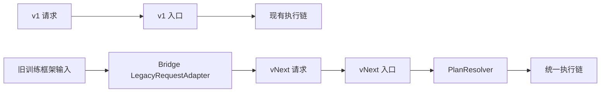

# UEnv 源码重构计划

## 1. 目的与范围

本文把目标设计转换为可以逐步实施的源码改造计划。目标不是按照新目录重新编写整个系统，而是保留现有可靠能力，替换职责混乱的协议和编排，完成验证后删除旧分支。

源码基线为远端提交 `af675b20b91c66672b0517b378205603fe424bf3`。2026-09-08 再次只读检查远端 `/home/uenv-release-0905/uenv_pre_release`，分支为 `uenv_pre_release`，工作区干净。与 design 同级的 `source` 是本次分析使用的本地快照。本文描述计划，不表示生产源码已经迁移，也不表示已有测试在本次检查中通过。

目标语义以[系统设计方案](../uenv_design.md)为准，系统协议实施后以 `contracts/proto/uenv/v1/*.proto` 为唯一可编辑来源；[字段字典](../generated/field_dictionary.md)和机器可校验 schema 都是生成物。目标文件组织见[模块清单](../generated/module_map.md)。本文统一维护原有能力证据、源码处置、迁移顺序和验收条件，不再定义另一套类型或字段。以下生产源码事实来自上述历史检查，本次文档整理没有重新连接生产服务器。

### 1.1 已集成数据集与源码范围

| 数据集 | 代码支持证据 | 现状判断 | 目标包 |
|---|---|---|---|
| GSM8K | math/qa manifest；gsm8k scoring.rs；Bridge 数据准备脚本 | 有题目转换和评分实现 | datasets/gsm8k |
| PubMedQA | math/qa manifest；标签评分；Bridge benchmark/train scripts | 有训练/评测输入和标签评分 | datasets/pubmedqa |
| SciTab | math/qa manifest；表格转换和标签评分 | 有表格任务、分类评测实现 | datasets/scitab |
| OlymMATH | math/qa manifest；数学评分；Bridge EN/ZH、easy/hard 元数据转换 | 变体共享算法，不需四条调度链 | datasets/olymmath |
| DSCodeBench | code manifest；evaluate_code.py/dscodebench_harness.py | 有代码生成、测试、分数解释；另有 Code Agent 服务路径 | datasets/dscodebench |
| SWE-bench Verified | BenchmarkVariant、dataset/session、grader、OpenHands adapter | 有完整相关执行模块；本次未跑 benchmark | datasets/swe-verified |
| SWE-bench Lite | 同家族 enum/parser/grader 分支 | 有变体支持，不能仅此认定独立端到端验收 | datasets/swe-lite |
| SWE-bench Pro | pro_eval、runtime_contract、OpenHands official runner | 有专用 harness 和运行依赖处理 | datasets/swe-pro |
| SWE-smith | smith_eval、dataset、训练准备与运行代码 | 有专用训练/评测路径与资源要求 | datasets/swe-smith |

`math`、`qa`、`code`、`swe` 是现有环境/路由标识，不是应新增的四个数据集。OpenEnv/MCP 是接口适配，不列为数据集。ROLL/GEM 目录有实验脚本，尚不据此宣称所有相关环境已集成验收。

证据：math/qa 数据集声明（生产源码 `plugins/math/manifest.yaml:13`）、Code 数据集声明（生产源码 `plugins/code/manifest.yaml:11`）、SWE 四变体（生产源码 `uenv-worker/src/swe/variant.rs:8`）。

### 1.2 源码审查中需要防止的问题

下表汇总此前静态审查发现的风险，用于安排迁移检查，不表示已复现所有故障。具体模块及处置见第 3 节；测试与上线要求见第 7、11 节。

| 原有风险 | 会造成什么问题 | 迁移检查 |
|---|---|---|
| 执行完成被当成答对；评分异常被转成零分 | 无法区分答错与评分程序故障 | 分别检查执行状态、任务成功和评分状态 |
| 用完整回答评分，却只保存截断回答 | 无法根据保存结果解释原分数 | 对照评分输入、最终产物和已保存轨迹 |
| 多次生成的 token 被拼平，模型版本只取第一次 | 训练数据无法准确对应每次真实生成 | 逐 generation 验证 token、logprob 和版本 |
| Rust、Python 分别解析同一份评测日志并静默回退 | 相同测试结果可能得到不同分数 | 固定 harness 输出和单一解释入口，做语料差分 |
| 早退未清理资源；取消丢轨迹而超时保留轨迹 | 资源泄漏，失败记录不完整 | 注入失败和取消，验证统一收尾路径 |
| 请求超时与默认值取较大值 | 实际执行超过用户要求的期限 | 验证默认值、子调用和重试均不能延长期限 |
| 指定 Agent 后因缺少任务字段回到旧执行链 | 实际没有执行用户选择的 Agent | 不完整配置明确报错，禁止静默切换链路 |
| 缺少模型服务时用目标答案作为模型回答 | 测试数据可能被误当成真实模型输出 | 测试替身只能在测试入口注入，产品入口拒绝缺失端点 |
| reset 配置经额外 sidecar 文件传递 | 协议和文件成为两份配置来源 | 配置进入统一协议，移除隐藏覆盖入口 |
| instance_id 同时表示样本和运行会话；预热复用键不完整 | 日志关联混乱，或复用不兼容的资源 | 分开任务身份与会话身份，核验完整版本与兼容键 |
| 题目与评分材料混在同一对象 | 难以检查 Agent 实际可读的数据范围 | 分离公开输入与私有材料并验证进程、文件和接口权限；静态混放本身不证明已经泄漏 |

## 2. 重构原则

### 2.1 保留行为，不强求保留原文件

“保留”表示保留已经存在且仍然需要的行为、算法和可靠性能力。为了满足新的职责边界，可以移动文件、修改类型或缩小接口。不能因为目标目录不同就重新实现并丢掉现有的超时、取消、重试、恢复和清理逻辑。

每项源码只使用以下四种处置状态：

| 状态 | 含义 |
|---|---|
| 保留 | 职责和接口基本正确，只做命名、依赖和测试调整 |
| 修改 | 核心实现可复用，但输入、输出或所在模块需要改变 |
| 重写 | 当前职责或执行方式与目标冲突，重新实现公开行为 |
| 删除 | 新路径完成替代和验收后，从产品调用图及源码中移除 |

### 2.2 新旧执行链按协议版本隔离

迁移期允许现有 `v1` 和新协议同时存在，但一次 attempt 只能由其中一条链负责。禁止对 Agent、容器、工作区或测试命令做有副作用的双执行。



兼容转换只出现在 Bridge 的 `LegacyRequestAdapter`。新协议内部不接收 `env_type`、同义字段或按字段形状猜测出来的配置。需要继续使用旧 Server RPC 的调用方在迁移期仍走完整 `v1` 链，之后升级到新接口；不能把两套字段同时塞进一个内部对象。

协议版本只选择哪套服务入口，不属于任务执行配置。后端、Agent、工具、模型、资源限制和评分组件仍然只由最终 `ExecutionPlan` 决定。

### 2.3 一个配置只有一个生效来源

Server 在接收新请求后一次性解析 `EpisodeRequest + RunSpec`，并按已选组件引用查询可信目录，生成不可变的 `ExecutionPlan`。Worker 和 Python 组件只读取计划中属于自己的字段，不再从任务 payload、数据集名称、环境变量或默认 manifest 重新覆盖执行配置。

运行期间可以读取服务启动参数、凭据和节点事实，例如数据库地址、容器引擎 socket、Worker 可用 CPU 和访问令牌。这些是部署状态，不得改变某个任务已经锁定的 Agent、Backend、工具、镜像或评分规则。

### 2.4 主流程不识别数据集

Bridge、Server 和 Worker 主流程不得出现 `if dataset == ...`、`if env_type == ...` 或等价分支。数据集差异只能存在于版本化扩展包中的专属 `DatasetAdapter`、`Environment` 和 `Scorer` 类以及它们依赖的辅助模块。

迁移可以按数据集逐个进行，但每个迁移完成的数据集必须经过同一条链：

```text
Bridge -> Server -> ExecutionPlan -> Worker EpisodeSupervisor
       -> BackendSession -> Environment -> AgentRunner
       -> Environment.finalize -> Scorer -> Trajectory/EpisodeResult
```

### 2.5 旧代码先失去流量，再删除

旧模块必须同时满足以下条件后才能删除：

1. 其有效能力已经有明确的新负责人；
2. 对照测试或故障测试证明新实现覆盖了该能力；
3. 新任务已经不再进入旧入口；
4. 已运行的旧 attempt 已完成或被明确终止；
5. 历史结果和轨迹仍可按 schema 版本读取；
6. 回退不再依赖恢复已删除的旧写路径。

## 3. 当前源码处置总表

### 3.1 Bridge

| 功能 | 当前关键代码 | 处置 | 迁移要求与验收 |
|---|---|---|---|
| Python Bridge 框架接入 | verl_agent_loop.py、clients.py | 修改 | 保留有效 VeRL 映射，分出 request/result/model/trace；移除业务别名猜测 |
| Rust AdapterCore 批次映射 | core/src/core.rs、protocol.rs、service.rs | 修改 | 独立进程可退役，但批次流、背压和协议校验继续使用 Rust；Python Bridge 只做框架转换和调用 |
| 通用批次提交 | AdapterCore.execute_batch、Server submit_episode_batch | 修改 | ID 对齐、部分失败、重复提交契约不丢失 |
| 模型 Gateway | bridge/model_gateway.py | 修改 | 保留推理服务接入，规范化真实 token/version，去除数据集语义 |
| Native SWE 直连训练 baseline | native_swe_agent_loop.py | 修改 | 基线对照脚本保留于 experiments，不作为产品的另一条任务链 |
| VeRL 版本补丁 | verl_*_patch.py、sitecustomize.py | 修改 | 锁定依赖版本、记录作用范围，能由正式 adapter 代替时移除，禁止无条件全局修改 |
| 数据集原始输入适配 | Bridge benchmark utils、swe/dataset.rs | 修改 | 题目、表格、repo、patch、测试计划都在扩展包，不在公共 Worker |

必须保留批次 ID 对齐、部分失败、重复提交处理、取消、重试边界、输出顺序恢复、真实 token/logprob 和模型版本传递。旧 AgentControl 客户端仅为迁移兼容保留，切换完成后删除。

### 3.2 Server

| 功能 | 当前关键代码 | 处置 | 迁移要求与验收 |
|---|---|---|---|
| Server 提交与幂等 | episode_coordinator.rs、service/episode.rs | 修改 | 稳定 ID、冲突拒绝、同一任务挂接原结果；加强事务唯一终态 |
| Server 执行后端分流 | execution_backend.rs、SweAgentSpec/CodeAgentSpec | 重写 | 统一 ExecutionPlan；删除以数据集判断 native/agent 的代码 |
| Server admission | admission.rs | 保留 | 队列/全局并发和 Worker 本地并发不同；统一计数收尾，测试取消等待 |
| Worker 注册、心跳、drain | control_plane.rs、scheduler/traits.rs | 修改 | 删除 supported_env_types 的路由职责，按能力/组件版本匹配 |
| Worker 选择与 reservation | scheduler/mod.rs | 修改 | 保留容量防超配；输入换能力/资源，release 按 reservation identity 防重复 |
| lease/epoch/dispatch token | proto 与 dispatch/control plane | 修改 | 旧 attempt 结果不覆盖新结果；不增加未经设计的多主 Server |
| Server SQLite/outbox/recovery | persistence/* | 修改 | 删除 native/agent 各自恢复流程，统一 attempt 对账 |
| Server ResultFinalizer | result_finalizer.rs | 修改 | 不补造评分/token，事务收口后再发布 |
| 观测事件与页面查询 | obs/*、admin_http.rs、trajectory/* | 修改 | 页面以规范事件投影，删除分支手写补偿与同义字段猜测 |
| 现有 Agent 池选择与入队 | service/episode.rs:703、714、1002、1010；2026-09-05 远端只读核对 | 删除 | Worker 统一管理 Agent 生命周期；退役池身份解析、独立容量和任务队列，不再引入 Agent 池 |

当前 `SelectedExecutionBackend`（生产源码 `uenv-server/src/execution_backend.rs:51`）是选择任务链的分流器，不是目标 Backend 驱动。以 PlanResolver、PlacementScheduler、EpisodeCoordinator 替代它；Worker 的进程与容器执行能力保留。AgentJob、池容量和独立 Agent lease 在旧流量退出后删除。

### 3.3 Worker

| 功能 | 当前关键代码 | 处置 | 迁移要求与验收 |
|---|---|---|---|
| Worker 主执行循环 | episode/executor.rs | 重写 | Rust EpisodeSupervisor 保留唯一外层状态机；模型决策循环移入 Python AgentRunner，环境准备、冻结、评分、轨迹和清理由 Rust 强制排序 |
| Worker 模型请求 | episode/model_client.rs | 修改 | Python Agent/SDK 组织模型消息，Rust Worker 强制端点配置、预算、取消并接收真实生成事件；移除隐式 target 回答 |
| Worker reward override | episode/reward_engine.rs | 删除 | Rust Supervisor 在每个进入评分的 attempt 中至多调用一次 Python Scorer，补全并校验 ScoreResult；Server 每个 episode 只接纳一个，评测与训练复用 |
| Python process-plugin 模板 | templates/process-plugin/* | 修改 | 复用简单生命周期思想，reset 配置进入协议，不再依赖 sidecar |
| 插件进程创建/健康/关闭 | plugin/host.rs、backend/process.rs | 修改 | 改为 Rust ComponentHostProcess/ScorerHostProcess，强化取消、超时和子进程组回收 |
| 通用 Backend 与 SWE Backend | backend/*、swe/backend/* | 修改 | 抽出 dataset-neutral 的 Process/Docker/Podman 实现 |
| SWE Docker/Podman CLI 操作 | swe/backend/cli_container.rs | 修改 | 去掉 SWE 类型依赖；错误、预算、exec/files 协议一致 |
| 镜像下载/缓存 | swe/image_cache.rs | 修改 | 按不可变 digest，保留镜像命名逻辑于数据包准备流程 |
| WarmupPool/SweInstancePool | pool/*、swe/instance_pool.rs | 修改 | 只保留 `BackendSessionWarmPool`：按完整后端/session 兼容键 borrow/release/invalidated；任务 reset 仍由 Environment 实现，与 Agent 调度无关 |
| WarmupSizer | pool/warmup_sizer.rs | 修改 | 测量收益后开启，不是正确性的依赖 |
| Worker WAL | wal/mod.rs | 修改 | 只负责计算结果在 ACK 前可恢复，不与 Server 争权威状态 |
| 轨迹存储/上传 | swe/trajectory*.rs、uenv-common/trajectory.rs | 修改 | Python 只提交事件内容；Rust 统一身份、序号、原文、逐生成 trace、快照、封存、部分轨迹与 ACK/GC |
| SWE Runtime Gateway | runtime_gateway/mod.rs | 重写 | 保留远端 exec/read/write 的必要传输；解绑 SweInstancePool，submit 交 Worker 评分服务 |
| 命令限制与隔离 profile | swe/command_policy.rs、sandbox_profiles/* | 重写 | 用户不配置 syscall/capability；环境包只声明 internet_access，Backend 统一落实平台安全底线 |

`execute_swe_episode()` 在统一 Supervisor 接管并验收后删除。目标执行和收尾顺序只在[主方案第 4.5 节](../uenv_design.md#45-worker执行与资源生命周期)定义；取消和失败也必须进入同一清理路径，不因数据集另设流程。

### 3.4 Hub

| 功能 | 当前关键代码 | 处置 | 迁移要求与验收 |
|---|---|---|---|
| Hub artifact/version/schema | hub package/repository/domain | 保留 | 版本、digest、发布校验和读取能力继续使用 |
| Hub env/EnvPackage/Stack | hub types/domain/stack.rs | 修改 | 对用户统一 manifest + RunSpec，内部区分组件和运行组合；旧实体入口转换 |
| 评分对齐证据 gate | hub domain/rubric.rs | 保留 | 对照 corpus、scorer digest 与报告挂在评分包，不成为数据集路由 |
| Hub 服务基础能力 | 鉴权、RBAC、请求 ID、限流和指标 | 保留 | 按现有权限边界继续提供服务，不随包领域模型重写 |
| Hub 仓储与事务 | SQLite repository；package.rs 流式 artifact 写入 | 修改 | 保留事务、SHA-256 和目标路径校验；增加代码包与数据 revision 索引，不重新实现文件仓储 |

生产源码 `uenv-hub/uenv-hub-core/src/package.rs:1` 中的流式 artifact、摘要和路径安全逻辑应复用。主要改变领域模型和 API。

### 3.5 数据集、评分和 OpenHands

| 功能 | 当前关键代码 | 处置 | 迁移要求与验收 |
|---|---|---|---|
| OpenHands SDK 接入 | integrations/openhands/* | 修改 | 保留真实 Conversation/工具执行；去掉任务特判、最终评分控制和全局副作用扩散 |
| 数学/标签评分 | plugins/math/src/backends/* | 重写 | 使用旧 scorer 和固定语料做差分；新增规则独立版本化 |
| DSCodeBench Python harness | plugins/code/scripts/* | 保留 | 由新 Python Scorer 使用 Worker 执行能力调用；重新区分候选错误和 harness 故障 |
| SWE 评分/harness | swe/grader.rs、*_eval.rs、plugins/swe/evaluator | 重写 | 不用多份日志解析器互为静默 fallback；按变体验收 |

语言迁移和评分政策升级必须分开。Python scorer 先复现当前可确认的规则；修复旧 bug 或对齐新的官方规则时，使用新的 scorer 版本并单独记录差异。OpenHands 保留真实 SDK 与工具执行，删除池化领取、AgentControl 调度和最终评分控制。

### 3.6 测试与验收工具

| 功能 | 当前关键代码 | 处置 | 迁移要求与验收 |
|---|---|---|---|
| 测试与压测工具 | tests/*、stress_test_refactored | 修改 | 必须测新公共链；已弃用 shortcut 不继续作为端到端验收 |

不得以旧 shortcut 的通过结果证明新公共执行链正确。保留历史源码快照与评分语料作行为对照；删除旧模块的前置条件见第 2.5 节。

### 3.7 协议与控制职责的源码依据

当前系统协议没有单一来源：公共 episode 消息位于 `proto/uenv/v1/*.proto`，Worker RPC 又在 `uenv-worker/proto/worker_service.proto`，Hub RPC 在 `uenv-hub/proto/hub.proto`，Hub HTTP/存储 DTO 还在 `uenv-hub-types/src/lib.rs` 手写。它们表达的是同一系统的边界对象，却由不同目录和不同语言分别维护。目标重构必须把 UEnv 系统 message/service 收敛到 `contracts/proto/uenv/v1/`，再生成 Rust/Python 类型、RPC stub、核心 JSON schema 和字段文档。数据集新增业务字段不进入核心 proto，只在包内 models.py 定义并生成包 schema，从而避免新增数据集触发核心协议升级。

当前 `EpisodeRequest.payload` 是 bytes，注释允许它承载 question、dataset、SWE instance 等多种业务字段；源码没有一个面向作者、可查询的字段目录。Hub 的 `config_schema`、`interface` 和若干开放 JSON Value 又分散在另一组协议/DTO 中。因此当前用户无法可靠地区分系统字段与扩展字段，只能查源码和数据集样例。目标方案增加由统一契约驱动且按作者任务过滤的 `uenv describe`、Python 类型提示与发布前校验：数据集作者只看 PreparedSample/包模型，运行用户只看 RunSpec，内部字段不进入默认视图。这些都属于待实现能力，不能描述成现有命令。

之前审查强调了 `backend/mod.rs` 的薄接口，但不足以覆盖后端现状。补查确认 SweSessionBackend（生产源码 `uenv-worker/src/swe/backend/mod.rs:90`） 已定义 provision/exec/read/write/terminate/reconcile。因此后端目标不是从零重写底层执行能力，而是合并现有两组抽象，复用 CLI container 的底层操作，并清除其中的 SWE 类型耦合。

Bridge 当前也不只是一个 Python 转发器：还存在 Rust AdapterCore（生产源码 `uenv-bridge/core/src/core.rs:31`），其 gRPC 服务还实现批次流并发与背压；Python `UEnvAgentLoop` 承担请求构造、模型端点、重试、轨迹转换和框架适配。目标允许删除单独 AdapterCore 进程，但不会把流控和权威协议校验迁入 Python；这些逻辑并入 Rust Server。

Worker 当前也不只是资源启动器。EpisodeExecutor（生产源码 `uenv-worker/src/episode/executor.rs:210`） 在 Rust 中掌握 reset/step、超时失败、reward 和轨迹，插件宿主（生产源码 `uenv-worker/src/plugin/host.rs:54`） 在 Rust 中监管 Python/Rust 插件进程。目标重构会清除数据集分支，但应保留 Rust 对 attempt 生命周期的最终控制；Python ComponentHost 只执行用户组件回调。

### 3.8 当前语言分工的源码依据

2026-09-07 再次只读核对远端提交 `af675b20b91c66672b0517b378205603fe424bf3`，工作区干净。Rust 与 Python 文件数量不能直接表示职责；例如 `uenv-server` 中的 Python 文件主要是压力测试和报告脚本，在线服务本身仍是 Rust。因此以下按实际调用职责分类，不用易受生成文件或统计范围影响的文件数作架构依据。

| 现有部分 | 当前实现 |
|---|---|
| Bridge | Python 负责 VeRL 等框架适配；`uenv-bridge/core` 的 Rust 服务负责批次流、并发和背压 |
| Server | 请求处理、调度、AgentJob/Agent 池、状态、持久化、轨迹接收均为 Rust |
| Worker | 主执行器、控制面、Process/Podman、插件进程、SWE session、评分适配和轨迹上传主要为 Rust |
| Hub | API、数据库、版本、manifest、schema 校验、包文件处理主要为 Rust |
| 数学/问答评分 | GSM8K、PubMedQA、SciTab、OlymMATH 的规则当前位于 Rust `plugins/math` |
| DSCodeBench | Rust 插件负责提取、启动和 reward 组织，实际代码评测脚本为 Python |
| SWE | Worker 的 session、grader、容器和轨迹大多是 Rust；官方评测包装和 OpenHands 是 Python |
| Agent | OpenHands 和 VeRL agent loop 为 Python；Server 的 AgentJob/池调度为 Rust |
| Backend | 通用 Process/Podman 及 SWE 容器驱动为 Rust |
| 轨迹 | Worker/Server 的落盘、上传和查询主要为 Rust；Python 生成模型与 Agent 事件 |
| 公共协议 | Proto 同时生成 Rust/Python 类型，业务 JSON 仍有多处手写转换 |

源码依据：Rust Bridge 批次与背压（生产源码 `uenv-bridge/core/src/service.rs:31`）、Rust Server 数据集分流（生产源码 `uenv-server/src/execution_backend.rs:57`）、Rust Worker 主执行器（生产源码 `uenv-worker/src/episode/executor.rs:210`）、Rust Process/Podman 后端接口（生产源码 `uenv-worker/src/backend/mod.rs:11`）、Rust 数学评分（生产源码 `plugins/math/src/score.rs:5`）、Rust 调用 Python 代码评测（生产源码 `plugins/code/src/backends/dscodebench/executor.rs:61`）、Python OpenHands 适配（生产源码 `integrations/openhands/run_swebenchpro_official.py:645`）、Rust 轨迹上传（生产源码 `uenv-worker/src/swe/trajectory_upload.rs:90`）、Rust Hub 包管理（生产源码 `uenv-hub/uenv-hub-core/src/package.rs:385`）。

判断标准很简单：用户需要经常修改的任务规则用 Python；涉及权限、进程、容器、并发、超时、取消、租约、持久化和不可变记录的系统规则用 Rust。这样既保留用户友好性，也避免 Python 扩展绕过平台约束。

## 4. 迁移后的唯一调用链

执行流程、类间调用和失败收尾统一引用[主方案第 4 章](../uenv_design.md#4-一次任务的完整执行流程)；本计划不再维护第二套目标时序图。

迁移验收必须确认三个转换点：Bridge 只提交标准请求；Server 一次解析并锁定计划；Worker 只从派发请求执行该计划。数据集迁移只替换扩展实现，不增加提交、调度、Agent 或评分分支。旧链与新链的并存边界见第 2.2 节。

## 5. 分阶段实施计划

每个阶段都必须保持主分支可部署。阶段提交不能同时大范围改协议、评分规则和可靠性算法，避免出现问题后无法判断来源。

### 阶段 0：冻结基线和建立能力账本

工作内容：

1. 为现有功能建立迁移账本，记录旧入口、新负责人、行为基线、验证方法和删除条件；
2. 运行并记录现有测试，不把“测试文件存在”写成“测试通过”；
3. 保存各类数据集的固定输入、回答、补丁、测试结果、score 和轨迹样本；
4. 标记测试属于“长期保留行为”“迁移对照”还是“随旧接口删除”；
5. 记录已知失败和非确定性来源，禁止在后续重构中静默跳过。

重点基线：

- Bridge：批次、重排、重试、模型版本、token、logprob；
- Server：幂等、admission、reservation、lease、恢复和迟到结果；
- Worker：进程监管、容器清理、超时、WAL、部分轨迹；
- Hub：包发布、digest、下载、权限、缓存和事务；
- 数据集：固定评分语料、真实 DSCodeBench/SWE harness；
- OpenHands：真实 SDK、模型 gateway、工具和工作区修改。

退出条件：能力账本中的每个正式功能都有新负责人和至少一种可执行验证方法。

### 阶段 1：集中系统协议并生成双语言类型

工作内容：

1. 把现有 core proto、Worker 私有 proto、Hub proto 及重复 Rust DTO 合并到 `contracts/proto/uenv/v1/`；
2. 评审并冻结新 proto，由它生成 Rust/Python 类型、RPC stub、核心 JSON schema 和字段字典；
3. 建立数据集 models.py 到包 schema 的发布生成链，用户不维护 schemas 目录；
4. 实现按作者任务过滤的 `uenv describe`：数据集作者只看 PreparedSample 与包模型，运行用户只看严格分组的 RunSpec；完整系统类型只进入由 proto 生成的核心维护文档，CLI 不保存第二份字段清单；
5. 让 Python SDK 根据 `UEnvModel` 自动生成内部 TypedConfig/schema_ref，普通作者不手写传输信封；
6. 增加新协议服务入口，现有 `v1` 保持冻结；
7. 实现严格的序列化、反序列化、digest、schema-version 和重新生成无差异契约测试；
8. 实现 Bridge 唯一的 `LegacyRequestAdapter`，兼容映射不得进入新核心。

退出条件：一个含义只有一个公共字段名；普通用户在不阅读 proto/JSON Schema 的情况下只看到当前需要填写的字段；Rust/Python round-trip 一致；未知字段、系统控制字段遮蔽、未知 schema 和已登记同义字段进入新接口时明确失败；疑似同义但无法确定的字段产生清晰警告，不宣称完全自动判断语义。

回退方式：关闭新协议入口，现有 `v1` 链不受影响。

### 阶段 2：建立 Server 新控制链

工作内容：

1. 新增 `PlanResolver`，生成不可变 `ExecutionPlan`；
2. 将 admission、幂等、lease、reservation、outbox 和 recovery 接入新 Episode/Attempt 状态；
3. Worker 注册增加协议、组件接口、后端和资源能力，不再用 `supported_env_types` 路由新任务；
4. 新增统一 `EpisodeCoordinator` 和结果接纳事务；
5. 保持旧 `execution_backend.rs` 只服务旧链，不让新链调用它。

退出条件：Server 新路径不读取数据集名称决定执行方式；相同请求只生成一个计划；所有后续模块只能读取该计划；重复和迟到结果不会覆盖已接纳终态。

回退方式：停止接收新协议请求；已经派发的新 attempt 按原协议完成或显式取消，不能转换到旧链继续执行。

### 阶段 3：建立 Worker 统一运行时

工作内容：

1. 实现 Rust `EpisodeSupervisor`、`EpisodeScope`、预算、取消和统一清理；
2. 把现有进程监管包装成 `ComponentHostProcess/ScorerHostProcess`；
3. 合并普通 Backend 和 SWE session 能力，形成 Process/Docker/Podman 契约；
4. 把模型传输、WAL、artifact、trajectory I/O 接入新端口；
5. 建立角色隔离的 Python ComponentHost 和 ScorerHost；
6. 使用合成 Echo/Counter 组件验证完整状态机，不用它替代真实数据集验收。

退出条件：成功、任务错误、系统错误、取消和超时都经过相同的 cleanup → seal → persist → report；资源清理由 `EpisodeScope` 统一负责；close 幂等，失败后有界重试且不改结果；Worker 重启后结果可继续上报。

回退方式：新 Worker 只声明新协议能力；旧 Server 不会向其派发旧任务。旧 Worker 继续服务旧链，两类 Worker 不交叉解释协议。

### 阶段 4：迁移 Bridge、Hub 和包加载

工作内容：

1. Python Bridge 改用统一新请求和结果；
2. Rust AdapterCore 的批次流和背压合入 Server；
3. Hub 增加不可变代码包、数据 revision、样本索引和 ArtifactRef API；
4. Bridge 准备入口取得原始或标准化样本，统一提交 task/private_data；Worker 仅按精确版本和 digest 下载组件及样本中引用的文件，不重新向 Hub 选题，不查询 `latest`；
5. 私有评分材料只交给 ScorerHost；Agent 和 Environment 只看公开任务内容及允许的运行能力。

退出条件：数据身份、代码包版本和 artifact digest 可从提交一直追踪到结果；Bridge、Server、Worker 不从数据字段推导 Agent 或 Backend。

回退方式：Hub 数据库先使用增量表和增量字段；旧包读取 API 保持可用，直到旧链停止读取。

### 阶段 5：迁移简单数据集并验证公共链

迁移顺序：GSM8K，然后 PubMedQA、SciTab、OlymMATH。

每个数据集必须提供：

- 明确命名的 `DatasetNameAdapter`；
- 明确命名的 `DatasetNameEnvironment`；
- 明确命名的 `DatasetNameScorer`；
- models.py 中的输入、私有材料和配置模型；
- 固定转换案例和评分边界案例；
- 使用 `PlainAgent` 的真实端到端测试。

退出条件：四个数据集全部经过统一 Agent、Environment、Scorer 和轨迹链；Python scorer 与确定的旧行为完成差分；有意修改的评分规则使用新版本。

回退方式：按协议入口回退整条新链，不在新核心中重新添加数据集分支。

### 阶段 6：迁移代码任务和 SWE/OpenHands

工作内容：

1. 迁移 DSCodeBench Adapter/Environment/Scorer，复用现有 Python harness；
2. 将 SWE 数据、变体、repo 规则和评分逻辑移入各自数据集包；
3. 把 SWE 容器/session/image 的通用部分移入 Worker Backend；
4. 实现 `OpenHandsAdapter`，保留真实 SDK、Conversation、模型请求、原生工具和工作区修改；
5. OpenHands 原生工具和用户工具统一转换为计划批准的 `ToolSpec`，统一预算和事件记录；
6. 真实执行 SWE-bench Verified、Lite、Pro 和 SWE-smith 的各自官方评分路径；
7. 迁移完成后停止新请求进入 Agent 池和独立 AgentJob 链。

退出条件：SWE 和文本任务使用相同 Server 调度及 Worker Supervisor；真实 OpenHands runner 没有被模拟实现替换；官方 harness 故障与候选答案错误能够区分；不同 Agent 的轨迹使用同一事件协议。

回退方式：切换整个协议入口。不能让同一工作区先由新 OpenHands 执行，再交给旧 Agent 链继续执行。

### 阶段 7：切流、观察和删除旧实现

切流顺序：

1. 所有新客户端使用新协议；
2. 拒绝新任务写入 `env_type` 和旧 Agent 池字段；
3. 等待或终止仍在运行的旧 attempt；
4. 保留历史 schema reader 和只读查询；
5. 删除旧 Server 分流、Agent 池、AgentJob、Worker SWE 特殊入口和 reward override；
6. 删除重复轨迹根类型、旧字段别名和不再使用的 proto；
7. 删除不在目标 Backend 列表中的旧驱动及其配置、测试和依赖；
8. 对仓库做死代码、依赖和配置来源审计。

退出条件：产品调用图中没有旧写路径；旧协议调用量为零；历史结果仍可读取；删除旧模块后完整验收仍通过。

## 6. 建议的变更批次

每个批次应独立审查和回退。实际 PR 数可以调整，但不能把下列不同风险混在一个不可审查的大提交中。

| 批次 | 内容 | 主要风险 |
|---|---|---|
| R0 | 基线测试、固定语料、能力账本 | 把已有失败误认为重构回归 |
| R1 | 将 core、Worker、Hub 的协议合并到 `contracts/proto/uenv/v1/`；生成 Rust/Python 类型、RPC stub、核心 JSON schema 和字段字典；建立 models.py 到包 schema 的发布生成链；实现按作者任务过滤的 `uenv describe`、严格 RunSpec 校验和 SDK 自动信封 | 字段产生第二个真值来源，CLI 暴露内部字段，或展示与实际校验漂移 |
| R2 | Server PlanResolver 和新 Episode/Attempt 状态 | 幂等、lease、唯一终态 |
| R3 | Worker EpisodeSupervisor、进程 host 和统一收尾 | 取消、超时、资源泄漏 |
| R4 | Backend 接口和 Process/Docker/Podman 驱动迁移 | 容器清理、镜像和文件能力差异 |
| R5 | 轨迹、artifact、WAL/outbox 接入 | 丢失部分轨迹或重复提交 |
| R6 | Bridge 与 Hub 新接口 | 数据版本、私有材料和 digest |
| R7 | 文本数据集和 PlainAgent | Python 评分语义变化 |
| R8 | DSCodeBench、SWE 和 OpenHands | 官方 harness、工具、复杂副作用 |
| R9 | 切流和旧代码删除 | 历史读取或遗漏调用方 |

不要以“一个 crate 一个 PR”的方式迁移。每个批次应围绕一个可验证行为，必要时同时改动 Bridge、Server、Worker 和测试，使该行为形成完整竖向切片。

## 7. 功能保护与验证

### 7.1 能力账本格式

本文第 3 节是源码级处置总表的唯一维护位置。正式迁移时，每一行补充以下字段：

| 字段 | 含义 |
|---|---|
| old_entry | 当前真实调用入口 |
| target_owner | 目标模块唯一负责人 |
| preserved_behavior | 必须保持的外部行为和失败语义 |
| baseline_evidence | 固定输入、旧结果、日志或测试 |
| replacement_test | 新路径的单元、契约、集成或系统测试 |
| cutover_status | 未开始、对照中、新链启用、旧链停写、已删除 |
| deletion_gate | 删除旧代码前必须满足的客观条件 |

任何没有 `target_owner` 或 `replacement_test` 的旧功能都不能删除。

### 7.2 对照规则

- Adapter、schema 转换和 scorer 等纯计算可以对同一固定输入同时运行并比较；
- Agent、工具、容器、工作区写入和 harness 等有副作用流程不能影子双跑；
- 有副作用能力使用已保存的回答、补丁、轨迹、测试材料和固定版本依赖进行重放；
- 分数变化必须分类为迁移错误、旧 bug 修复或评分政策升级；
- 比较结果时同时检查成功值、错误分类、证据、artifact 和轨迹，不能只比较最终 reward。

### 7.3 测试层次

| 层次 | 验证内容 |
|---|---|
| 单元测试 | 计划解析、状态转移、预算、字段校验和纯评分规则 |
| 契约测试 | Rust/Python 类型、组件 host、Backend、Tool、Scorer 和 RPC |
| 集成测试 | SQLite、Hub、进程组、Docker/Podman、模型 endpoint、官方 harness |
| 系统测试 | Bridge 到结果返回的完整链，包括取消、断连、重启和迟到结果 |
| 数据集验收 | 每个已支持数据集的固定样本和官方评测路径 |
| 规模验收 | 真实 Worker 和组件，多容量波次；模拟只能替换已明确标注的模型 endpoint |

现有测试先作为行为证据分类。只断言旧字段、Agent 池或数据集分支存在的测试在替代验收完成后删除，不能为了让旧测试通过而把已退役概念重新放回新架构。

## 8. 回退和数据兼容

1. 回退单位是协议入口和完整 attempt，不是运行到一半切换内部实现；
2. 每个 attempt 保存创建它的协议版本、ExecutionPlan digest、组件版本和 lease 身份；
3. Server 数据库迁移在旧链停写前只做向前兼容的增量修改；破坏性清理放在最终阶段；
4. Worker 上报结果前写 durable outbox，Server 只在事务提交后 ACK；
5. 历史轨迹由显式 schema-version reader 转换为查询视图，不把旧字段带回新写路径；
6. 新协议发生故障时可以停止接收新任务，但已运行 attempt 必须完成统一收尾或显式取消；
7. 回退演练必须覆盖 Server 重启、Worker 重启、网络断开、容器退出和 Scorer 超时。

## 9. 最终完成标准

以下条件全部满足后，源码重构才算完成：

1. 新主流程中不存在根据数据集名称或 `env_type` 选择执行链的代码；
2. 后端、Agent、工具、模型、资源和评分组件只从 `ExecutionPlan` 生效；
3. 所有数据集都通过 `AgentRunner -> Environment -> Scorer`；
4. 每个进入评分的 attempt 至多调用一次权威 Scorer，Server 只接纳一个 `EpisodeResult`；
5. 所有 Agent 和数据集使用同一 `TrajectoryEvent`/`TrajectoryManifest`；
6. Process、Docker、Podman 通过统一 Backend 契约和真实集成测试；
7. 真实 OpenHands SDK、工具和官方 SWE harness 通过新链运行；
8. 重复提交、取消、超时、迟到结果、Server/Worker 重启、结果重传和部分轨迹都有验收证据；
9. Agent 无法读取私有评分材料，任务专用代码不在 Bridge、Server、Worker 主流程；
10. 新增数据集只新增统一扩展包，不修改核心调度和运行时代码；
11. Agent 池、AgentJob、SWE 特殊执行入口、旧 reward override、重复轨迹模型、`env_type` 和目标范围外的旧 Backend 驱动已从产品源码及配置删除；
12. UEnv 系统 message/service 只在 `contracts/proto/uenv/v1/` 定义，Rust/Python/JSON schema/字段文档均可由它重新生成且无差异；
13. 数据集作者不维护 schemas 目录，本包业务模型只在 models.py 定义，发布工具生成并锁定包 schema；
14. `uenv describe`、Python 类型提示和实际校验来自同一契约；数据集作者只看 PreparedSample/包模型，运行用户只看 RunSpec，普通作者不手写 TypedConfig/schema_ref；
15. 包声明与 PackageManifest 拒绝已删除的 metadata、display_name、description、tags 和作者 schema_version，不以无消费者字段承载执行配置；
16. `uenv package validate` 对确定重复报错、对疑似同义字段警告，验收材料不宣称能够百分之百判断字段语义；
17. 旧协议停止写入，历史结果仍能只读访问，仓库依赖和死代码审计通过；
18. 数据集声明、PackageManifest、ExecutionPlan 和组件目录不提供额外的 UEnv dependencies 列表；Python/Cargo 安装依赖继续由各自包管理文件管理，运行组件在已有角色字段中明确选择；
19. 所有保留字段（包括嵌套子字段）都能指出填写方、实际读取方和具体作用，并注明唯一生效来源。审查沿转发与存储继续追踪到实际消费者；仅保存、校验或预留不算完成。无用途字段及其示例、生成契约同步删除；计划内待实现字段随功能验证后才能通过验收。统一说明格式见字段规范第 0.1 节。

## 10. 开始实施前的第一批工作

真正修改生产源码前，先完成 R0，不直接从重写 `EpisodeExecutor` 开始。第一批交付物应当是：

1. 带测试命令和结果的能力账本；
2. 各数据集固定评分语料及版本说明；
3. 一次真实 OpenHands + SWE 完整旧链记录；
4. Bridge、Server、Worker、Hub 的可靠性测试清单；
5. 新旧协议的边界和部署拓扑；
6. R1 契约变更的字段 diff；
7. 每个阶段的回退操作和负责人。

这些材料完成后，再进入协议和源码修改。这样可以保留现有系统中真正有价值的实现，同时确保最终把旧字段、旧分流和旧执行链完整删除，而不是长期维护两套系统。

## 11. 专项迁移依据与验收补充

本节收拢原主设计文档中的源码依据与迁移事项，所列日期为此前核对日期，不代表本次重新访问远端。最终目标规则以主设计对应章节为准；本节沿用第 5 章的迁移阶段，不另设一套阶段编号。

### 11.1 OpenHands 旧链路替换

本节说明现有实现如何迁移，不是第二套目标部署。该结论于 2026-09-05 首次核对，并在 2026-09-07 对同一提交与干净工作区再次确认。`uenv-server/src/service/episode.rs` 的 703—714 行解析池身份并取得并发信号量，1002—1012 行按池入队 AgentJob。不能把“不再引入 Agent 池”误写成当前源码已经没有池化逻辑。

目标中，Server 只分配 Worker，Worker 在本次 attempt 的资源和预算范围内运行所选 AgentRunner。RunSpec.agent 只含 implementation 和 config，删除 AgentPlacement、placement 与池选择字段；不提供任意 Agent 的 local/remote 切换。OpenHands SDK 由相应适配器调用，模型端点来自 Bridge 传入的模型配置，Agent 不加载模型权重；SDK 的模型请求也必须经过 Worker 发放的本 attempt 模型代理。

迁移期间，可以用边界明确的 LegacyOpenHandsAdapter 对接现有 runner/AgentControlService，完成旧新结果对照；这不是长期的通用远端 Agent 调度器，旧池字段只存在于兼容代码中，不进入新用户配置和公共执行协议。现有按池注册、容量信号量和 AgentJob 队列随旧执行入口退役，不能换名后继续作为目标架构的一部分。具体源码改造尚未执行。

目标执行只使用已有 episode/attempt 的身份、预算和取消机制。Worker 管理 Agent 子进程或会话的关闭，不增加另一层 Agent 租约；任务清理时撤销工具访问，阻止迟到操作。复用 Python 进程不等于复用会话，每次任务的历史、工具绑定和凭据必须独立。是否需要进程复用依据实测，不以未经测量的启动开销为池化设计理由。

迁移前对照测试保留现有真实 OpenHands runner、SDK、AgentControlService 和 gateway；迁移后测试保留真实 SDK、模型请求、受控工具和环境执行，不再要求经过已退役的旧池入口。两类报告明确注明执行路径，不能用伪造 Outcome 替代真实交互，也不能用删除旧接口来跳过工具或评分验证。

### 11.2 镜像和访问控制迁移

2026-09-06 已只读核对远端：SWE 源记录使用 `image_cache_key`，`SweInstance.image_ref()` 优先采用显式值，否则按实例/变体规则推导；容器后端读取 `ProvisionRequest.image` 创建容器。源字段及解析（生产源码 `uenv-worker/src/swe/dataset.rs:53`） · 后端创建（生产源码 `uenv-worker/src/swe/backend/cli_container.rs:54`）

| 当前内容 | 目标迁移 |
|---|---|
| 源数据 `image_cache_key` | 仅由对应 Adapter 读取，转成 TaskSpec.runtime.image；保留源记录用于追溯 |
| Worker 内按 SWE 实例名推导镜像 | 移到数据集 Adapter/prepare，不在公共调度器或后端里推导 |
| 旧参考 `RunSpec.backend.config.data.image` | 本地已移除并拒绝；统一为 RunSpec.runtime.image |
| SWE payload.command_mode | 删除；系统权限成为 Backend 内部策略，只有真实公共互联网需求写入 PackageManifest.internet_access |
| backend.config 的 network_policy/workspace_root_profile | 删除；用户不能从 RunSpec 覆盖 Environment 的 internet_access 或平台安全底线 |
| backend.config 的 runtime_profile | 仅 Process 保留，表示管理员准备的本机运行环境；Docker/Podman 删除此字段，引擎连接迁入 Worker 部署配置；不得覆盖 internet_access |
| 把镜像描述为 runtime_assets 中的任意 ArtifactRef | 镜像使用明确 runtime.image 字段；仓库归档、依赖锁等文件才使用 ArtifactRef |
| 每条任务的最终镜像 | 本地 ExecutionPlan.runtime.image/image_source 已加入并校验；真实镜像解析器待接入 |

本地已完成 runtime 字段、候选优先级、共享 RunSpec 不被改写、无效覆盖不回退、Process 显式镜像冲突与计划 digest 格式约束。示例解析器使用合成元数据和镜像回调；它不证明镜像存在、依赖齐全或与官方环境等价。生产后端、镜像解析与实际兼容性探测仍需接入，远端代码未修改。

当前源码还没有实现这项通用组合：普通插件清单仍通过 `supported_backends` 偏向 process，SWE 另走 `SweSessionBackend`。这正是重构对象，不能把当前限制写成目标接口。当前插件 Process 检查（生产源码 `uenv-worker/src/plugin/host.rs:188`） · 当前 SWE 后端分支（生产源码 `uenv-worker/src/runtime.rs:336`） · 当前独立 SWE 后端协议（生产源码 `uenv-worker/src/swe/backend/mod.rs:91`）

内部实现说明：当前源码的 `RestrictedShell` 和 `FullShell` 会同时切换操作系统与容器限制，SWE 路径还会从 payload 读取 `command_mode`。当前 CommandPolicy（生产源码 `uenv-worker/src/swe/command_policy.rs:17`） · 当前 Podman 参数（生产源码 `uenv-worker/src/backend/podman.rs:34`） · 当前 SWE payload 读取（生产源码 `uenv-worker/src/episode/executor.rs:608`）。迁移后删除公共 command_mode：底层限制成为 Backend 固定内部策略；只有任务是否需要公共互联网转换为 internet_access。容器用于 Agent/Worker 通信的内部网络不等于公共互联网，不能据此把值设为 true。

### 11.3 工具接入与验收

| 当前参考代码或源码快照 | 需要完成的迁移与验收 |
|---|---|
| 工具主要实现 ToolExecutor；没有完整的函数自动包装 | 将带类型和说明的函数包装到同一接口，生成工具描述；校验复杂输入、结构化/多模态返回和错误，不丢字段 |
| Python 参考已定义 AgentContext.tools 与异步 generate/call_tool/step；PlainAgent 示例仍只支持无工具单轮 | 实现真实 ComponentHost/RPC Context，并完成 PlainAgent 工具循环；单次生成请求工具不等于已经得到最终回答 |
| `RunSpec.tools[]` 的 ToolBinding 只含 name/implementation/config；AgentManifest 与 ToolSpec 通过公共 interfaces 匹配；ExecutionPlan.tools[] 才补入 interface/adapter | schema、九包示例和 Rust PlanResolver 已同步；仍需用真实 Agent SDK 验证 MCP/原生接口声明与实际工具表一致 |
| Python 工具到 MCP 的完整连接未实现 | Worker 管理本次执行的服务或受限会话，注入连接配置；已有外部服务的地址和凭据引用只在组件 config 配一次；核验实际工具名/schema/路由与计划一致，不开放额外工具 |
| 远端源码 Runtime 仍调用 backend.call_tool，并用最近一次 generation_id 关联 | 本地 Rust 参考已改为 AgentRuntime → ToolHost，Backend 只提供 session 资源；生产迁移还要显式传递生成关联，并用真实 IPC 验证错误、超时、取消均产生配对 ToolResult 且只计数一次 |
| OpenHands runner 显式注册原生工具，gateway 替换部分执行器 | 保留原生操作语义，验证终端会话、编辑命令、工作目录、取消和返回格式；优先 SDK 注入入口，限制全局 monkey patch 的影响 |
| 原生工具清单及隔离尚未真实验收 | 按锁定 SDK 核验 finish 等隐式工具、权限和状态隔离；需要外部能力的工具不能冒充 agent_state；同一有状态工具分别经直接接口和 MCP 验证同一任务状态与轨迹 |

源码依据是本地 source 快照：OpenHands runner（生产源码 `integrations/openhands/run_swebenchpro_official.py:906`）、gateway 工具执行器（生产源码 `integrations/openhands/uenv_runtime/gateway_tools.py:300`）、工具重新注册（生产源码 `integrations/openhands/uenv_runtime/gateway_tools.py:421`）。这些代码不证明任意函数已能自动接入；本次未重新核验远端部署。

### 11.4 Hub 与数据输入迁移

[主设计第 9 章](../uenv_design.md#9-hub代码包与数据存储)规定统一目标。当前本地源码快照中，问答路径可随请求传题目与评分目标；SWE 路径可只传 instance_id，再读取预同步 Hub EnvPackage 的 catalog.json，二者尚未统一。请求解析（生产源码 `uenv-worker/src/episode/payload.rs:38`） · SWE 查询实例（生产源码 `uenv-worker/src/episode/executor.rs:597`） · 包目录读取（生产源码 `uenv-worker/src/swe/env_package.rs:1`）。当前 Hub 的 PublishPackageRequest 只保存调用方显式提交的 artifacts/file_artifacts，并不会识别或自动上传上述目标工程目录；相关存储能力可以复用，但目标打包规则和数据服务仍需实现。当前发布请求（生产源码 `uenv-hub/uenv-hub-types/src/lib.rs:948`） · 当前 artifact 落盘（生产源码 `uenv-hub/uenv-hub-core/src/package.rs:264`）。

待实现：标准化 JSONL 行校验与数据版本/分片/样本索引发布读取接口；准备入口对“自带数据/Hub 引用”的互斥解析；Worker 按计划获取所需文件；私有文件授权、缓存隔离和保留期。复用已有 TaskSpec、TypedConfig、DatasetRef、ArtifactRef；Hub API 请求结构和数据发布元数据仍须定义和测试。本轮修改了 `design` 的 Rust/Python 参考与文档，没有修改远端服务。

验收以同一条样本分别从本地和 Hub 准备后进入同一执行链为准；检查内容、版本、评分材料一致，以及内容来源冲突、缺样本、无权限、摘要不符、缓存失效时明确报错。修复后的 Worker 不因数据集名称选择不同查题路径。

### 11.5 内置数据集评分迁移

迁移清单对每个功能标为保留/修改/重写/删除，不按整个 crate 粗暴处置，详见本文第 3 节。

文本类：把现有 Rust 评分规则迁到 Python，先保持版本可识别的既有行为；对固定语料做差分，包括空回答、Unicode、数学分数、标签冲突。改善官方评分对齐作为另一个 scorer 版本，不在语言迁移中偷偷改变政策。

DSCodeBench：保留 Python harness 的有效执行逻辑，把 Rust 调度、代码提取/评分组织迁到 Python Scorer；候选程序仍由所选后端的受控会话执行。不得在 Server/Agent 中保存另一套最终分数。

SWE Verified/Lite/Pro/Smith：抽出仓库准备、依赖计划、测试 patch、harness 选择和结果解释到各自包；复用公共仓库环境和底层 backend。官方运行工具、镜像内容和变体要求继续保留，消除的是主流程中的任务名称分支。Lite 当前有路由和变体实现，本次没有独立验证完整运行，不标注为已经验收。

参考代码有四个文本 Python scorer、九个同形包和源字段转换样例。OlymMATH 参考政策明确修复一个旧行为：未知数学命令不能被删除后制造相等，因此 sqrt(33) 不等于 33。本文将这组参考评分规则称为 reference-corrected-v1，不宣称与旧版逐项等价；真实迁移须单独列出此类修复差异。代码类 scorer 提供 Worker harness 绑定接口，缺少真实 harness 明确报错，不用假的成功结果补齐。样例是 synthetic-design-fixture-v1；它们验证模板和字段，不替代真实数据集运行。真实 harness 接入、完整环境准备、官方评分对照是后续生产迁移工作。

### 11.6 完整链路与规模验收

功能验收：新增一个全新数据集/Agent/Tool 不改核心源码；显式 backend/agent 参数不被数据集覆盖；无效组合提前失败；单轮和多轮计数准确；不同组件或数据版本不得复用不兼容的预热 session。

正确性验收：答错与评分错误分开；原始输出可回放；实际存在的 token/logprob/mask 数组相互对齐并与 generation_id、真实模型版本一致；TrainingSpec 要求 token 轨迹时缺失即拒绝训练；取消、超时、评分失败、断连、重启、重复提交、迟到完成都释放或隔离资源；私有测试不被 Agent 读取。

性能验收使用真实 Worker、插件与 benchmark 输入，模拟只替换 LLM endpoint。迁移前对照保留真实 OpenHands runner/SDK/AgentControlService/gateway/容器工具链；目标验收经过 Worker 管理的真实 AgentRunner/SDK/工具链，不再要求保留已退役的旧池入口，报告明确注明路径。规模报告区分 DSCodeBench 与 SWE，覆盖三种 parallel_mode；可行时用 1024+ Workers、多容量波次、多 SWE 实例和记录过的采样种子、wrong_steps 分布。单 Worker 只算 smoke/preflight。本次文档和参考代码检查不构成这些验收结果。

完成标准：业务差异全部在用户可发布的扩展包内，Bridge/Server/Worker 只执行稳定协议；新增数据集无需修改核心，故障处理不会按数据集分叉，已有功能及评分差异有可核验的迁移证据。
