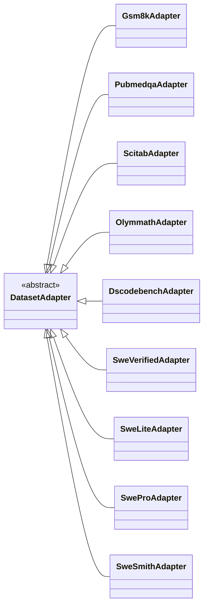
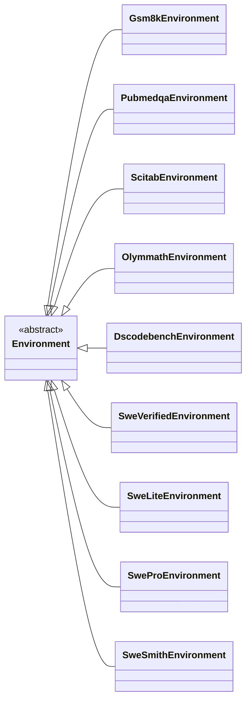
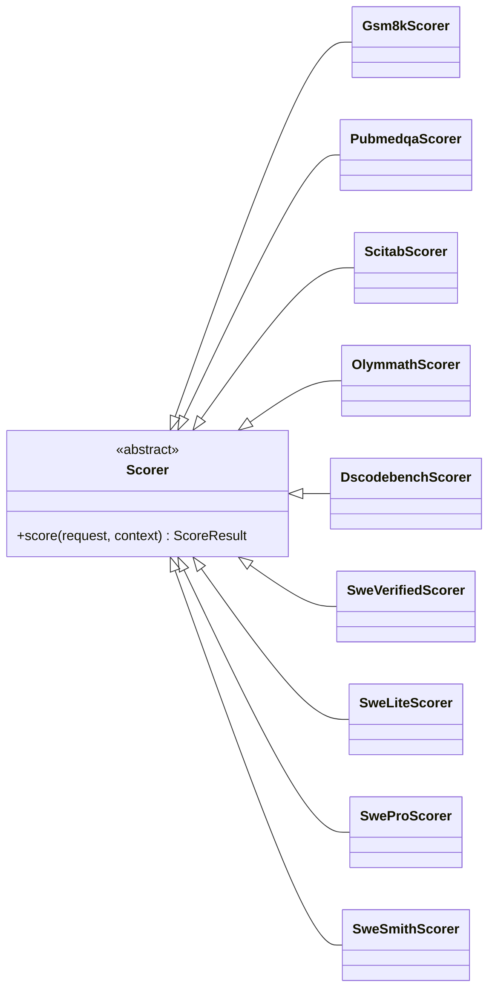
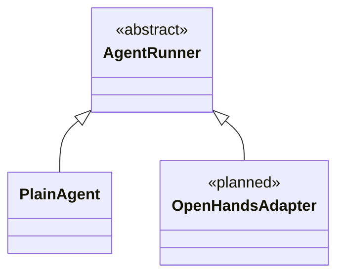

# 数据集统一包模板与代码复用

UEnv 不按问答、代码、SWE 或交互方式给数据集划分系统类型。所有数据集使用同一个包模板和同一条执行链。模板固定提供三个职责入口：Adapter、Environment、Scorer；它们是一个数据集包中的三个类，不是三类数据集。九个本地参考包、发布加载器和生成契约已采用同一目录、类结构和发布字段。生产服务迁移和产品侧脚手架尚未完成。

本文件替代此前以“省略 Python 类”为目标的最小模板。明确约定：**每个数据集必须有自己命名的 Adapter、Environment、Scorer 类，统一继承系统提供的对应基类。**

运行配置不属于数据集包；run.yaml 的统一模板、Bridge/SDK 处理方式和默认值说明见[用户指南第 2 节](user_guide.md#2-填写运行配置)。

## 1. 固定的三个入口

| 数据集 | dataset_adapter.py | environment.py | scorer.py |
|---|---|---|---|
| GSM8K | Gsm8kAdapter | Gsm8kEnvironment | Gsm8kScorer |
| PubMedQA | PubmedqaAdapter | PubmedqaEnvironment | PubmedqaScorer |
| SciTab | ScitabAdapter | ScitabEnvironment | ScitabScorer |
| OlymMATH | OlymmathAdapter | OlymmathEnvironment | OlymmathScorer |
| DSCodeBench | DscodebenchAdapter | DscodebenchEnvironment | DscodebenchScorer |
| SWE Verified | SweVerifiedAdapter | SweVerifiedEnvironment | SweVerifiedScorer |
| SWE Lite | SweLiteAdapter | SweLiteEnvironment | SweLiteScorer |
| SWE Pro | SweProAdapter | SweProEnvironment | SweProScorer |
| SWE Smith | SweSmithAdapter | SweSmithEnvironment | SweSmithScorer |

类名采用项目统一的 PascalCase，不另外混用全大写缩写。每个类必须在其数据集模块中实际声明；manifest 指向该声明。`from shared import ScorerClass as Gsm8kScorer` 只是别名，不满足专属类要求。已有数据集增加样本、划分或配置变体时继续使用原有类，不为每条样本生成类。

## 2. 继承与复用方式

三个入口类分别直接继承 DatasetAdapter、Environment、Scorer，实现 normalize、reset、score。所有数据集 Scorer 不增加中间评分基类，也不继承其他数据集的 Scorer；公共逻辑通过函数或组合组件复用。

专属类必须实现对应的抽象入口，不能只有 pass；方法体可以直接调用公共函数，不要求复制相同算法。参数和方法的复用不得改变业务评分规则。多个数据集共享代码不意味着共用有状态对象；每个执行 attempt 使用独立环境/会话状态。

## 3. 固定目录与可选文件

```text
my_dataset/
  dataset.yaml          # 用户唯一编辑的本地发布声明
  pyproject.toml        # 本地构建输入
  src/my_dataset/
    __init__.py         # 以下源码构建进版本化 Python wheel
    models.py           # 按需：本数据集新增的业务字段模型；复用 SDK 类型时省略
    dataset_adapter.py          # 必需：MyDatasetAdapter
    environment.py      # 必需：MyDatasetEnvironment
    scorer.py           # 必需：MyDatasetScorer
    tools.py            # 可选：数据集特有操作
```

这个基础模板不要求 `tests/`、`test_contract.py` 或 `cases.jsonl`。本地代码测试按需添加，见第 3.4 节；完整数据集与 ground truth 的发布方式见第 3.3 节。

dataset.yaml 是用户唯一编辑的发布声明。发布工具解析它、构建 wheel，并从 `dataset.yaml.models` 登记的 Python 类型及其嵌套类型自动导出校验 schema；用户不再维护 `schemas/` 目录。工具计算 wheel/schema digest 后组装 PackageManifest 对象，通过 API 发给 Hub。Hub 把该对象作为结构化记录存入数据库，查询时可序列化为 JSON，但不要求生成或保存一个独立的 manifest.json 文件。脚手架默认写入 `internet_access: false`；只有 Environment 确实需要公共互联网时才改为 true，并由发布准入检查。任务怎样创建进程或容器、怎样限制文件和权限，都由平台自动处理，数据集作者无需理解或填写这些设置。用户不重复手写两份等价声明。本次 `reference/generated/packages/*/manifest.json` 只是由 `dataset.yaml` 和 `models.py` 生成的可执行设计夹具，不是产品要求用户维护的文件；`reference/datasets/*` 的作者目录中不保存 manifest。公共基类由系统维护，用户不运行中央 scripts/build_contracts.py 来登记新数据集。

`dataset.yaml` 的目标模板如下。`models` 和 `entrypoints` 引用 Python 类，不重复描述字段；本包新增类型放在 `src/<package>/models.py`，已有 SDK 类型直接引用：

```yaml
id: datasets/my-dataset
version: 1.0.0
entrypoints:
  dataset_adapter: my_dataset.dataset_adapter:MyDatasetAdapter
  environment: my_dataset.environment:MyDatasetEnvironment
  scorer: my_dataset.scorer:MyDatasetScorer
models:
  input: my_dataset.models:MyDatasetInput
  private_data: my_dataset.models:MyDatasetPrivateData  # 没有私有评分材料时省略
internet_access: false
required_capabilities: []
```

模板不再要求填写 `metadata`、`display_name`、`description`、`tags`：当前没有消费这些字段的展示或检索功能，不能仅因为能够保存就保留。也不要求作者填写 `schema_version: vnext.3`；包版本只使用 `version`，系统协议兼容性由平台负责。参考加载器、九份声明和生成的 PackageManifest 均已删除这些字段，并拒绝旧字段重新传入。TaskSpec、RunSpec 和轨迹等内部契约的 schema_version 是系统协议标记，不是作者填写的代码包版本。

模型根类型必须继承 `UEnvModel`；字段可嵌套其他 UEnvModel，或引用 SDK 的 ArtifactRef、ContentPart、EvaluationPlan，不能把这些文件/内容引用类型当成整个任务模型。字段定义只维护一份，dataset.yaml.models 只登记入口；入口代码直接 import 同一个模型。当前参考生成器支持基本标量、Literal、列表、字符串键字典、可空字段与有限嵌套；递归模型和有歧义的多类型联合会在发布时明确拒绝。

`pyproject.toml` 的 project.version 必须与 dataset.yaml.version 相同，加载时检查；前者是 Python 安装元数据，不能形成另一个可独立选择的 UEnv 代码版本。参考 build_manifest 生成 schema 和 manifest 夹具，artifacts/provided_tools 当前为空；真实 wheel/运行文件上传、函数工具发布及 Hub 入库仍待产品发布工具实现，不能把夹具当成已上传包。

### 3.1 发布字段逐项用途

下表展开模板中的子字段。“读取”包括发布、准备和执行阶段；列出目标消费者不代表生产链路已经实现。

| 字段（类型） | 谁填写 | 谁读取 | 读后产生什么具体作用 |
|---|---|---|---|
| `id`（string） | 包作者确定稳定标识 | 发布工具、Hub 组件查询、Server 计划解析器 | 与 version 一起定位所选代码包；参考生成器还用它组成包 schema 地址 |
| `version`（string） | 包作者发布新代码时更新 | 发布工具、组件查询和计划解析器 | 选择确定版本的代码与字段定义；避免升级评分代码后旧运行改用新规则 |
| `entrypoints.dataset_adapter`（string） | 作者或脚手架填写本包类入口 | 数据准备阶段的包加载器 | 导入对应 Adapter，调用 normalize 将原始样本转换成规范输入 |
| `entrypoints.environment`（string） | 作者或脚手架填写本包类入口 | Worker 的 EnvironmentHost 加载器 | 创建对应 Environment，调用 reset 及按需实现的 step/finalize |
| `entrypoints.scorer`（string） | 作者或脚手架填写本包类入口 | Worker 的 ScorerHost 加载器 | 创建对应 Scorer，对单条 episode 的 Outcome 评分 |
| `models.input`（string） | 作者填写 Python 模型入口 | 发布工具、准备入口及 SDK 模型绑定 | 从类型生成并绑定 schema；校验公开任务输入、恢复组件接收的模型对象 |
| `models.private_data`（可选 string） | 需要私有评分材料时由作者填写 | 发布工具、准备入口及 ScorerHost 的 SDK 模型绑定 | 校验并恢复评分材料的类型，交给 Scorer；没有这类材料时省略 |
| `models.environment_config`、`models.scorer_config`（各为可选 string） | 对应组件有额外参数时由作者填写 Python 模型入口 | 发布工具生成 config_schemas，提交端校验，组件构造函数读取 config.data | 定义该角色唯一配置的字段；省略时严格使用 EmptyConfig，只允许 {} |
| `models.action`、`models.observation`、`models.state`（各为可选 string） | 环境存在相应业务数据时由作者填写 Python 模型入口 | 发布工具和 SchemaRegistry；Environment.step、Observation.data、Outcome.state 的 SDK 转换 | 生成并登记交互模型；名称只索引类型，不新增执行分支或另一套值 |
| `internet_access`（boolean） | 脚手架默认 false；环境确需联网时作者改为 true | Server 计划解析器、Worker/Backend | 核验联网需求与后端兼容性并应用本次会话的网络限制；真实后端实施仍待验收 |
| `required_capabilities`（string 数组） | 作者填写环境确实需要的已登记功能；无需求时为 [] | 计划解析器和 Worker 调度器 | 排除不支持所需功能的组件或 Worker；不是标签，不能填写无人检查的任意字符串 |

Python 库依赖只在 `pyproject.toml` 声明，由 Python 包管理器安装；数据集声明、PackageManifest 和 ExecutionPlan 不再维护额外的 UEnv 组件依赖列表。运行组件通过既有角色字段、工具适配器字段和 harness 字段明确指定，并在这些位置锁定版本。

空数组表示没有对应需求，不触发额外操作。镜像 `runtime.image` 等按需字段不塞入基础示例；添加时必须从公共契约引用完整类型，并按同样四列展开子字段。镜像选择和消费规则见主方案第 7 章。

本地参考已实现类导入、模型/schema 绑定和 Rust 组件版本核验；完整 Hub 发布、Worker 动态 host 加载、调度及真实网络控制仍属待实现或待集成范围。验收必须检查实际消费路径，不能只检查字段通过 schema 校验。

### 3.2 发布后保存的内容

之所以仍需要 PackageManifest 对象，是因为 Hub 和 Server 必须在下载、安装或执行用户代码之前，就能读取入口、schema、运行要求和 wheel digest 并完成兼容性检查。这些内容不能藏在尚未验证的 wheel 内。发布前只有 dataset.yaml 是声明真值；发布成功后，该固定版本只以 Hub 中不可变的 PackageManifest 为运行时真值，二者不会同时覆盖配置。

这个目录是本地开发工程，不会原样复制到 Hub。`uenv package publish` 将它转换成三个部分：版本化 Python wheel、PackageManifest、schema/资源文件。三部分分别保存，不再笼统称为一个“代码产物”。

| 本地内容 | 是否进入 wheel | Hub 中保存什么 |
|---|---|---|
| `dataset.yaml` | 否 | 发布工具解析为 PackageManifest API 对象；Hub 数据库保存结构化记录，查询时返回 JSON |
| `pyproject.toml` | 否 | 用来构建 wheel；Python 包名、版本和安装依赖进入 wheel 元数据；manifest 记录 UEnv 包身份及 wheel 引用，不作为第二份运行配置 |
| `src/my_dataset/__init__.py` | 是 | 位于版本化 wheel 中 |
| `src/my_dataset/models.py` | 文件存在时是 | 业务字段的唯一源码；位于 wheel 中，发布工具另外生成只读校验 schema |
| `src/my_dataset/dataset_adapter.py` | 是 | 位于版本化 wheel 中 |
| `src/my_dataset/environment.py` | 是 | 位于版本化 wheel 中 |
| `src/my_dataset/scorer.py` | 是 | 位于版本化 wheel 中 |
| `src/my_dataset/tools.py` | 文件存在时是 | 位于同一个 wheel 中，不单独发布另一个数据集包 |
| 发布工具生成的 schema | 不适用 | 不是用户工程文件；按 digest 存入文件存储并由 manifest 索引，禁止手工修改 |
| Python 实现所需的小型公开资源 | 在 pyproject 中声明为 package data 时是 | 随 wheel 保存 |
| 大文件、共享文件或受限文件 | 否 | 包级运行资源由 manifest 引用；样本文件与隐藏测试由 task.input/private_data 中的 ArtifactRef 引用并随数据 revision 发布；Worker 只获取本次获准引用 |
| 可选的 `tests/` 及本地测试样本 | 否 | 验证包代码的开发资料，默认不上传；不是完整数据集或正式评分测试的存放规范 |

因此，一个数据集代码版本在 Hub 中至少对应：一条 PackageManifest 记录、一个 wheel 文件及其 digest，以及该版本实际使用的类型引用。包新增业务类型时，Hub 还保存由发布工具生成的 schema；全部复用公共类型时只记录公共类型引用。只有包确实需要额外运行文件时，才增加 ArtifactRef。

`run.yaml` 不属于数据集包。它是训练、评测或实验项目的一次运行配置，用来选择 Environment、Scorer、Agent、Backend、Model、Tools 和预算；提交时转换为 RunSpec。用户可以为同一个数据集维护多份不同的 run.yaml，也可以由训练框架直接构造 RunSpec。发布或使用数据集包都不要求存在这个文件。

Hub 逻辑上包括元数据数据库和文件存储；wheel、schema 和大文件字节都不放进数据库。标准化样本、隐藏测试和其他数据内容也不混进 wheel，它们按独立 data revision 发布并使用各自的读取权限。

除这个数据集代码版本之外，Hub 还管理：其他数据集/Agent/工具的版本化包；数据 revision、样本分片和样本索引；隐藏测试、图片、代码快照等受控文件；容器镜像的不可变引用和 digest；包与数据的读取权限。RunSpec、episode 状态、评分结果和 lease 由 Server 管理，不属于 Hub 包仓库。

tools.py 仅在需要新操作时添加；可以编写带参数/返回类型和说明的 Python 函数，复杂工具实现现有 ToolExecutor。发布工具生成或校验 ToolSpec 的入口、配置 schema、输入/输出 schema 与 interfaces。AgentManifest 只声明支持的接口，不逐个登记工具；因此复用已有 MCP/原生接口时，同一个工具不用分别写各 Agent 的适配。跨数据集复用的工具放入独立包。新增数据集与自定义 Agent 都不意味着必须新增工具。目标调用方式及迁移说明入口见 [用户手册第 7 节](user_guide.md#6-自定义工具)。

### 3.3 完整数据集和 ground truth 如何存入 Hub

**代码包和样本数据分别发布。** `models.py` 定义题目与评分材料的字段类型；实际题目、标准答案和隐藏测试保存在数据文件中。ground truth 属于 `private_data`，但 private_data 还可以包含测试文件引用等评分所需材料。无需标准答案的任务可以省略它。

用户原始数据可以是 JSON、JSONL、Parquet 等格式，放在任意明确传入的数据路径；也可以放在本地 `my_dataset/data/`，但这不是必需目录，也不自动进入 wheel。发布到 Hub 的标准化样本统一采用 **UTF-8 JSONL，每行一条样本，允许分成多个文件**。原始数据由 Adapter.normalize 转换；已经标准化的输入直接按同一契约校验，不再次猜测或映射业务字段。

每行的逻辑结构如下；这里使用类型名称说明结构，不是可直接提交的 JSON：

```text
{
  "task": TaskSpec,
  "private_data": TypedConfig  // 可选
}
```

外层复用公共契约，不新增另一个样本类。样本身份只使用 `task.dataset` 的 id/revision/split/subset 和 `task.sample_id`，不在行顶层再复制一份。`task.input` 和 `private_data` 的内部业务字段由本包 `models.py` 定义。发布/准备工具根据模型自动生成 schema_ref/data 信封，用户无需逐行填写这些内部字段。

| 内容 | 谁填写 | 谁读取 | 读后产生什么具体作用 |
|---|---|---|---|
| `task` 的公开输入 | Adapter 从源样本转换，准备工具组装 TaskSpec | Environment、Agent | 呈现题目、公开上下文及执行任务所需信息 |
| `task.dataset` 与 `task.sample_id` | 作者选择数据身份，Adapter 提取样本编号，发布工具写入固定 revision | Hub 索引查询和准备工具 | 在确定的数据版本中定位样本；组装请求时保留身份以便追溯 |
| `private_data` | Adapter 从源记录提取答案或隐藏评分材料 | 受控评分阶段的 Scorer | 将回答、代码或最终状态与评分依据比较；不提供给 Agent、Environment 或普通工具 |
| 样本中的 `ArtifactRef` | 发布工具根据上传的图片、测试等文件生成 | 被授权的资源读取器 | 定位文件、校验 digest，再向对应环境或评分器提供实际内容 |

例如数学样本的 `task.input` 包含题目，`private_data` 包含答案；编程样本的 `task.input` 包含编程要求和公开样例，`private_data` 包含隐藏测试及预期结果，或指向这些文件的 ArtifactRef。统一的是外层结构和引用方式，不要求所有数据集的 ground truth 都是字符串。业务子字段仍按第 4.1 节逐项说明消费者和作用。

**Hub 中的存放方式：**

| 保存位置 | 保存内容 | 实际用途 |
|---|---|---|
| Hub 数据库 | 数据 id/revision、划分、schema 引用、样本与分片索引、文件引用及权限 | 定位固定版本的样本，检查格式和读取权限 |
| Hub 文件存储 | 标准化 JSONL 分片；图片、隐藏测试、代码快照等原文件或归档 | 提供实际题目、ground truth 和附件字节；大文件不嵌入 JSONL |

题目与评分材料放在同一条记录中，避免两份文件按行号配对造成错位。包含 private_data 的整份 JSONL 必须受限访问；可信准备流程读取后，只将公开 TaskSpec 交给 Agent/Environment，私有材料交给评分阶段。原始数据文件和隐藏测试不能挂载到智能体工作目录。Worker 接收统一请求，不按数据集自行去 Hub 查题。

增加题目或修正 ground truth 时发布新的数据 `revision`，不改写已经发布的版本，也不要求升级没有变化的代码包 `version`。数据行不保存本次运行的 Agent、Backend、模型、run_id 或 episode_id；这些在提交任务时才与 RunSpec 组合。完整 Hub 数据发布、分片索引与权限链路仍为目标设计，不能用本地合成样例的验证结果代替验收。

### 3.4 tests 目录是否必须

**不必须，可以从用户的基础模板删除。** 系统不能把名为 `tests/test_contract.py` 或 `tests/cases.jsonl` 的文件存在作为包可发布、可运行的条件。

- `test_contract.py` 是开发者验证 Adapter 等代码的测试脚本；需要自定义回归测试时才添加，文件名不属于发布协议。
- `cases.jsonl` 是这类本地测试使用的少量输入样本；也可以采用其他文件名或测试内构造数据，不是完整数据集的必需副本。
- 编程任务的隐藏评分测试属于正式 private_data 或其 ArtifactRef，必须随数据版本提供；不能因为省略开发用 tests 目录而省略这些评分材料。

省略目录不等于省略验证。发布工具应执行通用结构、模型、入口和 Python 安装依赖检查；作者按需要补充针对业务正确性的测试。依赖样本的行为检查从明确提供的样本输入读取，不强制扫描 tests/cases.jsonl。

当前九个参考包的 `tests/cases.jsonl` 确实由 `scripts/build_examples.py` 读取，`scripts/validate_design.py` 也检查这些参考测试文件。这是设计维护用样例的真实依赖，因此本次只从用户基础模板移除必需项，保留已有参考测试。它们不能被解释为未来产品对所有数据集作者的强制文件要求。

## 4. schema 与 proto 的唯一来源

UEnv 核心协议只在 `contracts/proto/uenv/v1/` 定义。TaskSpec、RunSpec、EpisodeRequest、ExecutionPlan、Observation、Outcome、ScoreInput、ScoreResult、轨迹事件、Hub/Server/Worker RPC 等系统对象都必须是这里的 protobuf message 或 service。Rust 类型、Python SDK 类型、JSON 校验 schema 和字段文档都从 proto 生成，生成文件不可手改。目录可以按 task、run、execution、trajectory、hub 等领域拆成多个 proto 文件，但同一个 message 只能定义一次。

数据集新增的题目、私有评分材料、配置或动作字段不进入核心 proto。否则每新增一个数据集都要修改并发布 UEnv 核心协议。作者只在本包 `models.py` 定义 Python 类型，例如 `MyDatasetInput` 和 `MyDatasetPrivateData`；Adapter、Environment、Scorer 的类型声明直接引用它们。发布工具自动导出 schema，PackageManifest 记录类型 URI 与生成文件 digest，Worker 的 SchemaRegistry 据此校验 `TypedConfig.data`。生成的 schema 是运行时校验文件，不是第二份字段定义。

因此只有两个互不重叠的定义边界：

| 内容 | 唯一可编辑来源 | 生成或使用结果 |
|---|---|---|
| UEnv 系统结构和 RPC | `contracts/proto/uenv/v1/*.proto` | Rust/Python 类型、RPC stub、核心 JSON schema、字段文档 |
| 某个包新增的业务字段 | 该包 `models.py` | 包 schema；由发布工具生成并存入 Hub |

`dataset.yaml` 只声明包、入口、版本和运行要求，不再重复逐字段 schema。一个已有 SDK 类型直接 import 使用，不在 `models.py` 重新声明同名字段。schema URI 只是对上述定义的版本化引用，不是另一处定义。

### 4.1 字段发现与扩展判定

数据集字段采用 HUD 的 Python 类型定义方式。作者只在 `models.py` 中编写模型和类型标注，发布工具从中生成 schema；作者不查看系统完整字段表。数据集脚手架和默认字段查询只展示 `PreparedSample`、本包模型及 Adapter、Environment、Scorer 的方法参数：

```text
uenv describe PreparedSample                 # 数据集作者可以填写的准备结果
uenv describe my-org/my-dataset@1.0.0         # 本包入口和业务类型
uenv describe my-org/my-dataset@1.0.0:MyInput # 展开包业务字段
```

每个字段显示完整路径、类型、必填性、默认值、说明和来源。包类型标出 `models.py` 中的类和已发布版本。命令读取 SDK/Hub 已登记的同一契约，不另建手写目录；Python IDE 通过 `UEnvModel` 类型标注提供相同补全。EpisodeRequest、ExecutionPlan、episode_id、attempt_id、lease、input_digest、plan_digest 和 `TypedConfig.schema_ref` 不进入普通数据集作者视图，由系统自动生成并仅在核心维护文档中说明。

新增业务字段前，作者必须说明**谁填写、谁读取、读后产生什么具体作用**。例如 Adapter 填入 `input.instruction`，Environment.reset 读取它并生成 Agent 的初始观测；不能只写“存入 input”。嵌套对象也要说明每个子字段。说明跟随 `models.py` 的字段定义维护，完整格式见 [字段规范第 0.1 节](../development/field_conventions.md#01-字段必须有明确用途)。没有消费方法或对应用户功能的字段不加入模板；程序只能辅助检查，实际用途仍需审查组件代码。

作者的判断规则只有三类：

| 想表达的内容 | 做法 | 示例 |
|---|---|---|
| 数据集准备阶段允许填写的身份和内容 | 使用 PreparedSample 的字段 | `sample_id`、`input`、`private_data`、可选 `runtime` |
| SDK 已有的公共值结构 | import 后组合到业务模型 | `ArtifactRef`、`ContentPart`、`EvaluationPlan` |
| 只有本数据集组件理解的任务内容或私有评分内容 | 在本包 `models.py` 定义一次 | `instruction`、`contexts`、`repo`、`base_commit`、`answer` |

运行配置采用 Harbor 的严格分组方式，只在 RunSpec 中选择 Environment、Agent、Backend、Model、Tools、Scorer 和 Limits。如果新字段需要改变平台对所有数据集的调度、权限、模型、预算、评分生命周期或结果处理，它不是数据集扩展，必须作为核心协议变更评审。业务字段不能覆盖这些系统行为，也不能新增 metadata 或自由字典来绕过字段用途审查。

作者正常编写和调用 Python 模型，不手写 `TypedConfig` 或 `schema_ref`。SDK 只在 RPC/存储边界根据实际模型和已发布包版本生成传输信封。`uenv package validate` 对确定的系统字段遮蔽和已登记常见别名报错，对疑似同义字段给出警告并要求作者判断。程序可以提示 `timeout` 使用 `RunSpec.limits.total_timeout_ms`，但不能确定 `allowed_time` 是否具有相同语义，也不能自动改名。源数据的 `question`、`problem_statement` 在语义确为任务指令时仍由 Adapter 显式映射为 `instruction`。

## 5. 以实际 GSM8K 参考包为例

### 5.1 评分器入口

dataset_adapter.py 声明 Gsm8kAdapter，完成题目转换和参考答案提取；environment.py 声明 Gsm8kEnvironment，直接继承 Environment，在 reset 中构造题目观测。scorer.py 直接继承 Scorer，实现统一接口并调用公共规则函数：

```python
from uenv.sdk import Scorer, ScoreInput, ScoringContext, ScoreResult, read_reference_text
from uenv_reference_rules import score_gsm8k


class Gsm8kScorer(Scorer):
    """Dataset-specific scoring; reuse rule functions without intermediate bases."""

    def score(self, request: ScoreInput, context: ScoringContext) -> ScoreResult:
        answer, private_data = read_reference_text(request)
        return score_gsm8k(answer, private_data)
```

发布入口指向 `gsm8k.scorer:Gsm8kScorer`。`uenv_reference_rules` 只提供规则函数；评分算法没有复制，也不增加中间父类。

```yaml
# dataset.yaml 中的作者入口；发布后原样进入生成的 manifest
entrypoints:
  dataset_adapter: gsm8k.dataset_adapter:Gsm8kAdapter
  environment: gsm8k.environment:Gsm8kEnvironment
  scorer: gsm8k.scorer:Gsm8kScorer
```

一个 run 只选择一个专属 Scorer。每个得到最终 Outcome 的 attempt 至多产生一个 ScoreResult；Server 只接纳一个 attempt 的结果作为 episode 的权威 ScoreResult。评测与后训练复用其中的 reward；升级规则时发布新的 Scorer 组件版本并创建新 run，不在同一 run 中配置两套评分器。

Scorer 只处理一条 episode，不接收整批结果。平均 reward、成功率、完成数和错误数由系统根据已保存的 ScoreResult 统一计算，属于查询和报表，不回写单条 reward。macro-F1、pass@k 等需要联合多条结果计算的特殊报表，由评测框架或分析程序读取导出的结果后计算；首版数据集包不提供另一种聚合扩展入口。

### 5.2 源数据转换与稳定身份

DatasetAdapter 只把源字段放到标准位置，并将答案/测试放入可选 private_data，和公开输入一同返回。业务字段先在 `models.py` 定义一次：

```python
from uenv.sdk import UEnvModel

class MyInput(UEnvModel):
    instruction: str

class MyPrivateData(UEnvModel):
    answer: str
```

Adapter 直接返回这些模型；发布工具和 SDK 负责生成、引用并校验 schema，用户不再手写 `typed("MyInput", {...})` 信封：

```python
from uenv.sdk import DatasetAdapter, PreparedSample

class MyAdapter(DatasetAdapter):
    def normalize(self, row):
        return PreparedSample(
            sample_id=str(row["id"]),
            input=MyInput(instruction=row["question"]),
            private_data=MyPrivateData(answer=row["answer"]),
        )
```

prepare 工具负责数据集 revision、task_id 和 input_digest。SDK 在进程边界自动把 Python 模型封装为 TypedConfig 并填入已发布的 schema_ref；这个信封是内部传输格式，不是用户编程接口。prepare 用它生成公开 task.json；task 与 private_data 配对进入受控 episode_request.json。系统不再为评分依据生成额外包装文件。无参考依据时省略 private_data；大型测试内容通过其内部的 ArtifactRef 传递。

源数据无 ID 时，Adapter 应从规范化后的公开输入计算稳定内容摘要作为 sample_id；完全相同但必须区分的重复行，数据作者需要在源数据中补稳定 ID，prepare 会拒绝重复 sample_id。不能依赖临时行号、文件绝对路径或随机值。PubMedQA 的外层 JSON key 在导入时作为 id，OlymMATH 的语言/难度从原记录或明确的数据发布配置写入，不能由 Worker 猜测。配对正确性由受信 Adapter/prepare 负责；同类型材料并不意味着适用于同一道题。

Worker 在执行开始前校验 private_data 的已注册 schema，并在交互阶段保持隔离；得到最终 Outcome 后才将它放入 ScoreInput。Environment 和 Agent 只接收公开 TaskSpec；隐藏测试的读取能力只提供给评分器。整个 episode_request.json 含有私有数据，不能作为公共任务文件给 Agent 或写入公开日志。本地验证的是接口与数据副本边界，生产进程和存储隔离仍需实现。

### 5.3 内置数据集的原始字段映射

已有原始脚本到新字段的映射（“私有字段”指 episode_request.json 中 private_data.data 的字段）：

| 数据集 | 原始身份 | 模型可见 input.data | 私有字段 |
|---|---|---|---|
| GSM8K | 稳定行 ID | question -> instruction | answer（从参考解的 #### 后提取最终答案） |
| PubMedQA | JSON 外层 key | QUESTION -> instruction；CONTEXTS -> contexts[] | final_decision -> answer |
| SciTab | id | claim/paper/paper_id/table_id；table_caption -> caption；table_column_names -> columns[]；table_content_values -> rows[][] | label -> answer |
| OlymMATH | unique_id | problem -> instruction、language、difficulty、subject | answer |
| DSCodeBench | problem_id | code_problem -> instruction、library、entry_point | tests artifact、reference_solution（按需）、num_tests、test_seed、evaluation_plan |
| SWE Verified/Lite/Pro/Smith | instance_id | problem_statement -> instruction、repo、base_commit、workspace_path、runtime_assets[] | test_patch、reference_patch（按需）、FAIL_TO_PASS/PASS_TO_PASS、evaluation_plan（其中选择 harness） |

Code/SWE 原始数据中的测试路径、镜像标签、测试命令先由包的 prepare/build 逻辑转换为有 digest 的产物和类型化 EvaluationPlan。不能把本机绝对路径当成跨机器稳定输入。SWE 变体身份只来自所选数据集包；原始记录中的 `benchmark_variant` 只用于 Adapter 校验数据是否进了正确的包，不再复制为公开输入中的第二个 `variant` 字段。SWE 的具体初始化与官方测试准备仍属于各包 Environment/Scorer，本次参考样例没有实现这些完整操作。

OlymMATH easy/hard 和 en/zh 用字段组合表示；它们共享同一个 adapter/environment/scorer。字段字典把每一层数组和对象都展开，不以“JSON，任意内容”代替定义。

评分规则可复用 `reference/shared/src/uenv_reference_rules` 中的函数，数据集 Scorer 仍直接继承系统 Scorer。文本规则显式读取参考文本；代码规则通过 ScoringContext 请求 harness。OlymMATH 的 reference-corrected-v1 包含未知 LaTeX 命令归一化修正，仍需官方语料对照；规则迁移与版本要求见[重构计划第 3.5 节](../development/source_refactoring_plan.md#35-数据集评分和-openhands)。

## 6. 三个类的职责与运行阶段

| 类 | 负责 | 运行阶段 |
|---|---|---|
| DatasetNameAdapter | 原记录转换为规范公开输入与私有材料；包括源样本镜像字段的目标映射 | 数据准备或 Bridge 提交前 |
| DatasetNameEnvironment | reset/step、初始观测、任务状态与结果收集；按需覆盖 finalize/close | Worker 管理的任务执行资源中 |
| DatasetNameScorer | 根据冻结产物、状态、轨迹和可选参考材料评价任务 | Worker 组织的评分阶段 |

Adapter 返回 PreparedSample(sample_id, input, private_data, runtime)，作者侧的 input 与 private_data 是 `UEnvModel` 实例。prepare 根据 dataset.yaml.models 声明和已发布包版本把它们自动封装为内部 TypedConfig，用 input 构建公开 TaskSpec，再与可选 private_data 配对写入 EpisodeRequest；不新增评分材料文件。大型测试通过已有 ArtifactRef 引用。

Environment.reset 与 AgentContext.task 接收公开 TaskSpec；Scorer 从 ScoreInput.private_data 取得评分依据。private_data 不进入公开任务或轨迹，无参考依据时省略。大型私有测试文件通过受控 reader 读取；真实存储权限与进程隔离仍需平台实现。

三个类属于同一数据集包，不意味着同一进程。Agent 决策、模型加载、调度、后端实现、轨迹序列化不放进这三个类。模型服务端点从 Bridge 传入，Agent 不加载模型权重。后续不引入 Agent 池。

Environment.step 是否需要覆盖取决于交互规则；公共接口的存在不要求问答任务伪造多轮操作。代码/SWE 参考环境直接继承通用 Environment，避免自动继承问答提交动作，但目前只提供初始观测示例，真实仓库准备、冻结补丁与隔离仍需实现。

## 7. 简洁与通用如何同时实现

- 脚手架生成三个文件、类名和 manifest 入口，减少机械填写；不省略专属类。
- 基类提供真实可复用的默认行为，公共模块提供转换、渲染和评分辅助；用户只覆盖差异。
- 类型只定义一次：核心系统类型来自 proto；数据集新增字段来自本包 models.py；发布生成物不手改。
- 通用性由 Observation、Transition、Outcome、ScoreInput 等完整协议保证，不把所有输入都压成字符串。
- 个别数据集的初始化、测试准备、评分差异仍在其专属类实现，不为了少代码而隐藏在 Worker 分支。
- Agent、backend、model 和工具选择保持在运行配置；镜像默认/样本专用/用户覆盖规则见主方案第 7 章，runtime 字段已进入参考 schema 和示例。
- internet_access 属于 Environment 运行要求，脚手架默认 false；它不进入 TaskSpec 或 RunSpec，Backend 只执行 Server 已锁定的 ExecutionPlan 值。

QA 的 Environment 直接实现 reset 来呈现题目，不增加问答中间基类；单轮 Agent 返回最终回答，无需通过环境 step 提交答案。重复逻辑按需提取为公共函数或通过组合调用。DSCodeBench、SWE 的仓库和测试流程不能仅因接口相同就复用问答行为；实际共享部分应提取为代码/仓库公共模块，再由专属 Environment 调用。为兼容新任务增加通用平台能力可以评审，但不应新增数据集名字分支。

## 8. 验收标准与当前实现边界

1. 九个数据集各自的三个类在本模块中实际声明，共 27 个不同类对象。
2. 每个类的直接父类必须是对应系统基类，并且不是未实现抽象方法的类。
3. manifest 指向本包对应类；导入别名或共享类直连不能替代该入口。
4. 使用公共函数复用后仍通过原有数据转换与评分用例，并由统一 Rust EpisodeSupervisor 契约测试检查，不因新包装改变评分事实。
5. 包内其他文件可以按需增减；三个专属类和文件作为稳定入口保留。
6. 每个发布字段和业务子字段都有填写方、实际读取方及可观察的作用；仅保存、转发或校验不算完成。无用途字段与对应示例删除，计划内功能须验证消费路径后验收。
7. 精简后的 dataset.yaml 经过同一个加载器、发布转换和契约校验；参考加载器、九个示例包和生成 manifest 必须同步。

本次本地验证检查上述类声明、模块归属、继承、具体可实例化状态和入口一致性。现有合成样例与测试替身不构成官方 benchmark、真实 Docker/Process 或 OpenHands 集成验收；没有修改远端生产代码。

## 9. 内置数据集的继承关系

每个数据集都有自己的 Adapter、Environment、Scorer。下面按职责分别画出九个数据集的全部入口，不能把某一张图中的一个数据集类理解为其他数据集共用的入口。空心三角箭头 `<|--` 指向父类。

**Adapter：九个数据集分别继承 DatasetAdapter。**



**Environment：九个数据集直接继承 Environment。**



不再增加问答专用的中间 Environment 基类。各数据集在 reset 中构造自己的初始 Observation；普通问答由 AgentRunner 返回最终回答，无需实现 step。有状态任务按需实现 step、state_snapshot、finalize、close。每个 Environment 都得到所选 Backend 已创建的必填 session；问答 Environment 可以不使用它，但系统不以 `session=None` 暗中形成“无后端”旁路。重复的格式化、文件操作等可以复用公共函数或通过组合调用组件，不能把问答行为移入 Environment 基类成为所有任务的默认行为。

**Scorer：九个数据集直接继承 Scorer。**



所有数据集 Scorer 均直接继承 Scorer，统一实现 score(request, context) -> ScoreResult；不设文本或测试执行中间评分基类，也不继承其他数据集的 Scorer。文本提取、答案比较、测试执行和报告转换通过公共函数或组合组件复用，一个评分器可以组合多种评分方式。

当前参考代码中，文本评分器调用 `read_reference_text` 与 `uenv_reference_rules` 包中的规则函数；代码/SWE 评分器调用 `evaluate_harness`，由 ScoringContext 提供受控测试执行能力。每个进入评分的 attempt 由 Rust `run_score` 至多调用一次 `Scorer.score`，不按数据集、评测或训练分支。一个 RunSpec 只选择一个 Scorer；升级规则时发布新的组件版本并创建新的 run，不能让评测端和训练端各选一套评分配置。

**Agent 独立于数据集，按运行参数选择。**



OpenHandsAdapter 是待接入统一接口的 Agent 包装类，不是 DatasetAdapter，也不表示现有 SDK 已经继承 UEnv AgentRunner。CounterEnvironment 和 ProgressScorer 是额外的本地有状态测试示例，分别直接继承 Environment 和 Scorer，不属于上述九个数据集入口。

manifest 必须指向本包实际声明的三个类。仅导入公共类并改名不算专属类；Adapter、Environment、Scorer 分别实现 normalize、reset、score，方法体可以调用共享函数。
