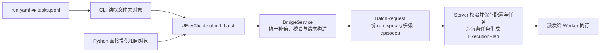

# UEnv 用户指南

本指南按运行任务、自定义 Agent 和工具组织。产品 CLI/客户端仍是目标接口；仓库中的 reference 是可执行的本地参考，不是已部署服务。示例模型地址、镜像和任务资源需要替换为真实配置。

新增数据集的文件结构、组件入口类、数据格式和原始字段映射统一见[数据集包模板](dataset_package_template.md)，不在本指南另维护一份。

## 1. 准备任务数据

使用已有数据集时，提供原始数据，或选择 Hub 中固定 revision 的数据及样本范围。原始数据经该包 DatasetAdapter 转换；已经标准化的 Hub 样本直接校验读取。两者都进入相同准备入口，用户不直接与 Worker 交换数据。

数据符合已有数据集包支持的原始格式时，普通用户不需要再写 normalize；系统调用该包已有的实现。新增数据集包的作者在 src/<package>/dataset_adapter.py 中实现它。已标准化的样本直接校验，无须再次调用 normalize。

本地原始数据的目标命令示例：

```text
uenv dataset prepare --package datasets/gsm8k@1.0.0 --input raw.jsonl --output tasks.jsonl
```

输出的 tasks.jsonl 是 UTF-8 JSONL，每行包含 task 和可选 private_data。含答案或隐藏测试的文件按评分材料管理，不能直接作为 Agent 输入。格式与 Hub 保存内容见[数据集模板第 3.3 节](dataset_package_template.md#33-完整数据集和-ground-truth-如何存入-hub)。Hub 数据选择 API 的完整请求结构尚待确定，当前不提供未经定义的 CLI 参数示例。

## 2. 填写运行配置

本节是 run.yaml 的统一使用说明。所有数据集使用同一个模板；不维护 GSM8K 专用、SWE 专用等不同配置协议。可从[精简 GSM8K 示例](../../reference/runs/gsm8k.yaml)或[九份运行示例](../../reference/runs)开始。示例的组件选择和预算值不同，字段的含义不随数据集改变。

### 2.1 CLI 和 Python 如何使用同一个客户端

run.yaml 保存在调用方的训练、评测或实验项目中，不属于数据集包，也不发布到 Hub。它是可选的文件输入方式；Python 调用方可以直接提供等价配置，由 SDK 构造 RunSpec。SDK 是 Bridge 的编程入口，不绕过 Bridge 另走执行链。



CLI 不自行实现默认值、样本转换、请求构造或 Server RPC。Python 的 submit_batch(tasks, run_spec, dry_run=True) 与 CLI --dry-run 调用相同准备过程，只返回待提交 BatchRequest；它不启动 Worker，也不保证远端当前可用。YAML 重复键（包括嵌套配置）直接报错，禁止后值静默覆盖前值。

Bridge 只调用一次提交接口：BatchRequest.run_spec 保存这一批共用的完整 RunSpec，episodes 保存一条或多条 EpisodeRequest。单条任务也使用同一接口，只含一个成员；没有前置的配置注册请求。

同一批次只允许一套运行配置。EpisodeRequest 不携带 RunSpec、run_id 或 Agent/模型/预算覆盖；它的运行身份来自 BatchRequest.run_spec.run_id。需要不同执行配置时分别提交批次，并使用不同 run_id。任务自己的数据、种子和样本身份仍可不同。

Server 在接收批次时保存配置与任务；后续批次沿用同一 run_id 时，补齐后的完整 RunSpec 必须一致，否则返回 RUN_CONFIG_CONFLICT，不覆盖已保存配置。Server 比较旧配置是为了拒绝冲突，生成计划仍只读取本次 BatchRequest.run_spec。配置变更使用新的 run_id。

Server 不读取 YAML 文件，Worker 接收包含 ExecutionPlan 的派发请求。CLI 和环境变量不能另行覆盖已提交配置。run_id 由调用方或 SDK 在首次提交前确定并复用，无需先请求 Server 创建它；九份设计示例显式给出稳定值，便于对应生成夹具。

可查看[GSM8K 批次请求示例](../../reference/generated/episodes/gsm8k/batch_request.json)，其中 run_spec 和 episodes 就是一次提交的完整内容。以上是统一目标接口；当前本地已有批次 schema、九份批次示例和 Rust 批次校验，真正的 Bridge/RPC、数据库事务与并发幂等仍待接入。

### 2.2 每组字段负责什么

| 字段 | 谁填写 | 谁读取及具体作用 |
|---|---|---|
| run_id | 调用方或 SDK 在首次提交前确定；同一配置跨批次复用 | Server 关联配置与结果，Bridge 按它提交和查询 |
| purpose | 运行用户或训练框架 | evaluation 用于评测、training 用于在线训练接入、trajectory_collection 用于轨迹采集；Bridge 选择消费方式，Server 校验配置组合 |
| dataset_package | 运行用户填写 id/version | Server 锁定一个数据集包；准备工具加载其 Adapter，Worker 加载其 Environment 和按需加载 Scorer |
| environment | 运行用户按需填写参数 | 用包内 environment_config 模型校验，Worker 传给 Environment；不含实现选择 |
| scoring.enabled | 运行用户必填 true/false | 是否评分的唯一来源；true 加载本包 Scorer，false 不创建评分进程；评测和训练必须为 true |
| scoring.config | 开启评分时按需填写 | 用包内 scorer_config 模型校验并传给 Scorer；关闭评分时禁止填写 |
| agent | 运行用户 | Server 校验接口，Worker 启动所选智能体 |
| backend | 运行用户 | Server 校验资源与兼容性；Worker 选择执行后端，按 resources 限制资源 |
| model | 运行用户或训练框架 | Worker 模型入口使用端点、模型及 generation 参数；训练端点可指向 Bridge ModelGateway |
| tools | 运行用户，显式给出完整列表 | Server 解析接口；Worker 只开放列表中的工具；[] 表示无工具 |
| limits | 运行用户 | Server 固定总截止时间，Worker 限制模型调用、工具动作和累计输出 |
| retry | 运行用户，允许省略 | Server 决定基础设施失败是否重试及退避；不用于模型网络请求重试 |
| training | 训练框架或运行用户，仅训练时提供 | Bridge/模型入口约束版本和训练轨迹；评测和轨迹采集时不得填写 |
| runtime.image | 需要覆盖镜像时由运行用户填写 | Server 选择并锁定镜像；Worker 使用最终值；Process 不接受显式镜像覆盖 |
| trajectory_retention_days | 运行用户，允许省略 | 目标 Server 控制轨迹保存期；真实保留期服务仍待实现 |

finalize_reserve_ms 是 limits 中为提交校验、冻结和可选评分预留的时间，包含在 total_timeout_ms 内，不评分也需要收尾时间。

题目、答案、仓库信息和隐藏测试属于任务数据，不写进 run.yaml。Docker 引擎连接地址、宿主路径和隔离规则属于 Worker 部署配置，也不让普通运行用户填写。完整嵌套字段、类型及声明默认值查[生成字段字典](../generated/field_dictionary.md)，不在这里复制第二份字段清单。

运行配置中，与数据集相关的选择只写一次。例如（以下仅展示相关字段）：

```yaml
dataset_package:
  id: datasets/gsm8k
  version: 1.0.0
scoring:
  enabled: true
```

需要调整环境规则时填写 environment 中的业务参数；需要调整评分算法时填写 scoring.config。两者都不能填写 implementation、包名或版本。RunSpec 和 ExecutionPlan 均只保留一份 dataset_package。

### 2.3 哪些参数可以省略

有声明默认值的参数允许省略。当前精简示例省略了默认资源、模型生成参数、重试退避、轨迹保留天数和默认组件参数。dataset_package、Agent、Backend 的实现选择，scoring.enabled、模型端点和身份，以及 limits 中的预算仍须明确给出。Environment 和 Scorer 固定来自数据集包，不接受单独实现选择。

environment 参数省略时按空对象处理；scoring.enabled=true 时 scoring.config 可省略并按空对象处理，false 时禁止填写 config。Agent、Backend 和工具的 config 省略时也按空对象处理，再补相应参数模型声明的默认值。若组件还有无默认值的必填参数，仍然报错。例如 Process 的 config.runtime_profile 必填，Docker/Podman 没有对应参数。

默认值只在统一契约或组件模型中定义一次。Bridge 只补缺失字段；显式填写的 0、false、空列表不会被默认值替换，类型错误和非法 null 直接报错。补齐后形成完整 RunSpec，Server 校验与 Worker 执行不再补值。--dry-run 应显示补齐后的配置，用户可以确认实际提交内容。默认值规则随对应协议或组件版本维护，不从 Worker 本机配置临时取值。

参考中的默认值用于演示，不代表真实部署的资源和采样推荐。model.source=simulated 明确标记模拟模型；接真实模型时需填写真实端点并声明 real，不能把示例当成真实模型评测证据。

### 2.4 组件特有参数和同义字段

只有组件独有且用户需要调整的行为才能放在 config 中，并受所选组件的 schema 校验。当前九个数据集的 environment 和 scoring.config 均无额外参数；新数据集若确有业务参数，在 models.py 中定义并登记相应角色配置。

总超时只用 limits.total_timeout_ms，模型调用上限只用 limits.max_generations，采样温度只用 model.generation.temperature。组件 config 不能再定义另一个同义入口，schema 不接受任意扩展字典。未知字段和已登记别名可自动拒绝；任意自定义字段的语义仍需作者和审查者判断。

不同作用范围的限制分别保留：工具 timeout_ms 限制一次工具调用，limits.total_timeout_ms 限制整个 episode；model.generation.max_output_tokens 限制一次生成，limits.max_total_output_tokens 限制累计输出。前者都不能放大后者。

PlainAgent 的 history_policy=full 保留完整历史；last_generation 保留系统提示、初始任务和最近一次完整的 assistant/tool 或 assistant/环境反馈交互，工具请求和结果一起保留。该策略只改变下一次输入，不裁剪已保存轨迹。OpenHands 的固定 SDK 历史处理不要求用户填写。OpenHands 不公开 sdk_iteration_limit，模型调用预算统一在 limits；真实接入时须验证 SDK 内部迭代与模型调用的关系，不能直接把两个计数当成同一个数。

### 2.5 更换 Agent、Backend 和镜像

更换组件只改相应 implementation 及该组件确实需要的 config，题目和评分材料保持不变；不通过修改 Adapter 来选择 Agent。工具列表仍由用户明确填写，新 Agent 必需的工具缺失时应报错。

Process 的 runtime_profile 仅表示管理员准备好的本机运行环境；Docker/Podman 不接受该字段，其引擎连接由 Worker 部署时确定。容器镜像仍只使用 runtime.image，来源与优先级统一见[主方案第 7.3 节](../uenv_design.md#73-镜像来源与唯一解析规则)。

参数独立选择不保证任意组合可用。系统按所选组件的类型、工具接口、运行依赖和资源能力判断兼容性；不按数据集名称选择默认后端，也不在组合失败时偷偷切换。

### 2.6 轨迹采集怎样配置

三种用途都记录同一种轨迹。评测重点是衡量表现，training 把奖励和轨迹交给 Trainer；trajectory_collection 只负责本次执行记录的保存与导出，不驱动模型更新。采集的数据以后可以用于离线训练，但是否可用由训练算法所需字段决定。

只采集时设置 purpose: trajectory_collection 和 scoring.enabled: false；需要同时评分时设为 true，系统加载同一数据集包内的 Scorer。两种情况都不填写 training，不另设 enable_scoring 或 collect_only。运行配置、BatchRequest 提交方式、后端和工具选择均保持一致。

可直接查看[只采集示例](../../reference/runs/gsm8k_collection.yaml)与[采集并评分示例](../../reference/runs/gsm8k_collection_scored.yaml)，两份均为完整公共配置。示例使用模拟模型，不能当作真实评测或训练数据。

无评分采集不要求 ground truth。准备阶段可只提供公开 task；已有标准化数据含 private_data 时，Bridge 提交前省略它，Server 不把它传入无评分的执行计划。原始源文件仍按原权限管理，不能把含答案的文件交给 Agent。

## 3. 提交、查看和取消

```text
uenv run --tasks tasks.jsonl --config run.yaml
uenv run status RUN_ID
uenv run cancel RUN_ID
uenv trajectory export --run RUN_ID --sample SAMPLE_ID --format jsonl
```

RUN_ID 使用提交返回的运行标识，SAMPLE_ID 使用样本标识。运行前可用 --dry-run 检查展开结果；CLI 不提供另一套 Agent、模型或预算覆盖参数。

需要程序调用时，客户端通过 submit_batch(tasks, run_spec) 一次提交任务与配置，并提供查询/订阅结果、取消和读取轨迹的接口，签名见[主方案第 2.4 节](../uenv_design.md#24-运行与查询接口)。同一样本可能执行多次，因此结果与轨迹查询返回列表，不能默认只取一项。

## 4. 理解结果

| 看到的结果 | 含义与后续操作 |
|---|---|
| execution_status=completed，scoring.enabled=false | 采集执行正常结束，没有评分；不能当作答对或零分 |
| execution_status=completed，score.status=ok | 执行和评分完成；再看 score.success、reward，判断任务表现 |
| score.status=ok，success=false | 评分器正常工作，候选答案或产物未成功；可检查回答和轨迹 |
| score.status=error | 评分程序或评测依赖出错；查 error，不能当作模型答错 |
| 进入评分前执行失败 | 没有 score；先检查执行错误和可用的部分轨迹 |

结果包含最终回答或产物、实际产生的评分、用量和轨迹引用。开启评分却评分失败时依然报告错误并保留轨迹，不能隐去失败当作无评分采集。默认轨迹导出选择 Server 最终接纳的 attempt；需要历史尝试时显式选择。筛选成功轨迹和格式转换生成派生文件，不改写原始记录。采集轨迹缺少某训练算法需要的 token/logprob 等信息时，训练消费端必须拒绝，不补造这些信息。评分结构及训练消费规则见[主方案第 8 章](../uenv_design.md#8-评分与轨迹)。用户不需要填写内部调度身份、租约、摘要或事件序号。

## 5. 自定义智能体

设计约束：后续不引入 Agent 池。RunSpec.agent 只指定 implementation 和 config，不提供 pool_id、agent_pool_id 或 placement。Agent 由本次任务的 Worker 管理；用户不注册 Agent 池，也不配置独立 Agent 容量或调度。模型服务端点通过运行配置由 Bridge 传入，Agent 不加载模型权重。

实现异步 AgentRunner.run(context)，返回 ContentPart[] 作为 final_answer：文本/补丁用 text，文件用 artifact，结构化提交用 structured；仅依赖环境状态评分时可返回 []。context 提供公开 task、最近 observation、只读 tools/seed 和异步 generate/call_tool。call_tool 只委托 Worker 的系统 step(tool_call)，不直接调用工具函数；不再暴露另一套 parse_action/step 作者入口。模型仍经 AgentRuntime → ModelProvider，不直连端点；Agent 不接收 private_data，不填写 ScoreResult。

Observation 的 content 是唯一观测内容入口，可以同时有文本、文件引用和 structured 结构化项。自定义 Agent 可直接读取结构化数据；把 content 交给 generate 即可由 Worker 统一转换为模型可读取的 JSON 文本。不要再实现一份数据集专用转换，也不要把评分私有状态放进 content。

参考 extension_templates.py 中的 PlainAgent 已实现多轮工具循环和历史策略；当前采用 PlainAgent 的 run.yaml 示例初始都设置 limits.max_generations=1，表示最多调用模型一次，而不是把 Agent 实现限制为单轮。OpenHandsAdapter 将 SDK Conversation 事件转换成同样的模型、工具和终态记录。用户可以让数学选择 OpenHands，或让仓库修复选择 PlainAgent+工具，只要能力满足。

PlainAgent 的目标循环是：生成 → 工具请求通过 call_tool 委托系统 step → 将 Observation 作为工具反馈 → 未结束则再次生成。完整、无工具请求的 stop 回复直接返回 final_answer。需要猜测、提交后反馈等交互时，由任务提供相应工具；通用 Agent 不解析数据集动作。

Worker 拒绝超出 generation/tool/token 预算的调用时，SDK 以 AgentRuntimeError 传递原 ErrorRecord；PlainAgent 直接返回已获得的回答内容，Worker 根据实际预算拒绝记录 termination_reason=budget_exhausted，再继续提交校验、冻结和可选评分。取消、网络故障和权限错误继续作为错误处理，不能伪装成正常回答。单次输出达到长度上限时，PlainAgent 同样返回该次内容，Worker 据模型完成信息记录 budget_exhausted，不自动拼接伪造的后续文本。

**自定义 Agent 不等于自定义工具。**作者实现 AgentRunner 和配置模型，发布工具生成内部 AgentManifest。自己写循环时，读取 UEnv 提供的工具描述并通过 AgentContext.call_tool 调用；接入外部框架时，在该 Agent 包内一次性实现工具注册和调用转发，也可复用 UEnv 提供的 MCP 包装。运行用户和工具作者都不选择接入协议、不逐工具编写适配器。复杂原生工具的专门接入由框架集成维护者负责。框架隐式启用的原生工具也必须受 UEnv 控制，否则不能作为已兼容 Agent 发布。

工具次数上限只用 limits.max_tool_calls，模型次数只用 limits.max_generations。问答无需工具即可回答，不再要求额外的环境提交预算；max_environment_steps 删除。工具使环境终止后不执行剩余请求；工具副作用、结果和调用身份保持一致。[PlainAgent 参考代码](../../reference/extension_templates.py)已采用本节接口；迁移及真实框架接入状态见[参考实现说明](../development/reference_implementation.md#8-实现状态与待决事项)。

过程评分也是数据集 Scorer 的职责：结果在整体 reward 之外可带按 generation_id 关联的 generation_rewards。运行用户仍使用同一个 scoring.enabled，不增加过程评分开关或另一条执行链；是否产生过程分数由所选 Scorer 的规则决定。训练框架须明确支持该结果后才能将其用于过程奖励训练，不支持时不能静默丢弃或求和替代。参考 SDK 和 Worker 评分校验已实现该扩展，真实训练消费尚待接入，定义和状态见[主方案第 8.1 节](../uenv_design.md#81-评分输入计算与返回)。

## 6. 自定义工具

原生工具和 UEnv 工具都通过 RunSpec.tools 选择。原生工具是 Agent 包的导出项，例如 agents/openhands/tools/terminal，随 Agent 版本管理，不单独发布 Hub 工具包。选择其他 Agent 时不能自动使用该专有工具；系统提前检查兼容性。工具 config 只在这一处生效，Agent 配置中不再配置另一套工具。原生参数由框架接入代码转换，工具作者不重复定义。

独立工具包与数据集包使用相同规范：用户自定义工具在所属包的 src/<package>/tools.py 中定义，用函数类型标注生成参数与返回 schema；复杂工具在该文件实现 ToolExecutor。Environment 不声明 @tool 方法，AgentRunner 不放工具业务逻辑。需要环境状态时由系统注入当前实例，工具不重新创建环境或再转交同名操作。跨包复用只引用同一工具实现。

运行用户只通过 RunSpec.tools 选择工具及配置。使用直接接口的 Agent 通过 UEnv SDK 调用；使用 MCP 的 Agent 连接 UEnv 自动提供的 MCP 服务。MCP 是同一 Python 工具的通信包装，不产生另一份实现。接入方式由 Agent 接入代码固定，作者和运行用户不逐工具选择协议，也不维护自动启动的 MCP 地址。两条接入方式均委托同一个系统 step(tool_call)，使用唯一 ExecutionPlan.tools 及相同权限、预算和轨迹规则。

代码示例和调用图统一见 [工具设计第 6.4 节](../uenv_design.md#64-工具定义接入与调用)。上述为目标用法；当前参考格式、尚未实现的接口和验收要求集中见 [迁移说明第 11.3 节](../development/source_refactoring_plan.md#113-工具接入与验收)。

有状态或需要文件访问的工具可参考同一文件中的[ReadFileTool](../../reference/extension_templates.py)。工具的 Python 函数包装和 MCP 服务属于待实现接入功能，不能将类型声明通过校验当成外部 Agent 已能调用。

## 7. 查字段与新增数据集

以下目标命令只展开当前角色需要填写的字段：

```text
uenv describe RunSpec
uenv describe PreparedSample
uenv describe my-org/my-dataset@1.0.0:MyInput
uenv package validate ./my_dataset
```

运行用户查看 RunSpec；数据集作者查看 PreparedSample 和自己在 models.py 中定义的业务模型。题目、状态、工具参数和参考材料属于业务字段；后端、智能体、模型、工具和执行预算使用已有运行字段，不能在业务模型里再定义一遍。

校验器会拒绝已登记的重复控制字段，对疑似同义字段给出提示；程序无法百分之百判断 timeout 和 allowed_time 是否表达相同含义，作者仍需确认业务语义。完整作者步骤见[数据集包模板](dataset_package_template.md)，维护者规则见[字段规范](../development/field_conventions.md)。

普通用户不运行 build_contracts.py、build_examples.py、build_module_map.py 或 validate_design.py。它们是本设计仓库的维护工具，使用方法见[仓库 README](../../README.md#谁需要运行哪些命令)。
