# UEnv 系统设计方案 vNext.3

状态：设计提案与可执行接口参考，尚未替换生产系统。基线最初于 2026-09-05 核对，并于 2026-09-07 再次只读确认远端 `/home/uenv-release-0905/uenv_pre_release` 仍为提交 `af675b20b91c66672b0517b378205603fe424bf3`，工作区干净。本文件独立描述目标系统；当前代码处置清单、字段字典和参考包是配套附件。

## 1. 产品目标与边界

UEnv 为训练框架和评测用户提供统一的任务执行服务。输入为标准任务和运行配置，输出为任务结果、评分及可追溯的交互记录。受控结束的 attempt 必须有完整记录；进程或节点突然丢失时返回已经持久化的部分并明确标记。新增数据集、智能体、工具和评分器通过 Python 包扩展，不修改 Bridge、Server 或 Worker 的公共执行流程。

系统支持单轮问答、多轮环境交互、代码生成、仓库修复；支持用户选择 Process、Docker、Podman；支持 PlainAgent、OpenHands 和用户自定义 AgentRunner；支持同步、一步离策略、完全异步训练接入。是否经过 Agent 与数据集名称无关。

UEnv 不实现优化器、梯度更新或训练算法；这些由 Trainer 负责。UEnv 不承诺任意后端均能满足任意任务依赖，也不以静态配置存在作为 benchmark 已完整验收的证据。

## 2. 核心设计决策

1. 所有 episode 都走同一条调度与执行路径：Worker 运行指定 Agent 得到候选产物，再调用统一评分入口。正式系统不提供绕过 Agent、只提交已有产物的评分作业。
2. 每个得到最终 `Outcome` 并进入评分阶段的 attempt 至多调用一次受管 Python `Scorer`。Server 最终只接纳一个 attempt 的 `ScoreResult` 作为该 episode 的权威评分；评测和后训练消费这个结果，Agent、Bridge、Server、Trainer 都不重算得分。进入评分前失败的 attempt 不产生 `ScoreResult`。
3. 用户显式指定 backend、agent、tools。数据集包只描述接口、数据转换、状态准备、评分实现和所需能力，不含默认后端或默认智能体。示例 run 配置与包分开放置。
4. Rust 负责所有必须强制执行的系统规则：请求校验、计划解析、调度租约、attempt 状态机、预算与取消、后端资源、工具准入、评分调用顺序、轨迹封存、持久化和传输。Python 负责用户可扩展算法：DatasetAdapter、Environment、AgentRunner、Scorer、ToolExecutor 及训练框架适配。跨语言字段只由公共契约生成，不手写两套定义。
5. AgentRunner 拥有 episode 内交互循环；Worker 拥有生命周期；Trainer 拥有参数更新循环。
6. TaskSpec、RunSpec、ExecutionPlan、TrajectoryEvent 和 EpisodeResult 分工明确，删除 env_type 作为目标系统字段。
7. 任何包定义的 JSON 都要有版本化 schema。主流程可验证 schema，但不能解释 dataset 名称或业务字段。
8. 原始轨迹不可被展示裁剪改写。模型生成按调用记录版本与 token；不得重新 tokenize 显示文本冒充实际生成 token。
9. Server 通过持久化事务确认一个 episode 的唯一权威终态。工具副作用不宣称 exactly-once；恢复与重试使用明确的租约和 attempt 规则。
10. 第一版默认一个有效 Server 实例。保留 Worker 水平扩展；不在此次重构中新增分布式共识、多主写入或透明任意步骤续跑。
11. 后续不引入 Agent 池，也不将其列为未来扩展方向。Agent 执行由已分配的 Worker 管理，不另建 Agent 注册、容量调度、领取队列、独立租约或自动扩缩容体系。现有池化调度仅作为迁移期旧实现，完成替换后退役。任务工作区/容器资源池不是 Agent 池，按原有资源管理需求单独评估。
12. 所有数据集使用同一个包模板和同一条执行链。每个数据集包必须在自己的 dataset_adapter.py、environment.py、scorer.py 中声明明确命名的三个职责入口类，分别直接继承 DatasetAdapter、Environment、Scorer。入口必须指向本包实际声明的类，不能用 import 别名或直接引用共享类代替；各类实现对应的 normalize、reset、score 接口，公共逻辑通过函数或组合组件复用。

13. 每个字段必须说明谁填写、谁读取、读后产生什么具体作用，并标明唯一生效来源与实现状态。要求覆盖嵌套子字段；仅保存、转发、校验或预留不构成完整用途。没有对应功能的字段从当前规范和默认模板删除；计划内待实现的字段不能宣称已支持。字段说明格式与验收规则统一见 [字段规范第 0.1 节](field_conventions.md#01-字段必须有明确用途)。

## 3. 系统组成与部署

### 3.1 先分清软件职责、进程和机器

Bridge、Server、Worker 是三种软件职责，不能直接理解为三台机器。Agent、Environment、Scorer 是扩展接口，也不等于三个常驻服务。以下是目标部署；当前代码迁移状态见功能处置清单。

| 名称 | 具体是什么 | 通常在哪里运行 | 什么时候需要 |
|---|---|---|---|
| Bridge | Python 用户接口和训练框架适配；批次 RPC、背压和权威校验由 Rust Server 承担 | Trainer 或评测 CLI 的 Python 进程内 | 提交任务、取回结果时 |
| Server | 接收请求、排队、分配 Worker、保存最终状态的 Rust 服务 | 一个常驻进程；可与 Worker 同机 | 每次在线执行 |
| Worker Supervisor | 管资源、超时、取消、子进程和结果上报的 Rust 服务 | 每个执行节点的常驻进程 | 每次执行 |
| Component Host | Worker 启动并监管的通用 Python 子进程协议；按角色启动隔离实例，不接收完整 ExecutionPlan | Agent 实例在 Worker 节点；Environment 与 sandbox 工具实例位于所选 Backend session | 加载 Python Environment、AgentRunner 和工具时 |
| AgentRunner | 决定问模型什么、调用什么工具、何时结束的 Python 对象/SDK 适配器 | Worker 管理的 Agent host；不另行分配 Agent 池槽位 | 每个 attempt 调用一次，内部可发起多次 generation |
| 评分控制 / Scorer | Rust Worker 负责何时评分、超时、私有材料授权、结果校验和记录；用户 Python Scorer 只计算业务字段 | Rust 控制在 Worker；Scorer 在独立受管 Python 进程或评分容器中 | 正式评测打分和训练打分 |
| Backend | Rust trait 与驱动，创建和操作任务资源并强制清理 | Worker 进程内；连接本机进程或容器引擎 | 环境或工具需要运行资源时 |
| 任务工作区 / 评分工作区 | 被操作的目录、进程或容器 | Worker 管理的资源中；两份权限和用途不同 | 前者供 Agent 操作，后者供正式评分 |
| Hub | Rust 服务，管理代码包和数据版本、manifest、文件引用与读取权限 | 小部署可与 Server 共机 | 发布和获取固定版本；不负责派发任务 |
| ArtifactStore | 保存数据文件、代码文件、轨迹和产物的实际字节 | 本地目录或共享文件/对象存储，可由 Hub 管理 | 按授权读写文件；执行状态和评分记录仍由 Server 管理 |
| 模型服务 | 根据输入生成回答 | 训练推理服务或外部评测端点 | Agent 请求模型时 |

“Worker 负责评分”表示 Rust Supervisor 发起评分、提供私有材料、设置超时、校验结果并记录终态。Python Scorer 只实现答案比较、测试结果解释等数据集规则。评分器使用独立进程或评测容器，并不改变这个责任归属。一个 Python 类的存在也不要求部署一个同名微服务。

### 3.1.1 现有源码的语言分布与目标保留方式

2026-09-07 再次只读核对远端提交 `af675b20b91c66672b0517b378205603fe424bf3`，工作区干净。Rust 与 Python 文件数量不能直接表示职责；例如 `uenv-server` 中的 Python 文件主要是压力测试和报告脚本，在线服务本身仍是 Rust。因此以下按实际调用职责分类，不用易受生成文件或统计范围影响的文件数作架构依据。

| 现有部分 | 当前实现 | 目标语言与处置 |
|---|---|---|
| Bridge | Python 负责 VeRL 等框架适配；`uenv-bridge/core` 的 Rust 服务负责批次流、并发和背压 | 框架适配和用户 API 保持 Python。Rust Core 中有价值的批次、流控和校验逻辑保留在 Rust，可并入 Server 公共 RPC；不重写成 Python |
| Server | 请求处理、调度、AgentJob/Agent 池、状态、持久化、轨迹接收均为 Rust | 保持 Rust；删除按 env_type 和 Agent 池分流，重组为统一计划、租约和终态链路 |
| Worker | 主执行器、控制面、Process/Podman、插件进程、SWE session、评分适配和轨迹上传主要为 Rust | 保持 Rust 作为执行控制面；将数据集分支改为通用组件调用，不把生命周期迁到 Python |
| Hub | API、数据库、版本、manifest、schema 校验、包文件处理主要为 Rust | 保持 Rust；整理通用包和数据版本模型 |
| 数学/问答评分 | GSM8K、PubMedQA、SciTab、OlymMATH 的规则当前位于 Rust `plugins/math` | 评分政策迁为用户可读的 Python Scorer；调用时机、隔离、超时和结果校验仍由 Rust Worker 负责 |
| DSCodeBench | Rust 插件负责提取、启动和 reward 组织，实际代码评测脚本为 Python | 数据集提取和结果解释迁入 Python Scorer；进程/容器执行、超时和回收保留在 Rust Backend/HarnessExecutor |
| SWE | Worker 的 session、grader、容器和轨迹大多是 Rust；官方评测包装和 OpenHands 是 Python | 数据集 Environment/Scorer 和 OpenHandsAdapter 使用 Python；仓库工作区、容器、命令控制、测试执行和清理使用 Rust |
| Agent | OpenHands 和 VeRL agent loop 为 Python；Server 的 AgentJob/池调度为 Rust | AgentRunner 保持 Python；旧 Agent 池/AgentJob 专用调度退役，Rust Worker 直接监管本次 Agent 进程 |
| Backend | 通用 Process/Podman 及 SWE 容器驱动为 Rust | Process/Docker/Podman 统一为 Rust trait 实现；数据集不得实现或替换后端 |
| 轨迹 | Worker/Server 的落盘、上传和查询主要为 Rust；Python 生成模型与 Agent 事件 | Python 只上报真实事件内容，Rust 分配顺序、验证身份、封存、持久化、重传和回收 |
| 公共协议 | Proto 同时生成 Rust/Python 类型，业务 JSON 仍有多处手写转换 | Schema/Proto 是唯一字段来源，生成 Rust/Python 类型；Server/Worker 的 Rust 边界做权威校验，Python SDK也做提前校验 |

源码依据：Rust Bridge 批次与背压（生产源码 `uenv-bridge/core/src/service.rs:31`）、Rust Server 数据集分流（生产源码 `uenv-server/src/execution_backend.rs:57`）、Rust Worker 主执行器（生产源码 `uenv-worker/src/episode/executor.rs:210`）、Rust Process/Podman 后端接口（生产源码 `uenv-worker/src/backend/mod.rs:11`）、Rust 数学评分（生产源码 `plugins/math/src/score.rs:5`）、Rust 调用 Python 代码评测（生产源码 `plugins/code/src/backends/dscodebench/executor.rs:61`）、Python OpenHands 适配（生产源码 `integrations/openhands/run_swebenchpro_official.py:645`）、Rust 轨迹上传（生产源码 `uenv-worker/src/swe/trajectory_upload.rs:90`）、Rust Hub 包管理（生产源码 `uenv-hub/uenv-hub-core/src/package.rs:385`）。

判断标准很简单：用户需要经常修改的任务规则用 Python；涉及权限、进程、容器、并发、超时、取消、租约、持久化和不可变记录的系统规则用 Rust。这样既保留用户友好性，也避免 Python 扩展绕过平台约束。

### 3.2 统一部署：Worker 管理 Agent 执行

最小开发部署可以在一台机器上启动客户端、Server、Worker；使用本地包和文件存储，选 ProcessBackend。生产可把客户端、Server 和多台 Worker 分开。只有选择 Docker/Podman 时，执行节点才需要对应引擎。QA 显式选择 Docker 时，Environment 与 sandbox 工具也必须通过该容器中的组件 host 运行；选择 Process 时由本机受管进程承载。AgentRunner 使用同一 host 协议的另一个角色实例，位于 Worker 管理的 Agent 运行位置，不随任务镜像进入容器。两个实例不是两套公共接口或两个调度系统。

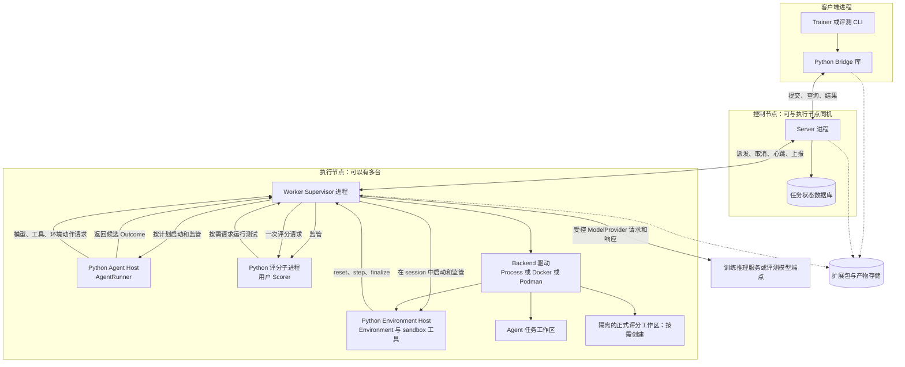

实线表示运行中的调用/消息，虚线表示材料读写。Agent host 与 Environment host 都由同一个 `ComponentHostProcess` 实现和协议启动，只因执行位置与权限不同而使用两个进程实例；它们没有独立调度、注册或容量体系。Python 评分子进程由 Rust Worker 监管；Rust 负责评分请求、系统字段补全和最终校验。

目标不强制保留独立 Rust AdapterCore 进程，但其批次流控、背压和协议校验不能迁成 Python 客户端的可选行为；这些职责并入 Rust Server 公共 RPC。Python Bridge 只负责框架对象转换、提交和结果消费。所有 Agent 模型调用先进入 Rust Worker 的 `AgentRuntime/ModelProvider`；训练模式下该 provider 再调用客户端的 ModelGateway，评测时则由 provider 连接外部模型端点。这样预算、取消和 generation 轨迹始终只有一个权威入口。

### 3.3 现有 OpenHands 链路的迁移边界

本节说明现有实现如何迁移，不是第二套目标部署。该结论于 2026-09-05 首次核对，并在 2026-09-07 对同一提交与干净工作区再次确认。`uenv-server/src/service/episode.rs` 的 703—714 行解析池身份并取得并发信号量，1002—1012 行按池入队 AgentJob。不能把“不再引入 Agent 池”误写成当前源码已经没有池化逻辑。

目标中，Server 只分配 Worker，Worker 在本次 attempt 的资源和预算范围内运行所选 AgentRunner。RunSpec.agent 只含 implementation 和 config，删除 AgentPlacement、placement 与池选择字段；不提供任意 Agent 的 local/remote 切换。OpenHands SDK 由相应适配器调用，模型端点来自 Bridge 传入的模型配置，Agent 不加载模型权重；SDK 的模型请求也必须经过 Worker 发放的本 attempt 模型代理。

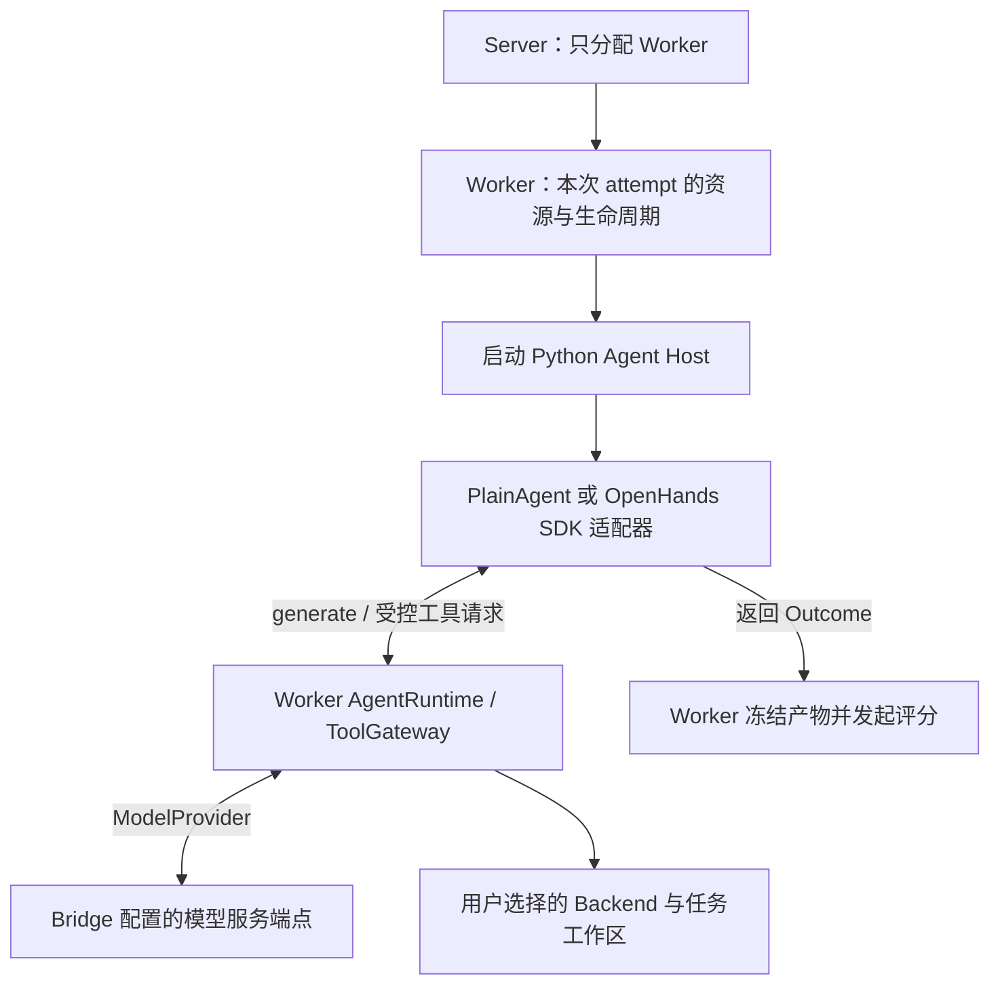

迁移期间，可以用边界明确的 LegacyOpenHandsAdapter 对接现有 runner/AgentControlService，完成旧新结果对照；这不是长期的通用远端 Agent 调度器，旧池字段只存在于兼容代码中，不进入新用户配置和公共执行协议。现有按池注册、容量信号量和 AgentJob 队列随旧执行入口退役，不能换名后继续作为目标架构的一部分。具体源码改造尚未执行。

目标执行只使用已有 episode/attempt 的身份、预算和取消机制。Worker 管理 Agent 子进程或会话的关闭，不增加另一层 Agent 租约；任务清理时撤销工具访问，阻止迟到操作。复用 Python 进程不等于复用会话，每次任务的历史、工具绑定和凭据必须独立。是否需要进程复用依据实测，不以未经测量的启动开销为池化设计理由。

迁移前对照测试保留现有真实 OpenHands runner、SDK、AgentControlService 和 gateway；迁移后测试保留真实 SDK、模型请求、受控工具和环境执行，不再要求经过已退役的旧池入口。两类报告明确注明执行路径，不能用伪造 Outcome 替代真实交互，也不能用删除旧接口来跳过工具或评分验证。

### 3.4 Hub 与数据存储规范

**Hub 负责提供固定版本的代码和数据，Server 派发任务，Worker 执行。用户可以自带样本，也可以选择 Hub 中的样本；同一份样本只取一个来源。**以下是目标规范，当前代码差异集中见第 13.2 节。

**存什么、存在哪里。**代码包版本与数据 revision 分别管理；增加题目不要求重新发布未修改的评分代码。包 manifest 描述入口、代码文件引用和 schema；数据发布信息描述数据身份、文件清单、样本索引与配套 schema 引用。

| 内容 | 格式 | 存储位置 |
|---|---|---|
| 原始样本 | 保留原来的 JSON、JSONL、Parquet 等格式，由准备入口的 reader 读取，逐行交给 Adapter | 用户本地或原数据源；不强制上传 Hub |
| 标准化样本 | 默认 UTF-8 JSONL，一行一个样本；可分片 | 发布到 Hub 管理的文件存储，或由用户本地 prepare 保存 |
| Adapter、Environment、Scorer、可选工具 | 有精确版本的 Python 包；发布 manifest 为 JSON，字段定义为 JSON Schema | Hub 登记版本与入口，实际文件放文件存储 |
| 图片、测试文件、代码快照等大文件 | 原文件或归档，通过 ArtifactRef 引用 | 文件存储；不把大文件嵌进样本 JSONL |
| 容器镜像 | OCI 镜像引用与 digest | 镜像仓库存内容，Hub 登记引用；镜像离线归档可作为文件保存 |
| 执行状态、评分、轨迹和输出产物 | Server 的执行记录；轨迹/文件通过 ArtifactRef 引用 | Server 管理状态与评分，文件存储管理实际产物；不写回数据版本 |
| Worker 缓存及工作区 | 包/文件按 digest 缓存；每次执行使用独立工作目录 | Worker 本地；缓存不是数据的权威来源 |

Hub 数据库保存版本、manifest、文件索引和权限，不强制把大文件字节存进数据库。文件存储可由本地目录实现，也可使用共享文件或对象存储；这是部署选择，不要求新增一个独立服务。

PackageManifest 必须能在下载和执行组件代码之前读取，用于校验入口、schema、运行要求和代码包 digest，因此不能只藏在 wheel 内。dataset.yaml 是发布前唯一由作者维护的声明；发布工具结合构建得到的 digest 组装 PackageManifest API 对象。发布成功后，Hub 中该版本的不可变 PackageManifest 是运行时唯一真值，不再回读本地 dataset.yaml。

包声明与 PackageManifest 不再提供 metadata、display_name、description、tags：当前没有对应的展示或检索功能。包身份使用 id，代码版本使用 version；作者不填写包 schema_version。运行字段必须放在各自唯一规范位置，不得通过自由字典增加覆盖配置。

数据集作者看到的工程目录不是 Hub 中的目录镜像。发布工具在本地运行验证并生成发布物，Hub 只接收运行所需的不可变内容：

| 本地工程内容 | 是否进入 Hub | Hub 中的形态 |
|---|---|---|
| `dataset.yaml` | 不原样作为运行配置保存 | 发布工具解析为唯一 PackageManifest API 对象；Hub 数据库保存结构化记录，查询时返回 JSON |
| `pyproject.toml` | 不作为独立运行配置保存 | 用于把 src 构建成版本化 Python wheel，并生成包/依赖元数据 |
| `src/` 中的 Adapter、Environment、Scorer、可选工具和按需新增的 `models.py` | 是 | 构建进同一个 wheel；wheel 放文件存储，数据库保存 ArtifactRef |
| 发布工具从 `models.py` 生成的 schema | 新增业务类型时是 | 不是用户维护的源文件；按 digest 存入文件存储并由 manifest 索引，已有公共类型直接引用 |
| 运行必需的其他文件 | 仅显式声明的文件 | 使用 ArtifactRef 发布，未声明内容不会被 Worker 下载 |
| `tests/` 与测试案例 | 默认否 | 在作者本地或 CI 执行，不进入 Agent/Environment 的运行包 |
| 用户训练、评测或实验项目中的 `run.yaml` | 否 | 不属于数据集包；按需用于构造 RunSpec，也可以由调用方直接构造 RunSpec |

一个数据集代码版本至少由 PackageManifest、一个 wheel 及其 digest 和该版本实际使用的类型引用组成；新增业务类型时还包含自动生成的 schema。用户不创建 `schemas/` 源码目录，也不同时维护 Python 类型和 JSON Schema。其他运行文件只有被 manifest 明确引用时才发布。标准化样本、隐藏测试、图片和代码快照不混入 wheel。它们作为独立 data revision 或受控 ArtifactRef 发布，因此更新数据不要求重新发布未变化的 Adapter、Environment 和 Scorer。

标准化 JSONL 每行只包含 `task: TaskSpec` 和可选 `private_data: TypedConfig`，复用现有字段定义，不新增一套样本类。数据身份统一使用 task.dataset 的 id/revision/split/subset 和 task.sample_id；行内不再重复这些字段。数据发布时固定 revision 和文件 digest，再生成数据索引；索引引用已固定文件的 ArtifactRef，revision 不定义为包含自身的索引文件摘要，避免循环计算。行内不保存 run_id、episode_id、Agent 或后端选择，运行时才与 RunSpec 组装 EpisodeRequest。私有内容存在时，整份 JSONL 按受限数据保存；Agent/Environment 只接收经过筛选的公开 TaskSpec，不能直接读取原文件。

**用户传什么，Hub 提供什么。**

| 输入方式 | 用户交给准备入口的内容 | Hub 提供的内容 |
|---|---|---|
| 用户自带样本 | 原始样本文件或已标准化样本，以及选择的代码包版本 | 代码包与被明确引用的资源；不拿 Hub 的同名题目覆盖用户内容 |
| 使用 Hub 数据 | dataset 的 id/revision/split/subset、选中的 sample_id 或样本范围，以及代码包版本 | 该数据版本中对应的标准化样本、私有评分材料及资源引用 |

两种方式在受管理的 prepare/Bridge 准备阶段汇合：原始数据先经过 Adapter，已标准化数据直接校验，随后统一组装 EpisodeRequest。一次样本提交不能同时指定“从 Hub 读取”又传入另一份样本内容；发生冲突直接报错，不逐字段合并。基于 Hub 数据修改题目时，按自带样本准备新数据身份或发布新 revision。数据引用选择属于准备入口，不在 Worker 再增加一种按数据集查题的执行分支。


Worker 只读取计划指定的版本和文件，不重新查询 latest，不下载整份数据集来猜测本次题目；下载结果先校验再加入缓存。Hub/文件读取按调用身份授权，凭据不嵌入 ArtifactRef.uri；私有测试的读取能力只交给评分路径。原生包缓存也不能包含 Agent 可读的隐藏评分材料。缓存可回收，但被运行任务或保留结果引用的源文件不能直接删除；工作区清理与结果重传分别处理。

对外统一支持包/数据的版本发布与查询、固定样本读取、获准文件下载；运行产物通过 ArtifactStore 写入。数据版本不可原地修改，样本缺失、摘要不符或无读取权限时明确失败。服务 API 的具体请求 schema 与生产实现须随第 13.2 节一并落地，不能把本节示意图当成已部署协议。

## 4. 主要领域对象与接口

| 对象/接口 | 责任 | 明确不负责 |
|---|---|---|
| DatasetAdapter.normalize | 源数据行转 PreparedSample，分开公开输入与私有材料 | 选择 backend、agent、调度或模型调用 |
| TaskSpec | 数据来源、稳定样本 ID、公开任务输入及摘要 | 私有评分材料或引用、运行模式和后端选择 |
| RunSpec | 显式组合环境、agent、tools、scorer、backend、model、预算 | 正在执行的 session/lease |
| ExecutionPlan | 精确组件引用、能力需求、截止时间和本次 attempt | 按数据集临时改写执行策略 |
| Environment.reset/step/finalize | 初始任务状态、环境转移、收集候选产物 | 模型调用或权威评分 |
| AgentRunner.run | 会话、模型决策、工具调用、交互循环 | 访问私有标准答案、写最终分数 |
| ToolExecutor.execute | 使用绑定的 session 执行一个操作 | 创建另一套任务调度/评分链 |
| Backend | 通用资源创建、执行、文件操作、中止和清理 | SWE instance、QA 标签、基准评分 |
| Scorer.score | 根据 ScoreInput 同时给出本条 episode 的指标和唯一 reward | 修改 Server 终态、决定全局重试 |
| TrajectoryWriter | Rust Worker 顺序校验、保存并封存事实和产物引用；Python 组件只提交事件内容 | 展示文本清洗、编造 token |
| EpisodeCoordinator | Server 唯一终态、attempt 切换和幂等 | 交互循环与业务评分 |

SDK 对外提供 ABC，内部依赖窄 Protocol；按 Python/Rust 语言习惯使用 class/trait。相同角色共享接口，不要求所有能力组成一个巨大父类。跨进程必须依赖序列化协议，而不是假设 Python 继承关系跨语言有效。

### 4.0 核心类、数据对象与调用关系

先明确这节要回答的问题：系统有哪些可扩展的类；这些类互相调用还是互相继承；它们之间传递什么数据；新增数据集时用户需要实现哪一部分。

**阅读范围：以下是目标类关系，不是远端生产类图。**2026-09-07 只读核对远端，当前 Rust Worker 的 `EpisodeExecutor.execute_episode()` 仍负责环境 reset/step，OpenHands runner 则创建 Python SDK Agent/Conversation 并调用其循环。对应源码见 Worker 入口（生产源码 `uenv-worker/src/episode/executor.rs:210`） 与 OpenHands 入口（生产源码 `integrations/openhands/run_swebenchpro_official.py:906`）。设计目录已经增加 Rust `EpisodeSupervisor` 可执行参考，但不表示远端服务已经迁移。

#### 4.0.1 用户接口与 Rust 系统执行器

先只看数据集接入直接相关的核心关系。图中方法省略 context 等参数以便阅读；准确签名见参考 SDK。标为 abstract 的类是用户扩展接口。

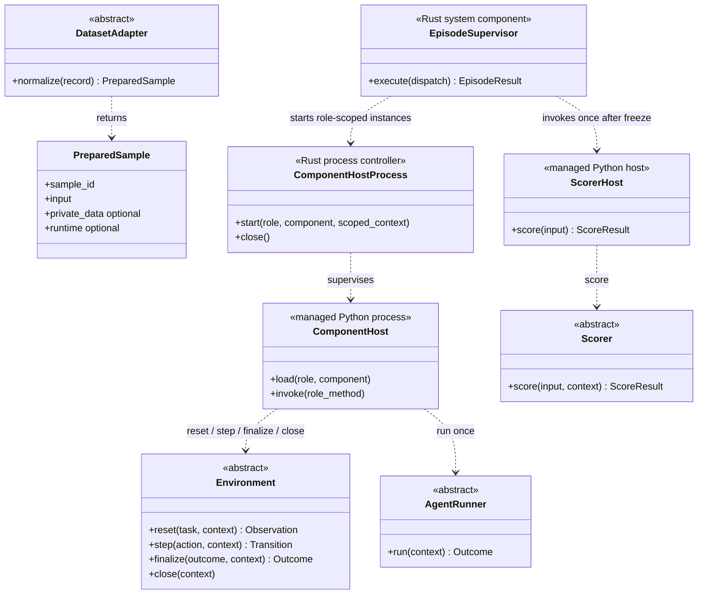

图例：虚线箭头 `..>` 表示调用或使用，不表示继承；箭头标签 run once 指一次 attempt 中只调用一次 Agent.run，内部可以发起多次 generation。`ComponentHostProcess` 是一种基础设施实现，按 role 启动 Agent 与 Environment/沙箱工具两个权限隔离的实例，不是两个用户接口。这里没有一个包揽所有职责的 Dataset 父类。

DatasetAdapter 位于数据准备阶段，返回 PreparedSample(sample_id, input, private_data, runtime)。作者侧的 input 与 private_data 使用 `UEnvModel`；prepare 根据入口类型和固定包版本自动封装为内部 TypedConfig，再用 input 构建公开 TaskSpec，与可选 private_data 配对写入 EpisodeRequest，不再生成和读取额外的私有材料包装文件。Worker 执行时不再转换原始数据。

EpisodeSupervisor 是 Rust Worker 内唯一的 attempt 生命周期执行器。它创建后端会话、启动/终止 Python host、强制预算和取消、冻结产物、在本 attempt 进入评分时至多调用一次评分、完成首次清理、封存轨迹并保存待上报结果。ComponentHost 和 ScorerHost 只是受管 Python 组件入口，不拥有租约、后端、最终状态或持久化。它们先按对应角色的 package config schema 完整校验 `ComponentSpec.config`，随后只把 `config.data` 作为必填 dict 传给用户类构造函数；基类统一保存为 `self.config`，空配置显式传 `{}`。Environment、AgentRunner、Scorer 是用户扩展对象；用户不实现 Supervisor 或 host。

本地参考位置：[Python 用户接口与数据类型](../reference/sdk/src/uenv/sdk/__init__.py)、[Python 类型与 schema 生成](../reference/sdk/src/uenv/sdk/modeling.py)、[Rust EpisodeSupervisor](../reference-control/src/supervisor.rs)、[Rust 计划解析](../reference-control/src/plan.rs)、[Rust 评分补全](../reference-control/src/scoring.rs)。本轮修改的是 `design` 参考实现；远端代码和本地 `source` 快照未修改。

#### 4.0.2 谁继承谁：系统基类与数据集专属类

每个数据集都有自己的 Adapter、Environment、Scorer。下面按职责分别画出九个数据集的全部入口，不能把某一张图中的一个数据集类理解为其他数据集共用的入口。空心三角箭头 `<|--` 指向父类。

**Adapter：九个数据集分别继承 DatasetAdapter。**

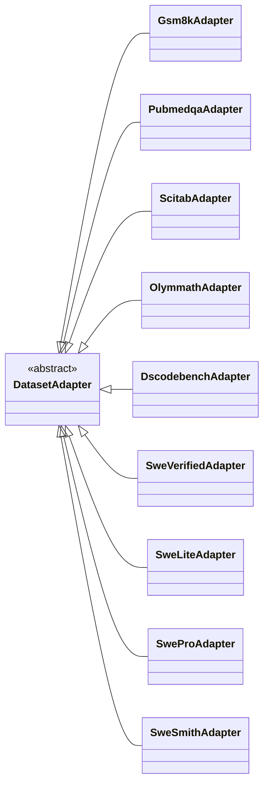

**Environment：九个数据集直接继承 Environment。**

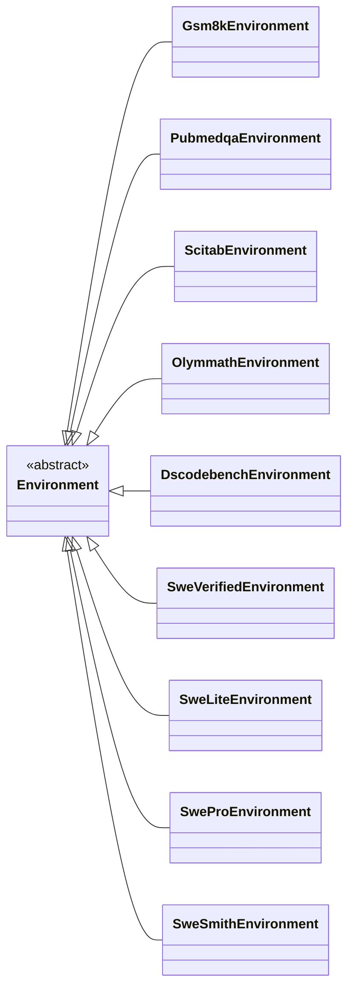

不再增加问答专用的中间 Environment 基类。各数据集在 reset 中构造自己的初始 Observation；普通问答由 AgentRunner 返回最终回答，无需实现 step。有状态任务按需实现 step、state_snapshot、finalize、close。每个 Environment 都得到所选 Backend 已创建的必填 session；问答 Environment 可以不使用它，但系统不以 `session=None` 暗中形成“无后端”旁路。重复的格式化、文件操作等可以复用公共函数或通过组合调用组件，不能把问答行为移入 Environment 基类成为所有任务的默认行为。

**Scorer：九个数据集直接继承 Scorer。**

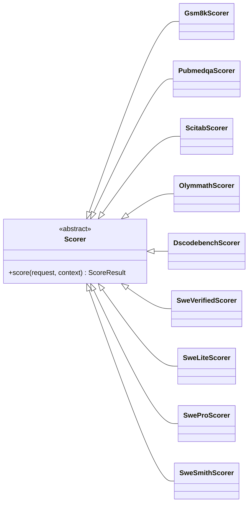

所有数据集 Scorer 均直接继承 Scorer，统一实现 score(request, context) -> ScoreResult；不设文本或测试执行中间评分基类，也不继承其他数据集的 Scorer。文本提取、答案比较、测试执行和报告转换通过公共函数或组合组件复用，一个评分器可以组合多种评分方式。

当前参考代码中，文本评分器调用 `read_reference_text` 与 `uenv_reference_rules` 包中的规则函数；代码/SWE 评分器调用 `evaluate_harness`，由 ScoringContext 提供受控测试执行能力。每个进入评分的 attempt 由 Rust `run_score` 至多调用一次 `Scorer.score`，不按数据集、评测或训练分支。一个 RunSpec 只选择一个 Scorer；升级规则时发布新的组件版本并创建新的 run，不能让评测端和训练端各选一套评分配置。

**Agent 独立于数据集，按运行参数选择。**

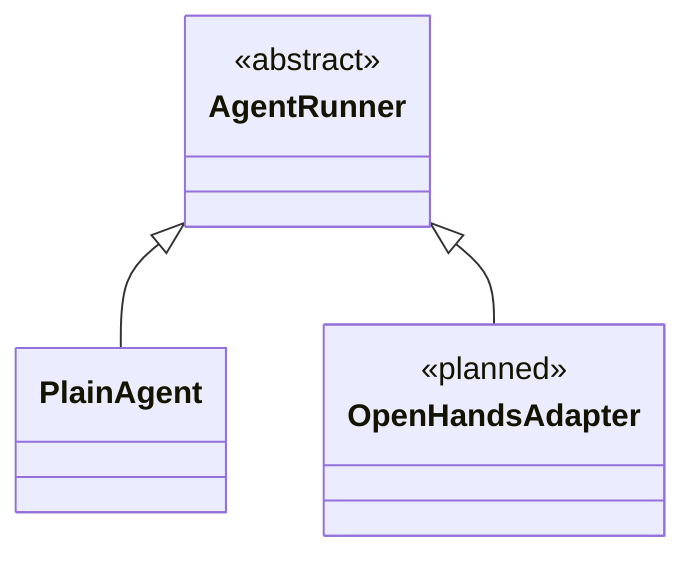

OpenHandsAdapter 是待接入统一接口的 Agent 包装类，不是 DatasetAdapter，也不表示现有 SDK 已经继承 UEnv AgentRunner。CounterEnvironment 和 ProgressScorer 是额外的本地有状态测试示例，分别直接继承 Environment 和 Scorer，不属于上述九个数据集入口。

manifest 必须指向本包实际声明的三个类。仅导入公共类并改名不算专属类；Adapter、Environment、Scorer 分别实现 normalize、reset、score，方法体可以调用共享函数。

#### 4.0.3 数据归谁、交给谁：任务、执行控制、交互和评分

**系统只保留一种公开任务定义 TaskSpec。** 它描述要完成的任务，可直接提供给 Environment、Agent 和 Scorer。运行配置和私有评分材料各自放在自己的位置，不再通过另一种任务类型过滤字段。

本节中的 TaskSpec、RunSpec、ScoreInput 等是传递数据的结构，DatasetAdapter、Environment、AgentRunner、Scorer 才是执行方法的类。数据结构的数量不对应进程或服务数量；JSON Schema 中一个有名字的文件格式，也不意味着要新增一个 Python 类。

先按使用者看整体分工：

| 使用者 | 接收什么 | 为什么需要这些数据 |
|---|---|---|
| 数据准备工具 | Adapter 返回的 PreparedSample | 用公开输入构建 TaskSpec，与 private_data 配对生成同一受控请求 |
| Environment、Agent | TaskSpec；各自获准使用的 Context | 了解任务并执行交互，不接收完整调度计划或私有评分数据 |
| Server、Worker 控制代码 | RunSpec、EpisodeRequest、ExecutionPlan | 选组件、分发、重试、控制预算；这些对象不直接传给 Agent |
| Scorer | ScoreInput 与 ScoringContext | 读取任务、固定的执行产物、轨迹和可选私有材料，计算评分 |
| Bridge、调用方及结果存储 | EpisodeResult | 获得执行状态、产物、得分、轨迹和用量 |

以下类图只表示字段关系：实线 `-->` 表示字段内包含该类型，虚线 `..>` 表示用 ID 引用。箭头标签是字段名，`0..1` 表示可选。处理顺序另用流程图表示；完整字段见 [字段字典](field_dictionary.md)。

**一、公开任务：TaskSpec 只描述要完成什么**

| 字段 | 含义 |
|---|---|
| schema_version | 公共协议版本 |
| task_id | 准备阶段确定的任务身份 |
| dataset | 数据集 ID、不可变 revision、split、subset |
| sample_id | 数据集中的稳定样本 ID |
| input | TypedConfig，包含题目及其他公开业务输入；data 按注册 schema 校验 |
| input_digest | 公开 input 的规范序列化摘要 |
| runtime | 可选的样本容器镜像候选；不选择 backend，Process 执行不会消费它 |

TaskSpec 不含参考答案、隐藏测试、私有材料引用，也不含 Agent、backend、model 或预算选择。Environment.reset 接收 TaskSpec，AgentContext.task 也是 TaskSpec；系统分别传入副本，避免某个组件修改任务对象后影响其他组件。Scorer 接收同一任务定义，不需要再维护另一份任务格式。

例如 GSM8K 的 TaskSpec.input.data 只有题目，参考答案放入受控请求的 private_data。新增数据集时，作者在 Adapter.normalize 中返回 PreparedSample；它是准备阶段的临时返回值，包含公开输入和可选私有内容。系统的 prepare 工具负责身份、存储、摘要和组装，用户不手写两份任务。

**二、执行控制：配置、请求与最终计划**

RunSpec 保存用户选择，EpisodeRequest 指定这一次执行哪个任务。Server 校验二者后，**转换生成** ExecutionPlan；计划不再嵌套原始请求与 RunSpec，也不再附带另一份组件选择或工具配置。

| 对象 | 由谁产生、谁使用 | 范围 |
|---|---|---|
| RunSpec | 用户经 Bridge 提交，Server 保存 | 一次 run 共用的 environment、agent、backend、model、tools、scorer、limits 等配置 |
| EpisodeRequest | Bridge 提交给 Server | run_id、episode_id、task、seed、可选 private_data；以及提交幂等与批次定位字段 |
| ExecutionPlan | Server 生成，Worker 使用 | 本次 attempt 唯一生效的配置、公开任务、受控评分依据、精确组件引用和截止时间 |

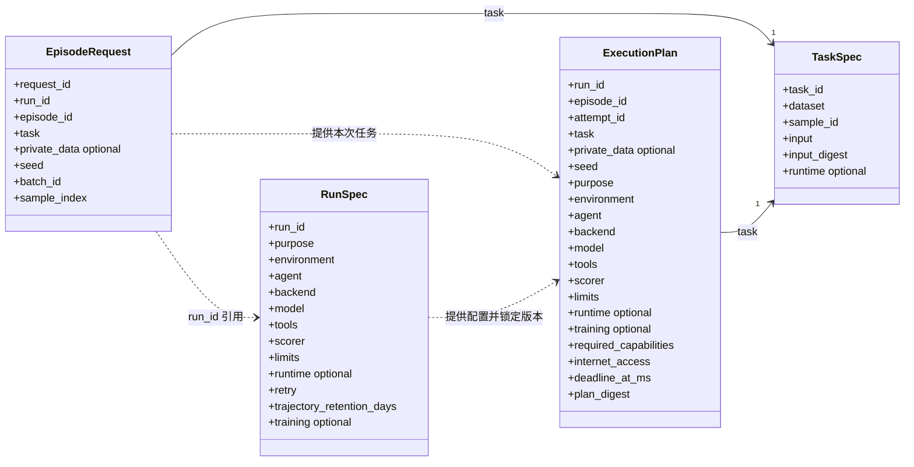

虚线表示引用或转换来源，不表示包含对象。RunSpec 的 environment 到计划中仍叫 environment，tools 仍叫 tools；变化的是组件版本已锁定、工具执行路由已核验，字段的含义和名字不变。Worker 只读取计划，不能再查询 RunSpec 重新选组件，也不能用另一张 components 表覆盖角色配置。同一组件被多个角色使用时，引用必须完全一致。

数据集 `PackageManifest` 是发布/安装元数据，不是图中第五个运行对象。它登记 Adapter、Environment、Scorer 入口、各角色 config schema、任务 schema、默认 runtime 和 internet_access；独立 Agent 和工具分别使用 `AgentManifest`、`ToolSpec` 发布。PlanResolver 只沿 RunSpec 已选的角色引用查询可信目录。数据集 Environment 与 Scorer 可以引用同一个包坐标，再按角色取得 manifest 中不同入口；它们仍分别使用 `RunSpec.environment` 与 `RunSpec.scorer`，不存在一个 package 参数同时暗中覆盖两项选择。

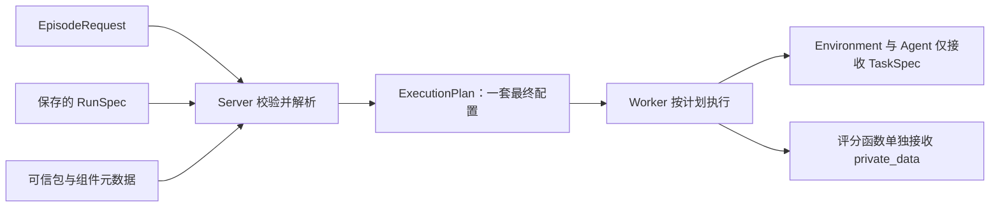

同一 run 共享一套环境与评分组件配置。不同样本可以共享它，但都必须满足这些组件支持的任务 schema；若 GSM8K 与 SWE 需要不同专属 Environment/Scorer，就创建不同 run，由 Bridge 同时管理。Worker 不能根据 dataset 名称临时更换组件。同一任务多次采样使用不同 episode_id。正常执行只有 `attempt_id=1`；发生允许重试的基础设施故障时，Server 保留 episode_id 并增加 attempt_id，用户不填写该字段。

Server 保留原始 RunSpec、EpisodeRequest 用于审计、幂等与批次定位。request_id、batch_id、sample_index 不进入执行计划；retry 由 Server 消费，不向 Worker 提供第二个重试决策入口。计划中的 task 不含私有材料引用；完整计划不能直接传给 Environment/Agent 或写入公开轨迹。

`purpose` 与 `training` 的组合没有第三种解释：`purpose=training` 时 `training` 必填，`purpose=evaluation` 时 `training` 必须省略。purpose 只选择结果消费方；training 只约束训练所需的模型版本和 token 轨迹，不改变 Scorer、ScoreInput 或 reward 算法。

`trajectory_retention_days` 也是 Server/ArtifactStore 的保存策略，只在 RunSpec 出现并由服务端存储管理消费，不复制到 ExecutionPlan。Worker 始终记录完整的标准事件；summary 只是查询端可生成的派生视图，不是执行配置，也不能改变训练事实。

重试必须沿用已锁定的任务、private_data、seed、模型配置、组件、工具、镜像和限制，只更新 attempt_id 与对应 plan_digest；租约在 DispatchRequest 中单独颁发。截止时间不重置。Server 在重新派发时把截至上一 attempt 已确认的累计 `consumed_usage` 与当前 `remaining_timeout_ms` 放入 DispatchRequest；Worker 用二者初始化本机预算，不能通过重试获得新调用、token 或时间预算。用量不确定时按保守上界结算或不自动重试。训练的实际模型版本按明确 version_policy 处理，不能借重试隐式切换政策。

**同义字段命名与唯一生效位置**

| 含义 | 统一字段与规则 |
|---|---|
| 通用指令型任务正文 | TaskSpec.input.data.instruction；原始 question/problem/problem_statement 在语义确为“待执行指令”时由 Adapter 映射；claim 等不同业务概念不强改名 |
| 工具表 | RunSpec.tools → ExecutionPlan.tools；不保留另一份 tool_bindings |
| 工具的会话名称、执行实现 | ToolBinding、ResolvedToolBinding、ToolCall 都使用 name、implementation；调用记录必须匹配选中的绑定 |
| 评分器选择 | RunSpec.scorer → ExecutionPlan.scorer；一个 run 只有这一处作者配置，计划只把同一选择锁定为精确版本 |
| episode 奖励 | ScoreResult.reward；评测直接展示/聚合，后训练原值复制到 FrameworkSample.reward，不再定义 training_reward、StepReward 或 RewardAssignment |
| 镜像 | 各候选入口统一 runtime.image；只有 ExecutionPlan.runtime.image 生效，image_source 仅记录来源 |
| 任务、执行、尝试身份 | 分别 task_id、episode_id、attempt_id，跨消息传递原值，不改名 |
| 模型调用 | generation；使用 generation_id、max_generations、generation_count，不使用含义不明确的 turn |
| 环境动作 | environment_step；使用 environment_step_index、environment_step_count，不与模型调用合并 |
| 交互结束原因 | Outcome.termination_reason；EpisodeResult 与 TerminalEvent 不再复制，系统失败原因使用 ErrorRecord.code |
| 内容摘要 | input_digest 校验公开 input；plan_digest 校验完整计划（包含 task 与 private_data）去掉摘要字段本身；不再增加材料专用 task_digest |
| 时间预算 | total_timeout_ms 是最初总时长；deadline_at_ms 由首次接纳时间据此确定；DispatchRequest.remaining_timeout_ms 是派发时派生的剩余上限，接收方只能收紧，不能延长截止时间；Lease.expires_at_ms 只表示租约有效期 |

“同义同名”不等于把不同含义都叫一个名字。SciTab 的 claim 是待核验陈述，contexts 是证据，二者不是任务指令别名；参考答案 answer、模型最终输出 final_answer 与评分 success 也不同。schema_ref/data 是扩展类型信封，不能在 data 内另放 task_id、backend、tools 等公共协议同义字段。新增包发布前也需按此规则审查业务语义，Schema 只能自动拒绝已定义的旧字段和不符合结构的数据，不能自动证明任意新字段没有语义重复。

更详细的逐字段来源和禁止项见 [字段统一规则](field_conventions.md)。

**三、交互数据：观测、动作结果、执行结果**

| 对象 | 由谁产生 → 交给谁 | 保存什么，为什么单独存在 |
|---|---|---|
| Observation | Environment.reset/step → AgentRuntime、Agent | 当前公开观测：content 与可选有类型 data |
| Transition | Environment.step → AgentRuntime、Agent | 一次真实动作后的 observation、terminated、episode_truncated、可选 environment_reward |
| Outcome | AgentRunner.run → Environment.finalize → EpisodeSupervisor、Scorer；snapshot 也返回同类 | final_answer、artifacts、termination_reason 与可选 state；state 只能由 Environment 填写 |

reset 直接返回 Observation；step 返回 Transition，其中的 observation 是后续观测。模型调用、工具调用与环境动作不是同一件事，单轮问答可以直接生成回答并返回 Outcome，无需伪造 step。environment_reward 是环境原生反馈，不自动成为训练 reward。

Agent 提交与环境收集共用一个 Outcome。finalize 这个执行步骤保留：代码任务需要收集工作区修改，有状态任务需要收集环境状态；但不再为了前后两个阶段定义两个字段相近的类。Agent 只能填写 final_answer、artifacts、termination_reason，携带 state 或返回 in_progress 会在交给 Environment 前被拒绝。Environment.finalize 返回独立 Outcome。作者按需覆盖 `state_snapshot()`；SDK 的默认 `snapshot()` 只是把它包装成 termination_reason=in_progress 的 Outcome，最终评分禁止该状态，作者不需要再实现第二套快照协议。

终态 `termination_reason` 只允许 final_answer、environment_terminal、budget_exhausted；in_progress 只用于过程快照。系统取消和系统失败不再伪装成交互结束原因，分别写入 `EpisodeResult.execution_status` 与 `ErrorRecord`，也不触发正式评分。

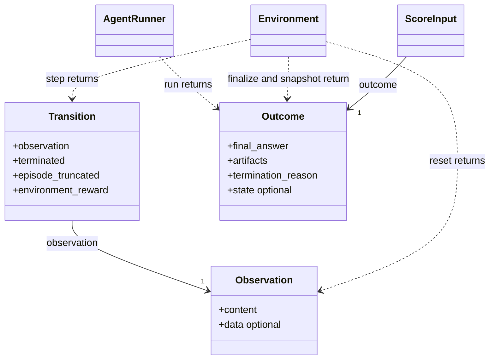

Observation 是可反复使用的公开内容；Transition 是一次动作的结果，包含 Observation 和终止/奖励信息。初始化还没有动作，因此 reset 只返回 Observation。Outcome 表示进入评分的提交内容与环境状态，不与模型可见观测合并，避免把不同用途和权限的数据混在同一对象中。

**用户接口：三个返回类型，轨迹由系统记录**

```text
Environment.reset(task, context)       -> Observation
Environment.step(action, context)      -> Transition
AgentRunner.run(context)               -> Outcome
Environment.finalize(outcome, context) -> Outcome
```

数据集作者只实现需要的方法并填写业务返回值。普通问答使用 Observation 和 Outcome，不需要伪造动作或实现无用的 step；有状态任务再使用 Transition。执行编号、时间戳、动作序号、轨迹写入和评分调用分别由 AgentRuntime、TrajectoryWriter 与 EpisodeSupervisor 负责，数据集作者不组装轨迹信封。

**轨迹结构：直接复用 Transition**

目标 EnvironmentTransition 是 AgentRuntime 内部生成的轨迹内容，字段如下；它不增加用户需要构造的第四个返回类。

| 字段 | 类型 | 唯一来源 |
|---|---|---|
| environment_step_index | integer | AgentRuntime 在执行动作前分配的序号 |
| observation_before | Observation | 执行动作前保存的公开观测副本 |
| action | TypedConfig | 这一次实际执行的动作 |
| transition | Transition | Environment.step 返回值经校验后的独立副本 |

动作后的 observation、terminated、episode_truncated、environment_reward 只在 Transition 中定义，轨迹不在顶层重复声明或逐字段重组它们。动作后观测的路径为 payload.transition.observation；动作前观测为 payload.observation_before。字段 observation 保持原名，多一级 transition 只表示包含一次动作的返回结果。

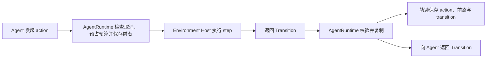

轨迹中的 transition 与返回 Agent 的 Transition 内容一致，但必须是独立副本，后续修改不能改变已记录内容。轨迹仍使用既有 TrajectoryEvent 信封保存身份、时间与 kind；不新增转换类、用户日志接口或第二份动作结果字段。

实现范围：三个用户类型和上述四个方法已在参考 SDK 中存在；EnvironmentTransition.transition 已同步到 scripts/build_contracts.py、生成 schema、字段字典和 Rust 记录入口。校验拒绝同时保留平铺字段作为第二套来源。

“冻结”要求后续评分使用固定内容。本地 Rust 参考在 finalize 后按顺序调用 `ToolHost.freeze()` 和 `Backend.freeze()`，并用 mock 验证评分发生在二者之后；Python 数据对象也做独立复制和部分摘要检查。真实 Backend 仍需实现只读评分视图和不可变产物存储，不能仅凭 dataclass 或方法名认为生产隔离已经完成。

**四、评分：输入、计算与返回**

代码测试的执行器仅在 private_data.data.evaluation_plan.harness 中选择。evaluate_harness 不接受另一份 harness 名称；它用 outcome、原 private_data 和 ScoringContext 当前剩余时间组装 HarnessRequest，校验后调用受控回调。ScoreInput 本身不再复制 remaining_timeout_ms。

评分是一条完整的数据流：Rust Worker 组装 ScoreInput，通过受管评分进程调用数据集 Scorer.score，校验 ScoreResult 并放入 EpisodeResult。private_data 只是评分输入中的可选字段，不单独形成一套材料对象或处理流程。

评分输入有两个来源：准备入口提供配对的 task 与可选 private_data，经 EpisodeRequest 原名传入 ExecutionPlan；原始数据需要 Adapter 转换，标准化本地或 Hub 数据直接校验。待评分的回答、补丁或最终状态来自 Environment 收集的 Outcome。Rust Supervisor 在交互结束后把这些内容与评分前轨迹放入 ScoreInput，剩余预算只通过 ScoringContext 提供。

例如 GSM8K 作者只构造 `Gsm8kPrivateData(answer="42")`；SDK 在内部传输边界生成 `{"schema_ref":"uenv://packages/datasets/gsm8k/1.0.0/Gsm8kPrivateData","data":{"answer":"42"}}`。大型隐藏测试使用 private_data 内已有的 ArtifactRef 引用。没有参考依据时省略 private_data；小型评分依据直接传递，只有实际文件内容需要受控 reader。

| 对象 | 谁负责组装 | 数据内容与接收方 |
|---|---|---|
| ScoreInput | Rust EpisodeSupervisor | task、outcome、评分前 trajectory_ref 与可选 private_data；只交给受管 Scorer；时间和取消状态只通过 ScoringContext 提供 |
| ScoreResult | Python Scorer 填业务字段，Rust Worker 补全并校验系统字段 | 评分状态、指标、成功与否、奖励及证据；完整校验后写入 EpisodeResult |
| EpisodeResult | Worker 汇总，Server 校验租约后接纳 | episode/attempt 身份、执行状态、产物、最终评分、最终轨迹、用量和清理状态 |

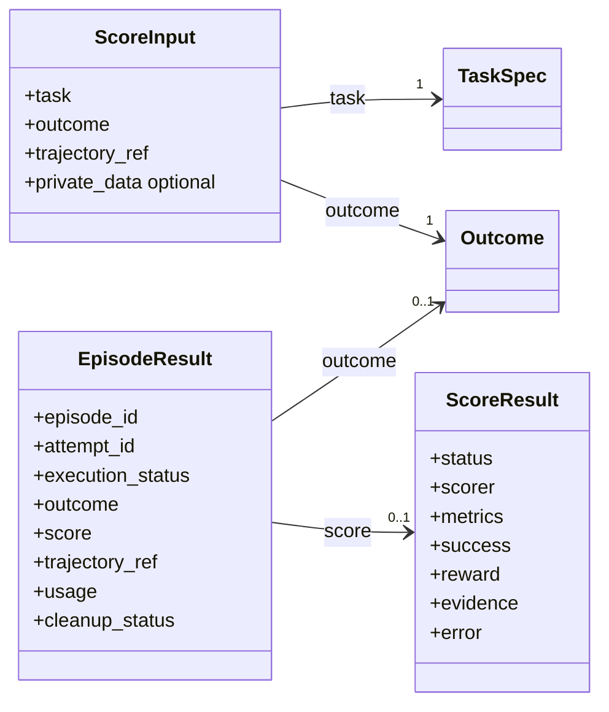

用户实现 `Scorer.score(ScoreInput, ScoringContext) -> ScoreResult`，填写 success、metrics、reward 和可选 evidence；Rust Worker 根据可信计划补入 status、scorer、error。ScoringContext 的 cancelled 与本机单调 deadline 都由 Worker 注入，`context.check()` 统一产生 EPISODE_CANCELLED 或 SCORER_TIMEOUT；Scorer 不能自己建立另一套取消或超时定义。评分成功时 reward 必须存在；评分器填写系统字段会被拒绝。系统完成复制、补全与完整校验后，结果才可写入轨迹或 EpisodeResult.score。用户可直接单元测试 `Scorer.score` 的业务字段；系统字段由 Rust 控制测试验证。

`ScoreResult.binary(passed)` 同时产生 success、accuracy 和 0/1 reward。一般任务可直接构造 `ScoreResult(success=..., metrics=[...], reward=...)`；该对象经 Worker 补全系统字段后才满足正式传输 schema。评分程序正常执行但答案错了，是 status=ok、success=false、reward=0；评分器异常则生成 status=error，success/reward 为 null。

ScoreInput 和 ScoreResult 不含 purpose、stage，也不定义逐步正式评分。RunSpec.purpose 只决定完成后由评测汇总器还是训练器消费结果，不改变 Scorer 输入、算法或输出。进入评分前失败时 EpisodeResult.score 省略；只要已经调用 Scorer，就必须保留这一次产生的 ScoreResult，包括 status=error 的结果。每个 attempt 至多调用一次，Server 只接纳一个 attempt 的 score 作为 episode 权威评分。ScoreInput.trajectory_ref 和 EpisodeResult.trajectory_ref 都指向 TrajectoryManifest；前者的 manifest 使用 trajectory_status=scoring_checkpoint，后者使用 final_complete 或 final_partial，避免一个布尔值同时表达“尚未结束”和“事件缺失”。

输入权限随这条链路保持不变：Environment/Agent 只接收公开 task；private_data 和隐藏测试读取能力只进入评分路径。EpisodeResult 返回评分结果，不包含整份 ScoreInput 或 private_data。受控请求和计划不能原样写入公开日志；evidence 与测试报告也必须按可见性授权。

受信 Adapter/prepare 负责将任务与评分依据正确配对，schema 或摘要不能证明标准答案语义正确。Server 校验包声明的 schema；计划摘要覆盖 task 与 private_data，重试保留原输入，提交幂等比较应覆盖完整请求。生产的事务、访问控制、进程隔离及嵌套测试引用保留仍需接入，本地数据副本不是操作系统隔离。

**完整执行顺序**

下图只表达正常执行时的处理顺序，不表示字段包含。私有材料校验失败时在 prepare 阶段结束；正式评分只在 Environment.finalize 得到最终 Outcome 后执行一次。

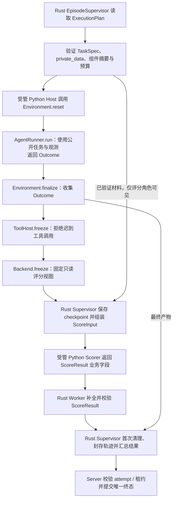

以上控制链路已在 `design/reference-control` 中提供同步 Rust 参考，并以独立 AgentHost、EnvironmentHost mock 端口验证统一顺序和权限方向。它接收 DispatchRequest 对象，但不实现真实 RPC 传输、lease/replay fencing、进程强制中断或生产私有存储授权。图中的角色分工不等于每个角色都要部署为一个新服务。

#### 4.0.4 谁调用谁：多轮执行时序

下面使用有状态环境说明 step 的位置。工具与沙箱路径下一小节单独画。

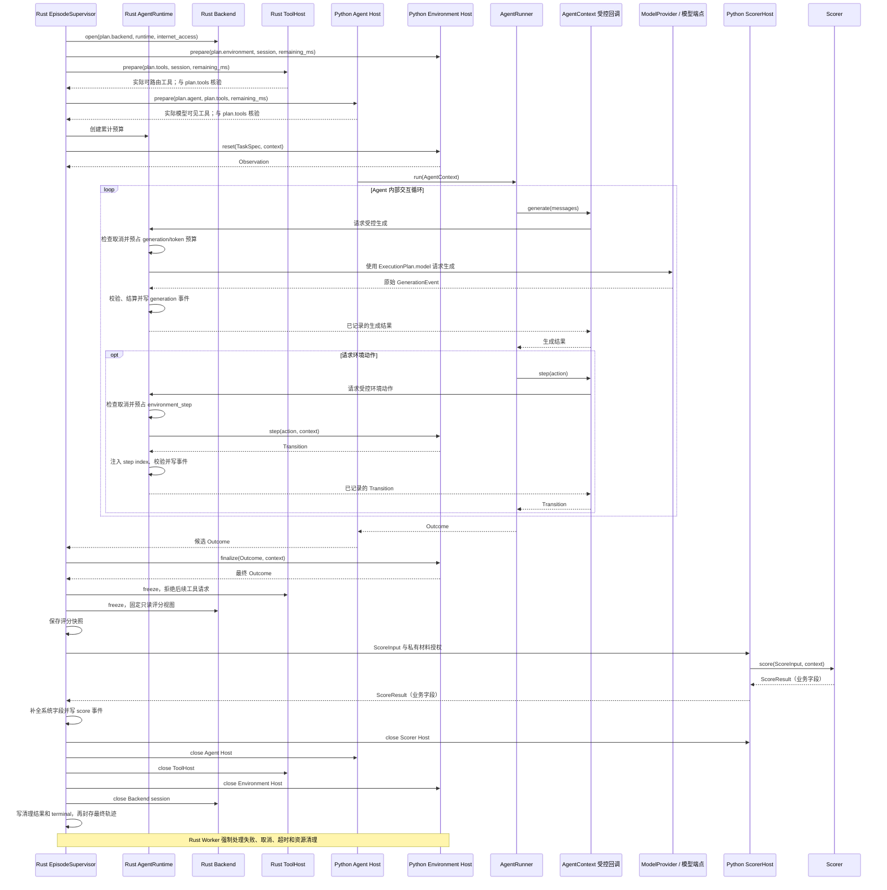

AgentContext 不是另一个调度服务。它在 Python 中向 Agent 提供 task、observation、step、generate 和工具入口；调用必须进入 Rust `AgentRuntime`，由它在副作用发生前检查取消、截止时间和对应预算。Python 只把框架调用转换成协议，不能直连模型后再补报、不能自行增加次数、延长截止时间或封存轨迹。本地 Rust 参考把受控调用集中在 [AgentRuntime](../reference-control/src/runtime.rs)。open、prepare、Agent.run、freeze 以及每次模型/工具/环境/评分调用都接收同一预算派生的当前 remaining_ms。清理固定为 ScorerHost → AgentHost → ToolHost → EnvironmentHost → Backend；`freeze()`、`close()` 都必须幂等，某一步失败也继续尝试后续步骤。close 使用平台固定的清理超时，不能因 episode 预算已耗尽而跳过。

单轮问答仍调用同一个 Agent.run，只生成一次回答，可以不调用 step。多轮策略由 AgentRunner 决定，Rust Worker 强制公共预算；Supervisor 不再套一层模型决策循环。多轮中的公开反馈来自 Environment.step 的 Observation 或工具结果；这些内容会写入轨迹，但正式 ScoreResult 只在最终 Outcome 冻结后产生一次。

#### 4.0.5 工具与后端位于哪里

这一张是目标逻辑依赖图。用户扩展是 Python，准入和资源控制是 Rust；跨进程通过生成协议通信。`ToolHost` 是 Rust 内部端口，`ToolGateway` 是它的实现，不是新的部署进程。普通 Python ToolExecutor 与 Environment 使用同一个 sandbox 角色 host；Agent 原生会话工具留在 Agent host。ToolGateway 只按唯一 `ExecutionPlan.tools` 选择路由，Backend 只提供本次 session。本地 Rust 参考已实现受控模型/工具入口，真实 IPC 接线和 OpenHands 适配器仍未实现。

```mermaid
classDiagram
  direction LR
  class AgentRunner {
    <<abstract>>
  }
  class ToolGateway {
    <<Rust ToolHost implementation>>
    +prepare(tools, session, remaining_ms) routable_tools
    +execute(binding, arguments) ToolResult
    +freeze(remaining_ms)
    +close()
  }
  class ToolExecutor {
    <<abstract>>
    +execute(arguments, context) dict
  }
  class ReadFileTool
  class BackendSession {
    <<planned>>
    +read_file(path)
    +execute(request)
  }
  class Backend {
    <<Rust trait>>
    +open(backend, runtime, internet_access, remaining_ms)
    +execute(request)
    +read_file(session_id, path)
    +freeze(remaining_ms)
    +close()
  }
  AgentRunner ..> ToolGateway : through Python SDK adapter
  ToolGateway ..> ToolExecutor : invokes through role-scoped ComponentHost
  ToolExecutor <|-- ReadFileTool
  ReadFileTool ..> BackendSession : context.session.read_file
  BackendSession ..> Backend : delegates through Worker
```

工具不是 Agent 的父类，Backend 也不是 Environment 的父类。它们通过受控接口组合：Agent 决定调用，工具完成操作，后端提供资源能力。ProcessBackend、DockerBackend、PodmanBackend 在 Worker 侧实现统一后端协议；这不意味着 Python ABC 的继承关系可以直接跨语言执行。ToolHost 返回“能否路由”，AgentHost 返回“模型能否看见”；Supervisor 把两者分别与唯一 `ExecutionPlan.tools` 核对，返回值不成为第二份工具配置。

状态环境的动作工具可以调用 AgentContext.step；文件工具通过 session 操作文件。一次动作只执行一次，不能先由文件工具修改，再让 Environment.step 重复修改。只操作 SDK 会话状态的原生工具无需经过任务 Backend，但仍遵守工具选择、平台安全底线、计数和记录。工具使用规则见第 4.1 节。

#### 4.0.6 用户新增数据集时改哪些类

| 需求 | 用户实现或引用 | 公共流程是否修改 |
|---|---|---|
| 只有源字段格式不同 | 本数据集 Adapter 子类，内部可复用字段映射实现 | 否 |
| 题目呈现不同，仍为问答 | 本数据集 Environment 直接继承 Environment，在 reset 中构造初始观测 | 否 |
| 新的有状态交互规则 | Environment 的 reset/step，按需覆盖 state_snapshot/finalize/close | 否 |
| 新评分规则 | 直接继承 Scorer，实现 score 并按需调用公共评分函数 | 否 |
| 新任务操作 | ToolExecutor，按需增加目标 Agent SDK 适配器 | 否 |
| 新 Agent 决策方式 | AgentRunner；这属于 Agent 扩展，不是每个数据集都要写 | 否 |
| 新计算资源驱动 | Backend；属于平台扩展与部署工作 | 可能增加通用驱动，但不增加数据集分支 |

用户不实现 Rust EpisodeSupervisor、ComponentHost 或评分调用器。`Environment` 只强制作者提供 reset；其余方法有默认行为或明确不支持动作的默认实现。需要状态转移时必须实现 step，需要产物或状态收集时覆盖对应方法；默认方法不是自动具备所有能力。

#### 4.0.7 通用性与实现边界

完整扩展协议、可复用组件、用户模板是三个层次。模板组合组件，组件实现接口；字段映射、题目渲染、binary_score 只是可复用辅助逻辑，不限制核心协议的表达能力。当前参考 SDK 支持结构化观测、状态转移、冻结产物和单次最终评分；真实后端、OpenHands 与官方 harness 仍属生产接入工作。详见 [参考 SDK vNext.3](reference_sdk_vnext3.md)。

| 维度 | 通用协议必须表达 | 便捷组件可以做的简化 |
|---|---|---|
| 样本来源 | 文件、流式读取或可复现生成；源身份、revision、seed；逐条归一化 | 文件 reader 与字段映射函数 |
| 任务输入 | 有类型的结构化输入、文本、图像等 artifact；公开内容和受限材料分开 | 单个 question 与 answer 的映射 |
| 环境交互 | 初始观测、有状态 action/transition、终止条件、任务最终状态收集 | 无状态问答环境无需作者写 step |
| Agent 产物 | 文本、结构化答案、文件/补丁，或者只通过环境状态体现结果 | 取 final_answer.text |
| 评分依据 | 冻结产物、合法的环境状态视图、轨迹、可选参考材料；不强制有标准答案 | 精确匹配和二元成功 |
| 评分输出 | 一条 episode 的多个指标、可空 success、唯一 reward 和证据；运行统计从已保存结果生成 | binary_score 同时生成二元 success 与 reward |
| 执行资源 | 用户选择计算后端；环境包只声明所需能力和 internet_access；平台安全底线始终生效 | Process/Docker/Podman 下的文件和命令 |

DatasetAdapter 负责原记录到规范任务；Environment 负责可见观测和状态演化；AgentRunner 负责决策循环；Scorer 负责指定依据的评价。不能为了少文件合成一个同时调模型、管容器、改变环境和算分的大 Dataset 类。

完整扩展方法的职责保持为：

```text
DatasetAdapter.normalize(record) -> PreparedSample
Environment.reset(task, context) -> Observation
Environment.step(action, context) -> Transition
Environment.state_snapshot(context) -> UEnvModel | None
Environment.finalize(outcome, context) -> Outcome
Environment.close(context) -> None
AgentRunner.run(agent_context) -> Outcome
Scorer.score(scoring_input, scoring_context) -> ScoreResult
```

只有 normalize、reset、run、score 是各自基类的必需实现。step 仅有状态环境实现，state_snapshot/finalize/close 有默认行为；SDK 的 snapshot() 是 state_snapshot 的系统包装，不是作者要维护的第二个 hook。Observation 支持多段可见内容和有 schema 的结构化数据；Transition 包含后续观测、环境终止/外部截断和可选原生奖励；Outcome 包含回答、产物及版本化结果状态，不要求任务必须产生自然语言答案。评分读取冻结的状态/轨迹视图，不能依赖已被清理的活环境。非共享类型由包内 models.py 定义并生成 schema，公共信封保持固定，通过 SchemaRegistry 绑定后严格校验。

Environment.step 是真实状态转移入口；不是每次模型调用后必须空调一次的方法。工具若封装环境动作，就调用 step；文件工具若已经在沙箱中修改文件，不能再让 step 重复修改。单轮问答无需调用 step；Agent 返回最终回答，其 run 仍经过统一入口。Worker 管 prepare/run/freeze/score/cleanup，不接管 SDK 的第二套交互循环。

RunSpec.purpose 区分结果交给评测汇总还是训练器，但不进入 ScoreInput，也不改变评分算法。vNext.3 只允许对最终 Outcome 正式评分一次；EpisodeRequest.private_data 与 ScoreInput.private_data 可省略，TaskSpec 仅包含公开任务。公开的过程反馈通过 Environment/Tool 交互返回并写入轨迹，不另造 step score。

动态交互也不能突破工具授权。环境可根据状态提供合法动作范围，通常由固定的工具 schema 和状态验证实现。若确实需要运行中发现新工具，则必须事先授权可发现的来源/能力范围、验证适配器并记录工具表版本；超出当前固定工具协议的动态注册尚未设计完成，应明确报不支持，不能静默加工具后仍声称遵守固定表。

Process/Docker/Podman 统一管理计算资源；已有网页服务或远端模拟环境的连接属于另一项受控能力。环境包可通过该能力适配外部状态，不能把服务访问强行等价为某个 shell 命令，也不能据数据集名称选择不同 Server 路由。

模板通用性应由同一条链路上的行为覆盖验收：文本问答、上下文/表格问答、代码产物、仓库修改、需要先前状态的多轮环境、多模态观测、无固定答案但按规则评分。每项都要检查新增业务是否仅发生在扩展包、原始信息是否保留、评分是否统一进入 Worker，以及失败/取消是否沿用公共生命周期。当前范围以单一 AgentRunner 驱动的有限 episode 为主，多智能体协作、任意硬件设备和无限持续任务不能未经协议扩展与测试就宣称支持。

少写代码依靠公共默认行为、复用函数和脚手架，不以省略三个专属类为手段。通用性的标准是：新增任务行为能通过已定义的扩展接口实现，且无须在主流程增加业务分支。核心缺少某项资源或传输能力时允许增加通用平台扩展，不承诺现有实现已经覆盖所有可能任务。

### 4.1 工具：怎么写、怎么用、怎么管

**用户写一份 Python 工具，UEnv 负责接入不同 Agent，并管理调用。**本节定义目标用法；现有代码差异和待实现事项集中见第 13.1 节。

**怎么写。**在数据集可选的 tools.py 或独立工具包里写函数，声明参数、返回类型和用途，并登记函数入口。例如：

```python
def count_words(text: str) -> int:
    """按空白分隔，统计文本中的词数。"""
    return len(text.split())
```

UEnv 从函数生成 ToolSpec；其中 entrypoint、config_schema、输入/输出 schema 和 interfaces 都由发布工具校验。复杂类型的声明也只维护一份。不支持的类型在发布时明确报错。需要资源或状态的工具可以实现现有 ToolExecutor 接口，系统注入当前任务的资源、配置和取消信号，不让模型填写这些信息。工具状态按本次执行创建和清理。

**怎么用。**用户在 RunSpec.tools 选择工具及配置，不逐个填写 adapter。AgentManifest 只按优先顺序声明 supported_interfaces，例如 `uenv_direct.v1`、`mcp.v1` 或 `openhands_native.v1`；ToolSpec.interfaces 声明该工具可用的接口、适配器与执行位置。PlanResolver 选择两者第一个共同接口，校验工具 config_schema，再把 interface、adapter 和精确版本锁定到 ExecutionPlan.tools。MCP 包装执行的仍是原 Python 函数，不需要再写一份工具代码。若没有共同接口则在执行前拒绝。

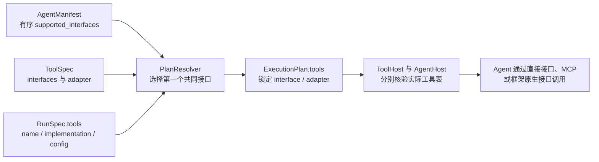

自定义 Agent 复用 UEnv 的工具描述和调用接口，或已支持框架的 MCP/原生接入，不逐个列出所有工具实现。新增一个已经支持 MCP 的工具，不需要更新 OpenHands 或 PlainAgent 的 manifest。只有引入新工具接口、未支持的框架或特殊交互语义时，才需补一次接口适配代码。OpenHands 自带工具可以保留原生实现，在 ToolSpec 中声明 `openhands_native.v1`；不必全部改成 MCP。

**怎么管。**数据集包可用 `PackageManifest.provided_tools` 登记 ToolSpec，独立工具包直接发布同一 ToolSpec；这不是默认启用列表。所有模型可见工具，包括 Agent 自带工具，都必须进入用户的 `RunSpec.tools` 选择。AgentManifest.required_tool_names 只列框架不可缺少的内置工具名，不是逐工具兼容清单；空数组表示没有必需工具。UEnv 校验后形成唯一的 `ExecutionPlan.tools`，执行时只读这张表；缺必要工具、重名或不兼容就报错，`tools=[]` 表示没有工具。运行配置 config 与每次调用参数 arguments 分开，不能互相覆盖。

所有入口执行相同的平台安全底线、预算、超时和取消规则；Rust ToolGateway 根据 ExecutionPlan.tools 做权威检查。操作文件或命令时使用当前任务的 Backend 会话，操作环境状态时调用当前 Environment，外部服务通过受管的专用连接访问。Python SDK/MCP 适配层只负责格式转换，不能增加工具或重置预算。只操作 Agent 会话状态的工具可以留在 Agent 进程，但仍需向 Rust Worker 登记调用和结果。选择一个工具只表示允许调用该工具接口，不会给 Agent 开放宿主目录或私有评分材料。`internet_access` 只控制任务 Backend session 的通用公网；`external_service` 工具的已选连接只开放该特定服务，不给 session 打开公网，也不产生第二个 internet_access。

UEnv 管理 MCP 连接及其生命周期，只开放获准工具，不要求用户重复填写自动启动的服务地址。每次调用只计数一次，用 ToolCall/ToolResult 记录参数、结果或错误，并关联实际模型调用；超时和取消也要记录，崩溃导致缺失时标明轨迹不完整。工具格式转换不改写真实模型消息和训练 token。

### 4.2 轨迹：谁记录、记录什么、如何保存

**一句话定义：轨迹是一次 attempt 中已经发生事实的有序事件流，由 Rust Worker 记录；Agent、Environment、Tool 和 Scorer 只产生业务结果，不自行组装、排序、封存或上传轨迹。**评测与后训练读取同一条轨迹，不按数据集或 Agent 类型换格式。

#### 4.2.1 轨迹协议只有事件与索引两层

| 对象 | 作用 | 是否保存事件内容 |
|---|---|---|
| `TrajectoryEvent` | 表示已经发生的一件事 | 是，`kind` 决定 `payload` 的确定类型 |
| `TrajectoryManifest` | 标识一条 attempt 轨迹由哪些事件分片组成 | 否，只保存公开身份、分片引用、事件数量和清单状态 |

当前源码使用了三组含义重叠的轨迹结构：`proto/uenv/v1/episode.proto` 中的 `Trajectory`/`StepRecord`、`uenv-worker/src/swe/trajectory.rs` 中的 `TrajectoryBundle`/`StepTrace`，以及分别出现在 step 和 Agent 完成请求中的 `RolloutTrace`。迁移时统一把这些数据映射为 `TrajectoryEvent`；目标系统只用 `TrajectoryManifest` 索引事件分片，不再保留多套权威轨迹结构。读取端加载 `TrajectoryManifest`，校验每个 `ArtifactRef`，再按 `sequence` 合并 `event_segments` 中的事件。训练框架需要的 messages、token、logprob 和 mask 是从事件生成的版本化视图，不是另一份权威轨迹。

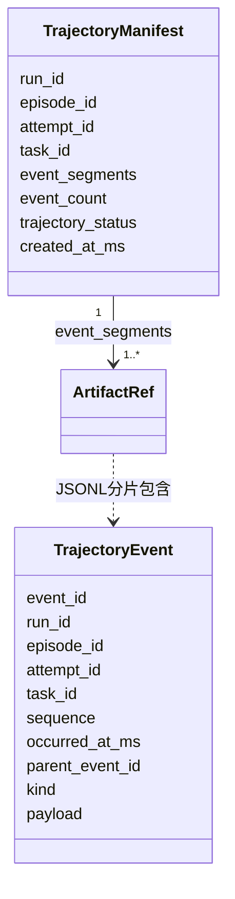

#### 4.2.2 所有 Agent 共用同一组事件

| `kind` | `payload` 类型 | 表示什么 |
|---|---|---|
| `state` | `StateEvent` | payload.phase 保存 preparing、running、scoring、finalizing、cleaning 等生命周期阶段；Outcome.state 只表示环境状态 |
| `observation` | `Observation` | Environment.reset 的初始观测，或不属于某次 Transition 的独立公开观测；step 后观测只在 transition 中保存 |
| `generation` | `GenerationEvent` | 一次真实模型调用的 messages、响应和实际 model_id；端点提供的版本、token、logprob、loss mask 原样保存，禁止重新 tokenize 冒充 |
| `tool_call` | `ToolCall` | 实际获准执行的工具名、实现、参数、超时以及关联的 `generation_id` |
| `tool_result` | `ToolResult` | 与 `tool_call_id` 配对的成功、失败、超时、取消和返回内容 |
| `environment_transition` | `EnvironmentTransition` | 动作前观测、动作和同一个 `Transition` 返回值 |
| `score` | `ScoreResult` | Rust 完成系统字段后的唯一最终评分；直接复用写入 `EpisodeResult.score` 的同一个值 |
| `error` | `ErrorRecord` | 执行、模型、工具、环境、评分或清理错误 |
| `terminal` | `TerminalEvent` | attempt 的执行状态、用量和可选错误摘要；交互结束原因只在最终 Outcome 中保存 |

`kind` 和 `payload` 必须匹配，不能把同一件事换一个字段名塞入 `extra`。PlainAgent、OpenHands 或以后接入的 Agent 的适配器只提供原生事件内容，由 Rust 入口生成上述事件；无法标准化但需要保留的原始响应使用 `ArtifactRef`，不能新增另一套顶层轨迹结构。

模型提出调用工具与工具实际执行是两个事实。`generation` 保存模型原始输出，`tool_call`/`tool_result` 保存受管执行；通过 `generation_id` 和 `tool_call_id` 关联，不用相同字段表达两个阶段。Environment 的动作结果只在 `Transition` 中定义一次，`EnvironmentTransition.transition` 保存其独立副本。

#### 4.2.3 写入路径

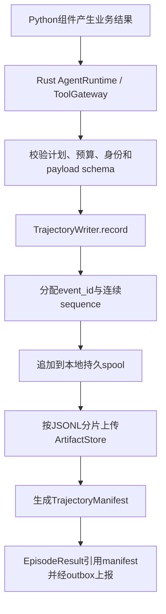

Python 组件不能直接设置 `event_id`、`sequence`、attempt 身份或时间戳。Rust `TrajectoryWriter` 从唯一 `ExecutionPlan` 复制 run/episode/attempt/task 身份；写入前验证 payload，递归禁止 `private_data`，并把大图片、文件、原生响应等内容改为受权限控制的 `ArtifactRef`。完整 `plan_digest` 留在受信 Server/Worker 执行记录中，不写入用户可读 manifest，避免低熵 private_data 被离线猜测。生产实现还必须按字段角色做允许列表和内容隔离，不能只依赖字段名扫描。

事件分片使用 UTF-8 JSONL，一行一个完整 `TrajectoryEvent`。**分片只依据序列化后的字节大小，不依据数据集、Agent、step 或事件类型。**第一版使用系统内部固定上限 4 MiB：加入下一条完整事件将超过上限时，关闭当前分片并开始下一个分片；一条事件不能跨分片。大内容必须先保存为 `ArtifactRef`，单条事件本身超过 4 MiB 时拒绝写入。这个上限属于 Worker 存储实现，不进入 `RunSpec`、数据集参数或用户配置。

同一个 attempt 只有一个 sequence 空间，所有分片按 `event_segments` 数组顺序排列，分片内部继续按 `sequence` 递增。`checkpoint()` 和最终 `seal()` 都必须把当时尚未成段的事件写成最后一个分片，因此评分可以读取一个完整的时间点快照。Worker 先逐事件写本地持久 spool，再按上述大小形成不可变分片。`checkpoint()` 返回前，其 manifest 引用的全部分片必须已经可读并通过摘要校验；只有尚未进入 manifest 的预上传可以异步。Server ACK 前不得删除唯一副本，上传重试不能改变事件内容、顺序或摘要。

#### 4.2.4 评分前快照与最终封存

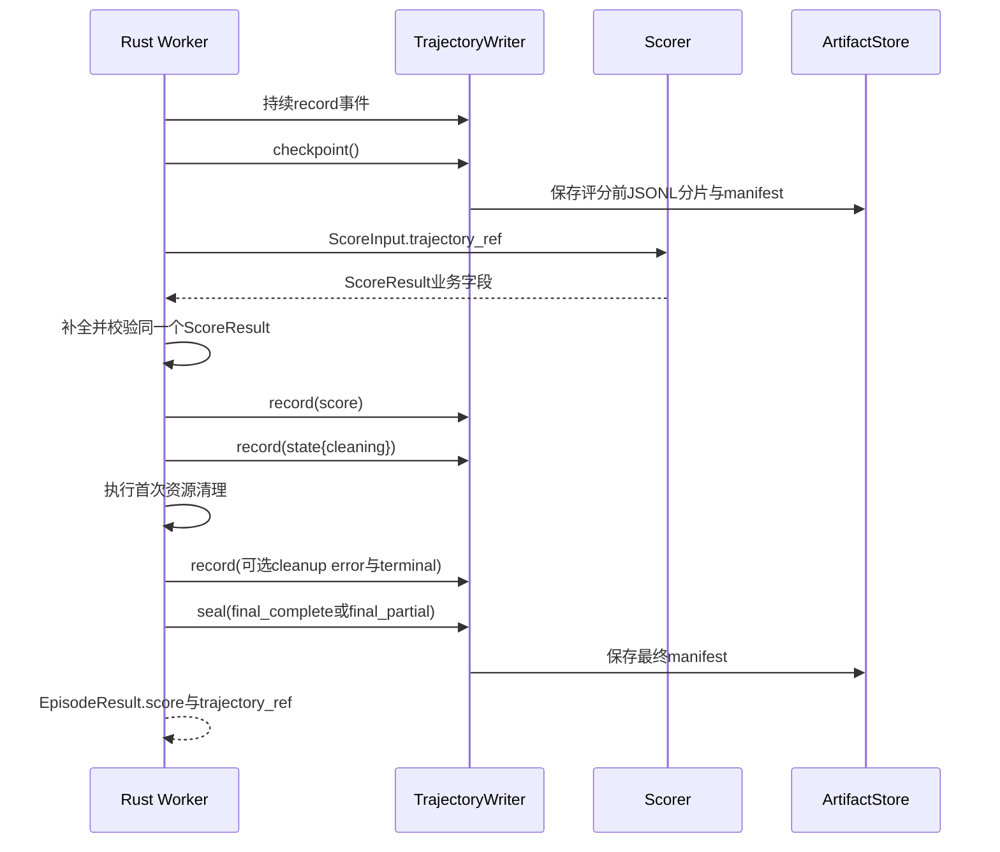

TrajectoryManifest 只用一个 `trajectory_status` 表达清单状态：`scoring_checkpoint` 是供本次 Scorer 读取的评分前快照；`final_complete` 是事件完整的最终轨迹；`final_partial` 是已知缺失事件的最终恢复结果。它不表达任务是否答对或执行是否成功。任务执行失败，但错误、首次清理和 terminal 均成功记录时仍为 final_complete；Worker 突然丢失导致事件缺口时才是 final_partial。Scorer 只读取 scoring_checkpoint，避免 score 事件包含自身输入。最终 manifest 再包含适用的 score、cleaning 状态、错误和 terminal 事件。

`EpisodeResult.score` 和 `score` 事件不得分别计算。Rust Supervisor 先形成一个不可变的 `ScoreResult`，把同一个值写入两处：前者方便查询最终结果，后者保留发生顺序。`terminal` 只保存终态摘要，不包含最终 `trajectory_ref`，从而避免 manifest 摘要引用自身。

#### 4.2.5 用户与读取端看到什么

数据集作者只实现 Observation、Transition、Outcome 和评分业务，不调用轨迹 API。普通用户从 `EpisodeResult.trajectory_ref` 加载最终 manifest；Scorer 从 `ScoreInput.trajectory_ref` 加载评分前 manifest；Trainer 读取 `generation` 事件中的真实模型数据并与同一个 `ScoreResult.reward` 配对。展示层可以裁剪或格式化派生视图，但不能覆写原始事件。

失败和取消也返回已经保存的部分或完整轨迹。读取端必须验证 ArtifactRef digest、事件身份一致、`event_count` 与实际保存事件数相符、kind/payload 匹配。完整轨迹的 sequence 从 0 连续；final_partial 允许已知缺口，但序号必须保持原值、唯一且递增，不能补写或重排成完整轨迹，也不能假定末尾存在 terminal。每次 attempt 的结果与轨迹按 `(episode_id, attempt_id)` 留存，Episode 的权威结果只指 Server 最终接纳的 attempt；训练只消费该 attempt，旧 attempt 仅供审计和诊断。历史 schema 通过 `schema_version` 选择显式迁移器，不在默认读取路径中同时猜测两套字段。

## 5. 完整执行流程及调用关系

### 5.0 先看一次任务的完整顺序

以下图描述目标流程，尚未表示生产代码已经按此执行。先按中文动作阅读；后面的小节把动作对应到类的方法。

```mermaid
sequenceDiagram
  participant U as Trainer / 评测用户
  participant B as Bridge
  participant S as Server
  participant W as Worker
  participant A as AgentRunner
  participant M as 模型服务
  participant Q as Python Scorer
  U->>B: 标准任务 + 运行配置
  B->>S: 提交任务
  S-->>B: 返回已接收凭据
  Note over B,S: 接收凭据不代表任务执行完成
  S->>S: 校验工具与能力，保存任务，排队
  S->>W: 派发任务、固定配置、租约
  W->>W: 准备环境与工具，记录初始状态
  W->>A: run(任务可见上下文)
  loop 直到回答完成、环境结束或预算耗尽
    A->>W: generate(messages)
    W->>M: 使用计划中的模型请求生成
    M-->>W: 原始生成结果
    W-->>A: 已校验并记录的结果
    opt 本次 generation 请求了工具
      A->>W: 受控工具执行请求
      W-->>A: 工具结果
    end
  end
  A-->>W: Outcome：回答或候选产物
  W->>W: 撤销 Agent 写能力，冻结产物，保存评分前轨迹
  W->>Q: score(冻结产物、私有材料、评分前轨迹)
  Q-->>W: ScoreResult
  W->>W: 记录 cleaning 并执行首次资源清理
  W->>W: 写清理结果和 terminal，封存最终轨迹
  W->>W: 将 EpisodeResult 写入 durable outbox
  W->>S: 上报结果与轨迹引用
  S->>S: 校验 attempt，提交唯一最终状态
  S-->>W: ACK
  S-->>B: 通过订阅或查询返回结果
  B-->>U: 评测结果或可训练样本
  Note over W: 清理不等待 Server ACK；后续清理重试不改变 score
```

这张图省略了进程间转发及内部状态工具。Worker 一列是 Rust Supervisor：它强制环境准备、冻结、评分和清理的外层顺序；模型决策循环只存在于 Python AgentRunner/SDK。各 AgentRunner 使用相同外层顺序，不经过独立 Agent 池分配。

### 5.0.1 Worker 内谁调用谁

```mermaid
flowchart TB
  RPC[Rust WorkerRpc.start：接收 DispatchRequest] --> GUARD[validate_dispatch：核验 lease、重复派发、摘要和剩余预算]
  GUARD --> SUP[Rust EpisodeSupervisor：执行已授权 attempt]
  SUP --> BACKEND[Rust Backend.open：创建本次 session]
  BACKEND --> ENVHOST[EnvironmentHost.prepare：绑定 Environment 与 session]
  ENVHOST --> TOOLHOST[ToolHost.prepare：绑定唯一工具表]
  TOOLHOST --> ROUTE[核验实际可路由工具 = ExecutionPlan.tools]
  ROUTE --> AGENTHOST[AgentHost.prepare：初始化 Agent SDK]
  AGENTHOST --> CHECK[核验实际模型可见工具 = ExecutionPlan.tools]
  CHECK --> ENV[Environment.reset：准备初始状态]
  ENV --> AG[Python AgentRunner.run：执行交互循环]
  AG --> EVENTS[Rust TrajectoryWriter：接收并排序真实事件]
  AG --> FINAL[Environment.finalize：返回最终候选产物]
  FINAL --> TF[ToolHost.freeze：拒绝迟到工具调用]
  TF --> FREEZE[Backend.freeze：固定只读评分视图]
  FREEZE --> PRE[Rust TrajectoryWriter：保存评分前快照]
  PRE --> SCORE[受管 Python Scorer：计算业务评分字段]
  SCORE --> VALIDATE[Rust Worker：补全并校验 ScoreResult]
  VALIDATE --> CLEAN[Rust EpisodeScope：按 Scorer→Agent→Tool→Environment→Backend 清理]
  CLEAN --> TERMINAL[Rust TrajectoryWriter：写 terminal 并封存最终轨迹]
  TERMINAL --> REPORT[Rust ResultReporter：持久化并上报结果]
  ENV -.->|失败、取消、超时| ERR[保存错误和已有轨迹]
  CHECK -.->|配置不兼容| ERR
  AG -.->|失败、取消、超时| ERR
  SCORE -.->|评分异常| ERR
  ERR --> CLEAN
```

清理和上报是两个可恢复的工作：首次清理必须在最终 terminal、manifest 与 EpisodeResult 形成前完成一次，因此 cleanup_status 有确定值；网络不通时保留待上报记录，不能因等待 ACK 一直占用容器。清理固定为 ScorerHost → AgentHost → ToolHost → EnvironmentHost → Backend；每个 close 都必须幂等，一步失败也继续关闭后续资源。清理失败进入有限重试队列，后续重试只更新资源清理记录，不改不可变 score、轨迹或已接纳终态。示意图中的异常出口代表所有阶段的统一错误处理，不是只处理画出的几种错误。

### 5.0.2 单轮问答与仓库修复如何使用相同流程

| 阶段 | 数学单轮示例 | 仓库修复示例 |
|---|---|---|
| 准备 | Environment 提供题目 | Environment 准备指定提交的仓库 |
| 调用 Agent | PlainAgent，max_generations=1，tools=[] | OpenHands 或带工具的 PlainAgent，多次生成预算 |
| 交互 | 模型返回答案 | 模型多次读取、编辑、测试代码 |
| 冻结 | 保存原始答案 | 保存候选补丁和基础仓库身份 |
| 评分 | Python Scorer 比较答案 | Python Scorer 请求 Worker 在评分工作区执行测试 |
| 完成 | 相同的 ScoreResult、轨迹和上报协议 | 相同的 ScoreResult、轨迹和上报协议 |

差异来自已选择的扩展实现和预算，调度器不出现 `if dataset == swe`。一次工具调用不一定对应一次 Environment.step：操作沙箱的工具已经执行了修改，不能再由 Environment.step 重复修改；状态型环境则由其工具将一个明确动作转交 Environment.step。

### 5.1 发布与准备阶段

**先选择代码包，再准备本次样本。发布代码包、发布数据、提交任务是三个不同操作，不要求每次运行都重新发布。**存储格式和权限遵循第 3.4 节。

```mermaid
flowchart TB
  subgraph PACKAGE[代码包准备：只在新增或修改代码时发布]
    AUTHOR[编写 Adapter、Environment、Scorer<br/>工具按需添加] --> VALIDATE[PackageValidator<br/>校验入口、schema、Python 安装依赖<br/>执行工具自带契约检查；作者测试按需提供]
    VALIDATE --> PUBLISH[HubClient.publish_package<br/>发布固定代码版本和 digest]
    PUBLISH --> SELECT[RunSpec 的 environment / scorer<br/>分别引用精确包版本]
    EXISTING[已有代码包] --> SELECT
  end
  subgraph DATA[样本准备：本次选择一个来源]
    SOURCE{用户选择样本来源}
    SOURCE -->|自带原始样本| RAW[受管理的 Adapter.normalize]
    RAW --> PREP[prepare 生成 TaskSpec<br/>配对可选 private_data，固定数据身份]
    SOURCE -->|自带标准化样本| LOCAL[读取本地 JSONL<br/>每行 task 与可选 private_data]
    SOURCE -->|Hub 样本| HUB[按 dataset 固定 revision<br/>及样本选择读取 JSONL 对应行]
    PREP --> CHECK[统一校验 schema、身份、材料配对<br/>及资源引用；不混合覆盖不同来源]
    LOCAL --> CHECK
    HUB --> CHECK
  end
  SELECT -->|提供转换入口和字段规范| DATA
  CHECK --> READY[标准化样本就绪<br/>可保存为不含运行配置的 JSONL]
  READY -->|可选：发布数据| SAVE[Hub 保存独立数据 revision<br/>登记文件、样本索引和访问权限]
  READY --> BUILD[Bridge 组装 EpisodeRequest]
  RUN[RunSpec：本次 Agent、后端、模型<br/>工具、Scorer、作业用途和预算] --> BUILD
  BUILD --> SUBMIT[按第 5.2 节提交任务]
```

1. **注册包，再选择角色。**已有包直接使用精确版本；新增或修改实现时才校验、发布新代码版本。发布服务把数据集 PackageManifest 的 Adapter/Environment/Scorer 入口、角色配置 schema、任务 schema 和运行要求登记到组件目录；独立 Agent 和工具分别登记 AgentManifest、ToolSpec。运行时没有独立的 `package` 选择字段：用户只填写 `RunSpec.environment` 和 `RunSpec.scorer`。两者通常引用同一个数据集包，系统按角色取得其中不同的 Environment/Scorer 类；包内声明不替用户选择 Agent 或 Backend。图中校验失败均直接报错，不进入发布或提交。
2. **确定样本来源。**用户自带原始数据时调用 Adapter，再由 prepare 构建 task/private_data；自带标准化 JSONL 或使用 Hub 已有样本时直接读取和校验，不重复转换。Hub 输入包含固定数据版本与样本选择，不能同时带另一份内容要求覆盖。
3. **得到可复用数据。**标准化样本使用同一个 task/private_data 结构；prepare 负责固定身份、摘要和引用。文件不包含 run_id、episode_id 或执行配置，训练和评测可复用，私有材料不进入 Agent 可见的 TaskSpec。
4. **按需发布数据。**可保留本地使用，也可独立发布到 Hub；发布前固定数据 revision、文件 digest 和读取权限，再登记索引。代码不变时无需重新发包，数据内容改变时不能覆盖旧 revision。数据发布本身不启动任务。
5. **提交本次任务。**Bridge 将准备好的样本与 RunSpec 组合，生成本次请求身份并提交。Server 和 Worker 接收相同的标准结构，Worker 不再从另一个 catalog 补齐或替换题目。Hub API 与准备入口的实现差异见第 13.2 节。

### 5.2 Bridge 内部

```mermaid
flowchart TB
  CLIENT[VerlAdapter.run_batch<br/>或 UEnvClient.submit_batch] --> BRIDGE[BridgeService.submit_batch]
  INPUT[TaskSpec、RunSpec、可选 private_data] --> BUILD[build_episode_request / build_batch_request<br/>建立请求与样本身份]
  BRIDGE --> BUILD
  BUILD --> CHECK{请求契约校验通过？}
  CHECK -->|否| ERROR[返回输入错误]
  CHECK -->|是| SUBMIT[EpisodeClient.submit_batch → Server]
  SUBMIT --> COLLECT[ResultCollector.collect<br/>订阅或查询结果，按身份对齐]
  COLLECT --> TRACE[TraceLoader.load<br/>读取对应轨迹]
  TRACE --> PURPOSE{运行用途}
  PURPOSE -->|评测| EVAL[返回评测结果与轨迹]
  PURPOSE -->|训练| TRAIN[TrainingSampleBuilder.build<br/>检查训练数据完整性与版本]
  TRAIN --> OUTPUT[VerlAdapter.to_framework_output<br/>交给 Trainer]
```

图中是任务提交与结果返回。训练时模型调用的完整路径是 `Agent → Worker AgentRuntime/ModelProvider → ModelGateway → Trainer 推理服务`；评测则由同一个 Worker ModelProvider 连接外部模型端点。Bridge 的提交函数不生成回答；同步或异步只改变等待、消费结果的方式。

`VerlAdapter.run_batch()` 或 `UEnvClient.submit_batch()` -> `BridgeService.submit_batch()` -> `build_batch_request()` -> 生成契约校验 -> `EpisodeClient.submit_batch()`。

build_episode_request/build_batch_request 函数接收已标准化的公开 TaskSpec、RunSpec 及可选 private_data。每个 EpisodeRequest 生成自己的 request_id 和 episode_id；整批只生成一个 batch_id，各项复用该 batch_id 并用 sample_index 定位。BatchRequest 不再另设同名 request_id，BatchReceipt 原样返回 batch_id。评分依据只进入 EpisodeRequest.private_data，不能混入 TaskSpec.input。不从多个旧字段猜测 question/answer，不判断 SWE/Code。旧字段转换只在 LegacyRequestAdapter。

用户自带数据与 Hub 数据均先按第 3.4 节在准备入口确定唯一内容来源，到上述函数时已是相同的 task/private_data；Server 和 Worker 不再分别补齐同一份样本字段。

训练模型由 Trainer 提供时，`ModelGateway` 暴露统一模型端点，实际转发到框架推理服务，并保留真实 token/logprobs/版本；Worker 的 ModelProvider 是唯一调用者。评测配置外部模型端点时，也由 Worker ModelProvider 发起连接，Agent 不绕过 Worker 直连。ModelGateway 不访问评分材料，不执行奖励计算。

结果返回后：`ResultCollector.collect()` -> `TraceLoader.load()` -> `TrainingSampleBuilder.build()` -> `VerlAdapter.to_framework_output()`。按 request/episode identity 对齐结果，不能只依赖返回顺序。同步在批次边界等待，异步按准备好的结果交给 Trainer；取消与停止消费分开。

### 5.3 Server 内部

```mermaid
flowchart TB
  RPC[EpisodeRpc.submit_batch] --> SERVICE[EpisodeService.submit<br/>校验请求及幂等内容]
  SERVICE --> EXIST{同一幂等键是否已存在？}
  EXIST -->|内容不同| CONFLICT[返回 CONFLICT]
  EXIST -->|内容相同| ORIGINAL[返回原任务状态]
  EXIST -->|不存在| PLAN[PlanResolver.resolve<br/>校验兼容性，锁定唯一 ExecutionPlan]
  PLAN --> SAVE[EpisodeRepository.create<br/>事务持久化并保证幂等]
  SAVE --> ADMIT[AdmissionController.acquire<br/>按队列及并发上限接纳]
  ADMIT --> PLACE[PlacementScheduler.reserve<br/>选择满足能力和资源要求的 Worker]
  REGISTRY[WorkerRegistry<br/>能力与资源快照] --> PLACE
  PLACE --> LEASE[LeaseService.issue<br/>生成 lease_id、epoch、expires_at_ms、token]
  LEASE --> DISPATCH[DispatchClient.start → Worker]
  DISPATCH --> EVENTS[ProgressIngestor<br/>接收可丢失的只读进度投影]
  DISPATCH --> RESULT[EpisodeCoordinator.accept_result<br/>接收 Worker 最终结果]
  RESULT --> TX[同一事务内核验 attempt 和 lease<br/>校验结果、提交终态、写通知 outbox]
  TX --> PUBLISH[ResultPublisher<br/>重试通知 Bridge，直至成功]
```

计划不合法时直接拒绝；无可用容量时按接纳与排队规则等待。结果事务会识别重复报告及过期 attempt，避免重复计分或覆盖当前结果；过程事件不直接替代权威终态。

`EpisodeRpc.submit_batch()` -> `EpisodeService.submit()`：

1. `validate_request()` 校验协议、RunSpec 与任务 schema；EpisodeService 在仓库事务中比较幂等内容，同 idempotency key 内容不同返回 CONFLICT。
2. `PlanResolver.resolve()` 将请求和配置转换为 ExecutionPlan，以 Server 首次接纳时间和 limits.total_timeout_ms 生成唯一 deadline_at_ms，锁定所有明确选择组件的版本/digest，验证角色与 schema，生成唯一的 tools 表并汇总 required_capabilities。它只沿 `RunSpec.environment/scorer/...` 已选引用读取可信组件目录，不接收独立 PackageManifest 或某个 Worker 的 capabilities，也不在 Server 加载用户 Python 代码。Placement 在下一步根据计划要求选择 Worker。明确指定的实现不可无声回退；Worker 初始化 Environment、工具路由和 Agent SDK 后，在 `Environment.reset` 前分别核验可路由工具与模型可见工具。
3. `EpisodeRepository.create()` 持久化任务；重复请求返回原任务状态。
4. `AdmissionController.acquire()` 实施队列与并发上限。
5. `WorkerRegistry` 提供能力/资源快照；`WorkerRegistration.components` 是 Environment、Agent、Scorer、Tool、Backend 等所有已安装可执行组件的唯一清单，不再另设 `backends` 清单。`capabilities` 表示 Worker 能提供的运行能力；`capacity` 是总并发 episode 槽位，Heartbeat.available_slots 是当前剩余槽位；`resource_capacity` 是 CPU/内存/存储总量，单 episode 的资源申请只来自 `BackendSpec.resources`。`PlacementScheduler.reserve()` 同时核验计划锁定组件、required_capabilities、槽位和当前资源余量。
6. `LeaseService.issue()` 只为本次 attempt 生成 lease_id、epoch、expires_at_ms 与 token；token 将结果绑定到该租约且不得进入组件或公开轨迹。LeaseService 不生成或延长 episode deadline。`DispatchClient.start()` 发送统一 DispatchRequest，其中 remaining_timeout_ms 是根据 plan.deadline_at_ms 在派发时计算的只减上限，consumed_usage 是此前 attempt 已确认的累计用量。
7. `ProgressIngestor` 只接收可丢失的进度投影，不分配轨迹 sequence、修改事件或形成第二份轨迹存储；`EpisodeCoordinator.accept_result()` 校验结果结构和轨迹引用，并在同一仓库事务中核验当前 attempt/lease、更新权威终态及写结果通知 outbox，避免校验后状态发生变化。
8. 事务成功后 `ResultPublisher` 重试发布通知。重复报告只 ACK，不重复计分或释放名额；过期 attempt 不能覆盖当前结果。

Server 不创建 SWE session，不准备测试 patch，不解析 pytest，不调用 Agent 工具。失联与执行失败由 EpisodeCoordinator 按保存的 `RunSpec.retry`、错误分类及当前 attempt/lease 状态统一决定是否重试，不再定义另一种 AttemptPolicy。

### 5.4 Worker 内部

```mermaid
flowchart TB
  subgraph WORKER[Rust Worker：权威执行控制]
    RPC[WorkerRpc.start → validate_dispatch<br/>核验租约、预算、digest 和重复派发] --> SUP[EpisodeSupervisor.execute dispatch<br/>唯一 attempt 状态机]
    SUP --> PKG[PackageService.ensure<br/>准备锁定版本]
    PKG --> BACKEND[SessionManager + Backend.open<br/>创建唯一 session]
    BACKEND --> EHOST[EnvironmentHost.prepare<br/>加载 Environment 并绑定 session]
    EHOST --> TOOLS[ToolHost.prepare<br/>绑定工具并返回可路由表]
    TOOLS --> ROUTE[核验可路由表 = ExecutionPlan.tools]
    ROUTE --> AHOST[AgentHost.prepare<br/>初始化 Agent SDK 并返回模型可见表]
    AHOST --> VISIBLE[核验模型可见表 = ExecutionPlan.tools]
    SUP --> BUDGET[AgentRuntime + BudgetEnforcer<br/>在副作用前强制截止时间与计数]
    SUP --> TRACE[TrajectoryWriter<br/>排序、校验、快照和封存]
    SUP -.->|监控取消、超时或崩溃| STOP[终止子进程/后端操作<br/>保存错误与部分轨迹]
  end
  subgraph PYTHON[同一 ComponentHost 协议的两个 Python 进程实例]
    ALOAD[Agent Host<br/>加载 AgentRunner 并初始化 SDK]
    ELOAD[Environment Host<br/>加载 Environment 与 sandbox Python 工具]
    RESET[Environment.reset]
    AGENT[AgentRunner.run<br/>通过受控 Runtime 产生交互结果]
    FINAL[Environment.finalize<br/>收集最终 Outcome]
    ALOAD --> RESET
    ELOAD --> RESET
    RESET --> AGENT
    AGENT --> FINAL
  end
  subgraph SCORING[受管 Python 评分进程]
    SCORE[Scorer.score<br/>只计算 success/metrics/reward/evidence]
  end
  AHOST --> ALOAD
  EHOST --> ELOAD
  VISIBLE --> RESET
  AGENT -->|模型、工具、环境动作申请| BUDGET
  BUDGET -->|已准入工具调用| TOOLS
  BUDGET -->|校验后的真实事件| TRACE
  FINAL -->|最终 Outcome| SUP
  SUP --> TF[ToolHost.freeze<br/>拒绝迟到工具请求]
  TF --> BF[Backend.freeze<br/>固定只读评分视图]
  BF -->|checkpoint 后的唯一 ScoreInput| SCORE
  SCORE -->|业务字段| SUP
  SUP -->|补全并校验 ScoreResult| TRACE
  TRACE --> CLEAN[EpisodeScope.finish<br/>Scorer→Agent→Tool→Environment→Backend]
  STOP --> CLEAN
  CLEAN --> TERMINAL[记录清理结果与 terminal<br/>封存最终轨迹]
  TERMINAL --> STORE[DurableOutbox<br/>持久化待上报 EpisodeResult]
  STORE --> REPORT[ResultReporter<br/>重传直到 Server ACK]
```

EpisodeSupervisor 是唯一外层生命周期。同一个 `ComponentHostProcess`/IPC 实现按 role 启动 Agent 和 Environment 两个进程实例；前者不进入任务容器，后者随 Backend session 放置并承载 sandbox Python 工具。Scorer 进程单独持有私有材料。三者都不能创建另一套 attempt、重选后端、修改预算、封存轨迹或上报终态。各阶段失败进入统一 Rust 错误处理；清理不等待 Server ACK，进程异常退出时由 Worker 的进程监管和启动恢复处理。持久 spool/outbox 与真实进程回收仍属于生产待实现，不由本地内存 mock 证明。

`WorkerRpc.start()` -> `validate_dispatch()` -> `EpisodeSupervisor.execute()`：

1. 目标 `WorkerRpc.validate_dispatch()` 核验 lease_id/epoch/expires_at_ms/token、plan digest、remaining_timeout_ms、consumed_usage、槽位和重复派发；同一有效派发连接原 attempt，过期或冲突派发拒绝。它通过后才调用 Supervisor。本地 Rust 参考没有真实 Worker RPC、lease token 校验或持久 replay 账本，`EpisodeSupervisor.execute()` 假定派发已授权，只检查请求形状、摘要和预算。
2. `PackageService.ensure()` 按计划的精确版本准备扩展及资源；它通过注入的 `PackageCache` 读取缓存，缺失时按第 3.4 节从 Hub/文件存储获取并核对 digest，不临时重解析 latest，也不再次按 sample_id 从另一份目录替换任务内容。
3. 准备可信组件目录、模型连接器与 Worker 资源操作端口；此处不提前创建另一份任务 session，也不重新选择执行配置。
4. Rust `SessionManager` 按唯一 plan 调用选定 `Backend.open(backend, runtime, internet_access, remaining_ms)`，创建本次 session；Backend 不接收 Environment 对象或工具表，也不按 Environment 或数据集名称分派。Docker/Podman 必须使用计划确切镜像，QA 也在所选容器中运行；Process 使用计划指定的本机运行配置。非法输入不创建资源，创建后的异常统一清理。
5. EnvironmentHost 先按 package 的 environment config schema 校验 `plan.environment.config`，把唯一 `config.data` 传给 Environment 构造函数，并绑定必填 session。随后 `ToolHost.prepare(plan.tools, session, remaining_ms)` 绑定工具并返回实际可路由表；Rust 要求它与 ExecutionPlan.tools 一致。再由 `AgentHost.prepare(plan.agent, plan.tools, remaining_ms)` 按相同约定初始化 Agent SDK，并返回实际模型可见表；Rust 同样要求它与 ExecutionPlan.tools 一致。Scorer 与 ToolExecutor 构造也使用各自已校验的唯一 config.data。两个工具返回表只是运行时核验结果，不是两份生效配置。
6. Agent 实例只获得公开 TaskSpec 与受控 AgentContext，Environment 实例只获得锁定 Environment、sandbox 工具和当前 session 的 EnvironmentContext。命令不传完整 ExecutionPlan，也不携带另一份后端、模型、工具或超时覆盖字段。两次工具核验成功后才执行 `Environment.reset()`，再调用一次 `AgentRunner.run()`；PlainAgent 无工具单轮也走相同顺序。
7. Agent 的模型、工具和环境操作通过 SDK 适配层请求 Rust Worker。`BudgetEnforcer` 与 `ToolGateway` 做权威计数和准入，`TrajectoryWriter` 接收真实模型、工具、动作与观测事件；Python 不分配最终事件序号，也不能自行封存或删除轨迹。
8. Environment host 调用 `Environment.finalize()` 后将最终 Outcome 返回 Rust Supervisor。Supervisor 用评分剩余预算依次调用 `ToolHost.freeze(remaining_ms)` 拒绝新的工具请求，再调用 `Backend.freeze(remaining_ms)` 固定只读评分视图；之后才允许生成 scoring checkpoint。正式测试基于冻结候选建立评分工作区，私有测试不写回 Agent 工作区。
9. Rust `TrajectoryWriter` 保存评分前快照；Supervisor 只把唯一 ScoreInput 和获准材料交给 ExecutionPlan.scorer 指定的 Python Scorer。Scorer 返回业务字段后，Rust 补全 status/scorer/error 并执行数值、身份和跨字段校验。生产边界还必须执行完整 JSON Schema；本地 Rust `validate_shape` 只有浅层字段检查。ScoreInput.trajectory_ref 指向评分前快照；评测汇总与后训练复用同一个 ScoreResult。
10. Rust `EpisodeScope.finish()` 固定按 ScorerHost → AgentHost → ToolHost → EnvironmentHost → Backend 完成首次关闭；各端口 close 必须幂等，一步失败仍继续关闭后续资源。异常或取消触发同一路径。清理失败写入 cleanup 错误并进入有限重试队列，不把不干净实例放回复用池。
11. Rust 写 terminal 并调用 `TrajectoryWriter.seal()`；writer 一旦发现事件或 checkpoint 写入失败，就自动形成 final_partial，否则形成 final_complete。随后目标 Worker 把 EpisodeResult 写入 durable outbox，由 `ResultReporter.report()` 重传直到 Server ACK。当前本地参考只实现内存 writer/reporter，没有持久 spool/outbox。后续清理重试不修改已形成的 score、manifest 或 EpisodeResult.cleanup_status。

通用 Agent 实现维护 messages 和显式上下文策略；当前参考 PlainAgent 为单轮实现。OpenHandsAdapter 调用 SDK Conversation.run 并转换其事件；不在 Worker 再套一次 generation 循环。SDK 自己的 iteration 计数仅作为额外限制，统一模型/工具预算由 Rust AgentRuntime 在实际调用前强制执行。

### 5.5 异常与取消

任务答错：执行 completed，评分 ok，success=false，reward=0。评分器崩溃：评分 error，success=null，reward=null，不能伪装答错。未产生可训练 token 的结果不可进入训练。

总预算从 Server 首次接纳开始，包括排队、准备、交互及最终评分。Agent 的可用时间减去 score_reserve_ms；预留时间供 finalize 收集结果、freeze 固定评分视图及最终 Scorer 共用，不在进入评分时重新计时。所有阶段预算取剩余预算以内。ExecutionPlan 的 deadline_at_ms 是 Server 的唯一绝对截止时间；Server 派发时从它派生只减的 remaining_timeout_ms。Worker RPC 核验该值没有被放大，Supervisor 随后只用“本机单调时钟当前值 + remaining_timeout_ms”建立运行截止时间，不再用本机墙上时钟重算 deadline。Usage 表示 episode 截至当前 attempt 的累计用量，重试通过 consumed_usage 恢复，不能清零。

取消：Server 持久化取消意图 -> Worker 中止 Agent 和正在执行的工具/harness -> 保存已有轨迹 -> 执行首次清理 -> 写 terminal 并封存 -> ACK。EpisodeResult.cleanup_status 记录形成结果时的首次清理结论；失败后的有限清理重试只供运维查询，不回写 score 或覆盖已接纳终态。迟到结果不能覆盖取消终态。

`Scorer.score()` 可以在评分器单元测试、规则对齐测试中直接调用，但返回的只是业务字段，不是正式 EpisodeResult。需要验证系统字段补全，可运行 Rust `run_score` 测试；需要形成正式训练或评测结果，必须提交 episode 并走完整链路。

## 6. 后端设计

每次尝试由一个后端实例管理，close() 释放其资源。统一基础协议：`open(backend, runtime, internet_access, remaining_timeout_ms) -> SessionRef`、`execute(ExecRequest) -> ExecResult`、`read_file`、`write_file`、`cancel_operation`、`freeze(remaining_timeout_ms)`、`run_harness(HarnessRequest) -> HarnessResult`、`close`、`inspect`。工具表只交给 ToolHost，Backend 不据此增删工具。进入评分前，Supervisor 先撤销 Agent/session 写能力并验证 Outcome 中的 ArtifactRef 已不可变；`run_harness` 必须据此创建 Agent 不可访问的评分视图，私有材料只进入该视图。SnapshotBackend 是可选的恢复优化，不承担正式评分冻结语义。

| 实现 | 提供的任务运行方式 | 不能假定的能力 |
|---|---|---|
| ProcessBackend | 在管理员配置的运行账户/依赖环境中创建工作区与进程组 | 不能宣称与容器等价隔离；不能直接消费任意 OCI 镜像 |
| DockerBackend | Docker engine 创建并管理任务容器 | 不假定容器具有任意宿主目录或网络权限 |
| PodmanBackend | Podman 创建并管理任务容器，可按部署配置使用 rootless | 不假定所有 Docker 专有参数都兼容 |

后端选择与环境需要的运行内容不同：`backend=podman` 指定谁创建资源；`image=...@sha256` 指定运行依赖内容。环境包可以声明兼容的镜像/依赖要求，但不能写“遇到 swe 必须选 docker”。Process 若有等价、受验证的 runtime profile，可以运行需要 exec/filesystem 的任务；只有镜像而没有本机依赖方案时，Process 组合在计划阶段明确失败。

不保留 `Backend.kind()` 和 `SweSessionBackend` 两套并行权威接口。抽出 SWE CLI container 的底层操作，去掉 Swe 名称和业务类型，接入统一 backend registry。插件进程启动能力保留为 Rust ComponentHostProcess/ScorerHostProcess，避免再称为同一种业务后端。

评分使用本次 ExecutionPlan 已锁定的后端和兼容运行资源，并通过同一 `run_harness` 入口采用隔离的评分工作区/权限视图。第一版不提供第二个评分后端配置来源，也不允许 scorer 私自执行本机 subprocess 或切换后端。纯文本 Scorer 不调用 run_harness；代码类 Scorer 通过 ScoringContext 请求它。

### 6.0 Environment 与 Backend 的关系

Environment 定义任务规则，例如如何生成初始 Observation、如何处理 Action、如何产生 Transition，以及结束时收集什么 Outcome。Backend 提供运行位置和资源，例如进程、容器、工作目录、文件与命令执行。Backend 不是 Environment 的父类，Environment 也不持有 Backend 类型或配置；Rust EpisodeSupervisor 创建本次会话后，把受控会话能力交给 Python EnvironmentContext，从而组合二者。

```mermaid
flowchart LR
  P[ExecutionPlan<br/>分别锁定 Environment 和 Backend] --> B[Backend.open<br/>创建唯一 Session]
  P --> L[组件加载器<br/>加载唯一 Environment]
  B --> C[EnvironmentContext<br/>绑定本次 Session 的统一操作]
  L --> E[Environment.reset / step / finalize]
  C --> E
```

同一个 Environment 类可以与 ProcessBackend、DockerBackend 或 PodmanBackend 组合，数据集作者不编写 `Gsm8kDockerAdapter`、`Gsm8kPodmanAdapter`、`SweProcessAdapter` 这类组合适配器。DatasetAdapter 只转换源数据，也不承担后端适配。每种 Backend 由平台实现一次统一接口，所有 Environment 复用。

组合成立仍需满足运行条件：所选 Backend 必须提供 Environment 和工具所需能力，运行依赖必须存在，并满足固定安全底线及 `internet_access`。不满足时由 Server 在计划或 Worker 准备阶段返回明确的不兼容错误；不能让用户编写组合适配，不能按数据集名称偷偷改后端，也不能回退到另一执行路径。

Environment 的 Python 代码由受管 ComponentHost 调用。Rust Worker 对所有数据集使用同一套 host 协议：ProcessBackend 在本机受管 session 中启动 Environment 实例，Docker/Podman 在任务容器 session 中启动或代理该实例；sandbox Python 工具与它共享 session。AgentRunner 由同一 ComponentHostProcess 实现启动为 Worker 侧的另一个角色实例，不进入任务容器。这个平台桥接按 Backend 实现一次，不为每个数据集或每种 Environment × Backend 组合增加代码。Backend 公共接口因此不提供 `bind_environment(environment, session)`；它只创建和操作 Session。

当前源码还没有实现这项通用组合：普通插件清单仍通过 `supported_backends` 偏向 process，SWE 另走 `SweSessionBackend`。这正是重构对象，不能把当前限制写成目标接口。当前插件 Process 检查（生产源码 `uenv-worker/src/plugin/host.rs:188`） · 当前 SWE 后端分支（生产源码 `uenv-worker/src/runtime.rs:336`） · 当前独立 SWE 后端协议（生产源码 `uenv-worker/src/swe/backend/mod.rs:91`）

### 6.0.1 访问控制：Environment 包只声明是否需要互联网

数据集作者只需回答一个容易判断的问题：这个 Environment 是否需要访问公共互联网。运行用户选择 Environment，不再填写第二个网络开关。任务怎样创建进程或容器、怎样隔离文件和权限，都不进入 UEnv 用户协议，由 Backend 按平台固定规则实现。

平台安全底线包括：任务资源不能读取 `private_data`、隐藏测试、评分工作区、Worker 凭据或容器引擎 socket；不能获得未声明的宿主挂载；不同 episode 的工作区和进程互相隔离；评分在 Agent 不可继续修改的隔离视图中执行。Backend 无论采用 Process、Docker 或 Podman，都必须满足这些规则。做不到就拒绝任务，不能让用户通过配置降低底线。

环境包只有一个 boolean 字段：

| 字段值 | 用户看到的含义 | 平台行为 |
|---|---|---|
| `internet_access: false` | 环境不需要访问公共互联网 | Backend 禁止任务访问公共互联网；内部控制通道不属于公共互联网 |
| `internet_access: true` | 环境确实需要访问公共互联网 | 发布时审核；运行时只通过平台受控出口访问，仍禁止宿主机、内网和评分私有资源 |

`internet_access` 属于 **Environment 的运行要求**。环境包在 `PackageManifest.internet_access` 声明，脚手架默认生成 false；Hub/本地安装流程审核 true。Server 验证所选 Backend/Worker 能否受控提供互联网后，将同名 boolean 原样写入 `ExecutionPlan.internet_access`。Worker 只执行计划中的值。RunSpec、数据行、Agent、Tool 和 backend config 都不能再提供另一份覆盖值。

```mermaid
flowchart LR
  M[Environment 所属 PackageManifest<br/>internet_access true / false] --> P[Server 解析与准入检查]
  U[RunSpec<br/>选择 Environment / Agent / Backend / Tools] --> P
  W[可信组件目录<br/>Backend 是否支持受控互联网] --> P
  P --> E[ExecutionPlan<br/>唯一生效 internet_access]
  E --> PL[Placement：再匹配 Worker 能力与资源]
  PL --> B[选定 Backend 落实网络要求和固定安全底线]
  B --> A[Agent 任务工作区]
  B --> Q[隔离的评分工作区]
```

`required_capabilities` 只表示 Worker 是否具备 `exec.v1`、`filesystem.v1`、`internet_access.v1` 等运行功能，供调度和兼容性检查使用。作者在 dataset.yaml 中声明环境确实需要的已登记能力，无需求时为 []；组件注册流程检查能力名，PlanResolver 汇总到同名计划字段。它不是访问授权。当前参考加载器检查字符串结构，已登记能力名的生产准入仍待接入。`execution_scope` 只决定已选择工具由哪个受控执行入口承接，也不能修改 internet_access。external_service 工具使用平台登记的专用连接和对应 connector 能力；它只访问获准服务，不等同于给任务 session 提供通用公网。sandbox 工具确实需要通用公网时，必须由所属 Environment 包统一声明 internet_access=true。

内部实现说明：当前源码的 `RestrictedShell` 和 `FullShell` 会同时切换操作系统与容器限制，SWE 路径还会从 payload 读取 `command_mode`。当前 CommandPolicy（生产源码 `uenv-worker/src/swe/command_policy.rs:17`） · 当前 Podman 参数（生产源码 `uenv-worker/src/backend/podman.rs:34`） · 当前 SWE payload 读取（生产源码 `uenv-worker/src/episode/executor.rs:608`）。迁移后删除公共 command_mode：底层限制成为 Backend 固定内部策略；只有任务是否需要公共互联网转换为 internet_access。容器用于 Agent/Worker 通信的内部网络不等于公共互联网，不能据此把值设为 true。

### 6.1 镜像在哪里指定

**后端指定运行引擎，镜像指定容器内容。**Docker/Podman 创建任务容器时必须有镜像；不存在“不使用镜像的 Docker 模式”。所谓“不用数据集专用镜像”，是改用满足依赖的公共镜像，不是一条新的执行路径。

下面的 runtime 字段已落实到本地 schema、参考解析函数与九个示例。解析函数通过注入的镜像解析器验证接口规则；真实镜像拉取、平台探测及容器运行仍未实现。迁移差异见 6.5。

| 来源 | 目标填写位置 | 谁填写 | 作用范围 |
|---|---|---|---|
| 数据集默认镜像 | 作者 `dataset.yaml` 的 `runtime.image`；构建后为 `PackageManifest.runtime.image` | 数据集作者 | 没有样本专用镜像时使用；可以引用公共 Python 镜像，不要求每个数据集单独构建 |
| 样本专用镜像 | `TaskSpec.runtime.image` | DatasetAdapter 从原始记录映射，prepare 工具写入规范任务 | 仅当前样本，例如 SWE 每个实例的镜像；不放在 question 或任意 metadata 中 |
| 用户显式覆盖 | 用户 `run.yaml` 展开后的 `RunSpec.runtime.image` | 运行用户 | 覆盖本 run 下每条任务的镜像候选；必须逐条验证兼容性 |
| 最终执行镜像 | `ExecutionPlan.runtime.image` | Server 的通用计划解析器产生 | 仅当前 episode/attempt；Worker 唯一读取的镜像执行字段 |
| 最终镜像来源 | `ExecutionPlan.runtime.image_source` | 计划解析器 | 固定为 `run`、`task` 或 `package`，供结果与轨迹追溯 |

`runtime` 在这里是一个有类型的运行资源配置对象，不是 env_type，也不是由数据集自由填写的任意字典。作者输入的 `image` 为非空镜像引用字符串；省略表示不提供该层镜像，空字符串和 null 均不表示省略。最终 `ExecutionPlan.runtime.image` 必须是解析到实际内容的 `repository@sha256:<digest>` 引用；执行时不再重新解析可变 tag。Worker 还需校验所选平台/架构和实际拉取内容。URI 或引用不得包含仓库密码，凭据由部署配置提供。

数据集声明镜像需求不等于选择后端。`PackageManifest.runtime.image` 可以被 Docker 或兼容的 Podman 使用；Process 是否可用由本机依赖方案决定，不能由数据集名称决定。

### 6.2 完整解析规则

对每条 EpisodeRequest 单独执行以下规则：

1. 根据 RunSpec.backend 明确运行引擎，不由镜像来源反向决定后端。
2. 容器后端按 **用户显式覆盖 > 样本专用镜像 > 数据集默认镜像** 选择候选。
3. 仅当 backend 为 Docker/Podman 且三个位置都没有镜像时，返回 `MISSING_IMAGE`；不偷偷使用某个全局默认镜像。Process 跳过镜像候选解析，改为校验管理员登记的 runtime_profile。
4. 检查候选镜像的依赖、平台、任务初始化、环境执行入口和正式测试要求。显式覆盖不满足要求时由镜像兼容性检查返回明确错误，不回退到较低优先级后继续执行。
5. 解析确切 digest，写入当前 ExecutionPlan.runtime.image 及 image_source，纳入 plan_digest。未知或不可获取的镜像明确失败。
6. Worker 按计划准备资源并验证。静态元数据检查不能证明任意镜像语义兼容，仍需准备阶段的运行探测及对应基准测试；不得因一项简单探测通过就声称与官方镜像等价。

**共享 RunSpec 不保存按样本解析后的镜像。**例如同一批 SWE 请求都引用 run_001，样本 A、B 分别带镜像 A、B，最终分别产生两个 ExecutionPlan。不得先把 A 的镜像写回 run_001，再让 B 错用同一镜像。若 run_001 显式设置 image，则表示用户有意对这批任务全部覆盖，逐条验证失败的样本必须报错。

后端驱动不读取 dataset 名称，不推导 SWE 镜像名。Environment.reset 也不在执行时自行换镜像；它基于计划已创建的 session 准备任务状态。数据集特有的原始镜像命名规则放在 Adapter/prepare 中。

### 6.3 QA 与 SWE 的填写示例

以下为目标字段片段，不是完整可执行配置；所有镜像地址均为占位示例。

**QA 使用公共镜像：**数据集作者在自己的声明中配置一次，样本无需重复填写。

```yaml
# 数据集包 dataset.yaml
runtime:
  image: registry.example.com/uenv-python:1.0
```

用户的 run.yaml 选择 Docker 后端，不设置 image，最终使用该公共镜像。Gsm8kEnvironment 仍是该数据集专属的环境类；镜像共用不等于取消该类。该镜像必须有兼容的 Python/通信运行支持，并通过受管方式加载数据集包；普通 python 镜像不自动等于可运行的 UEnv 环境镜像。

**SWE 使用每条样本自己的镜像：**Adapter 从源记录提取，prepare 工具生成标准 TaskSpec。

```yaml
# task_A.json 对应内容的 YAML 展示片段
task_id: swe/sample-A
runtime:
  image: registry.example.com/swe-instance-a:prepared
```

另一个 TaskSpec 可以填写另一镜像；RunSpec 不需要按样本复制。Adapter 只做字段/规则转换，不在数据准备阶段创建 Docker 容器。

**用户显式覆盖：**只在用户确实需要更换运行镜像时填写。

```yaml
# 用户 run.yaml 的运行资源片段
runtime:
  image: registry.example.com/my-compatible-runtime:2.0
```

若该镜像没有任务所需仓库/依赖准备方案或 harness，执行前或准备阶段明确失败，不能把覆盖后的结果无条件称为官方环境结果。版本与来源写入实际执行计划，比较结果时可查。

### 6.4 Process、评分环境与容器执行位置

选择 Process 时不消费 OCI 镜像，使用 `ProcessBackendConfig.runtime_profile` 对应的管理员本机依赖配置。该字段不选择工作区根目录，也不改变平台安全底线或 `ExecutionPlan.internet_access`。数据集/样本声明镜像可以与合法的本机方案共存，但不能因为有镜像就认定本机依赖齐全。只有容器方案而没有本机准备、兼容验证或目标网络要求落实能力时明确拒绝 Process。

用户选择 Process 的同时显式提供 image，属于配置冲突，应拒绝，不能接受后忽略；数据集默认镜像或样本镜像作为另一种可用运行方案，不等于用户显式要求本次必须消费该镜像。

本轮不新增第二套 scorer 镜像优先级。正式评分使用与解析后的任务镜像兼容的隔离评分资源，并单独提供私有材料；首版按同一基础镜像准备评分工作区，所需测试依赖也必须纳入兼容性检查。若任务镜像不能满足评分依赖，计划阶段直接拒绝；Scorer 不能私自切换 Docker 镜像或后端。

Environment host 的执行位置服从所选后端：QA + Docker 也在任务容器 session 中调用 reset/step/finalize；SWE + Process 使用本机受管 session 与独立工作区。Rust Worker 通过统一 ComponentHost 协议管理这些调用，Python 类跨容器依靠生成的 IPC/RPC 协议，不靠继承自动跨进程。Agent host 是同一进程控制实现的独立角色实例，位于 Worker 管理的 Agent 运行位置；模型请求继续经过 Rust ModelProvider。因而任务镜像只决定 Environment/sandbox 工具的运行内容，不决定 Agent 或模型服务位置。本地 Rust 参考以 AgentHost、EnvironmentHost 两个 mock 端口代替两个真实进程实例，真实位置切换尚未实现。

### 6.5 当前源码、参考模板与目标协议的差异

2026-09-06 已只读核对远端：SWE 源记录使用 `image_cache_key`，`SweInstance.image_ref()` 优先采用显式值，否则按实例/变体规则推导；容器后端读取 `ProvisionRequest.image` 创建容器。源字段及解析（生产源码 `uenv-worker/src/swe/dataset.rs:53`） · 后端创建（生产源码 `uenv-worker/src/swe/backend/cli_container.rs:54`）

| 当前内容 | 目标迁移 |
|---|---|
| 源数据 `image_cache_key` | 仅由对应 Adapter 读取，转成 TaskSpec.runtime.image；保留源记录用于追溯 |
| Worker 内按 SWE 实例名推导镜像 | 移到数据集 Adapter/prepare，不在公共调度器或后端里推导 |
| 旧参考 `RunSpec.backend.config.data.image` | 本地已移除并拒绝；统一为 RunSpec.runtime.image |
| SWE payload.command_mode | 删除；系统权限成为 Backend 内部策略，只有真实公共互联网需求写入 PackageManifest.internet_access |
| backend.config 的 network_policy/workspace_root_profile | 删除；用户不能从 RunSpec 覆盖 Environment 的 internet_access 或平台安全底线 |
| backend.config 的 runtime_profile | 只保留管理员预注册的本机依赖或引擎连接身份；不得携带访问规则或覆盖 internet_access |
| 把镜像描述为 runtime_assets 中的任意 ArtifactRef | 镜像使用明确 runtime.image 字段；仓库归档、依赖锁等文件才使用 ArtifactRef |
| 每条任务的最终镜像 | 本地 ExecutionPlan.runtime.image/image_source 已加入并校验；真实镜像解析器待接入 |

本地已完成 runtime 字段、候选优先级、共享 RunSpec 不被改写、无效覆盖不回退、Process 显式镜像冲突与计划 digest 格式约束。示例解析器使用合成元数据和镜像回调；它不证明镜像存在、依赖齐全或与官方环境等价。生产后端、镜像解析与实际兼容性探测仍需接入，远端代码未修改。

## 7. 评分与数据访问

生产系统在 attempt 得到冻结 Outcome 并进入评分阶段后，由 Rust Worker 至多调用一次 Python `Scorer.score()`；不额外建立 ScoringService。RunSpec.scorer 是唯一作者配置；Server 解析后仍以 ExecutionPlan.scorer 保存同一含义，只把版本和摘要锁定。Rust Worker 补全并校验结果；一旦调用开始，status=ok 或 status=error 的同一个 ScoreResult 都写入 EpisodeResult.score。进入评分前失败则没有 score。用户无需启动 Worker 即可直接测试 Scorer 的业务规则，完整结果补全由 Rust 测试覆盖。

ScoreResult 同时保存 success、metrics、reward 和 evidence。二元任务通常让 success 与 reward 分别为 true/1 或 false/0；连续任务可令 success 为 null，并返回连续 reward。评测读取同一个 score 做展示和批次指标，后训练把同一个 reward 与真实 token 轨迹交给 Trainer。RunSpec.purpose 只选择消费方，不得触发另一套评分器、参数或奖励计算。

首版不提供逐步正式评分、RewardPolicy、StepReward 或 RewardAssignment。多轮中 Agent 可见的反馈由 Environment.step 的 Observation、environment_reward 或工具结果表达，并记录为交互事实；这些值不会自动覆盖最终 ScoreResult.reward。若 Scorer 希望参考过程，可读取完整的评分前轨迹，在 episode 结束时一次性计算最终 reward。

```mermaid
flowchart LR
  A[AgentRunner 完成交互] --> O[Environment.finalize<br/>得到最终 Outcome]
  O --> S[本 attempt 至多调用一次 Scorer.score]
  S --> R[一个 ScoreResult<br/>success / metrics / reward / evidence]
  R --> E[评测：展示并聚合指标]
  R --> T[后训练：reward + 同一条模型轨迹]
  G[GenerationEvent<br/>token / logprob / loss_mask] --> T
```

| 环节 | evaluation run | training run |
|---|---|---|
| Agent 与 Environment 执行 | 同一条 episode 链路 | 同一条 episode 链路 |
| Scorer 输入、实现和调用次数 | 最终 Outcome，本 attempt 至多一次 | 最终 Outcome，本 attempt 至多一次 |
| ScoreResult | 保存并展示 | 原样保存，同时把 reward 交给 Trainer |
| 模型训练字段 | 可省略 token 级训练字段 | 按 TrainingSpec 要求 token、logprob、loss_mask 和策略版本 |
| 评分错误 | 不计作答错，不进入有效评测统计 | 不计作零分，不进入训练样本 |

这里借鉴 HUD 的核心原则是“一次 rollout 产生一次 grade/reward，评测与训练消费同一结果”。HUD 当前的 [Tasks](https://docs.hud.ai/v6/reference/tasks)、[Graders](https://docs.hud.ai/v6/reference/graders) 和 [Training](https://docs.hud.ai/v6/reference/training) 文档都沿用这条关系。UEnv 保留分布式 Worker、私有材料和显式数据集类，因此不照搬两次 yield 的任务函数，也不在首版引入 HUD 的实验性 verifier 环境。

Scorer 只处理一条 episode。平均 reward、成功率、完成数和错误数由系统查询层根据已保存的 ScoreResult 动态计算，不形成第二份权威评分，也不回写单条 reward。macro-F1、pass@k 等需要联合多条结果计算的特殊报表，由评测框架或分析程序从明确导出的结果集合计算；UEnv 首版不提供自定义批次聚合扩展。比较时仍必须保证结果集合使用相同 scorer 版本和失败处理政策。

TaskSpec 是 Environment 和 Agent 可见的公开任务；EpisodeRequest.private_data 仅在受控链路传递，正文只交给评分角色。凭据、标准答案和隐藏测试不混入 messages、公共 metadata 或模型请求。逻辑类型分离不自动等于安全隔离：运行不可信用户 Agent 时，选定 Backend 必须落实平台安全底线与 `ExecutionPlan.internet_access`，阻止它读取评分进程数据与私有测试文件。ProcessBackend 若无法落实固定安全底线或所需互联网访问，就不能承载该任务，不能靠用户 profile 降低要求。

## 8. 用户接口与扩展操作

以下 CLI/API 为目标接口提案，不是当前版本已支持的命令。

```text
uenv package init ./my_task
uenv package validate ./my_task
uenv package test ./my_task
uenv package publish ./my_task
uenv describe PreparedSample
uenv describe RunSpec
uenv describe my-org/my-dataset@1.0.0
uenv describe my-org/my-dataset@1.0.0:MyInput
uenv dataset prepare --package my/task@1.0.0 --input raw.jsonl --output tasks.jsonl
uenv run --tasks tasks.jsonl --config run.yaml
uenv run status RUN_ID
uenv run cancel RUN_ID
uenv trajectory export --run RUN_ID --sample SAMPLE_ID --format jsonl
```

`run.yaml` 展开为唯一的严格 RunSpec，固定分组选择 Environment、Agent、Backend、Model、Tools 和 Limits，Scorer 作为同级必选配置。CLI 不提供这些字段的覆盖参数。客户端可以帮助生成完整 run 文件，但提交时不能再注入另一套默认值。最终 RunSpec 可在提交前通过 `--dry-run` 查看；包不提供隐式 backend/agent 默认值。

数据集字段采用 HUD 的方式：用户在 Python `models.py` 中用类型标注定义，发布工具自动生成 schema。运行配置采用 Harbor 的方式：用户填写上述严格分组的 RunSpec，提交前校验类型、必填项和组合兼容性。两者使用不同作者入口，但进入系统后仍由统一协议传输，不能互相覆盖。

`uenv describe` 默认按当前用户工作展示字段。数据集作者看到 `PreparedSample`、本包模型及三个入口参数；运行用户看到 RunSpec；不会看到 EpisodeRequest、ExecutionPlan、episode_id、attempt_id、lease、input_digest、plan_digest 或 `TypedConfig.schema_ref`。完整核心类型仍由 proto 生成技术文档，供 UEnv 核心维护者使用，不混入普通用户手册。CLI、IDE 类型提示、生成文档和实际校验都读取同一契约，不维护第二份字段清单。

字段归属按行为判断：只有数据集组件理解的题目、状态、动作和私有评分材料才写入本包 `models.py`；已有 `ArtifactRef`、`ContentPart`、`EvaluationPlan` 等公共值类型直接 import。Agent、Backend、Model、Tools、Scorer 和预算等执行选择只能来自 RunSpec。需要改变所有数据集共有执行行为的新字段必须经过核心 proto 变更，不能藏在 package config、input 或 metadata 中。

包 metadata 已删除，ExecutionPlan 也不接受该字段。`uenv package validate` 对确定的系统字段遮蔽和已登记常见别名报错，对疑似同义字段给出警告。例如 `timeout` 可以指向 `RunSpec.limits.total_timeout_ms`；`allowed_time` 是否表达相同含义无法百分之百自动判断，工具不能自动改名或保证消除全部语义重复。

普通 Python 客户端：`UEnvClient.create_run(RunSpec)`、`submit_batch(tasks)`、`get_run(run_id)`、`get_results(run_id, sample_id)`、`watch_results(run_id)`、`cancel_run(run_id)`、`load_trajectories(run_id, sample_id)`。客户端内部构造 BatchRequest、CursorRequest、CancelRequest 并解析 EpisodeResult，普通调用方不填写 episode_id、attempt_id 或 lease。同一样本可采样多个 episode，因此按 run_id/sample_id 查询返回结果或轨迹列表，不能任取一个；SDK 内部用返回结果的 episode_id 定位具体执行。面向 Server/Worker 维护者的底层客户端仍使用核心 proto；REST 与 gRPC 不能各自命名字段。

新增数据集必须提供 dataset_adapter.py、environment.py、scorer.py，分别声明 DatasetNameAdapter、DatasetNameEnvironment、DatasetNameScorer 并注册本包入口。脚手架可以生成这些文件和默认继承代码，作者只覆盖不同的方法或填写参数；三个入口方法都必须实现；规则相同时可以直接调用公共函数。新增已有数据集的原始样本继续使用原三个类，不为每条样本新建类。

三个入口文件统一必需，其余 tools.py、models.py 等按需增加。Python 新类型只在包内 models.py 定义，由发布工具生成 JSON Schema；不允许再直接维护第二份 schema 文件，新增数据集也不编辑中央协议生成器。参数配置不替代专属类，复杂条件和解析使用 Python。Scorer 只处理单条 episode；运行统计由系统查询层计算，特殊多结果报表由外部评测或分析程序计算。详见 [数据集统一包模板与代码复用](dataset_package_template.md)。产品侧自动脚手架与声明构建尚未实现，九个本地参考包已有对应类和入口。

新增 Agent：实现 `AgentRunner.run(context)`，发布 AgentManifest、参数 schema、能力需求和测试；在 RunSpec.agent 引用其 implementation。AgentManifest 只列有序 supported_interfaces 和 required_tool_names，使用 UEnv 提供的工具描述和调用入口，或复用已支持框架的 MCP/原生接入，不逐个登记工具实现。Context 只提供公开 task、初始 observation、只读 tools、seed，以及 generate/call_tool/step；预算、取消和事件记录由这些受控调用统一落实。新接口需要的适配由框架接入扩展承担。OpenHands 是同样的扩展，不享有数据集专用 Server 分支。

新增工具：在数据集可选 tools.py 或独立工具包中编写 Python 函数；复杂工具实现现有 `ToolExecutor.execute(arguments, context)`。发布 ToolSpec，声明唯一入口、config/input/output schema，以及一个或多个 interfaces。UEnv 根据解析出的 interface 负责函数包装、MCP 暴露或已支持框架的直接注册。运行用户在 RunSpec.tools 选择工具及配置，不逐项填写 adapter。实现差异集中见第 13.1 节。操作任务环境的 Context 注入当前 session；工具不得自己去按数据集找另一个 Worker。

新增后端属于平台扩展：实现统一 backend trait/驱动插件并部署到 Worker，发布能力信息；需要平台管理权限。普通数据集作者不需要编译后端。

所有内置数据集也使用相同模板。参考包覆盖 GSM8K、PubMedQA、SciTab、OlymMATH、DSCodeBench、SWE Verified/Lite/Pro/Smith。OlymMATH easy/hard/en/zh 作为有类型参数和示例数据变体；旧 math/qa 是接口别名，不发布成两套不同数据集。

## 9. 代码组织与命名规范

统一使用 `domain / application / infrastructure / interfaces` 四层，按职责在每个组件中采用相同名称。只创建实际需要的目录；不为了对称建立空模块。依赖方向为 interfaces -> application -> domain，infrastructure 实现 domain ports 并在启动入口注入；domain 不导入 RPC、数据库、Docker 或具体数据集包。

文件/模块/函数/字段用 snake_case；类、结构体、trait 用 PascalCase；常量用 UPPER_SNAKE_CASE；包 ID 用 kebab-case 或稳定 slash namespace，JSON 字段始终 snake_case。不要混用 camelCase 作为另一个“兼容字段”。Python 类继承 ABC，Rust 用 trait，不要求语法形式一致。

Rust `mod.rs`、Python `__init__.py` 只导出模块和公共符号，不承载业务流程。每个文件围绕一个清晰职责，可有同一职责的多个小类型；不机械规定一类一文件。禁止新增含糊的 `utils.py/helpers.rs/common.rs` 来收容无关逻辑。具体文本提取、时钟、摘要、错误映射各用职责名称。测试镜像组织在 tests/unit、tests/contract、tests/integration、tests/system；fixture 标注 synthetic/benchmark 来源。

目标目录和逐文件职责见配套 `module_map.md`。这是完整目标清单，不表示这些目录已在生产实现。目标共享契约包 `uenv-contracts` 使 Bridge 不再依赖整个 uenv-server crate 来取得消息定义。

### 9.1 精简类的规则与最终分工

数据集 Adapter、Environment、Scorer 始终保留各自专属类并直接继承系统基类。内部代码不要求每个函数都有一个对应 Service/Factory；只有维护独立状态、管理生命周期、提供可替换实现或承担明确权限/进程/事务边界时才建类。独立文件仍可承载一组相关函数，减少类不等于扩大单个 run 方法。

- 配置统一：RunSpec.agent 使用 ComponentSpec（implementation + config），和环境、评分等组件共用字段定义；角色由配置字段确定，加载时仍必须验证 AgentRunner 接口及 agent 参数 schema。BackendSpec 的 resources 等差异保留，不为统一外观丢字段。
- 客户端统一为 UEnvClient；请求构建是 build_episode_request/build_batch_request 函数。请求和派发校验分别为 validate_request/validate_dispatch，幂等和活动 attempt 状态仍由对应服务与仓库维护。
- Python ComponentHost 通过 EntryPointLoader 按角色加载 Agent，或加载 Environment 与 sandbox 工具；同一种 host 协议使用权限隔离的进程实例，ScorerHost 单独加载 Scorer。Rust EpisodeSupervisor 协调后端、预算、轨迹、评分和清理；不再增加角色专用调度服务或创建工厂。
- Rust ToolGateway 保存当前 episode 的固定工具映射，不额外部署注册服务；Python SDK 只把这张表适配给 Agent，实际兼容检查仍保留。Hub 的 validate_compatibility 是包服务调用的函数，不取代 Server 组合校验或 Worker 实际能力核验。
- EpisodeCoordinator.accept_result 统一接受结果和提交终态，仓库事务内验证当前 attempt/lease 并写终态与 outbox；ResultPublisher 的通知重传、RecoveryService 的恢复、LeaseService 的租约管理保持独立。
- Server 查询层只根据明确结果集合生成数量、完成率、错误率、成功率、平均 reward 和同名数值指标均值等通用统计，不调用数据集代码，也不修改 EpisodeResult。macro-F1、pass@k 等特殊多结果报表由评测框架或分析程序计算。Scorer 不等待其他样本，UEnv 首版不增加批次聚合扩展或分布式聚合作业。

保留 TaskSpec/RunSpec/EpisodeRequest/ExecutionPlan 的不同复用范围；PreparedSample 仅在准备阶段返回，TaskSpec 只含公开数据，私有材料经 EpisodeRequest.private_data 单独交给评分角色；保留角色各异的 Context；Rust EpisodeSupervisor 直接监管 Python ComponentHost 与 ScorerHost；保留事务、租约、结果 outbox、取消和清理。Outcome 合并提交与收集后的数据类型，finalize 和 state 填写权限仍保留；ComponentRef/ResolvedComponent 仍区分待解析与已锁定版本。

本次配置与 ScoreResult 简化已落实到本地 SDK、schema 和九个参考包；Server/Worker 的内部类调整是目标组织设计，尚未迁移远端服务。镜像 runtime 字段的待实施状态仍见 6.5，不因本次精简而宣称已实现。

## 10. 字段协议与版本化

UEnv 系统协议的唯一可编辑来源是 `contracts/proto/uenv/v1/*.proto`。TaskSpec、RunSpec、EpisodeRequest、ExecutionPlan、Observation、Outcome、ScoreInput、ScoreResult、轨迹事件、PackageManifest，以及 Hub、Server、Worker RPC 都在这个 proto package 中各定义一次。按领域拆分多个 proto 文件只用于控制文件大小，不允许在 Worker、Hub 或 SDK 目录再声明同义 message。Rust/Python 类型、RPC stub、核心 JSON Schema 和 `field_dictionary.md` 都由 proto 生成，生成文件不可手改。

数据集独有的题目、私有评分材料、配置和动作字段属于开放扩展，不能要求每新增一个数据集就修改核心 proto。作者只在数据集包 `models.py` 中定义这些 Python 模型；Adapter、Environment 和 Scorer 的类型声明引用它们。发布工具自动导出带版本 URI 的 JSON Schema，计算 digest 并写入 PackageManifest，SchemaRegistry 在 Worker 加载用户代码前据此校验 TypedConfig。SDK 在 RPC/存储边界自动封装模型并填写 schema_ref，普通作者不构造这个信封。该 schema 是生成的校验产物，不是另一份可编辑定义；全部复用 SDK 公共类型时不生成新 schema。

当前 `design/build_contracts.py`、`contracts/uenv.schema.json` 和 `contracts/extensions/` 是本地参考设计的过渡生成链，还不是上述目标 proto 工具链。生产重构先把现有 proto、Hub Rust DTO 和 Worker 私有 proto 合并到统一 proto package，再切换生成器；在切换完成前不得把本地 JSON Schema 参考宣称为已经落地的生产协议。

TaskSpec、RunSpec 与数据集字段的关系：

| 数据 | 位置 |
|---|---|
| 数据集 ID、版本、划分、样本 ID | TaskSpec.dataset / sample_id |
| instruction、contexts、claim、rows、repo 等 | TaskSpec.input.data，由 input.schema_ref 完整定义 |
| answer、隐藏测试、参考 patch | EpisodeRequest.private_data → ExecutionPlan.private_data → ScoreInput.private_data；全程为同一 TypedConfig |
| 选什么 Agent、工具、后端、模型 | RunSpec.agent / tools / backend / model |
| 训练模式与版本限制 | RunSpec.training |
| 模型 generation 次数、工具次数、总时间 | RunSpec.limits |
| attempt_id | Server 产生并写入 ExecutionPlan；基础设施重试时递增 |
| lease_id、epoch、expires_at_ms、token | Server 产生并写入 DispatchRequest.lease；只用于本次派发授权与 fencing |
| remaining_timeout_ms、consumed_usage | Server 根据计划截止时间和 episode 账本产生，写入 DispatchRequest；只能收紧时间并延续累计计数 |
| 实际模型输入输出、token、版本 | 每条 GenerationEvent |
| 单条评分结果与 reward | EpisodeResult.score 中的 ScoreResult；评测与训练读取同一个对象 |

扩展字段并非无约束“套娃”：内部 TypedConfig 只有 schema_ref/data 两个字段，schema_ref 固定后 data 的全部递归字段必须验证。新增数据集发布由 `models.py` 自动生成 schema，公共核心动态验证；用户不手写信封或 schema，也不在核心业务代码写 switch(dataset)。扩展模型不得恢复 env_type 或覆盖 RunSpec 控制字段。用户通过 `uenv describe` 和 IDE 查看字段，通过 `uenv package validate` 得到发布前错误，不需要理解 Worker 如何绑定 schema_ref。

额外语义校验不能只靠 JSON Schema：TaskSpec.input schema 必须与包声明一致；tool_call/result 必须配对；完整轨迹 sequence 唯一连续，部分恢复轨迹保留原序号与缺口；token/logprob/mask 等长；policy version 与生成实际响应一致；score error 时 reward/success 为空；tests_passed <= tests_run；重复请求内容摘要一致；引用 digest 对应真实内容；图片/文件引用角色权限正确。具体校验由各对象的 validator 实施。

轨迹以事件为权威，训练框架视图是有版本的派生数据。TrajectoryManifest 引用事件分片；最后 terminal 事件仅保存摘要，不反向包含最终轨迹 manifest 的 digest，避免自引用。ScoreInput 引用 `trajectory_status=scoring_checkpoint` 的只读评分快照；评分后继续写 score/terminal，并形成 final_complete 或 final_partial manifest。

## 11. 稳定性、恢复与复杂度控制

| 机制 | 决策 | 原因与边界 |
|---|---|---|
| Server 并发准入、Worker 本地并发限额 | 保留，职责区分 | 前者避免队列/集群过载，后者保护实际本机资源；不是同一处重复计数 |
| request 幂等、attempt、lease/epoch | 保留并统一 | 防止重传变重复任务、旧结果覆盖新任务；不声称工具副作用 exactly-once |
| Server 事务与 outbox | 保留 | 权威终态和结果通知需一致，通知可以重发 |
| Worker 结果 WAL/outbox | 合并为一个有明确 ACK 的 durable outbox | 防止计算完成后网络故障丢结果；不重复保存多套权威终态 |
| Worker heartbeat + 每任务进度 | 保留并区别语义 | 心跳表示节点健康，进度表示任务进展；共用连接/批量上报即可 |
| deadline/cancel/统一清理 | 必须保留并修正 | 超时退出不能遗留子进程和 Active 实例 |
| 轨迹 spool + 服务端 artifact store | 保留 | 前者是暂存与重传，后者是已 ACK 的长期存储；明确 GC 和磁盘上限 |
| 镜像缓存 | 保留 | 以 digest 为键，节省重复拉取 |
| BackendSessionWarmPool | 可选性能优化 | 只预热后端 session，按实现 digest/后端/资源/reset 兼容性建键；与 Agent 调度无关 |
| 自适应 warmup sizer | 延后默认启用 | 需用命中率、资源空闲和尾延迟证明收益，不能以代码存在推断必要 |
| 通用快照恢复 | 可选能力，首版不强制 | 不假定所有进程与 SDK 都能安全恢复会话 |
| 多层业务重试 | 删除重复职责 | Server 管 episode attempt；传输层只重传同一身份；工具按副作用政策重试 |
| dataset 专属 AgentJob、gateway 编排 | 移除专用调度，保留受控工具接口 | Worker 管理 Agent 执行；旧池注册、队列和容量限制随兼容入口退役 |
| 隐式 oracle / scorer fallback | 删除 | 未配置模型或评分失败应显式失败；模拟只以参数开启 |
| 多种字段别名兼容 | 仅保留入口迁移 adapter | 公共内部始终只有一种字段名 |
| 多主 Server / 自动跨任意步骤恢复 | 本次不新增 | 需要独立正确性设计与部署需求，不是此次统一模板的必要前提 |

进程重启后：queued 任务可以重新调度；dispatched 任务先查询租约所属 Worker；无法确认旧执行已停止时先失效旧 lease 并隔离旧 session，不把不确定副作用当作未执行。新的 attempt 使用新的工作区。Worker outbox 只重报同一结果，不重跑模型。Server ACK 之前不能删除唯一结果副本。

这些是设计取舍，不是依据本次静态审查得出的性能结论。删性能组件前要测量其收益；不能为了减少代码同时删除并发保护和回收机制。

## 12. 内置数据集迁移

迁移清单对每个功能标为保留/修改/重写/删除，不按整个 crate 粗暴处置，详见 `current_capabilities.md`。

文本类：把现有 Rust 评分规则迁到 Python，先保持版本可识别的既有行为；对固定语料做差分，包括空回答、Unicode、数学分数、标签冲突。改善官方评分对齐作为另一个 scorer 版本，不在语言迁移中偷偷改变政策。

DSCodeBench：保留 Python harness 的有效执行逻辑，把 Rust 调度、代码提取/评分组织迁到 Python Scorer；候选程序仍由所选后端的受控会话执行。不得在 Server/Agent 中保存另一套最终分数。

SWE Verified/Lite/Pro/Smith：抽出仓库准备、依赖计划、测试 patch、harness 选择和结果解释到各自包；复用公共仓库环境和底层 backend。官方运行工具、镜像内容和变体要求继续保留，消除的是主流程中的任务名称分支。Lite 当前有路由和变体实现，本次没有独立验证完整运行，不标注为已经验收。

参考代码有四个文本 Python scorer、九个同形包和源字段转换样例。OlymMATH 参考政策明确修复一个旧行为：未知数学命令不能被删除后制造相等，因此 sqrt(33) 不等于 33。本文将这组参考评分规则称为 reference-corrected-v1，不宣称与旧版逐项等价；真实迁移须单独列出此类修复差异。代码类 scorer 提供 Worker harness 绑定接口，缺少真实 harness 明确报错，不用假的成功结果补齐。样例是 synthetic-design-fixture-v1；它们验证模板和字段，不替代真实数据集运行。真实 harness 接入、完整环境准备、官方评分对照是后续生产迁移工作。

## 13. 实施顺序和验收

本节规定目标阶段和验收原则；针对当前提交的逐模块迁移、变更批次、兼容边界、回退方法和旧代码删除条件，见 [源码重构计划](source_refactoring_plan.md)。

阶段 A：修复既有结果语义、原始轨迹、token/version 对齐、评分错误及资源回收；不等待大重构完成。

阶段 B：评审并冻结 vNext.3 契约、命名、目录和 SDK；把 core、Worker、Hub 的系统协议合并到统一 proto package，并由它生成 Rust/Python 类型、RPC stub、核心 JSON Schema 和字段字典；实现 models.py 到包 schema 的发布生成链。当前通用参考 validator 和包 schema 注册只作为迁移输入。生成文件差异必须可审查。

阶段 C：把本地 Rust EpisodeSupervisor、ToolGateway、TrajectoryWriter 参考接入生产 Worker，实现真实的角色隔离 ComponentHost/ScorerHost 进程、RPC 与后端端口；用单轮问答及 SWE+真实 OpenHands 两条路径验证同一调度、取消、评分和轨迹协议。模型来源显式可换模拟 endpoint。

阶段 D：按统一包模板迁移所有数据集，完成 Python 评分差分与官方 harness 验证；支持用户自定义 Agent/Tool 测试包；迁移 Process/Docker/Podman 的真实后端矩阵。

阶段 E：切换 Bridge/Hub/Worker 注册和任务资源管理，停止新请求写 env_type；保留有限旧入口兼容，验证历史轨迹读取后删除旧实现及 Agent 池注册、队列和容量调度；不增加独立 Agent 池或通用远端 Agent 调度阶段。

功能验收：新增一个全新数据集/Agent/Tool 不改核心源码；显式 backend/agent 参数不被数据集覆盖；无效组合提前失败；单轮和多轮计数准确；不同组件或数据版本不得复用不兼容的预热 session。

正确性验收：答错与评分错误分开；原始输出可回放；实际存在的 token/logprob/mask 数组相互对齐并与 generation_id、真实模型版本一致；TrainingSpec 要求 token 轨迹时缺失即拒绝训练；取消、超时、评分失败、断连、重启、重复提交、迟到完成都释放或隔离资源；私有测试不被 Agent 读取。

性能验收使用真实 Worker、插件与 benchmark 输入，模拟只替换 LLM endpoint。迁移前对照保留真实 OpenHands runner/SDK/AgentControlService/gateway/容器工具链；目标验收经过 Worker 管理的真实 AgentRunner/SDK/工具链，不再要求保留已退役的旧池入口，报告明确注明路径。规模报告区分 DSCodeBench 与 SWE，覆盖三种 parallel_mode；可行时用 1024+ Workers、多容量波次、多 SWE 实例和记录过的采样种子、wrong_steps 分布。单 Worker 只算 smoke/preflight。本次文档和参考代码检查不构成这些验收结果。

完成标准：业务差异全部在用户可发布的扩展包内，Bridge/Server/Worker 只执行稳定协议；新增数据集无需修改核心，故障处理不会按数据集分叉，已有功能及评分差异有可核验的迁移证据。

### 13.1 工具调用迁移说明

第 4.1 节是目标设计；当前 20 个 Rust 控制测试和 20 个 Python 契约/评分测试不证明 MCP 或新工具接口已经可用。`internet_access` 的包声明和 Rust 计划解析已进入参考实现，真实后端隔离仍待实现和部署验收。

| 当前参考代码或源码快照 | 需要完成的迁移与验收 |
|---|---|
| 工具主要实现 ToolExecutor；没有完整的函数自动包装 | 将带类型和说明的函数包装到同一接口，生成工具描述；校验复杂输入、结构化/多模态返回和错误，不丢字段 |
| Python 参考已定义 AgentContext.tools 与异步 generate/call_tool/step；PlainAgent 示例仍只支持无工具单轮 | 实现真实 ComponentHost/RPC Context，并完成 PlainAgent 工具循环；单次生成请求工具不等于已经得到最终回答 |
| `RunSpec.tools[]` 的 ToolBinding 只含 name/implementation/config；AgentManifest 与 ToolSpec 通过公共 interfaces 匹配；ExecutionPlan.tools[] 才补入 interface/adapter | schema、九包示例和 Rust PlanResolver 已同步；仍需用真实 Agent SDK 验证 MCP/原生接口声明与实际工具表一致 |
| Python 工具到 MCP 的完整连接未实现 | Worker 管理本次执行的服务或受限会话，注入连接配置；已有外部服务的地址和凭据引用只在组件 config 配一次；核验实际工具名/schema/路由与计划一致，不开放额外工具 |
| 远端源码 Runtime 仍调用 backend.call_tool，并用最近一次 generation_id 关联 | 本地 Rust 参考已改为 AgentRuntime → ToolHost，Backend 只提供 session 资源；生产迁移还要显式传递生成关联，并用真实 IPC 验证错误、超时、取消均产生配对 ToolResult 且只计数一次 |
| OpenHands runner 显式注册原生工具，gateway 替换部分执行器 | 保留原生操作语义，验证终端会话、编辑命令、工作目录、取消和返回格式；优先 SDK 注入入口，限制全局 monkey patch 的影响 |
| 原生工具清单及隔离尚未真实验收 | 按锁定 SDK 核验 finish 等隐式工具、权限和状态隔离；需要外部能力的工具不能冒充 agent_state；同一有状态工具分别经直接接口和 MCP 验证同一任务状态与轨迹 |

源码依据是本地 source 快照：OpenHands runner（生产源码 `integrations/openhands/run_swebenchpro_official.py:906`）、gateway 工具执行器（生产源码 `integrations/openhands/uenv_runtime/gateway_tools.py:300`）、工具重新注册（生产源码 `integrations/openhands/uenv_runtime/gateway_tools.py:421`）。这些代码不证明任意函数已能自动接入；本次未重新核验远端部署。

### 13.2 Hub 与数据输入迁移说明

第 3.4 节规定统一目标。当前本地源码快照中，问答路径可随请求传题目与评分目标；SWE 路径可只传 instance_id，再读取预同步 Hub EnvPackage 的 catalog.json，二者尚未统一。请求解析（生产源码 `uenv-worker/src/episode/payload.rs:38`） · SWE 查询实例（生产源码 `uenv-worker/src/episode/executor.rs:597`） · 包目录读取（生产源码 `uenv-worker/src/swe/env_package.rs:1`）。当前 Hub 的 PublishPackageRequest 只保存调用方显式提交的 artifacts/file_artifacts，并不会识别或自动上传上述目标工程目录；相关存储能力可以复用，但目标打包规则和数据服务仍需实现。当前发布请求（生产源码 `uenv-hub/uenv-hub-types/src/lib.rs:948`） · 当前 artifact 落盘（生产源码 `uenv-hub/uenv-hub-core/src/package.rs:264`）。

待实现：标准化 JSONL 行校验与数据版本/分片/样本索引发布读取接口；准备入口对“自带数据/Hub 引用”的互斥解析；Worker 按计划获取所需文件；私有文件授权、缓存隔离和保留期。复用已有 TaskSpec、TypedConfig、DatasetRef、ArtifactRef；Hub API 请求结构和数据发布元数据仍须定义和测试。本轮修改了 `design` 的 Rust/Python 参考与文档，没有修改远端服务。

验收以同一条样本分别从本地和 Hub 准备后进入同一执行链为准；检查内容、版本、评分材料一致，以及内容来源冲突、缺样本、无权限、摘要不符、缓存失效时明确报错。修复后的 Worker 不因数据集名称选择不同查题路径。

## 内部实现的精简约束

- 没有独立状态、生命周期或资源的操作优先写成函数。生产评分调用是 Rust EpisodeSupervisor 使用的 `run_score` 函数，不增加 ScoringService；Python 只实现 Scorer 业务规则。
- 只有真实存储、权限、进程或事务边界才新增传输对象；不因“后续可能需要”增加材料包装、加载层、工厂或转发服务。
- 同一 TypedConfig 从准备、请求到评分原名传递。保留必需验证与权限限制，删除无实际作用的中间转换；不能只减少类图中的框。
- 需要支持不同实现的扩展点保留基类，例如 DatasetAdapter、Environment、Scorer、AgentRunner、Backend；函数化不改变每个数据集三个专属类的要求。

## 字段与配置的实现状态

本地 Rust EpisodeSupervisor 参考接收一个 DispatchRequest。所有逐 episode 执行配置只从其中的 ExecutionPlan 读取；同级 lease、remaining_timeout_ms、consumed_usage 只表示派发授权和累计运行状态，不能覆盖组件、模型、工具、评分器或 limits。Python 仅保留用户扩展接口。逐项配置来源、修正内容与实现边界见 [配置审计](configuration_audit.md)。

## 本地执行入口落实情况（2026-09-06）

Rust EpisodeSupervisor 只接收 DispatchRequest；初始化参数只注入系统端口和宿主能力。组件、模型、工具绑定、评分角色、预算上限和 seed 都从 dispatch.plan 派生，不能额外传入逐任务覆盖。remaining_timeout_ms 只能缩短 plan.deadline_at_ms，consumed_usage 只初始化同一 episode 的累计计数。plan_digest 只留在受信的 Server/Worker 计划记录中，公开轨迹不复制它。后端只创建选定执行会话，Supervisor 将受控能力绑定到该会话；Environment 和工具不自行重选后端，也不存在按 Environment × Backend 组合编写的适配器。

Rust 参考已执行模型/工具/环境次数、累计输出 token、固定截止时间和评分预留；重试保持配置与截止时间不变。评分前和最终轨迹均以 TrajectoryManifest 的 ArtifactRef 表达。持久化的跨 attempt 累计预算、真实后端、模型连接器、进程取消和分布式事务仍待接入；详见 [配置审计](configuration_audit.md)。
