# UEnv 系统设计方案 vNext.3

本文描述 UEnv 的目标系统：用户提交什么、任务怎样执行、各组件怎样协作，以及必须遵守的数据与运行规则。它是设计提案，不代表生产系统已经完成迁移。

首次阅读按第 1—4 章了解完整使用过程；第 5—10 章分别定义数据、接口、后端、评分轨迹、Hub 与异常处理。代码路径以仓库根目录为基准，示例中的模型和资源地址是占位值。

| 需要查什么 | 唯一维护位置 |
|---|---|
| 目标系统的职责、流程与接口规则 | 本文 |
| 原有能力、源码处置、分阶段改造与验收要求 | [源码重构计划](development/source_refactoring_plan.md) |
| 参考实现已覆盖什么、缺什么、哪些事项待决定 | [参考实现说明](development/reference_implementation.md#8-实现状态与待决事项) |
| 已运行的测试及其结果 | [验证记录](development/verification.md) |
| 用户操作和包文件模板 | [用户指南](guides/user_guide.md)、[数据集模板](guides/dataset_package_template.md) |
| 完整字段约束与目标源码目录 | [字段规范](development/field_conventions.md)、[字段字典](generated/field_dictionary.md)、[模块清单](generated/module_map.md) |

## 1. 系统目标与范围

UEnv 为评测、在线训练接入和轨迹采集提供统一的任务执行服务。它接收任务与运行配置，运行指定智能体，按显式配置决定是否评分，返回结果和真实交互记录。

目标范围包括单轮问答、多轮环境交互、代码生成和仓库修复。用户可以选择 PlainAgent、OpenHands 或自定义 AgentRunner，以及 Process、Docker、Podman 后端。组件组合必须满足运行依赖和平台隔离要求。

UEnv 负责执行与评分，Trainer 负责优化器、梯度更新和模型参数更新。同步、一步离策略和完全异步训练使用同一执行服务；不同的是模型版本约束、等待和消费结果的方式。

所有数据集遵守以下规则：

1. 每个 episode 都经过 Agent；配置了 Scorer 才对最终产物评分；正式服务不接受绕过 Agent 的独立重评分作业。
2. 数据集差异由 Python 扩展实现，Bridge、Server、Worker 的公共流程不根据数据集名称分支。
3. 数据集、Agent、工具和后端分别选择，兼容性不足时明确报错。
4. 用户配置由 Server 解析为唯一执行计划，Worker 只读取该计划。
5. 评测、训练与轨迹采集使用同一套轨迹；实际评分时共用同一个 ScoreResult。
6. 任务、权限、进程与事务边界保留；没有独立职责的转发类不另行建立。

首版采用一个有效 Server 实例和可水平扩展的 Worker。每条任务由一个 AgentRunner 驱动；多智能体协作、无限持续任务和任意步骤恢复不属于当前承诺范围。

## 2. 用户输入、输出与基本使用方式

用户主要进行两类操作：选择已有实现运行任务，或编写扩展包。内部调度编号、租约和内容摘要由系统管理。

### 2.1 一条任务与一次执行

| 概念 | 含义 | 示例 |
|---|---|---|
| task | 一条稳定的题目或待完成任务 | GSM8K 中的一道题 |
| run | 共用一套运行配置的一组执行 | 用指定模型和 Agent 评测一批题 |
| episode | 对一条 task 进行一次采样执行 | 同一道题采样三次，对应三个 episode |
| attempt | 一个 episode 的执行尝试 | 正常只有第 1 次；允许的基础设施故障可触发下一次 |
| generation | 一次模型生成调用 | Agent 向模型发送消息并取得响应 |
| environment_step | 一次环境状态转移 | 执行动作并取得环境返回值 |

模型调用、工具调用和环境动作分别计数。普通单轮问答可以只有一次 generation，没有工具调用和 environment_step。具体身份字段及重试规则分别见第 5、10 章。

### 2.2 用户提供什么，系统返回什么

| 内容 | 用户操作 | 系统处理 |
|---|---|---|
| 任务数据 | 提供原始样本、标准化 JSONL，或指定 Hub 的固定数据版本与样本范围 | 准备阶段统一转换或校验为标准任务，正确配对私有评分材料 |
| 运行配置 | 填写 run.yaml，或通过 SDK 提供等价运行配置 | 提前校验 Environment、Agent、Backend、Model、Tools、Scorer、Limits 及组合兼容性 |
| 模型服务 | 在模型配置中提供评测端点；训练时由框架提供推理服务 | Worker 经统一模型入口调用；Agent 不加载模型权重 |
| 执行结果 | 查询或订阅运行结果 | 返回状态、回答或产物、评分、轨迹引用与用量；失败时返回明确错误 |

一个 run 的 Environment 与 Scorer 配置固定。需要不同数据集专属组件的任务分别建 run，可由同一个 Bridge 同时管理。一个样本只能选择一个内容来源，不把用户样本与 Hub 同名题目逐字段合并。

运行用户只填写当前需要的公开配置。episode_id、attempt_id、lease、digest 等内部字段由 SDK 和系统产生；返回结果保留足够身份供程序关联，但不要求用户手工填写。

### 2.3 贯穿示例：一次 GSM8K 评测

以下使用参考包中的同一条合成样本，不是官方数据集验收记录：

```json
{"id":"demo-gsm8k","question":"There are 2 apples and 3 more arrive. How many apples?","answer":"5"}
```

| 阶段 | 这条样本发生什么 |
|---|---|
| 选择配置 | 选择 GSM8K 的 Environment/Scorer、PlainAgent、Process 后端和模型端点；max_generations=1、tools=[] |
| 转换数据 | Gsm8kAdapter 把 question 转为 Gsm8kInput.instruction，把 answer 放进 Gsm8kPrivateData |
| 组装请求 | prepare 创建公开 TaskSpec，Bridge 将它与 private_data 组成 EpisodeRequest，再与 RunSpec 一起放入 BatchRequest |
| 解析与派发 | Server 固定组件版本和预算，产生 ExecutionPlan，并交给满足要求的 Worker |
| 运行 Agent | Gsm8kEnvironment 返回题目观测；PlainAgent 经 Worker 调用一次模型。假设模型回答“5” |
| 收集与评分 | Environment.finalize 返回最终 Outcome；Worker 固定内容，再调用 Gsm8kScorer，得到 success=true、reward=1 |
| 返回结果 | Worker 保存评分和轨迹，Server 接纳结果；评测用户取得 EpisodeResult |

参考答案“5”不会发送给 Agent。模型回答、评分和终态分别由系统记录；这三个记录使用同一条执行身份。

用户收到的结果中，以下字段来自同一次执行（仅列展示片段，非完整 EpisodeResult）：

```json
{
  "execution_status": "completed",
  "outcome": {"final_answer": [{"kind": "text", "text": "5"}]},
  "score": {"status": "ok", "success": true, "reward": 1}
}
```

完整返回还包括执行身份、用量、清理状态和 trajectory_ref；按引用读取的轨迹包含该次模型输入输出、评分及终态。

可对应查看 [原始样本](../reference/datasets/gsm8k/tests/cases.jsonl)、[完整公开配置](../reference/runs/gsm8k.yaml)、[标准任务](../reference/generated/episodes/gsm8k/task.json)、[批次提交](../reference/generated/episodes/gsm8k/batch_request.json)、[成员请求视图](../reference/generated/episodes/gsm8k/episode_request.json) 和 [解析后的计划](../reference/generated/episodes/gsm8k/execution_plan.json)。这些文件展示同一份数据的不同阶段，用户不编辑生成文件。

### 2.4 运行与查询接口

以下为目标产品接口；具体实现状态统一见参考说明。

```text
uenv dataset prepare --package datasets/gsm8k@1.0.0 --input raw.jsonl --output tasks.jsonl
uenv run --tasks tasks.jsonl --config run.yaml
uenv run status RUN_ID
uenv run cancel RUN_ID
uenv trajectory export --run RUN_ID --sample SAMPLE_ID --format jsonl
```

CLI 调用 Bridge 读取 run.yaml；SDK 对象使用同一配置补值和校验函数。Bridge 将完整 RunSpec 与多条 EpisodeRequest 一次提交为 BatchRequest，不先注册配置。Server 校验并保存配置与任务，逐条生成执行计划；同一 run_id 的完整配置不同则拒绝。CLI 不提供另一套字段覆盖参数，提交前可用 `--dry-run` 查看展开结果。具体填写方法见[用户指南第 2 节](guides/user_guide.md#2-填写运行配置)。

Python 客户端提供 `UEnvClient.submit_batch(tasks, run_spec)`、`get_run(run_id)`、`get_results(run_id, sample_id)`、`watch_results(run_id)`、`cancel_run(run_id)`、`load_trajectories(run_id, sample_id)`。同一样本可有多个 episode，因此结果查询返回列表；SDK 用返回的执行身份定位具体结果，不任取一个，也不依赖完成顺序。

## 3. 系统组成与部署

先区分常驻服务、用户扩展类和内部承载进程。一个类不对应一台机器，也不要求部署一个独立服务。

### 3.1 常驻组件与职责

| 组件 | 运行位置与语言 | 职责 |
|---|---|---|
| Bridge | Trainer 或评测程序内的 Python 库 | 数据准备、框架对象转换、提交任务、消费结果 |
| Server | 控制节点上的 Rust 服务 | 校验配置、排队调度、派发租约、保存权威终态 |
| Worker | 执行节点上的 Rust 服务 | 运行组件、管理资源与预算、记录轨迹、调用评分、清理和上报 |
| Hub | Rust 包与数据服务，可与 Server 同机 | 登记并提供固定版本的代码、schema、数据和读取权限 |
| ArtifactStore | 本地、共享文件或对象存储 | 保存包、样本资源、轨迹和输出产物的字节 |
| 模型服务 | Trainer 推理服务或外部端点 | 根据请求生成响应；独立于 Agent 实例 |

Rust 承担需要强制执行的规则，包括请求校验、背压、并发、租约、预算、取消、资源隔离、持久化和传输。Python 承担用户扩展算法与训练框架适配。跨语言通信使用统一生成协议。

### 3.2 部署关系

最小开发部署可以把 Bridge、Server、Worker 放在同一台机器上，并使用本地存储与 Process 后端。生产可以分开部署控制节点与多台 Worker；选择 Docker/Podman 时，执行节点必须具备对应引擎和隔离能力。

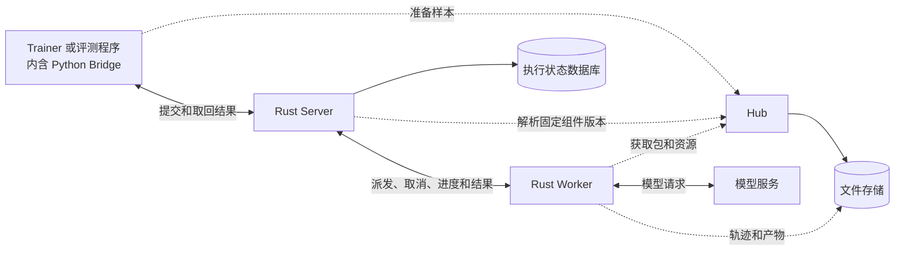

实线表示服务通信，虚线表示包、数据或文件访问。Hub 不派发任务，文件存储不决定执行状态。模型训练接入时，Worker 的请求经 ModelGateway 转到 Trainer 推理服务，细节见第 4.3 节。

### 3.3 Worker 如何承载 Python 扩展

| 名称 | 是什么 | 运行位置与权限 |
|---|---|---|
| AgentRunner | 用户扩展类，负责交互决策 | 在 Worker 管理的 Agent host 中运行，只接收公开任务和受控调用能力 |
| Environment、sandbox 工具 | 用户扩展类，负责环境与操作 | 在所选 Backend session 的 Environment host 中运行 |
| Scorer | 用户扩展类，计算评分业务字段 | 在独立受管评分进程或隔离评分资源中运行，可读取私有材料 |
| ComponentHostProcess | Rust 内部进程管理实现 | 按角色启动和监管上述组件进程；不另建任务队列或租约 |
| EpisodeSupervisor | Rust Worker 的生命周期执行器 | 管理一个 attempt 的准备、运行、评分、清理与上报 |
| AgentRuntime | Rust Worker 的受控调用入口 | 在模型、工具和环境操作前检查预算、取消与权限 |

Agent host 与 Environment host 使用同一组件加载协议的不同权限实例。Environment 与 sandbox 工具随 Process/Docker/Podman session 放置；Agent host 不随任务镜像进入容器。Scorer 单独持有私有材料权限。

系统不引入 Agent 池。Server 只调度 Worker，Worker 为当前 attempt 管理 Agent 会话，退出时关闭并撤销访问。后端资源是否预热属于资源性能优化，与 Agent 调度分开。系统内部进程接口的详细图见 [参考说明](development/reference_implementation.md#9-系统接口接入目标)。

## 4. 一次任务的完整执行流程

本章定义统一执行顺序。后续章节只展开各环节的数据与接口，不另定义一条执行链。

### 4.1 从提交到结果

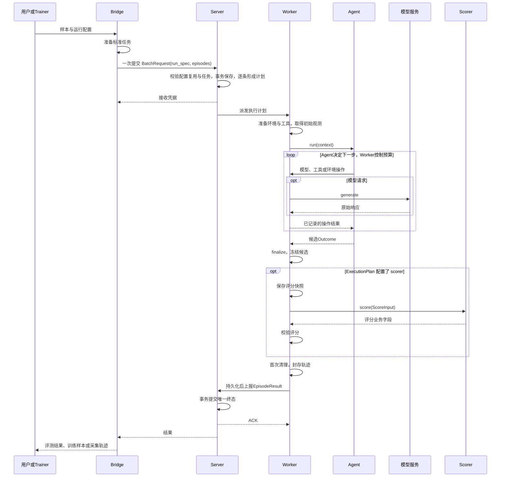

接收凭据表示请求已被保存，不表示执行完成。正常流程先收集最终产物，再按 scorer 是否配置决定评分；失败、取消和无法形成合法候选的情况按第 10 章处理。

### 4.2 发布与数据准备

**先选择代码包，再准备本次样本。发布代码包、发布数据、提交任务是三个不同操作，不要求每次运行都重新发布。**存储格式和权限遵循第 9 章。

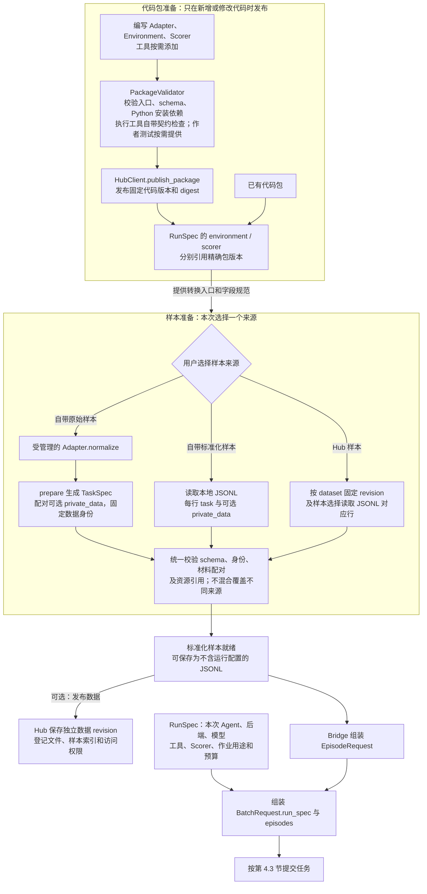

1. **注册包，再选择角色。**已有包直接使用精确版本；新增或修改实现时才校验、发布新代码版本。发布服务把数据集 PackageManifest 的 Adapter/Environment/Scorer 入口、角色配置 schema、任务 schema 和运行要求登记到组件目录；独立 Agent 和工具分别登记 AgentManifest、ToolSpec。运行时没有独立的 `package` 选择字段：用户只填写 `RunSpec.environment` 和 `RunSpec.scorer`。两者通常引用同一个数据集包，系统按角色取得其中不同的 Environment/Scorer 类；包内声明不替用户选择 Agent 或 Backend。图中校验失败均直接报错，不进入发布或提交。
2. **确定样本来源。**用户自带原始数据时调用 Adapter，再由 prepare 构建 task/private_data；自带标准化 JSONL 或使用 Hub 已有样本时直接读取和校验，不重复转换。Hub 输入包含固定数据版本与样本选择，不能同时带另一份内容要求覆盖。
3. **得到可复用数据。**标准化样本使用同一个 task/private_data 结构；prepare 负责固定身份、摘要和引用。文件不包含 run_id、episode_id 或执行配置，训练和评测可复用，私有材料不进入 Agent 可见的 TaskSpec。
4. **按需发布数据。**可保留本地使用，也可独立发布到 Hub；发布前固定数据 revision、文件 digest 和读取权限，再登记索引。代码不变时无需重新发包，数据内容改变时不能覆盖旧 revision。数据发布本身不启动任务。
5. **提交本次任务。**Bridge 将准备好的样本组装成 EpisodeRequest，与一份 RunSpec 一起放入 BatchRequest 并提交。Server 从批次生成逐任务 ExecutionPlan，再通过 DispatchRequest 派发；Worker 不再从另一个 catalog 补齐或替换题目。

### 4.3 Bridge：提交与消费结果

文件输入只多一个 YAML 读取步骤；它和 SDK 对象共用 Bridge 配置补值、校验和批次提交函数。Bridge 把完整配置写入 BatchRequest.run_spec，把任务写入 episodes，一次提交。默认值只在契约或组件模型声明，Server/Worker 不再补值。

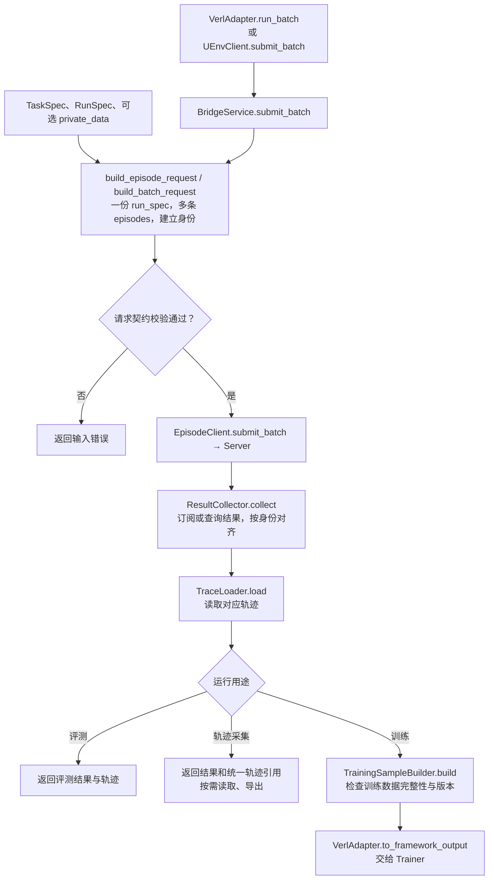

图中是任务提交与结果返回。训练时模型调用的完整路径是 `Agent → Worker AgentRuntime → ModelProvider → ModelGateway → Trainer 推理服务`；评测和轨迹采集也由同一个 Worker ModelProvider 连接所配置的模型端点。Bridge 的提交函数不生成回答；同步或异步只改变等待、消费结果的方式。

build_episode_request 接收标准公开 TaskSpec、种子及可选 private_data，生成成员 request_id/episode_id。build_batch_request 将一份完整 RunSpec 放入 run_spec，将这些成员放入 episodes；整批只生成一个 batch_id，各成员复用它并用从 0 开始的 sample_index 定位。EpisodeRequest 没有 run_id 或配置覆盖字段，ExecutionPlan.run_id 从批次 RunSpec 派生。BatchReceipt 返回 batch_id 及已接纳的 episode_ids。原始字段转换仅发生在准备阶段，不在请求构建中判断数据集或猜测字段。

无 scorer 时，Bridge 组装批次前省略成员的 private_data，不为采集单独准备答案或隐藏测试。源 JSONL 已含 private_data 时可直接复用公开 task；Server 对直接提交的受控请求也只把有 scorer 时所需的私有材料放入 ExecutionPlan，无 scorer 时不解析 harness、不下发私有材料。已有源数据文件仍受原权限控制。

用户自带数据与 Hub 数据均先按第 9 章在准备入口确定唯一内容来源，到上述函数时已是相同的 task/private_data；Server 和 Worker 不再分别补齐同一份样本字段。

训练模型由 Trainer 提供时，`ModelGateway` 暴露统一模型端点，实际转发到框架推理服务，并保留真实 token/logprobs/版本；Worker 的 ModelProvider 是唯一调用者。评测配置外部模型端点时，也由 Worker ModelProvider 发起连接，Agent 不绕过 Worker 直连。ModelGateway 不访问评分材料，不执行奖励计算。

结果返回后：`ResultCollector.collect()` -> `TraceLoader.load()` -> `TrainingSampleBuilder.build()` -> `VerlAdapter.to_framework_output()`。按 request/episode identity 对齐结果，不能只依赖返回顺序。同步在批次边界等待，异步按准备好的结果交给 Trainer；取消与停止消费分开。

### 4.4 Server：校验、调度与接纳结果

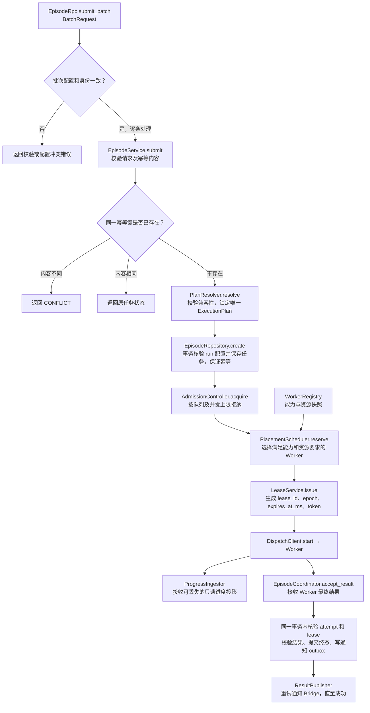

计划不合法时直接拒绝；无可用容量时按接纳与排队规则等待。结果事务会识别重复报告及过期 attempt，避免重复计分或覆盖当前结果；过程事件不直接替代权威终态。

`EpisodeRpc.submit_batch()` -> `EpisodeService.submit()`：

1. `validate_request()` 校验完整 BatchRequest：run_spec 唯一且完整，episodes 非空，成员身份不重复，batch_id/sample_index 一致。Server 按 run_spec.run_id 查找已保存配置，仅比较是否相同；不同返回 RUN_CONFIG_CONFLICT，不从旧记录补齐本次请求。然后逐条校验任务及幂等内容；同 request_id 关联的任务或 run_id 不同返回 CONFLICT。
2. `PlanResolver.resolve()` 逐条使用 batch.episodes 中的任务和同一 batch.run_spec 转换为 ExecutionPlan，以 Server 首次接纳时间和 limits.total_timeout_ms 生成唯一 deadline_at_ms，锁定所有明确选择组件的版本/digest，验证角色与 schema，生成唯一的 tools 表并汇总 required_capabilities。它只沿 `RunSpec.environment/scorer/...` 已选引用读取可信组件目录，不接收独立 PackageManifest 或某个 Worker 的 capabilities，也不在 Server 加载用户 Python 代码。Placement 在下一步根据计划要求选择 Worker。明确指定的实现不可无声回退；Worker 初始化 Environment、工具路由和 Agent SDK 后，在 `Environment.reset` 前分别核验可路由工具与模型可见工具。
3. `EpisodeRepository.create()` 在同一事务中核验或首次保存不可变 RunSpec，并保存本次接纳的任务和批次关系。事务内重新比较配置，防止并发提交各自通过检查后覆盖；重复任务返回原状态，不重置截止时间或再次执行。保存配置是批次处理的一部分，不是独立网络请求。
4. `AdmissionController.acquire()` 实施队列与并发上限。
5. `WorkerRegistry` 提供能力/资源快照；`WorkerRegistration.components` 是 Environment、Agent、Scorer、Tool、Backend 等所有已安装可执行组件的唯一清单，不再另设 `backends` 清单。`capabilities` 表示 Worker 能提供的运行能力；`capacity` 是总并发 episode 槽位，Heartbeat.available_slots 是当前剩余槽位；`resource_capacity` 是 CPU/内存/存储总量，单 episode 的资源申请只来自 `BackendSpec.resources`。`PlacementScheduler.reserve()` 同时核验计划锁定组件、required_capabilities、槽位和当前资源余量。
6. `LeaseService.issue()` 只为本次 attempt 生成 lease_id、epoch、expires_at_ms 与 token；token 将结果绑定到该租约且不得进入组件或公开轨迹。LeaseService 不生成或延长 episode deadline。`DispatchClient.start()` 发送统一 DispatchRequest，其中 remaining_timeout_ms 是根据 plan.deadline_at_ms 在派发时计算的只减上限，consumed_usage 是此前 attempt 已确认的累计用量。
7. `ProgressIngestor` 只接收可丢失的进度投影，不分配轨迹 sequence、修改事件或形成第二份轨迹存储；`EpisodeCoordinator.accept_result()` 校验结果结构和轨迹引用，并在同一仓库事务中核验当前 attempt/lease、更新权威终态及写结果通知 outbox，避免校验后状态发生变化。
8. 事务成功后 `ResultPublisher` 重试发布通知。重复报告只 ACK，不重复计分或释放名额；过期 attempt 不能覆盖当前结果。

Server 不创建 SWE session，不准备测试 patch，不解析 pytest，不调用 Agent 工具。失联与执行失败由 EpisodeCoordinator 按保存的 `RunSpec.retry`、错误分类及当前 attempt/lease 状态统一决定是否重试，不再定义另一种 AttemptPolicy。

### 4.5 Worker：执行与资源生命周期

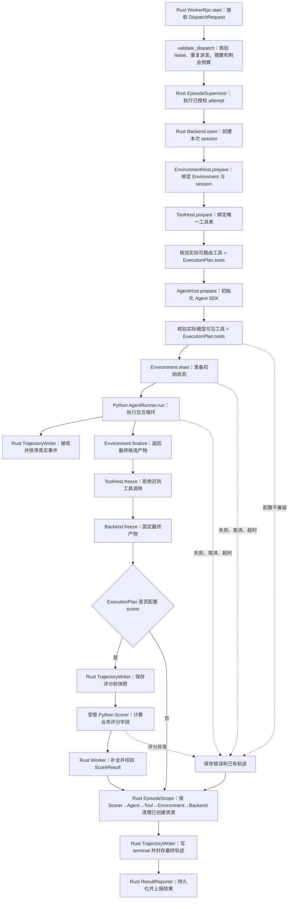

没有 scorer 时不创建 ScorerHost、不生成 scoring_checkpoint、不记录 score 事件；finalize、freeze、首次清理、terminal 和最终轨迹封存仍正常执行。运行代码只检查 plan.scorer 的存在性，不按 purpose 或 dataset 编写另外一条生命周期。

所有阶段的失败统一进入清理。资源关闭、失败后的清理重试和结果重传规则见第 10.3 节。

`WorkerRpc.start()` -> `validate_dispatch()` -> `EpisodeSupervisor.execute()`：

1. 目标 `WorkerRpc.validate_dispatch()` 核验 lease_id/epoch/expires_at_ms/token、plan digest、remaining_timeout_ms、consumed_usage、槽位和重复派发；同一有效派发连接原 attempt，过期或冲突派发拒绝。它通过后才调用 Supervisor。
2. `PackageService.ensure()` 按计划的精确版本准备扩展及资源；它通过注入的 `PackageCache` 读取缓存，缺失时按第 9 章从 Hub/文件存储获取并核对 digest，不临时重解析 latest，也不再次按 sample_id 从另一份目录替换任务内容。
3. 准备可信组件目录、模型连接器与 Worker 资源操作端口；此处不提前创建另一份任务 session，也不重新选择执行配置。
4. Rust `SessionManager` 按唯一 plan 调用选定 `Backend.open(backend, runtime, internet_access, remaining_ms)`，创建本次 session；Backend 不接收 Environment 对象或工具表，也不按 Environment 或数据集名称分派。Docker/Podman 必须使用计划确切镜像，QA 也在所选容器中运行；Process 使用计划指定的本机运行配置。非法输入不创建资源，创建后的异常统一清理。
5. EnvironmentHost 先按 package 的 environment config schema 校验 `plan.environment.config`，把唯一 `config.data` 传给 Environment 构造函数，并绑定必填 session。随后 `ToolHost.prepare(plan.tools, session, remaining_ms)` 绑定工具并返回实际可路由表；Rust 要求它与 ExecutionPlan.tools 一致。再由 `AgentHost.prepare(plan.agent, plan.tools, remaining_ms)` 按相同约定初始化 Agent SDK，并返回实际模型可见表；Rust 同样要求它与 ExecutionPlan.tools 一致。Scorer 与 ToolExecutor 构造也使用各自已校验的唯一 config.data。两个工具返回表只是运行时核验结果，不是两份生效配置。
6. Agent 实例只获得公开 TaskSpec 与受控 AgentContext，Environment 实例只获得锁定 Environment、sandbox 工具和当前 session 的 EnvironmentContext。命令不传完整 ExecutionPlan，也不携带另一份后端、模型、工具或超时覆盖字段。两次工具核验成功后才执行 `Environment.reset()`，再调用一次 `AgentRunner.run()`；PlainAgent 无工具单轮也走相同顺序。
7. Agent 的模型、工具和环境操作通过 SDK 适配层请求 Rust Worker。`BudgetEnforcer` 与 `ToolGateway` 做权威计数和准入，`TrajectoryWriter` 接收真实模型、工具、动作与观测事件；Python 不分配最终事件序号，也不能自行封存或删除轨迹。
8. 三种用途均由 Environment host 调用 `Environment.finalize()` 后将最终 Outcome 返回 Rust Supervisor。Supervisor 用评分剩余预算依次调用 `ToolHost.freeze(remaining_ms)` 拒绝新的工具请求，再调用 `Backend.freeze(remaining_ms)` 固定只读评分视图；之后才允许生成 scoring checkpoint。正式测试基于冻结候选建立评分工作区，私有测试不写回 Agent 工作区。
9. 仅配置 scorer 时，Rust `TrajectoryWriter` 保存评分前快照；Supervisor 只把唯一 ScoreInput 和获准材料交给 ExecutionPlan.scorer 指定的 Python Scorer。Scorer 返回业务字段后，Rust 补全 status/scorer/error 并执行数值、身份和跨字段校验。传输边界必须执行完整协议校验。ScoreInput.trajectory_ref 指向评分前快照；评测汇总与后训练复用同一个 ScoreResult。
10. Rust `EpisodeScope.finish()` 固定按 ScorerHost → AgentHost → ToolHost → EnvironmentHost → Backend 完成首次关闭；各端口 close 必须幂等，一步失败仍继续关闭后续资源。异常或取消触发同一路径。清理失败写入 cleanup 错误并进入有限重试队列，不把不干净实例放回复用池。
11. Rust 写 terminal 并调用 `TrajectoryWriter.seal()`；writer 一旦发现事件或 checkpoint 写入失败，就自动形成 final_partial，否则形成 final_complete。随后目标 Worker 把 EpisodeResult 写入 durable outbox，由 `ResultReporter.report()` 重传直到 Server ACK。后续清理重试不修改已形成的 score、manifest 或 EpisodeResult.cleanup_status。

PlainAgent 实现通用多轮循环并维护 messages：模型请求工具时，执行后把工具结果反馈给下一次生成；模型给出最终回答时结束。当前 PlainAgent 公共运行示例把 limits.max_generations 初始设为 1，用户可提高这一唯一上限；不增加 agent.config.max_rounds，也不在 Worker 再维护模型决策循环。无工具的直接回答会提前结束，不重复生成以凑满上限。full 保留全部历史，last_generation 保留系统提示、初始任务及最近一次完整模型/工具交互。OpenHandsAdapter 调用 SDK Conversation.run 并转换其事件；不在 Worker 再套一次 generation 循环。SDK 自己的 iteration 计数仅作为额外限制，统一模型/工具预算由 Rust AgentRuntime 在实际调用前强制执行。

### 4.6 三种循环与 SWE 对照

| 循环 | 谁负责 | 结束条件 |
|---|---|---|
| 训练循环 | Trainer | 训练算法或训练任务决定 |
| episode 内的模型与工具交互循环 | AgentRunner | 回答完成、环境结束或交互预算耗尽 |
| attempt 生命周期与故障恢复 | Worker 执行，Server 决定重试 | 完成上报，或按错误政策终止/重新派发 |

Worker 每个 attempt 调用一次 AgentRunner.run，Agent 内部可以多次生成和使用工具。Worker 在每次操作前强制公共预算，不再自行做第二层模型决策。

| 阶段 | 数学单轮示例 | 仓库修复示例 |
|---|---|---|
| 准备 | Environment 提供题目 | Environment 准备指定提交的仓库 |
| 调用 Agent | PlainAgent，max_generations=1，tools=[] | OpenHands 或带工具的 PlainAgent，多次生成预算 |
| 交互 | 模型返回答案 | 模型多次读取、编辑、测试代码 |
| 冻结 | 保存原始答案 | 保存候选补丁和基础仓库身份 |
| 评分 | Python Scorer 比较答案 | Python Scorer 请求 Worker 在评分工作区执行测试 |
| 完成 | 相同的 ScoreResult、轨迹和上报协议 | 相同的 ScoreResult、轨迹和上报协议 |

差异来自已选择的扩展实现和预算，调度器不出现 `if dataset == swe`。一次工具调用不一定对应一次 Environment.step：操作沙箱的工具已经执行了修改，不能再由 Environment.step 重复修改；状态型环境则由其工具将一个明确动作转交 Environment.step。

第 2.3 节的 GSM8K 只产生答案。把输入换成 SWE 任务时，SWE Adapter 转换仓库身份与样本镜像，SWE Environment 准备仓库；用户选择带工具的 Agent。Agent 经统一工具入口读取、编辑和测试文件，Environment.finalize 收集补丁，SWE Scorer 经 Worker 的隔离测试入口评分。两者的提交、调度、预算、轨迹和错误处理完全相同。

## 5. 数据对象与配置来源

本章解释数据结构，不把数据对象画成运行服务。完整字段、类型和递归约束由公共契约生成，见字段字典。

### 5.1 数据沿流程怎样传递

| 对象 | 谁产生 | 谁读取与用途 |
|---|---|---|
| PreparedSample | DatasetAdapter | prepare 用来组装标准数据，仅在准备阶段使用 |
| TaskSpec | prepare | Environment、Agent、Scorer 读取公开任务 |
| RunSpec | 用户经 Bridge 组装 | 仅作为 BatchRequest.run_spec 提交，Server 保存本批共用的选择 |
| EpisodeRequest | Bridge | Server 读取本次任务、种子和可选 private_data |
| BatchRequest | Bridge | Server 一次接收一份 run_spec 和多条 episodes |
| ExecutionPlan | Server | Worker 读取本次 attempt 的最终配置与固定输入 |
| DispatchRequest | Server | Worker 读取计划及派发租约、剩余时间、累计用量 |
| ScoreInput | Worker | Scorer 读取任务、候选、评分快照和可选 private_data |
| EpisodeResult | Worker 汇总、Server 接纳 | 用户获得状态、候选、评分、轨迹和用量 |

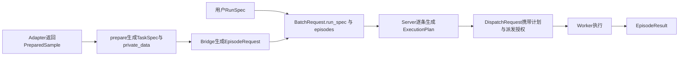

标准化 JSONL 和 Hub 样本直接进入校验与请求组装，不再经过 Adapter。私有材料与公开任务配对传递，但只有评分角色能读取；完整计划不会交给 Agent。

### 5.2 公开任务与私有评分材料

| 字段 | 含义 |
|---|---|
| schema_version | 公共协议版本 |
| task_id | 准备阶段确定的任务身份 |
| dataset | 数据集 ID、不可变 revision、split、subset |
| sample_id | 数据集中的稳定样本 ID |
| input | TypedConfig，包含题目及其他公开业务输入；data 按注册 schema 校验 |
| input_digest | 公开 input 的规范序列化摘要 |
| runtime | 可选的样本容器镜像候选；不选择 backend，Process 执行不会消费它 |

TaskSpec 不含参考答案、隐藏测试、私有材料引用，也不含 Agent、backend、model 或预算选择。Environment.reset 接收 TaskSpec，AgentContext.task 也是 TaskSpec；系统分别传入副本，避免某个组件修改任务对象后影响其他组件。Scorer 接收同一任务定义，不需要再维护另一份任务格式。

例如 GSM8K 的 TaskSpec.input.data 只有题目，参考答案放入受控请求的 private_data。新增数据集时，作者在 Adapter.normalize 中返回 PreparedSample；它是准备阶段的临时返回值，包含公开输入和可选私有内容。系统的 prepare 工具负责身份、存储、摘要和组装，用户不手写两份任务。

TaskSpec.input 使用包内定义的类型。GSM8K 示例的公开内容为 `instruction`，私有内容为 `answer`。大文件通过 ArtifactRef 引用；引用权限与读取方见第 9 章。受信 Adapter/prepare 负责材料配对，schema 和摘要只能检查结构与内容一致性，不能证明标准答案本身正确。

### 5.3 用户配置如何变为执行计划

BatchRequest.run_spec 保存本批共用的用户选择，episodes 中各 EpisodeRequest 指定执行哪个任务。Server 校验批次后，**转换生成** ExecutionPlan；计划不再嵌套原始请求与 RunSpec，也不再附带另一份组件选择或工具配置。

| 对象 | 由谁产生、谁使用 | 范围 |
|---|---|---|
| RunSpec | 用户填写，Bridge 放入 BatchRequest.run_spec，Server 保存 | 一次 run 共用的 environment、agent、backend、model、tools、scorer、limits 等配置 |
| EpisodeRequest | Bridge 放入 BatchRequest.episodes | episode_id、task、seed、可选 private_data；以及提交幂等与批次定位字段，不携带运行配置 |
| BatchRequest | Bridge 一次提交给 Server | batch_id、唯一 run_spec、非空 episodes 列表 |
| ExecutionPlan | Server 生成，Worker 使用 | 本次 attempt 唯一生效的配置、公开任务、受控评分依据、精确组件引用和截止时间 |

RunSpec 的 environment 到计划中仍叫 environment，tools 仍叫 tools；变化的是组件版本已锁定、工具执行路由已核验，字段的含义和名字不变。Worker 只读取计划，不能再查询 RunSpec 重新选组件，也不能用另一张 components 表覆盖角色配置。同一组件被多个角色使用时，引用必须完全一致。

数据集 `PackageManifest` 是发布/安装元数据。它登记 Adapter、Environment、Scorer 入口、各角色 config schema、任务 schema、默认 runtime 和 internet_access；独立 Agent 和工具分别使用 `AgentManifest`、`ToolSpec` 发布。PlanResolver 只沿 RunSpec 已选的角色引用查询可信目录。数据集 Environment 与 Scorer 可以引用同一个包坐标，再按角色取得 manifest 中不同入口；它们仍分别使用 `RunSpec.environment` 与 `RunSpec.scorer`，不存在一个 package 参数同时暗中覆盖两项选择。

同一 run 共享一套环境配置及可选的评分组件配置。不同样本可以共享它，但都必须满足这些组件支持的任务 schema；若 GSM8K 与 SWE 需要不同专属 Environment/Scorer，就创建不同 run，由 Bridge 同时管理。Worker 不能根据 dataset 名称临时更换组件。同一任务多次采样使用不同 episode_id。正常执行只有 `attempt_id=1`；发生允许重试的基础设施故障时，Server 保留 episode_id 并增加 attempt_id，用户不填写该字段。

Server 随批次保存 RunSpec、EpisodeRequest 及批次关联，用于审计、幂等与恢复。同一 run_id 的完整 RunSpec 不可变，后续批次必须再次携带相同配置；不一致拒绝，变更配置需使用新的 run_id。任务 request_id 的幂等比较必须包含所属 run_id，不能借复用身份切换配置。request_id、batch_id、sample_index 不进入执行计划；retry 由 Server 消费，不向 Worker 提供第二个重试决策入口。计划中的 task 不含私有材料引用；完整计划不能直接传给 Environment/Agent 或写入公开轨迹。

`purpose` 取 evaluation、training 或 trajectory_collection。training 配置仅在 purpose=training 时必填，另外两种用途禁止提供。evaluation/training 必须选择 scorer；trajectory_collection 可省略 scorer。是否评分唯一取决于 scorer 是否配置，purpose 只选择结果用途并校验合法组合，不改变评分算法。不增加 enable_scoring、collect_only 或采集专用配置类。

`trajectory_retention_days` 也是 Server/ArtifactStore 的保存策略，只在 RunSpec 出现并由服务端存储管理消费，不复制到 ExecutionPlan。Worker 始终记录完整的标准事件；summary 只是查询端可生成的派生视图，不是执行配置，也不能改变训练事实。

RunSpec 按 Environment、Agent、Backend、Model、Tools、Scorer、Limits 分组。公共字段名、含义和默认值不随数据集改变，组件专有 config 必须有类型声明，不能重复公共执行参数。用户在这一处选择组件；Server 将版本、工具路由、镜像与预算解析到 ExecutionPlan，Worker 不重新读取用户文件选择组件。后端镜像优先级唯一由第 7.3 节定义。

每条 task 可以多次采样，产生不同 episode_id；正常 attempt_id=1。基础设施重试保留 episode_id，更新 attempt_id。派发授权与剩余预算位于 DispatchRequest，不成为第二套执行配置；具体恢复规则见第 10 章。

### 5.4 交互返回值

| 对象 | 由谁产生 → 交给谁 | 保存什么，为什么单独存在 |
|---|---|---|
| Observation | Environment.reset/step → AgentRuntime、Agent | 当前公开观测：content 与可选有类型 data |
| Transition | Environment.step → AgentRuntime、Agent | 一次真实动作后的 observation、terminated、episode_truncated、可选 environment_reward |
| Outcome | AgentRunner.run → Environment.finalize → EpisodeSupervisor、Scorer；snapshot 也返回同类 | final_answer、artifacts、termination_reason 与可选 state；state 只能由 Environment 填写 |

reset 直接返回 Observation；step 返回 Transition，其中的 observation 是后续观测。模型调用、工具调用与环境动作不是同一件事，单轮问答可以直接生成回答并返回 Outcome，无需伪造 step。environment_reward 是环境原生反馈，不自动成为训练 reward。

Agent 提交与环境收集共用一个 Outcome。finalize 这个执行步骤保留：代码任务需要收集工作区修改，有状态任务需要收集环境状态；但不再为了前后两个阶段定义两个字段相近的类。Agent 只能填写 final_answer、artifacts、termination_reason，携带 state 或返回 in_progress 会在交给 Environment 前被拒绝。Environment.finalize 返回独立 Outcome。作者按需覆盖 `state_snapshot()`；SDK 的默认 `snapshot()` 只是把它包装成 termination_reason=in_progress 的 Outcome，最终评分禁止该状态，作者不需要再实现第二套快照协议。

终态 `termination_reason` 只允许 final_answer、environment_terminal、budget_exhausted；in_progress 只用于过程快照。系统取消和系统失败不再伪装成交互结束原因，分别写入 `EpisodeResult.execution_status` 与 `ErrorRecord`，也不触发正式评分。

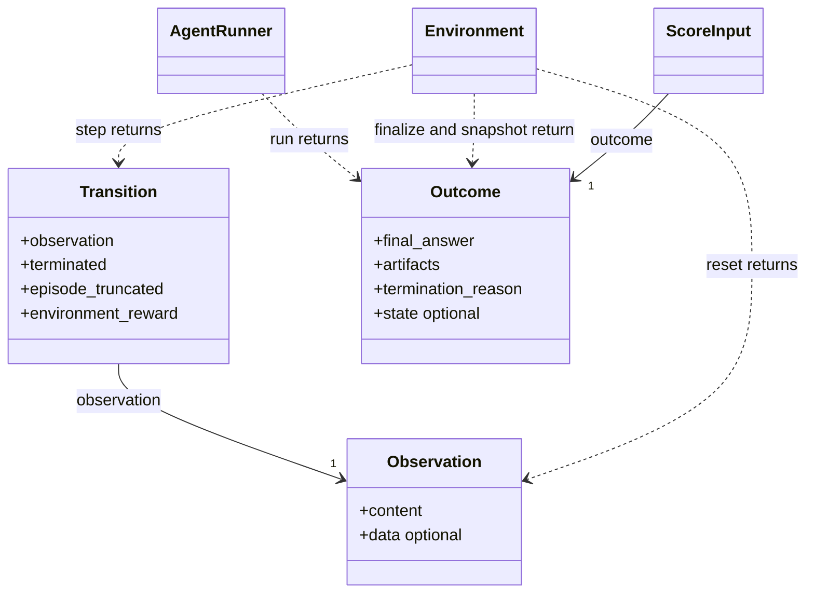

Observation 是可反复使用的公开内容；Transition 是一次动作的结果，包含 Observation 和终止/奖励信息。初始化还没有动作，因此 reset 只返回 Observation。Outcome 表示进入评分的提交内容与环境状态，不与模型可见观测合并，避免把不同用途和权限的数据混在同一对象中。

```text
Environment.reset(task, context)       -> Observation
Environment.step(action, context)      -> Transition
AgentRunner.run(context)               -> Outcome
Environment.finalize(outcome, context) -> Outcome
```

reset 负责初始观测；step 负责一次真实动作；finalize 收集最终答案、补丁或环境状态。轨迹由 Worker 记录，作者不构造事件编号、时间戳或分片。Transition 在轨迹中的使用见第 8.3 节。

### 5.5 字段命名、定义与版本化

UEnv 系统协议的唯一可编辑来源是 `contracts/proto/uenv/v1/*.proto`。TaskSpec、RunSpec、EpisodeRequest、ExecutionPlan、Observation、Outcome、ScoreInput、ScoreResult、轨迹事件、PackageManifest，以及 Hub、Server、Worker RPC 都在这个 proto package 中各定义一次。按领域拆分多个 proto 文件只用于控制文件大小，不允许在 Worker、Hub 或 SDK 目录再声明同义 message。Rust/Python 类型、RPC stub、核心 JSON Schema 和 `field_dictionary.md` 都由 proto 生成，生成文件不可手改。

数据集独有的题目、私有评分材料、配置和动作字段属于开放扩展，不能要求每新增一个数据集就修改核心 proto。作者只在数据集包 `models.py` 中定义这些 Python 模型；Adapter、Environment 和 Scorer 的类型声明引用它们。发布工具自动导出带版本 URI 的 JSON Schema，计算 digest 并写入 PackageManifest，SchemaRegistry 在 Worker 加载用户代码前据此校验 TypedConfig。SDK 在 RPC/存储边界自动封装模型并填写 schema_ref，普通作者不构造这个信封。该 schema 是生成的校验产物，不是另一份可编辑定义；全部复用 SDK 公共类型时不生成新 schema。

| 含义 | 统一字段与规则 |
|---|---|
| 通用指令型任务正文 | TaskSpec.input.data.instruction；原始 question/problem/problem_statement 在语义确为“待执行指令”时由 Adapter 映射；claim 等不同业务概念不强改名 |
| 工具表 | RunSpec.tools → ExecutionPlan.tools；不保留另一份 tool_bindings |
| 工具的会话名称、执行实现 | ToolBinding、ResolvedToolBinding、ToolCall 都使用 name、implementation；调用记录必须匹配选中的绑定 |
| 评分器选择 | RunSpec.scorer → ExecutionPlan.scorer；一个 run 只有这一处作者配置，计划只把同一选择锁定为精确版本 |
| episode 奖励 | ScoreResult.reward；评测直接展示/聚合，后训练原值复制到 FrameworkSample.reward，不再定义 training_reward、StepReward 或 RewardAssignment |
| 镜像 | 各候选入口统一 runtime.image；只有 ExecutionPlan.runtime.image 生效，image_source 仅记录来源 |
| 任务、执行、尝试身份 | 分别 task_id、episode_id、attempt_id，跨消息传递原值，不改名 |
| 模型调用 | generation；使用 generation_id、max_generations、generation_count，不使用含义不明确的 turn |
| 环境动作 | environment_step；使用 environment_step_index、environment_step_count，不与模型调用合并 |
| 交互结束原因 | Outcome.termination_reason；EpisodeResult 与 TerminalEvent 不再复制，系统失败原因使用 ErrorRecord.code |
| 内容摘要 | input_digest 校验公开 input；plan_digest 校验完整计划（包含 task 与 private_data）去掉摘要字段本身；不再增加材料专用 task_digest |
| 时间预算 | total_timeout_ms 是最初总时长；deadline_at_ms 由首次接纳时间据此确定；DispatchRequest.remaining_timeout_ms 是派发时派生的剩余上限，接收方只能收紧，不能延长截止时间；Lease.expires_at_ms 只表示租约有效期 |

“同义同名”不等于把不同含义都叫一个名字。SciTab 的 claim 是待核验陈述，contexts 是证据，二者不是任务指令别名；参考答案 answer、模型最终输出 final_answer 与评分 success 也不同。schema_ref/data 是扩展类型信封，不能在 data 内另放 task_id、backend、tools 等公共协议同义字段。新增包发布前也需按此规则审查业务语义，Schema 只能自动拒绝已定义的旧字段和不符合结构的数据，不能自动证明任意新字段没有语义重复。

更详细的逐字段来源和禁止项见 [字段统一规则](development/field_conventions.md)。

包 metadata 已删除；包声明不提供 metadata、display_name、description、tags 等没有实际消费者的字段。运行行为只能由已定义的运行字段决定。每个字段及其嵌套字段都要说明：谁填写、谁读取、读后产生什么作用。生成 schema 与文档不得另行手改。

普通作者在 models.py 中定义业务类型，通过类型标注、IDE 和 `uenv describe` 查看字段。用户不创建 `schemas/` 源码目录，也不手写 `TypedConfig` 或 `schema_ref`。工具对确定的系统字段遮蔽报错，对可能重复的字段给出提示；timeout 与 allowed_time 是否同义无法百分之百自动判断。

额外语义校验不能只靠 JSON Schema：Server 接纳结果时调用 validate_result_for_plan，依据已保存计划校验评分是否应当存在，completed 且配置了 scorer 时必须有 status=ok 的 score；未配置 scorer 时禁止出现 score。独立 EpisodeResult schema 允许 score 缺失，不意味着可以绕过计划校验。TaskSpec.input schema 必须与包声明一致；tool_call/result 必须配对；完整轨迹 sequence 唯一连续，部分恢复轨迹保留原序号与缺口；token/logprob/mask 等长；policy version 与生成实际响应一致；score error 时 reward/success 为空；tests_passed <= tests_run；重复请求内容摘要一致；引用 digest 对应真实内容；图片/文件引用角色权限正确。具体校验由各对象的 validator 实施。

Python/Rust 字段、函数和模块用 snake_case，类/结构体/trait 用 PascalCase，常量用 UPPER_SNAKE_CASE；包 ID 使用稳定 namespace。系统模块按职责组织，依赖方向及逐文件分工由 [模块清单](generated/module_map.md) 规定。内部类须具备独立状态、生命周期、可替换实现或权限/进程/事务职责；请求组装等纯操作使用函数。模块导出文件不承载业务逻辑；辅助函数按具体职责归属，不集中到无界 utils 文件，也不把一个长函数拆成多个 include 文件代替职责拆分。

## 6. 数据集、智能体与工具扩展接口

新增任务规则只修改扩展包。平台负责加载、资源、授权、预算、轨迹和调用顺序。

### 6.1 基类、专属类与加载约定

| 对象/接口 | 责任 | 明确不负责 |
|---|---|---|
| DatasetAdapter.normalize | 源数据行转 PreparedSample，分开公开输入与私有材料 | 选择 backend、agent、调度或模型调用 |
| TaskSpec | 数据来源、稳定样本 ID、公开任务输入及摘要 | 私有评分材料或引用、运行模式和后端选择 |
| RunSpec | 显式组合环境、agent、tools、scorer、backend、model、预算 | 正在执行的 session/lease |
| ExecutionPlan | 精确组件引用、能力需求、截止时间和本次 attempt | 按数据集临时改写执行策略 |
| Environment.reset/step/finalize | 初始任务状态、环境转移、收集候选产物 | 模型调用或权威评分 |
| AgentRunner.run | 会话、模型决策、工具调用、交互循环 | 访问私有标准答案、写最终分数 |
| ToolExecutor.execute | 使用绑定的 session 执行一个操作 | 创建另一套任务调度/评分链 |
| Backend | 通用资源创建、执行、文件操作、中止和清理 | SWE instance、QA 标签、基准评分 |
| Scorer.score | 根据 ScoreInput 同时给出本条 episode 的指标和唯一 reward | 修改 Server 终态、决定全局重试 |
| TrajectoryWriter | Rust Worker 顺序校验、保存并封存事实和产物引用；Python 组件只提交事件内容 | 展示文本清洗、编造 token |
| EpisodeCoordinator | Server 唯一终态、attempt 切换和幂等 | 交互循环与业务评分 |

SDK 对外提供 ABC，内部依赖窄 Protocol；按 Python/Rust 语言习惯使用 class/trait。相同角色共享接口，不要求所有能力组成一个巨大父类。跨进程必须依赖序列化协议，而不是假设 Python 继承关系跨语言有效。

每个数据集都在自己的 dataset_adapter.py、environment.py、scorer.py 中声明专属类，分别直接继承 DatasetAdapter、Environment、Scorer。共享算法通过函数或组合复用，入口不能仅是共享类的 import 别名。

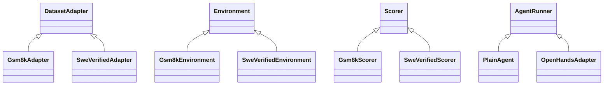

图只展示两套示例的继承关系，其他数据集使用同一规则。全部九个数据集的专属类列在 [数据集模板](guides/dataset_package_template.md#9-内置数据集的继承关系)。选择数据集不自动选择 Agent。

Host 在加载前按对应角色 schema 校验 ComponentSpec.config，只把已校验的 config.data 字典传给用户类构造函数，基类保存为 self.config；无配置时显式传 `{}`。用户不实现 Rust Supervisor 或组件进程管理器。

### 6.2 数据集作者需要实现什么

| 需求 | 用户实现或引用 | 公共流程是否修改 |
|---|---|---|
| 只有源字段格式不同 | 本数据集 Adapter 子类，内部可复用字段映射实现 | 否 |
| 题目呈现不同，仍为问答 | 本数据集 Environment 直接继承 Environment，在 reset 中构造初始观测 | 否 |
| 新的有状态交互规则 | Environment 的 reset/step，按需覆盖 state_snapshot/finalize/close | 否 |
| 新评分规则 | 直接继承 Scorer，实现 score 并按需调用公共评分函数 | 否 |
| 新任务操作 | Python 工具函数或 ToolExecutor；仅新接口或新框架需要一次接口适配 | 否 |
| 新 Agent 决策方式 | AgentRunner；这属于 Agent 扩展，不是每个数据集都要写 | 否 |
| 新计算资源驱动 | Backend；属于平台扩展与部署工作 | 可能增加通用驱动，但不增加数据集分支 |

用户不实现 Rust EpisodeSupervisor、ComponentHost 或评分调用器。`Environment` 只强制作者提供 reset；其余方法有默认行为或明确不支持动作的默认实现。需要状态转移时必须实现 step，需要产物或状态收集时覆盖对应方法；默认方法不是自动具备所有能力。

完整扩展方法的职责保持为：

```text
DatasetAdapter.normalize(record) -> PreparedSample
Environment.reset(task, context) -> Observation
Environment.step(action, context) -> Transition
Environment.state_snapshot(context) -> UEnvModel | None
Environment.finalize(outcome, context) -> Outcome
Environment.close(context) -> None
AgentRunner.run(agent_context) -> Outcome
Scorer.score(scoring_input, scoring_context) -> ScoreResult
```

只有 normalize、reset、run、score 是各自基类的必需实现。step 仅有状态环境实现，state_snapshot/finalize/close 有默认行为；SDK 的 snapshot() 是 state_snapshot 的系统包装，不是作者要维护的第二个 hook。Observation 支持多段可见内容和有 schema 的结构化数据；Transition 包含后续观测、环境终止/外部截断和可选原生奖励；Outcome 包含回答、产物及版本化结果状态，不要求任务必须产生自然语言答案。评分读取冻结的状态/轨迹视图，不能依赖已被清理的活环境。非共享类型由包内 models.py 定义并生成 schema，公共信封保持固定，通过 SchemaRegistry 绑定后严格校验。

作者开发流程为 `uenv package init/validate/test/publish`。新增业务字段写入包内 models.py，工具按需放在 tools.py；已有公共类型直接 import。完整目录与每个字段的填写方式统一见数据集模板，维护参考设计的生成脚本不属于普通作者操作。

### 6.3 Agent 与工具怎样协作

AgentRunner 负责选择下一步动作并结束会话，通过 AgentContext.generate、call_tool、step 申请模型、工具和环境操作。所有申请都进入 Worker 的 AgentRuntime，由 Rust 在副作用发生前检查取消、剩余时间及次数/token 预算，再返回已记录的结果。

工具完成一种操作，不拥有交互循环。文件工具使用当前 Backend session；有状态环境的动作工具调用 Environment.step。一次操作只执行一次，文件已被工具修改后不再次调用 step 重复修改。只操作 Agent 会话状态的原生工具可以留在 Agent host，但仍遵守工具选择、预算和事件规则。

自定义 Agent 不意味着必须自定义工具。使用已支持的 UEnv/MCP/原生工具接口时，只适配一次框架接口，不逐个适配每个工具。模型端点来自配置，Agent 不加载本地模型权重。

### 6.4 工具定义、接入与调用

**用户写一份 Python 工具，UEnv 负责接入不同 Agent，并管理调用。**

**怎么写。**在数据集可选的 tools.py 或独立工具包里写函数，声明参数、返回类型和用途，并登记函数入口。例如：

```python
def count_words(text: str) -> int:
    """按空白分隔，统计文本中的词数。"""
    return len(text.split())
```

UEnv 从函数生成 ToolSpec；其中 entrypoint、config_schema、输入/输出 schema 和 interfaces 都由发布工具校验。复杂类型的声明也只维护一份。不支持的类型在发布时明确报错。需要资源或状态的工具可以实现现有 ToolExecutor 接口，系统注入当前任务的资源、配置和取消信号，不让模型填写这些信息。工具状态按本次执行创建和清理。

**怎么用。**用户在 RunSpec.tools 选择工具及配置，不逐个填写 adapter。AgentManifest 只按优先顺序声明 supported_interfaces，例如 `uenv_direct.v1`、`mcp.v1` 或 `openhands_native.v1`；ToolSpec.interfaces 声明该工具可用的接口、适配器与执行位置。PlanResolver 选择两者第一个共同接口，校验工具 config_schema，再把 interface、adapter 和精确版本锁定到 ExecutionPlan.tools。MCP 包装执行的仍是原 Python 函数，不需要再写一份工具代码。若没有共同接口则在执行前拒绝。

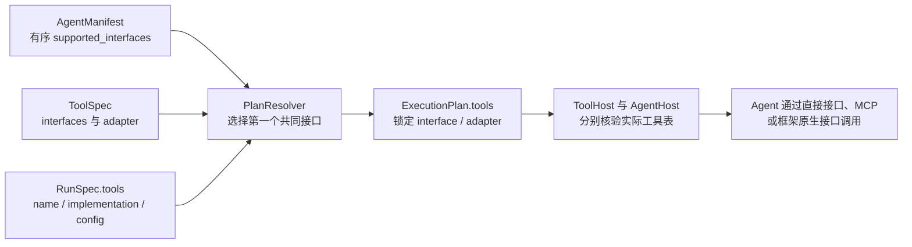

自定义 Agent 复用 UEnv 的工具描述和调用接口，或已支持框架的 MCP/原生接入，不逐个列出所有工具实现。新增一个已经支持 MCP 的工具，不需要更新 OpenHands 或 PlainAgent 的 manifest。只有引入新工具接口、未支持的框架或特殊交互语义时，才需补一次接口适配代码。OpenHands 自带工具可以保留原生实现，在 ToolSpec 中声明 `openhands_native.v1`；不必全部改成 MCP。

**怎么管。**数据集包可用 `PackageManifest.provided_tools` 登记 ToolSpec，独立工具包直接发布同一 ToolSpec；这不是默认启用列表。所有模型可见工具，包括 Agent 自带工具，都必须进入用户的 `RunSpec.tools` 选择。AgentManifest.required_tool_names 只列框架不可缺少的内置工具名，不是逐工具兼容清单；空数组表示没有必需工具。UEnv 校验后形成唯一的 `ExecutionPlan.tools`，执行时只读这张表；缺必要工具、重名或不兼容就报错，`tools=[]` 表示没有工具。运行配置 config 与每次调用参数 arguments 分开，不能互相覆盖。

所有入口执行相同的平台安全底线、预算、超时和取消规则；Rust ToolGateway 根据 ExecutionPlan.tools 做权威检查。操作文件或命令时使用当前任务的 Backend 会话，操作环境状态时调用当前 Environment，外部服务通过受管的专用连接访问。Python SDK/MCP 适配层只负责格式转换，不能增加工具或重置预算。只操作 Agent 会话状态的工具可以留在 Agent 进程，但仍需向 Rust Worker 登记调用和结果。选择一个工具只表示允许调用该工具接口，不会给 Agent 开放宿主目录或私有评分材料。`internet_access` 只控制任务 Backend session 的通用公网；`external_service` 工具的已选连接只开放该特定服务，不给 session 打开公网，也不产生第二个 internet_access。

UEnv 管理 MCP 连接及其生命周期，只开放获准工具，不要求用户重复填写自动启动的服务地址。每次调用只计数一次，用 ToolCall/ToolResult 记录参数、结果或错误，并关联实际模型调用；超时和取消也要记录，崩溃导致缺失时标明轨迹不完整。工具格式转换不伪造原始模型文本或训练 token；工具调用的 token/logprob 也必须来自实际模型响应，不能从归一化 JSON 重新生成。

### 6.5 通用性与支持边界

| 维度 | 通用协议必须表达 | 便捷组件可以做的简化 |
|---|---|---|
| 样本来源 | 文件、流式读取或可复现生成；源身份、revision、seed；逐条归一化 | 文件 reader 与字段映射函数 |
| 任务输入 | 有类型的结构化输入、文本、图像等 artifact；公开内容和受限材料分开 | 单个 question 与 answer 的映射 |
| 环境交互 | 初始观测、有状态 action/transition、终止条件、任务最终状态收集 | 无状态问答环境无需作者写 step |
| Agent 产物 | 文本、结构化答案、文件/补丁，或者只通过环境状态体现结果 | 取 final_answer.text |
| 评分依据 | 冻结产物、合法的环境状态视图、轨迹、可选参考材料；不强制有标准答案 | 精确匹配和二元成功 |
| 评分输出 | 一条 episode 的多个指标、可空 success、唯一 reward 和证据；运行统计从已保存结果生成 | binary_score 同时生成二元 success 与 reward |
| 执行资源 | 用户选择计算后端；环境包只声明所需能力和 internet_access；平台安全底线始终生效 | Process/Docker/Podman 下的文件和命令 |

DatasetAdapter 负责原记录到规范任务；Environment 负责可见观测和状态演化；AgentRunner 负责决策循环；Scorer 负责指定依据的评价。不能为了少文件合成一个同时调模型、管容器、改变环境和算分的大 Dataset 类。

动态交互也不能突破工具授权。环境可根据状态提供合法动作范围，通常由固定的工具 schema 和状态验证实现。若确实需要运行中发现新工具，则必须事先授权可发现的来源/能力范围、验证适配器并记录工具表版本；超出当前固定工具协议的动态注册尚未设计完成，应明确报不支持，不能静默加工具后仍声称遵守固定表。

Process/Docker/Podman 统一管理计算资源；已有网页服务或远端模拟环境的连接属于另一项受控能力。环境包可通过该能力适配外部状态，不能把服务访问强行等价为某个 shell 命令，也不能据数据集名称选择不同 Server 路由。

模板通用性应由同一条链路上的行为覆盖验收：文本问答、上下文/表格问答、代码产物、仓库修改、需要先前状态的多轮环境、多模态观测、无固定答案但按规则评分。每项都要检查新增业务是否仅发生在扩展包、原始信息是否保留、评分是否统一进入 Worker，以及失败/取消是否沿用公共生命周期。当前范围以单一 AgentRunner 驱动的有限 episode 为主，多智能体协作、任意硬件设备和无限持续任务不能未经协议扩展与测试就宣称支持。

少写代码依靠公共默认行为、复用函数和脚手架。已提供的入口使用数据集专属类；仅采集且没有评价规则的包可以省略 Scorer，不编写固定零分的占位评分器。通用性的标准是：新增任务行为能通过已定义的扩展接口实现，且无须在主流程增加业务分支。核心缺少某项资源或传输能力时允许增加通用平台扩展，不承诺现有实现已经覆盖所有可能任务。

## 7. 后端与资源隔离

Backend 管理任务运行位置和资源。平台提供 Process、Docker、Podman 三种统一驱动，数据集作者不实现后端，也不根据数据集名称选择运行引擎。

### 7.1 Environment 与 Backend 如何组合

Environment 定义任务规则，例如如何生成初始 Observation、如何处理 Action、如何产生 Transition，以及结束时收集什么 Outcome。Backend 提供运行位置和资源，例如进程、容器、工作目录、文件与命令执行。Backend 不是 Environment 的父类，Environment 也不持有 Backend 类型或配置；Rust EpisodeSupervisor 创建本次会话后，把受控会话能力交给 Python EnvironmentContext，从而组合二者。

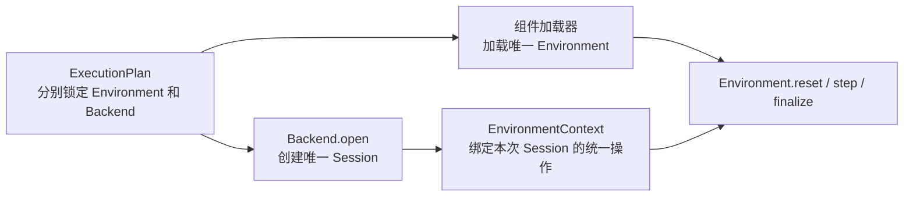

同一个 Environment 类可以与 ProcessBackend、DockerBackend 或 PodmanBackend 组合，数据集作者不编写 `Gsm8kDockerAdapter`、`Gsm8kPodmanAdapter`、`SweProcessAdapter` 这类组合适配器。DatasetAdapter 只转换源数据，也不承担后端适配。每种 Backend 由平台实现一次统一接口，所有 Environment 复用。

组合成立仍需满足运行条件：所选 Backend 必须提供 Environment 和工具所需能力，运行依赖必须存在，并满足固定安全底线及 `internet_access`。不满足时由 Server 在计划或 Worker 准备阶段返回明确的不兼容错误；不能让用户编写组合适配，不能按数据集名称偷偷改后端，也不能回退到另一执行路径。

Environment 的 Python 代码由受管 ComponentHost 调用。Rust Worker 对所有数据集使用同一套 host 协议：ProcessBackend 在本机受管 session 中启动 Environment 实例，Docker/Podman 在任务容器 session 中启动或代理该实例；sandbox Python 工具与它共享 session。AgentRunner 由同一 ComponentHostProcess 实现启动为 Worker 侧的另一个角色实例，不进入任务容器。这个平台桥接按 Backend 实现一次，不为每个数据集或每种 Environment × Backend 组合增加代码。Backend 公共接口因此不提供 `bind_environment(environment, session)`；它只创建和操作 Session。

### 7.2 平台隔离与互联网访问

数据集作者只需回答一个容易判断的问题：这个 Environment 是否需要访问公共互联网。运行用户选择 Environment，不再填写第二个网络开关。任务怎样创建进程或容器、怎样隔离文件和权限，都不进入 UEnv 用户协议，由 Backend 按平台固定规则实现。

平台安全底线包括：任务资源不能读取 `private_data`、隐藏测试、评分工作区、Worker 凭据或容器引擎 socket；不能获得未声明的宿主挂载；不同 episode 的工作区和进程互相隔离；评分在 Agent 不可继续修改的隔离视图中执行。Backend 无论采用 Process、Docker 或 Podman，都必须满足这些规则。做不到就拒绝任务，不能让用户通过配置降低底线。

环境包只有一个 boolean 字段：

| 字段值 | 用户看到的含义 | 平台行为 |
|---|---|---|
| `internet_access: false` | 环境不需要访问公共互联网 | Backend 禁止任务访问公共互联网；内部控制通道不属于公共互联网 |
| `internet_access: true` | 环境确实需要访问公共互联网 | 发布时审核；运行时只通过平台受控出口访问，仍禁止宿主机、内网和评分私有资源 |

`internet_access` 属于 **Environment 的运行要求**。环境包在 `PackageManifest.internet_access` 声明，脚手架默认生成 false；Hub/本地安装流程审核 true。Server 验证所选 Backend/Worker 能否受控提供互联网后，将同名 boolean 原样写入 `ExecutionPlan.internet_access`。Worker 只执行计划中的值。RunSpec、数据行、Agent、Tool 和 backend config 都不能再提供另一份覆盖值。

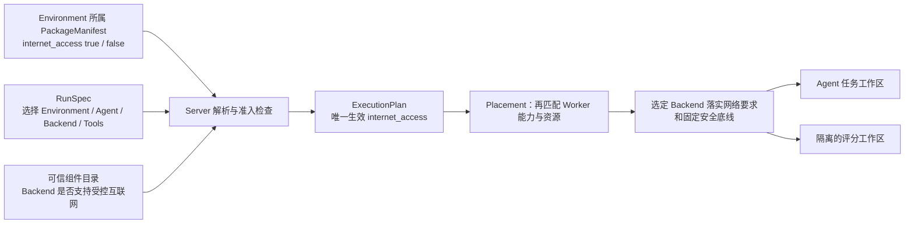

`required_capabilities` 只表示 Worker 是否具备 `exec.v1`、`filesystem.v1`、`internet_access.v1` 等运行功能，供调度和兼容性检查使用。作者在 dataset.yaml 中声明环境确实需要的已登记能力，无需求时为 []；组件注册流程检查能力名，PlanResolver 汇总到同名计划字段。它不是访问授权。`execution_scope` 只决定已选择工具由哪个受控执行入口承接，也不能修改 internet_access。external_service 工具使用平台登记的专用连接和对应 connector 能力；它只访问获准服务，不等同于给任务 session 提供通用公网。sandbox 工具确实需要通用公网时，必须由所属 Environment 包统一声明 internet_access=true。

### 7.3 镜像来源与唯一解析规则

**后端指定运行引擎，镜像指定容器内容。**Docker/Podman 创建任务容器时必须有镜像；不存在“不使用镜像的 Docker 模式”。所谓“不用数据集专用镜像”，是改用满足依赖的公共镜像，不是一条新的执行路径。

| 来源 | 目标填写位置 | 谁填写 | 作用范围 |
|---|---|---|---|
| 数据集默认镜像 | 作者 `dataset.yaml` 的 `runtime.image`；构建后为 `PackageManifest.runtime.image` | 数据集作者 | 没有样本专用镜像时使用；可以引用公共 Python 镜像，不要求每个数据集单独构建 |
| 样本专用镜像 | `TaskSpec.runtime.image` | DatasetAdapter 从原始记录映射，prepare 工具写入规范任务 | 仅当前样本，例如 SWE 每个实例的镜像；不放在 question 或任意 metadata 中 |
| 用户显式覆盖 | 用户 `run.yaml` 展开后的 `RunSpec.runtime.image` | 运行用户 | 覆盖本 run 下每条任务的镜像候选；必须逐条验证兼容性 |
| 最终执行镜像 | `ExecutionPlan.runtime.image` | Server 的通用计划解析器产生 | 仅当前 episode/attempt；Worker 唯一读取的镜像执行字段 |
| 最终镜像来源 | `ExecutionPlan.runtime.image_source` | 计划解析器 | 固定为 `run`、`task` 或 `package`，供结果与轨迹追溯 |

`runtime` 在这里是一个有类型的运行资源配置对象，不是 env_type，也不是由数据集自由填写的任意字典。作者输入的 `image` 为非空镜像引用字符串；省略表示不提供该层镜像，空字符串和 null 均不表示省略。最终 `ExecutionPlan.runtime.image` 必须是解析到实际内容的 `repository@sha256:<digest>` 引用；执行时不再重新解析可变 tag。Worker 还需校验所选平台/架构和实际拉取内容。URI 或引用不得包含仓库密码，凭据由部署配置提供。

数据集声明镜像需求不等于选择后端。`PackageManifest.runtime.image` 可以被 Docker 或兼容的 Podman 使用；Process 是否可用由本机依赖方案决定，不能由数据集名称决定。

**解析顺序**

对每条 EpisodeRequest 单独执行以下规则：

1. 根据 RunSpec.backend 明确运行引擎，不由镜像来源反向决定后端。
2. 容器后端按 **用户显式覆盖 > 样本专用镜像 > 数据集默认镜像** 选择候选。
3. 仅当 backend 为 Docker/Podman 且三个位置都没有镜像时，返回 `MISSING_IMAGE`；不偷偷使用某个全局默认镜像。Process 跳过镜像候选解析，改为校验管理员登记的 runtime_profile。
4. 检查候选镜像的依赖、平台、任务初始化、环境执行入口和正式测试要求。显式覆盖不满足要求时由镜像兼容性检查返回明确错误，不回退到较低优先级后继续执行。
5. 解析确切 digest，写入当前 ExecutionPlan.runtime.image 及 image_source，纳入 plan_digest。未知或不可获取的镜像明确失败。
6. Worker 按计划准备资源并验证。静态元数据检查不能证明任意镜像语义兼容，仍需准备阶段的运行探测及对应基准测试；不得因一项简单探测通过就声称与官方镜像等价。

**共享 RunSpec 不保存按样本解析后的镜像。**例如同一批 SWE 请求都引用 run_001，样本 A、B 分别带镜像 A、B，最终分别产生两个 ExecutionPlan。不得先把 A 的镜像写回 run_001，再让 B 错用同一镜像。若 run_001 显式设置 image，则表示用户有意对这批任务全部覆盖，逐条验证失败的样本必须报错。

后端驱动不读取 dataset 名称，不推导 SWE 镜像名。Environment.reset 也不在执行时自行换镜像；它基于计划已创建的 session 准备任务状态。数据集特有的原始镜像命名规则放在 Adapter/prepare 中。

### 7.4 QA 与 SWE 镜像示例

以下为目标字段片段，不是完整可执行配置；所有镜像地址均为占位示例。

**QA 使用公共镜像：**数据集作者在自己的声明中配置一次，样本无需重复填写。

```yaml
# 数据集包 dataset.yaml
runtime:
  image: registry.example.com/uenv-python:1.0
```

用户的 run.yaml 选择 Docker 后端，不设置 image，最终使用该公共镜像。Gsm8kEnvironment 仍是该数据集专属的环境类；镜像共用不等于取消该类。该镜像必须有兼容的 Python/通信运行支持，并通过受管方式加载数据集包；普通 python 镜像不自动等于可运行的 UEnv 环境镜像。

**SWE 使用每条样本自己的镜像：**Adapter 从源记录提取，prepare 工具生成标准 TaskSpec。

```yaml
# task_A.json 对应内容的 YAML 展示片段
task_id: swe/sample-A
runtime:
  image: registry.example.com/swe-instance-a:prepared
```

另一个 TaskSpec 可以填写另一镜像；RunSpec 不需要按样本复制。Adapter 只做字段/规则转换，不在数据准备阶段创建 Docker 容器。

**用户显式覆盖：**只在用户确实需要更换运行镜像时填写。

```yaml
# 用户 run.yaml 的运行资源片段
runtime:
  image: registry.example.com/my-compatible-runtime:2.0
```

若该镜像没有任务所需仓库/依赖准备方案或 harness，执行前或准备阶段明确失败，不能把覆盖后的结果无条件称为官方环境结果。版本与来源写入实际执行计划，比较结果时可查。

### 7.5 Process 与正式评分资源

选择 Process 时不消费 OCI 镜像，使用 `ProcessBackendConfig.runtime_profile` 对应的管理员本机依赖配置。该字段不选择工作区根目录，也不改变平台安全底线或 `ExecutionPlan.internet_access`。数据集/样本声明镜像可以与合法的本机方案共存，但不能因为有镜像就认定本机依赖齐全。只有容器方案而没有本机准备、兼容验证或目标网络要求落实能力时明确拒绝 Process。

用户选择 Process 的同时显式提供 image，属于配置冲突，应拒绝，不能接受后忽略；数据集默认镜像或样本镜像作为另一种可用运行方案，不等于用户显式要求本次必须消费该镜像。

仅配置 scorer 时检查评分依赖并准备隔离评分资源；无评分采集只检查任务运行所需依赖，不下载隐藏测试或启动测试 harness。评分与任务共用一套镜像解析规则。正式评分使用与解析后的任务镜像兼容的隔离评分资源，并单独提供私有材料；首版按同一基础镜像准备评分工作区，所需测试依赖也必须纳入兼容性检查。若任务镜像不能满足评分依赖，计划阶段直接拒绝；Scorer 不能私自切换 Docker 镜像或后端。

Environment host 的执行位置服从所选后端：QA + Docker 也在任务容器 session 中调用 reset/step/finalize；SWE + Process 使用本机受管 session 与独立工作区。Rust Worker 通过统一 ComponentHost 协议管理这些调用，Python 类跨容器依靠生成的 IPC/RPC 协议，不靠继承自动跨进程。Agent host 是同一进程控制实现的独立角色实例，位于 Worker 管理的 Agent 运行位置；模型请求继续经过 Rust ModelProvider。因而任务镜像只决定 Environment/sandbox 工具的运行内容，不决定 Agent 或模型服务位置。

## 8. 评分与轨迹

评分描述候选完成得怎样；轨迹保存执行中实际发生的事实。三种用途始终记录同一种轨迹；Scorer 是显式选择的可选执行阶段，是否必填由运行用途校验。

### 8.1 评分输入、计算与返回

代码测试的执行器仅在 private_data.data.evaluation_plan.harness 中选择。evaluate_harness 不接受另一份 harness 名称；它用 outcome、原 private_data 和 ScoringContext 当前剩余时间组装 HarnessRequest，校验后调用受控回调。ScoreInput 本身不再复制 remaining_timeout_ms。

评分是一条完整的数据流：Rust Worker 组装 ScoreInput，通过受管评分进程调用数据集 Scorer.score，校验 ScoreResult 并放入 EpisodeResult。private_data 只是评分输入中的可选字段，不单独形成一套材料对象或处理流程。

评分输入有两个来源：准备入口提供配对的 task 与可选 private_data，经 EpisodeRequest 原名传入 ExecutionPlan；原始数据需要 Adapter 转换，标准化本地或 Hub 数据直接校验。待评分的回答、补丁或最终状态来自 Environment 收集的 Outcome。Rust Supervisor 在交互结束后把这些内容与评分前轨迹放入 ScoreInput，剩余预算只通过 ScoringContext 提供。

例如 GSM8K 作者只构造 `Gsm8kPrivateData(answer="42")`；SDK 在内部传输边界生成 `{"schema_ref":"uenv://packages/datasets/gsm8k/1.0.0/Gsm8kPrivateData","data":{"answer":"42"}}`。大型隐藏测试使用 private_data 内已有的 ArtifactRef 引用。没有参考依据时省略 private_data；小型评分依据直接传递，只有实际文件内容需要受控 reader。

| 对象 | 谁负责组装 | 数据内容与接收方 |
|---|---|---|
| ScoreInput | Rust EpisodeSupervisor | task、outcome、评分前 trajectory_ref 与可选 private_data；只交给受管 Scorer；时间和取消状态只通过 ScoringContext 提供 |
| ScoreResult | Python Scorer 填业务字段，Rust Worker 补全并校验系统字段 | 评分状态、指标、成功与否、奖励及证据；完整校验后写入 EpisodeResult |
| EpisodeResult | Worker 汇总，Server 校验租约后接纳 | episode/attempt 身份、执行状态、产物、最终评分、最终轨迹、用量和清理状态 |

用户实现 `Scorer.score(ScoreInput, ScoringContext) -> ScoreResult`，填写 success、metrics、reward 和可选 evidence；Rust Worker 根据可信计划补入 status、scorer、error。ScoringContext 的 cancelled 与本机单调 deadline 都由 Worker 注入，`context.check()` 统一产生 EPISODE_CANCELLED 或 SCORER_TIMEOUT；Scorer 不能自己建立另一套取消或超时定义。评分成功时 reward 必须存在；评分器填写系统字段会被拒绝。系统完成复制、补全与完整校验后，结果才可写入轨迹或 EpisodeResult.score。用户可直接单元测试 `Scorer.score` 的业务字段；系统字段由 Rust 控制测试验证。

`ScoreResult.binary(passed)` 同时产生 success、accuracy 和 0/1 reward。一般任务可直接构造 `ScoreResult(success=..., metrics=[...], reward=...)`；该对象经 Worker 补全系统字段后才满足正式传输 schema。评分程序正常执行但答案错了，是 status=ok、success=false、reward=0；评分器异常则生成 status=error，success/reward 为 null。

ScoreInput 和 ScoreResult 不含 purpose、stage，也不定义逐步正式评分。RunSpec.purpose 只决定完成后用于评测汇总、训练消费还是轨迹采集，不改变 Scorer 输入、算法或输出。未配置 scorer，或者进入评分前失败时，EpisodeResult.score 省略；只要已经调用 Scorer，就必须保留这一次产生的 ScoreResult，包括 status=error 的结果。每个 attempt 至多调用一次，Server 只接纳一个 attempt 的 score 作为 episode 权威评分。ScoreInput.trajectory_ref 和 EpisodeResult.trajectory_ref 都指向 TrajectoryManifest；前者的 manifest 使用 trajectory_status=scoring_checkpoint，后者使用 final_complete 或 final_partial，避免一个布尔值同时表达“尚未结束”和“事件缺失”。

输入权限随这条链路保持不变：Environment/Agent 只接收公开 task；private_data 和隐藏测试读取能力只进入评分路径。EpisodeResult 返回评分结果，不包含整份 ScoreInput 或 private_data。受控请求和计划不能原样写入公开日志；evidence 与测试报告也必须按可见性授权。

受信 Adapter/prepare 负责将任务与评分依据正确配对，schema 或摘要不能证明标准答案语义正确。Server 校验包声明的 schema；计划摘要覆盖 task 与 private_data，重试保留原输入，提交幂等比较应覆盖完整请求。事务、访问控制、进程隔离和嵌套测试文件的保留期都必须在实际运行中落实。

GSM8K 示例由 Scorer 读取候选“5”和 private_data.answer=“5”，产生 success=true、reward=1。标准答案及隐藏测试只进入评分进程；EpisodeResult 不包含完整 ScoreInput 或 private_data，证据和测试报告同样按可见性授权。评分错误与答错是不同结果。

Scorer.score 可直接进行业务单元测试；正式评测/训练结果仍必须经过 Worker 补全与校验。ScoringContext 提供受控 read_artifact 和 run_harness，Scorer 不自行启动未受管的进程、切换后端或创建新的时间预算。

### 8.2 评测、训练与轨迹采集

三种用途共享任务提交、Server 调度、Worker 执行和轨迹协议。评测与训练本身也采集轨迹；purpose=trajectory_collection 表示本次以保存和导出执行记录为目的，不在本次作业中驱动 Trainer 更新模型。此处 training 指当前奖励驱动的在线训练接入；采集后用于 SFT 等离线训练，不要求采集时设置 training。

| 项目 | evaluation | training | trajectory_collection |
|---|---|---|---|
| 用户目的 | 判断模型表现 | 向 Trainer 提供训练样本 | 保存、检查和导出真实交互 |
| Agent、Environment、Backend、Tools | 同一执行链 | 同一执行链 | 同一执行链 |
| scorer | 必填 | 必填 | 可省略；填写则实际评分 |
| training | 禁止提供 | 必填 | 禁止提供 |
| 评分结果 | 展示和汇总 | 原样交给 Trainer | 有评分才保存，可供下游筛选 |
| 模型更新 | 不更新 | Trainer 更新，UEnv 不加载权重 | 本次不驱动模型更新 |
| token/logprob/版本 | 按实际响应记录 | 按 TrainingSpec 校验 | 按实际响应记录，不强制训练字段 |

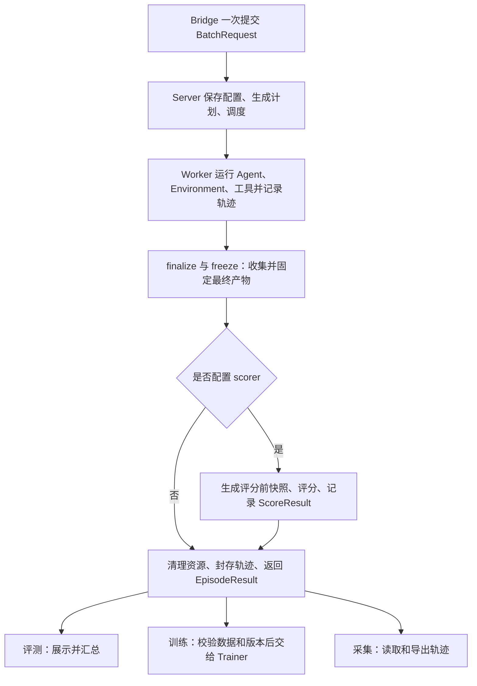

无 scorer 且交互与结果收集正常完成时，execution_status=completed、score 省略；不伪造 reward=0 或 success=false。配置了 scorer 却评分失败时保留 error ScoreResult、最终产物和已有轨迹，不能按“主动不评分”报成功。配置了 scorer 却丢失应有评分时，Server 拒绝 completed 结果。失败和取消同样保留可用轨迹。

ScoreResult 保存 success、metrics、reward 和 evidence。评测与训练复用同一次评分，轨迹采集需要评分时也使用完全相同的输入、算法和输出。环境原生 environment_reward 是交互事实，不自动覆盖最终 reward。首版只提供最终正式评分，每个进入评分的 attempt 至多调用一次 Scorer；不增加逐步正式评分或独立重评分作业。

Scorer 只处理一条 episode。系统查询层从已保存的结果计算完成数、成功率和平均 reward；无 score 的采集记录不进入评分统计，更不能按零分计入。macro-F1、pass@k 等特殊报表和“只导出成功轨迹”等筛选由调用方从明确结果集合生成，不回写评分或原始事件。

两份公开配置分别见[只采集](../reference/runs/gsm8k_collection.yaml)和[采集并评分](../reference/runs/gsm8k_collection_scored.yaml)。它们复用 GSM8K 的 Adapter/Environment，后者选择现有 Scorer，不新增数据集类型或采集专用请求。

### 8.3 统一轨迹事件与交互记录

**一句话定义：轨迹是一次 attempt 中已经发生事实的有序事件流，由 Rust Worker 记录；Agent、Environment、Tool 和 Scorer 只产生业务结果，不自行组装、排序、封存或上传轨迹。**评测与后训练读取同一条轨迹，不按数据集或 Agent 类型换格式。

| 对象 | 作用 | 是否保存事件内容 |
|---|---|---|
| `TrajectoryEvent` | 表示已经发生的一件事 | 是，`kind` 决定 `payload` 的确定类型 |
| `TrajectoryManifest` | 标识一条 attempt 轨迹由哪些事件分片组成 | 否，只保存公开身份、分片引用、事件数量和清单状态 |

读取端加载 TrajectoryManifest，校验 ArtifactRef 后按 sequence 合并事件分片。训练所需的 messages、token、logprob 和 mask 是有版本的派生视图，不能替代原始事件。

| `kind` | `payload` 类型 | 表示什么 |
|---|---|---|
| `state` | `StateEvent` | payload.phase 保存 preparing、running、scoring、finalizing、cleaning 等生命周期阶段；Outcome.state 只表示环境状态 |
| `observation` | `Observation` | Environment.reset 的初始观测，或不属于某次 Transition 的独立公开观测；step 后观测只在 transition 中保存 |
| `generation` | `GenerationEvent` | 一次真实模型调用的 messages、response、可选 tool_calls 和实际 model_id；端点提供的版本、token、logprob、loss mask 原样保存，禁止重新 tokenize 冒充 |
| `tool_call` | `ToolCall` | 实际获准执行的工具名、实现、参数、超时以及关联的 `generation_id` |
| `tool_result` | `ToolResult` | 与 `tool_call_id` 配对的成功、失败、超时、取消和返回内容 |
| `environment_transition` | `EnvironmentTransition` | 动作前观测、动作和同一个 `Transition` 返回值 |
| `score` | `ScoreResult` | Rust 完成系统字段后的唯一最终评分；直接复用写入 `EpisodeResult.score` 的同一个值 |
| `error` | `ErrorRecord` | 执行、模型、工具、环境、评分或清理错误 |
| `terminal` | `TerminalEvent` | attempt 的执行状态、用量和可选错误摘要；交互结束原因只在最终 Outcome 中保存 |

`kind` 和 `payload` 必须匹配，不能把同一件事换一个字段名塞入 `extra`。PlainAgent、OpenHands 或以后接入的 Agent 的适配器只提供原生事件内容，由 Rust 入口生成上述事件；无法标准化但需要保留的原始响应使用 `ArtifactRef`，不能新增另一套顶层轨迹结构。

模型提出调用工具与工具实际执行是两个事实。GenerationEvent.tool_calls 与后续 assistant Message.tool_calls 使用同一 ToolCall 结构保存归一化请求，finish_reason=tool_calls 时列表非空。ModelProvider 从选定工具表取得描述与输入 schema，并将模型原生调用 ID、工具名及参数映射回来；implementation、generation_id、timeout_ms 根据受控绑定填写，模型不得自行选择组件或预算。Worker 在返回 Agent 前核验绑定、调用身份与 finish_reason。调用模型 API 时只映射工具调用身份、名字和参数，不把组件引用或控制预算拼进提示词。`generation` 保存模型原始内容及结构化工具请求，`tool_call`/`tool_result` 保存受管执行；通过 `generation_id` 和 `tool_call_id` 关联，不用相同字段表达两个阶段。Environment 的动作结果只在 `Transition` 中定义一次，`EnvironmentTransition.transition` 保存其独立副本。

目标 EnvironmentTransition 是 AgentRuntime 内部生成的轨迹内容，字段如下；它不增加用户需要构造的第四个返回类。

| 字段 | 类型 | 唯一来源 |
|---|---|---|
| environment_step_index | integer | AgentRuntime 在执行动作前分配的序号 |
| observation_before | Observation | 执行动作前保存的公开观测副本 |
| action | TypedConfig | 这一次实际执行的动作 |
| transition | Transition | Environment.step 返回值经校验后的独立副本 |

动作后的 observation、terminated、episode_truncated、environment_reward 只在 Transition 中定义，轨迹不在顶层重复声明或逐字段重组它们。动作后观测的路径为 payload.transition.observation；动作前观测为 payload.observation_before。字段 observation 保持原名，多一级 transition 只表示包含一次动作的返回结果。

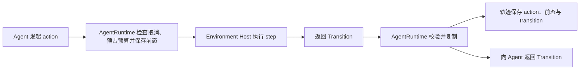

轨迹中的 transition 与返回 Agent 的 Transition 内容一致，但必须是独立副本，后续修改不能改变已记录内容。轨迹仍使用既有 TrajectoryEvent 信封保存身份、时间与 kind；不新增转换类、用户日志接口或第二份动作结果字段。

### 8.4 轨迹写入与分片

Python 组件不能直接设置 `event_id`、`sequence`、attempt 身份或时间戳。Rust `TrajectoryWriter` 从唯一 `ExecutionPlan` 复制 run/episode/attempt/task 身份；写入前验证 payload，递归禁止 `private_data`，并把大图片、文件、原生响应等内容改为受权限控制的 `ArtifactRef`。完整 `plan_digest` 留在受信 Server/Worker 执行记录中，不写入用户可读 manifest，避免低熵 private_data 被离线猜测。生产实现还必须按字段角色做允许列表和内容隔离，不能只依赖字段名扫描。

事件分片使用 UTF-8 JSONL，一行一个完整 `TrajectoryEvent`。**分片只依据序列化后的字节大小，不依据数据集、Agent、step 或事件类型。**第一版使用系统内部固定上限 4 MiB：加入下一条完整事件将超过上限时，关闭当前分片并开始下一个分片；一条事件不能跨分片。大内容必须先保存为 `ArtifactRef`，单条事件本身超过 4 MiB 时拒绝写入。这个上限属于 Worker 存储实现，不进入 `RunSpec`、数据集参数或用户配置。

同一个 attempt 只有一个 sequence 空间，所有分片按 `event_segments` 数组顺序排列，分片内部继续按 `sequence` 递增。`checkpoint()` 和最终 `seal()` 都必须把当时尚未成段的事件写成最后一个分片，因此评分可以读取一个完整的时间点快照。Worker 先逐事件写本地持久 spool，再按上述大小形成不可变分片。`checkpoint()` 返回前，其 manifest 引用的全部分片必须已经可读并通过摘要校验；只有尚未进入 manifest 的预上传可以异步。Server ACK 前不得删除唯一副本，上传重试不能改变事件内容、顺序或摘要。

### 8.5 评分快照与最终封存

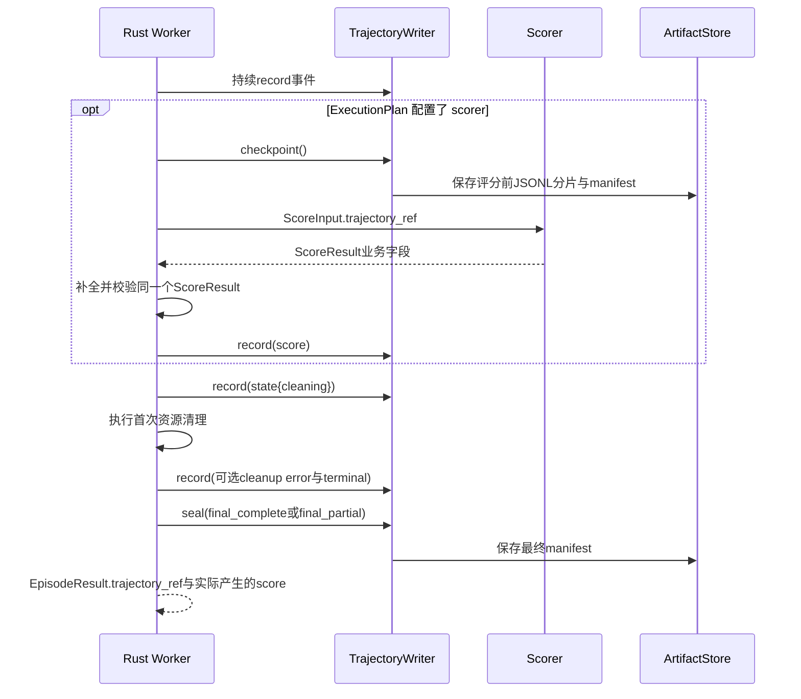

TrajectoryManifest 只用一个 `trajectory_status` 表达清单状态：`scoring_checkpoint` 是供本次 Scorer 读取的评分前快照；`final_complete` 是事件完整的最终轨迹；`final_partial` 是已知缺失事件的最终恢复结果。它不表达任务是否答对或执行是否成功。未配置 scorer 时没有 scoring_checkpoint 和 score 事件，其他事实完整保存后仍为 final_complete。任务执行失败，但错误、首次清理和 terminal 均成功记录时仍为 final_complete；Worker 突然丢失导致事件缺口时才是 final_partial。Scorer 只读取 scoring_checkpoint，避免 score 事件包含自身输入。最终 manifest 再包含适用的 score、cleaning 状态、错误和 terminal 事件。

`EpisodeResult.score` 和 `score` 事件不得分别计算。Rust Supervisor 先形成一个不可变的 `ScoreResult`，把同一个值写入两处：前者方便查询最终结果，后者保留发生顺序。`terminal` 只保存终态摘要，不包含最终 `trajectory_ref`，从而避免 manifest 摘要引用自身。

### 8.6 用户与训练框架读取轨迹

数据集作者只实现 Observation、Transition、Outcome 和评分业务，不调用轨迹 API。普通用户从 `EpisodeResult.trajectory_ref` 加载最终 manifest；Scorer 从 `ScoreInput.trajectory_ref` 加载评分前 manifest；Trainer 读取 `generation` 事件中的真实模型数据并与同一个 `ScoreResult.reward` 配对。展示层可以裁剪或格式化派生视图，但不能覆写原始事件。

采集使用同一 TraceLoader/导出接口，不新增轨迹根类型或存储。采集记录不保证适用于任意训练算法：例如某些 SFT 数据只需消息文本，需要真实 token/logprob/策略版本的算法必须在消费前检查并拒绝不满足条件的样本，不伪造缺失信息。筛选和格式转换生成派生文件，保留原始轨迹；采集本身不自动发布新的 Hub 数据 revision。

默认采集导出与训练一样选择 Server 最终接纳的 attempt，避免把基础设施重试重复计为样本；读取历史尝试需显式按 episode_id、attempt_id 选择。失败和取消也返回已经保存的部分或完整轨迹。读取端必须验证 ArtifactRef digest、事件身份一致、`event_count` 与实际保存事件数相符、kind/payload 匹配。完整轨迹的 sequence 从 0 连续；final_partial 允许已知缺口，但序号必须保持原值、唯一且递增，不能补写或重排成完整轨迹，也不能假定末尾存在 terminal。每次 attempt 的结果与轨迹按 `(episode_id, attempt_id)` 留存，Episode 的权威结果只指 Server 最终接纳的 attempt；训练只消费该 attempt，旧 attempt 仅供审计和诊断。历史 schema 通过 `schema_version` 选择显式迁移器，不在默认读取路径中同时猜测两套字段。

## 9. Hub、代码包与数据存储

Hub 管理代码与数据的固定版本、schema、文件索引和权限；Server 保存执行状态，Worker 按计划下载和运行。代码包版本与数据 revision 分别管理，修改数据不要求重发未修改的代码。

### 9.1 存什么，存在哪里

| 内容 | 格式 | 存储位置 |
|---|---|---|
| 原始样本 | 保留原来的 JSON、JSONL、Parquet 等格式，由准备入口的 reader 读取，逐行交给 Adapter | 用户本地或原数据源；不强制上传 Hub |
| 标准化样本 | 默认 UTF-8 JSONL，一行一个样本；可分片 | 发布到 Hub 管理的文件存储，或由用户本地 prepare 保存 |
| Adapter、Environment、Scorer、可选工具 | 有精确版本的 Python 包；发布 manifest 为 JSON，字段定义为 JSON Schema | Hub 登记版本与入口，实际文件放文件存储 |
| 图片、测试文件、代码快照等大文件 | 原文件或归档，通过 ArtifactRef 引用 | 文件存储；不把大文件嵌进样本 JSONL |
| 容器镜像 | OCI 镜像引用与 digest | 镜像仓库存内容，Hub 登记引用；镜像离线归档可作为文件保存 |
| 执行状态、评分、轨迹和输出产物 | Server 的执行记录；轨迹/文件通过 ArtifactRef 引用 | Server 管理状态与评分，文件存储管理实际产物；不写回数据版本 |
| Worker 缓存及工作区 | 包/文件按 digest 缓存；每次执行使用独立工作目录 | Worker 本地；缓存不是数据的权威来源 |

Hub 数据库保存版本、manifest、文件索引和权限，不强制把大文件字节存进数据库。文件存储可由本地目录实现，也可使用共享文件或对象存储；这是部署选择，不要求新增一个独立服务。

PackageManifest 必须能在下载和执行组件代码之前读取，用于校验入口、schema、运行要求和代码包 digest，因此不能只藏在 wheel 内。dataset.yaml 是发布前唯一由作者维护的声明；发布工具结合构建得到的 digest 组装 PackageManifest API 对象。发布成功后，Hub 中该版本的不可变 PackageManifest 是运行时唯一真值，不再回读本地 dataset.yaml。

包声明与 PackageManifest 不再提供 metadata、display_name、description、tags：当前没有对应的展示或检索功能。包身份使用 id，代码版本使用 version；作者不填写包 schema_version。运行字段必须放在各自唯一规范位置，不得通过自由字典增加覆盖配置。

### 9.2 数据集包如何发布

数据集作者看到的工程目录不是 Hub 中的目录镜像。发布工具在本地运行验证并生成发布物，Hub 只接收运行所需的不可变内容：

| 本地工程内容 | 是否进入 Hub | Hub 中的形态 |
|---|---|---|
| `dataset.yaml` | 不原样作为运行配置保存 | 发布工具解析为唯一 PackageManifest API 对象；Hub 数据库保存结构化记录，查询时返回 JSON |
| `pyproject.toml` | 不作为独立运行配置保存 | 用于把 src 构建成版本化 Python wheel，并生成包/依赖元数据 |
| `src/` 中的 Adapter、Environment、Scorer、可选工具和按需新增的 `models.py` | 是 | 构建进同一个 wheel；wheel 放文件存储，数据库保存 ArtifactRef |
| 发布工具从 `models.py` 生成的 schema | 新增业务类型时是 | 不是用户维护的源文件；按 digest 存入文件存储并由 manifest 索引，已有公共类型直接引用 |
| 运行必需的其他文件 | 仅显式声明的文件 | 使用 ArtifactRef 发布，未声明内容不会被 Worker 下载 |
| `tests/` 与测试案例 | 默认否 | 在作者本地或 CI 执行，不进入 Agent/Environment 的运行包 |
| 用户训练、评测或实验项目中的 `run.yaml` | 否 | 不属于数据集包；按需用于构造 RunSpec，也可以由调用方直接构造 RunSpec |

一个数据集代码版本至少由 PackageManifest、一个 wheel 及其 digest 和该版本实际使用的类型引用组成；新增业务类型时还包含自动生成的 schema。用户不创建 `schemas/` 源码目录，也不同时维护 Python 类型和 JSON Schema。其他运行文件只有被 manifest 明确引用时才发布。标准化样本、隐藏测试、图片和代码快照不混入 wheel。它们作为独立 data revision 或受控 ArtifactRef 发布，因此更新数据不要求重新发布未变化的 Adapter、Environment 和 Scorer。

### 9.3 标准数据格式与材料权限

标准化 JSONL 每行只包含 `task: TaskSpec` 和可选 `private_data: TypedConfig`，复用现有字段定义，不新增一套样本类。数据身份统一使用 task.dataset 的 id/revision/split/subset 和 task.sample_id；行内不再重复这些字段。数据发布时固定 revision 和文件 digest，再生成数据索引；索引引用已固定文件的 ArtifactRef，revision 不定义为包含自身的索引文件摘要，避免循环计算。行内不保存 run_id、episode_id、Agent 或后端选择，运行时先组装 EpisodeRequest，再与 RunSpec 一起放入 BatchRequest。私有内容存在时，整份 JSONL 按受限数据保存；Agent/Environment 只接收经过筛选的公开 TaskSpec，不能直接读取原文件。

公开任务和 private_data 配对保存，模型只看到公开任务。ArtifactRef 是文件引用，保存定位及完整性校验所需信息；它不代表自动获得读取权限。隐藏测试即使通过引用传递，仍只授予评分路径读取能力。

### 9.4 准备入口与 Worker 如何使用 Hub

| 输入方式 | 用户交给准备入口的内容 | Hub 提供的内容 |
|---|---|---|
| 用户自带样本 | 原始样本文件或已标准化样本，以及选择的代码包版本 | 代码包与被明确引用的资源；不拿 Hub 的同名题目覆盖用户内容 |
| 使用 Hub 数据 | dataset 的 id/revision/split/subset、选中的 sample_id 或样本范围，以及代码包版本 | 该数据版本中对应的标准化样本、私有评分材料及资源引用 |

两种方式在受管理的 prepare/Bridge 准备阶段汇合：原始数据先经过 Adapter，已标准化数据直接校验，随后统一组装 EpisodeRequest。一次样本提交不能同时指定“从 Hub 读取”又传入另一份样本内容；发生冲突直接报错，不逐字段合并。基于 Hub 数据修改题目时，按自带样本准备新数据身份或发布新 revision。数据引用选择属于准备入口，不在 Worker 再增加一种按数据集查题的执行分支。

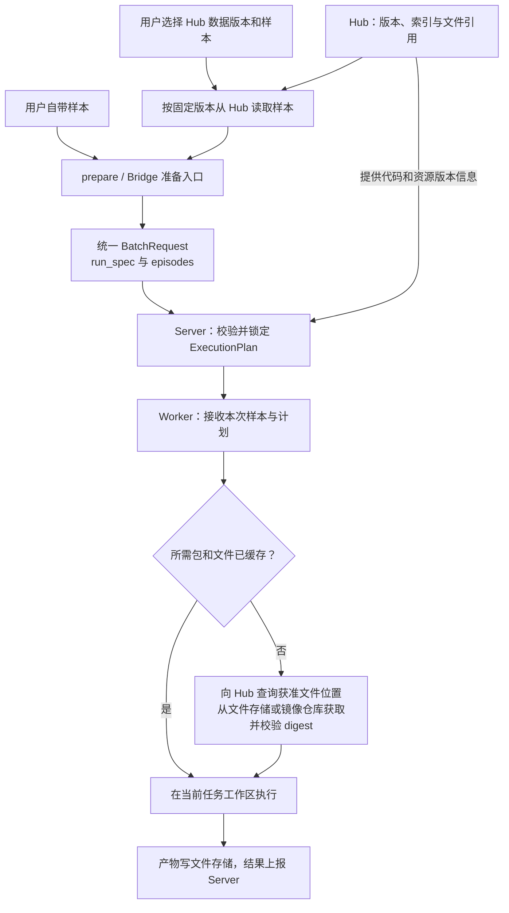

Worker 只读取计划指定的版本和文件，不重新查询 latest，不下载整份数据集来猜测本次题目；下载结果先校验再加入缓存。Hub/文件读取按调用身份授权，凭据不嵌入 ArtifactRef.uri；私有测试的读取能力只交给评分路径。原生包缓存也不能包含 Agent 可读的隐藏评分材料。缓存可回收，但被运行任务或保留结果引用的源文件不能直接删除；工作区清理与结果重传分别处理。

对外统一支持包/数据的版本发布与查询、固定样本读取、获准文件下载；运行产物通过 ArtifactStore 写入。数据版本不可原地修改，样本缺失、摘要不符或无读取权限时明确失败。Hub API 的具体请求结构列入参考说明中的待决策清单。

## 10. 异常处理与恢复

正常执行只有一个 attempt。重试、网络重传和资源清理分别处理，不能用多层重试制造重复模型调用或覆盖已有结果。

### 10.1 失败、取消与评分状态

无评分采集正常结束：执行 completed、score 省略。有评分任务答错：执行 completed，评分 ok，success=false，reward=0。评分器崩溃：评分 error，success=null，reward=null，不能伪装答错。未产生可训练 token 的结果不可进入训练。

取消：Server 持久化取消意图 -> Worker 中止 Agent 和正在执行的工具/harness -> 保存已有轨迹 -> 执行首次清理 -> 写 terminal 并封存 -> ACK。EpisodeResult.cleanup_status 记录形成结果时的首次清理结论；失败后的有限清理重试只供运维查询，不回写 score 或覆盖已接纳终态。迟到结果不能覆盖取消终态。

| 情况 | 是否形成最终评分 | 处理方式 |
|---|---|---|
| 输入或组件不兼容 | 否 | 接纳/准备阶段明确失败，已创建资源进入清理 |
| 答案错误，Scorer 正常执行 | 是 | status=ok，按评分规则返回失败指标与 reward |
| Scorer 已调用但发生异常 | 是，记录评分错误 | status=error，success/reward 为 null，不冒充答错或零分训练样本 |
| Agent 交互预算耗尽且得到合法最终 Outcome | 可进入一次评分 | termination_reason=budget_exhausted，使用预留的收尾预算；未配置 scorer 时正常收尾，不评分 |
| 系统取消或在候选形成前失败 | 否 | 保存错误和已有轨迹，终止调用并清理 |
| Worker 或节点丢失 | 按已持久化事实处理 | 标记已知轨迹缺口，由 Server 判断是否允许新 attempt |

评分与轨迹字段的唯一规范见第 8 章。

### 10.2 重试身份、预算与租约

总预算从 Server 首次接纳开始，包括排队、准备、交互及最终评分。Agent 的可用时间减去 finalize_reserve_ms；预留时间供 finalize 收集结果、freeze 固定最终产物及可选 Scorer 共用；不评分也保留这段时间，不在进入评分时重新计时。所有阶段预算取剩余预算以内。ExecutionPlan 的 deadline_at_ms 是 Server 的唯一绝对截止时间；Server 派发时从它派生只减的 remaining_timeout_ms。Worker RPC 核验该值没有被放大，Supervisor 随后只用“本机单调时钟当前值 + remaining_timeout_ms”建立运行截止时间，不再用本机墙上时钟重算 deadline。Usage 表示 episode 截至当前 attempt 的累计用量，重试通过 consumed_usage 恢复，不能清零。

重试必须沿用已锁定的任务、private_data、seed、模型配置、组件、工具、镜像和限制，只更新 attempt_id 与对应 plan_digest；租约在 DispatchRequest 中单独颁发。截止时间不重置。Server 在重新派发时把截至上一 attempt 已确认的累计 `consumed_usage` 与当前 `remaining_timeout_ms` 放入 DispatchRequest；Worker 用二者初始化本机预算，不能通过重试获得新调用、token 或时间预算。用量不确定时按保守上界结算或不自动重试。训练的实际模型版本按明确 version_policy 处理，不能借重试隐式切换政策。

Lease 表示派发授权，不延长 episode 的执行时间。Server 在事务中验证当前 attempt/lease 后才能接纳结果；过期 attempt 的迟到上报不会覆盖当前结果。Worker outbox 只重报原结果，传输重试不重新执行模型或工具。工具副作用不承诺 exactly-once。

### 10.3 清理、持久化与结果上报

清理和上报是两个可恢复的工作：首次清理必须在最终 terminal、manifest 与 EpisodeResult 形成前完成一次，因此 cleanup_status 有确定值；网络不通时保留待上报记录，不能因等待 ACK 一直占用容器。清理固定为 ScorerHost → AgentHost → ToolHost → EnvironmentHost → Backend；只关闭已创建的资源，无评分时没有 ScorerHost；每个 close 都必须幂等，一步失败也继续关闭后续资源。清理失败进入有限重试队列，后续重试只更新资源清理记录，不改不可变 score、轨迹或已接纳终态。

进程重启后：queued 任务可以重新调度；dispatched 任务先查询租约所属 Worker；无法确认旧执行已停止时先失效旧 lease 并隔离旧 session，不把不确定副作用当作未执行。新的 attempt 使用新的工作区。Worker outbox 只重报同一结果，不重跑模型。Server ACK 之前不能删除唯一结果副本。

清理超时由平台固定策略控制，不能因为 episode 预算耗尽就跳过清理。任务只有在已持久化后才能返回接收凭据；Worker 的唯一结果副本保留到 Server ACK。进度是可丢失的查询投影，不能替代权威终态或原始轨迹。

### 10.4 稳定性机制与复杂度边界

| 机制 | 决策与边界 |
|---|---|
| Server 准入与 Worker 本地限额 | 分别保护集群队列和本机资源，共同执行 |
| 请求幂等、attempt 与 lease | 防止重传生成重复任务和迟到结果覆盖当前状态 |
| Server 事务与结果通知 | 在同一事务提交终态与通知记录；通知可以重发 |
| Worker 结果 outbox | 保留一份持久待上报记录，直到收到 Server ACK |
| 心跳与任务进度 | 分别表示节点健康和执行进展，可共用连接批量上报 |
| deadline、取消与清理 | 在所有阶段生效，保证退出后回收或隔离资源 |
| 轨迹暂存与长期存储 | 暂存负责重传，长期存储负责保留；分别设磁盘和回收上限 |
| 镜像缓存 | 按 digest 复用，不能以可变 tag 作为内容身份 |
| 后端 session 预热 | 可选优化，按组件 digest、后端、资源及 reset 兼容性复用；不复用 Agent 会话 |
| 自适应预热容量 | 测量命中率、空闲资源和尾延迟后决定，不默认启用 |
| 通用会话快照 | 可选能力，不假定所有进程或 Agent SDK 均可恢复 |
| 模型或评分缺失 | 明确失败；模拟模型必须显式配置，不静默回退 |
| 旧输入字段兼容 | 仅在准备入口转换，公共内部协议使用唯一字段名 |
| 多主 Server、任意步骤续跑 | 当前范围不包含，需独立需求和正确性设计 |

以上是目标行为与取舍。真实恢复、隔离和规模能力必须按源码重构计划验收；现有参考覆盖与待决问题统一在参考说明维护，本文不维护测试数量或某日实现进度。
